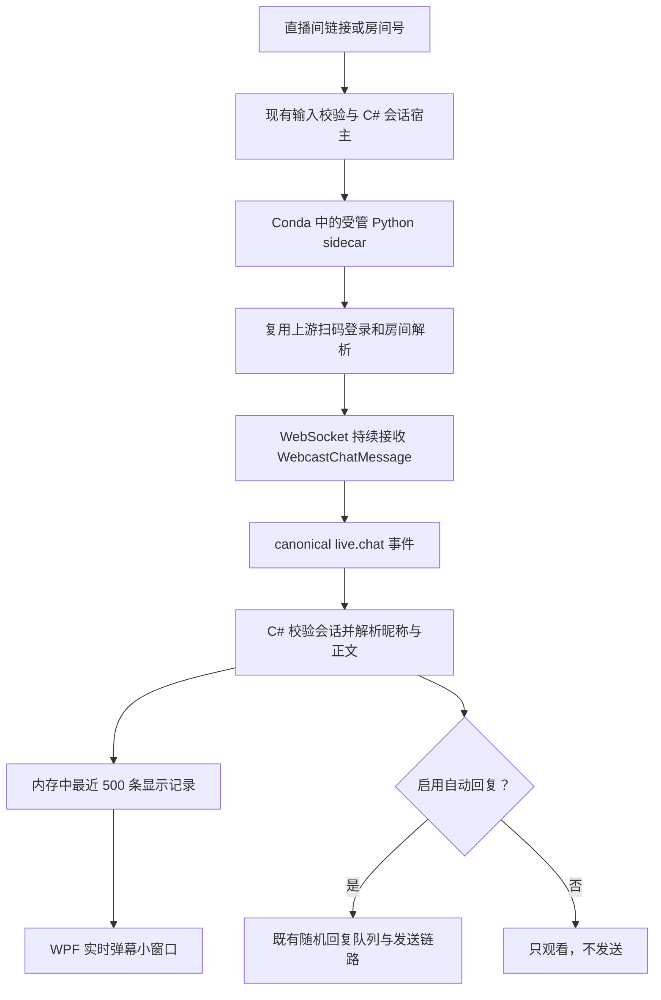

# 抖音实时弹幕窗口实施方案

日期：2026-09-09。状态：代码已接入；真实 WPF 扫码、连续弹幕显示、查看窗口关闭重开已验证。开发端结果和未验收项见第 6 节。

> 手动发送增量（2026-09-10，代码与定向验证完成，真实发送待验收）：用户要求暂不开自动发送，只确保可以发送弹幕。实时弹幕窗口新增单条文本输入与“发送”按钮；默认空白，Enter 不触发发送，不依赖自动回应开关或回复池。Host 复用既有 canonical `chat.send`、单发送互斥、限频、会话校验和取消退出，MainWindow 持有当前手动任务及结果；平台接收文案与列表中的本人回显分别表达，拒绝/超时/结果未知不自动重试。关闭查看窗口不终止已提交的发送监督。真实验收只发一句“大家好”，目标房间待用户提供，不能使用此前未确认的房间。

> 后续修复（2026-09-09，代码与定向验证完成，真实验收待用户确认房间并扫码）：同一次软件运行内，普通“断开连接”只退出直播间，保留 sidecar 内存中的有效抖音登录；重新连接直接打开直播间。退出桌面账号、关闭应用或认证失效时清除凭据，不跨重启保存。另授权只发送一次“大家好”，独立记录平台返回与自回显，不开启自动回应、不重试结果未知的发送。

## 1. 目标与现状

用户输入标准直播间链接，点击“连接直播间”，按需扫码，即可在独立小窗口看到持续收到的时间、昵称和弹幕正文。不要求开启自动回复，也不要求填写回复池。

用户补充的验收链接为 `https://www.douyin.com/follow/live/362781620214?anchor_id=3298190917109965`；本次同时支持该关注页链接格式，在本地提取 `362781620214`，不进行短链接跳转。

以下是实施前基线，所列缺口已在本次代码中处理。实施前没有弹幕查看窗口，`MainWindow.xaml` 只有扫码区域、连接状态及禁用的“显示在预览”选项；该选项不是弹幕查看入口：

| 环节 | 当前事实 | 必须补齐 |
|---|---|---|
| Python 来源 | 现有探针引用 `cv-cat/Douyin_Spider`，记录基线 `9afaf79580b1ee84e8954ff906ff26869d5b7f1f` | 复用上游登录、房间解析、Protobuf 和 WebSocket 能力，实现受管持续接收 |
| 探针输出 | `desktop/tools/douyin_live_compat_probe.py` 只处理首条外部消息，自行发送一次，回显后退出；`chat_received` 只带 `unique` | 新增 C# 专属 canonical sidecar，输出宿主已经支持的 `auth.*`、`live.state`、`live.chat` 合同 |
| C# 解析 | canonical parser 已读取昵称、正文、时间，但最终只保留元数据；legacy parser 要求的字段也多于旧探针输出 | 保留供本地窗口使用的最小显示 DTO |
| 监听与回复 | Core 在自动回复关闭时拒绝入站元数据，bridge 可能把该拒绝升级为会话失败；配置还强制要求回复池 | 接收成功与是否入回复队列分开，观看模式无需回复池 |
| 界面刷新 | 宿主只发布状态快照，UI 使用 latest-wins 合并状态刷新 | 先保存弹幕，再合并刷新通知，不能逐条把弹幕当可覆盖状态提交 |
| 持续运行 | Host 对全会话应用默认 300 秒超时，累计 stdout 超过 256 KiB 即停止 | 扫码/请求单独限时，持续消息流逐行消费，取消生命周期累计字节断流条件 |

依据：`src/GpAutoLive.App/MainWindow.Douyin.cs`、`src/GpAutoLive.Windows/WindowsDouyinProbeEventParser.cs`、`WindowsDouyinProbeEventBridge.cs`、`WindowsDouyinProbeHost.cs`、`src/GpAutoLive.Core/DouyinLiveManager.cs`。这些是代码核查结论，不代表真实平台已连通。

## 2. 用户流程与窗口草图

主界面保留“直播间链接 / 房间号”，将“启动 M1”改为“连接直播间”，新增“查看弹幕”。连接过程中直接复用现有扫码区域，无需先做独立账号中心。缺少运行依赖时明确指出缺少项，不能切到仅本地状态并显示“等待扫码”。

```text
抖音弹幕
直播间链接 / 房间号
[https://live.douyin.com/123456789       ]
[连接直播间] [断开连接] [查看弹幕]
状态：等待扫码 / 正在连接 / 已连接 / 已断开

┌─ 实时弹幕 · 房间 123456789 ─────────┐
│ 已连接              [置顶] [清空]   │
│ 14:30:01 小明：主播你好              │
│ 14:30:02 小红：这个怎么使用？        │
│ 14:30:03 我：欢迎来到直播间          │
│                                    │
│ 最近 500 条           [回到最新]    │
└────────────────────────────────────┘
```

草图消息为设计示例，不是已抓取的数据。小窗口采用非模态单实例 WPF Window，初始约 440×560，可调整大小；重复打开只激活已有窗口。默认跟随新消息，上滚阅读时停止自动跳底，点击“回到最新”恢复。关闭小窗口只关闭查看，不停止监听；重开显示本轮保留的最近消息。断开后标明“已断开”，旧消息可继续看；新会话、换房、退出桌面账号、退出应用时清空，不混入上一房间数据。

## 3. 完成后的链路



只维护一条平台连接，小窗口与自动回复共用入站消息。自账号回显可以显示“我”，但仍不得触发自动回复；相同消息 ID 不重复展示，重放消息不触发回复。显示缓存以当前 session/generation 为边界，最多 500 条，超过则移除最旧项，不增加容量设置面板。

## 4. 实施步骤

### 第一步：把真实连续接收打通

- 在 `desktop-csharp-windows/sidecars/douyin/` 增加受管入口与上游适配模块，按协议处理和平台调用两个职责拆分，不写新的抖音协议栈。既有 Rust 探针保持原样。
- 采用现有 canonical NDJSON 合同，实现 `auth.qr.start/auth.cancel/auth.logout/live.open/live.close/shutdown` 与相应事件、响应；保留既有 `chat.send` 接口接线，观看模式绝不自动调用发送。
- 去掉正式监听路径中的“首条弹幕就回复”“自回显后退出”和“探针整体 300 秒即结束”语义；300 秒扫码超时可保留，连接操作保持有界，连接成功后持续运行至用户断开、直播结束或错误。断线先如实展示并允许手动重连，不新增自动重连框架。
- 复用现有宿主取消、stdin/stdout、Join、Job Object；审查宿主整体超时，区分扫码/连接超时与已连接监听的生命周期。主窗口退出时收口同一受管进程。
- canonical 持续监听不沿用 `ProcessStdoutLine` 的生命周期累计 stdout 256 KiB 停止条件；改为消费后释放，保留现有单行 64 KiB 上限及 stderr 的有界诊断。不能为了延长运行而累计保存原始输出。
- 开发启动脚本接入 C# sidecar 的固定路径、上游路径、`gpautolive-douyin` Conda 环境和 canonical 模式。依赖从现有锁定清单核对安装，记录上游实际提交；不回退系统 Python，不让用户手填 WSS。测试安装包接入放在开发端真实闭环之后。
- 此步验收：真实扫码后连续产生多条合法 `live.chat`，不因首条消息或自己的回显结束；内容仅经本机 IPC 传递，不写日志。

### 第二步：让观看模式独立工作

- 调整 `DouyinLiveContracts` / `DouyinConfigDraft`：`Enabled=false` 时允许空回复池；`Enabled=true` 时保留原有回复候选和发送限制，不靠塞入默认回复绕过校验。
- 调整 Core / bridge：合法入站消息即使不入回复队列也属于正常接收；关闭自动回复、暂停回复或回复限流不能阻断显示。真正无效的房间/会话消息继续拒绝。
- 在 Contracts 的独立显示 DTO 中保留消息 ID、接收时间、昵称、正文、是否本人；平台作者 ID 继续仅用于内部过滤。Parser 保留经过既有长度/包络检查的内容，宿主将其送入显示缓存，不把内容混入状态日志。
- 本地显示正文是本次明确新增需求；同步修订“正文不进入 C#”的旧注释/专项文档为“正文只在本地显示链路内存中使用”，其余不落盘、不进入 Go 或模型的边界保留。

### 第三步：接上小窗口

- 新增 `Features/Douyin/DouyinChatWindow.xaml` 与 code-behind，复用现有窗口主题、按钮和生命周期写法；列表使用 WPF 原生 ListBox 和虚拟化，不引入 WebView、浏览器或第三方 UI 框架。
- 增加一个按会话保存最近 500 条的显示缓冲类，由现有宿主拥有；窗口只持有显示投影。每条消息先入缓冲，再复用 `_douyinUiUpdates` 合并“刷新显示”通知；禁止 latest-wins 直接覆盖单条弹幕。只在窗口显示时读取有界快照。
- 纯文本展示昵称和正文，不把消息内容解释为 HTML 或执行链接。清空只清显示记录，不清业务去重集合、回复任务或登录态。
- 在 `MainWindow.Douyin.cs` 添加窗口打开/激活/状态投影，在主窗口退出/登出路径解除订阅并关闭窗口。普通关闭小窗口后继续受管监听。
- 当前禁用的“显示在预览”不再承担查看入口；移除该占位项并以“查看弹幕”替代。本轮不做视频画面叠字，也不改 RTMP 输出。

### 第四步：最小充分验证与开发端交付

1. 定向测试：消息昵称/正文保留；连续消息与重复 ID；关闭自动回复+空回复池可观看且零发送；暂停回复仍持续接收；本人弹幕显示但不回复；旧 generation 不进入新窗口；500 条上限；关闭重开、清空与会话退出；超过旧累计 256 KiB 输出仍消费，已连接会话不使用扫码总超时（用可控时间验证，不在单元测试中睡眠 5 分钟）。
2. C# 定向测试按 `DouyinLiveContractTests`、`DouyinLiveManagerTests`、`WindowsDouyinProbeEventParserTests`、`WindowsDouyinProbeEventBridgeTests`、`WindowsDouyinProbeHostTests` 与新增窗口测试过滤运行；sidecar 用目标 Conda 环境执行自身协议/适配测试。共享契约影响先沿调用关系确认；如触及核心共享安全边界，再按仓库规则扩大测试。
3. 本地构建 `GpAutoLive.App`，用既有开发脚本启动。界面验收覆盖正常与窄窗口、中文/表情/长消息、滚动阅读、置顶、重复点击打开及关闭主窗口，无全量重构。
4. 在用户指定的真实直播间，用另一个账号手动发 3 条带可核对内容的弹幕，核对顺序、昵称、正文和接收后界面刷新；目标在 C# 收到事件后 1 秒内显示，不把平台网络延迟算成 UI 保证。持续观察至少 10 分钟，断开重连一次并确认没有混入旧会话消息。测试人员手动发送，程序观看模式保持零自动发送。
5. 分别记录静态检查、定向自动化、本地构建、页面点击、真实扫码、真实弹幕与进程退出结果。Mock 只证明本地链路，不替代真实完成；容器健康与外部模型调用不属于这条本地显示链路。

## 5. 完成标准与精简边界

完成意味着“输入真实链接→扫码→连接→小窗口持续看到真实弹幕→断开/关闭正确”，仅完成窗口或 fake 管道不算完成。上游协议当下兼容性、目标机 Conda 依赖和真实直播间需要在第一步尽早验证；若失败，针对具体错误修复，不先搭更多中间层。

消融检查：复用上游、canonical 合同、宿主、状态机、UI 合并调度及 WPF 控件；只增加现实需要的持续 sidecar、显示 DTO、有界记录和一个窗口。没有数据库、历史导出、搜索、模型分析、多直播间、云端转发、通用消息总线、独立账号中心或新重试框架。保留输入长度、会话归属、自动回复开关、凭据隔离与资源释放，因为它们直接保证观看正确、不会误发弹幕和退出不残留。

本次消融结果：删除禁用的“显示在预览”占位入口与缺少 sidecar 时假装等待扫码的本地回退；复用既有宿主、Core 状态、UI 刷新调度和 WPF 原生 ListBox。没有引入通用消息总线、独立账号中心、自动重连框架或新依赖框架。保留输入校验、会话代际、有限去重集合、500 条缓存、单行输出上限、扫码超时、线程 Join 和 Job Object，因为它们直接服务于不误发、不串房、持续读取及退出。没有扩大为无关旧代码清理。

## 6. 本次交付与验证记录

登录复用修复的验收边界：第一次扫码；断开后无活动房间但保留已认证状态；第二次连接不生成新 QR；换房创建新 generation 并清本轮消息/回复任务；凭据失效明确要求扫码；应用/账号退出仍 logout、shutdown、Join。复用既有 Host、Core 和 canonical `live.close/live.open`，不新增凭据持久化或账号中心。只验证受影响的 Core/Windows/App/Python 模块及本地 App 构建。

### 改动范围

- `sidecars/douyin/sidecar.py`、`upstream_adapter.py`：持续 canonical 协议与固定上游适配；另附 `requirements.lock.txt`、`test_sidecar.py`、`check_qr_bootstrap.py`、README。
- Contracts：`DouyinLiveContracts.cs`、`DouyinChatDisplayMessage.cs`，观看配置、关注页链接解析和显示数据合同。
- Core：`DouyinLiveManager.cs`，合法消息在观看/暂停时正常接收，不误入发送队列。
- Windows：`WindowsDouyinProbeEventParser.cs`、`WindowsDouyinProbeEventBridge.cs`、`WindowsDouyinProbeHost.cs`、`WindowsDouyinProbeLaunchPlan.cs`、`WindowsDouyinChatBuffer.cs`，消息显示、持续读取、启动和会话退出所有权。
- App：`Features/Douyin/DouyinChatWindow.xaml` 与 `.xaml.cs`、`MainWindow.xaml`、`MainWindow.Douyin.cs`、`MainWindow.Lifecycle.cs`，查看窗口、二维码投影与授权退出收口。
- 相应 Contracts/Core/Windows/App 测试；`tools/start-csharp-development.cmd`；本方案、C20、当前状态、README、根目录 PRD 与桌面架构同步。

### 自动化、构建与静态检查

命令均在本地开发机运行。C# 使用仓库 `.tools/dotnet/dotnet.exe`，Python 使用 Conda `gpautolive-douyin`。

| 检查类别 | 实际执行范围 | 结果 |
|---|---|---|
| Contracts 定向测试 | `dotnet test tests/GpAutoLive.Contracts.Tests/GpAutoLive.Contracts.Tests.csproj --filter FullyQualifiedName~Douyin`（独立 artifacts 路径） | 6 通过 |
| Core 定向测试 | `dotnet test tests/GpAutoLive.Core.Tests/GpAutoLive.Core.Tests.csproj --filter FullyQualifiedName~Douyin`（独立 artifacts 路径） | 16 通过 |
| Windows 定向测试 | `dotnet test tests/GpAutoLive.Windows.Tests/GpAutoLive.Windows.Tests.csproj --filter FullyQualifiedName~Douyin`（独立 artifacts 路径） | 47 通过；包括 600 条/超过 600 KiB 输出、假时钟超时边界、UTF-8、缓存上限与取消 |
| App 定向测试 | `DouyinChatWindowTests`、`DouyinConfigDraftTests`、`DouyinProbeRequestFactoryTests`、`DouyinQrImageLoaderTests` | 18 通过，1 跳过（本机重解析点/符号链接条件） |
| App 布局与退出 | `ResponsiveWorkbenchLayoutTests`、`MainWindowLifecycleTests` | 17 通过 |
| App 最终二维码/退出复核 | `DouyinQrProjectionTests`、`MainWindowLifecycleTests` | 6 通过，其中 2 项退出测试与上一行重复 |
| Python | `conda run -n gpautolive-douyin --no-capture-output python -m unittest discover -s desktop-csharp-windows/sidecars/douyin -p test_sidecar.py -v` | 最终 7 通过 |
| 真实二维码准备 | 同一 Conda 执行 `sidecars/douyin/check_qr_bootstrap.py` | `qr_prepared=true`、退出码 0、`forced_exit=false`；不发送 |
| 本地 App 构建 | `dotnet build src/GpAutoLive.App/GpAutoLive.App.csproj -c Release -p:Platform=x64 --no-restore --verbosity minimal` | 0 警告、0 错误 |
| 代码检查 | 调用关系、子线程结果必要检查、消融和本次文件 `git diff --check` | 已执行；未新增框架依赖 |

App 各组去重合计 39 通过、1 跳过。没有把重复执行累计为新增测试。未运行全仓测试或 Go/Rust 构建：本轮改动限定 C# 抖音路径及其直接上下游，按最小充分验证执行；没有重新打包安装器、部署服务器或提交 Git。

### 页面点击与真实业务

- 2026-09-09，北京时间约 21:18，用户完成真实扫码；使用用户提供的关注页直播链接，已连接并显示多条真实时间、昵称、正文。
- 21:23 观察到最近 91 条，主窗口与弹幕窗口均显示公屏监听、回复队列 `0/500`。未启用自动回应，未执行任何真实发送。
- 21:24 通过真实页面关闭小窗口，主窗口继续“已连接”；再次点击查看弹幕后显示原有 91 条。关闭查看窗口不会停止会话。
- 21:25 观察到已断开，随后界面进入重新扫码；断开来源和重连结果继续核对。当前不宣称完成 10 分钟连续观察。

尚未验收：另账号人工发送三条可核对消息、端到端延迟量测、10 分钟连续接收、真实重连后的代际隔离、目标机/网络矩阵和应用在已登录直播会话下的最终进程退出。受管取消/退出与代际隔离已有定向测试，不能代替以上实机项。上游快照缺少独立许可文件，安装分发的许可核验仍需完成。

容器健康：不适用，本链路未使用容器。外部模型返回：不适用，未调用模型。真实业务结果：已收到真实公屏弹幕；自动回应与自回显不属于本次已验证结果。

### 同次运行内复用抖音登录（2026-09-09，补充实施）

- 主界面“断开连接”调用宿主 `DisconnectAsync`，只关闭直播间；已确认的抖音登录仅在当前受管进程内保留。小窗口保留该房间最近记录。
- 宿主同时报告 `Authenticated=true`、`State=Ready`、`Douyin.State=LoggedIn` 时，显示“抖音已登录 · 直播间已断开，可直接重连”，允许编辑房间并重新连接。初次扫码后仍在解析直播间时不开放重复连接；服务端会话失效仍需重新扫码。
- 桌面账号退出/授权失效继续调用 `StopAsync`；应用退出调用 `DisposeAsync`，清除抖音登录与显示记录。重启软件不会恢复上次凭据。
- 复用同一个受管宿主、扫码区域与连接按钮，不新增账号中心或凭据文件。登录复用阶段没有增加产品手动发送入口；2026-09-10 的手动发送增量见下文，不能自动开启回复池。
- App 补充定向验证：已认证断开可重连、扫码确认到房间连接期间禁止重复连接、以上两态均不重新展示旧二维码。真实登录复用结果由本轮宿主与真实平台验收单独记录。

补充验证进度：App `DouyinQrProjectionTests|DouyinChatWindowTests|MainWindowLifecycleTests` 在 `artifacts/douyin-app-tests` 下运行，11 项通过、0 失败/跳过；Python `test_sidecar.py` 10 项通过，`check_single_send.py` 语法检查通过。单次真实发送验收曾启动到等待扫码，随后发现客户端已切换直播间，为避免目标不一致而在未登录/未发送阶段停止；该次没有发送，临时二维码已删除。后续发送只在目标明确后执行一次。

最终宿主/Core 定向结果：Core `--filter FullyQualifiedName~Douyin` 为 17/17，Windows 同过滤为 51/51；包括同进程免扫码重开、40 条旧房间迟到事件过滤、自然断开保留认证、Dispose 真正退出、重开 deadline/旧计时回调隔离和认证过期后新进程扫码。本轮四组共 89 项通过（17+51+11+10），不与第 6 节前次测试数叠加。未跑全仓、Go/Rust 或安装器测试，因为影响范围限定上述本地链路。

本地构建命令：在 `desktop-csharp-windows` 运行 `.tools/dotnet/dotnet.exe build src/GpAutoLive.App/GpAutoLive.App.csproj --artifacts-path artifacts/douyin-login-build -c Release -p:Platform=x64 --verbosity minimal`，结果 0 警告、0 错误。旧客户端当时仍在运行，未用新构建覆盖其进程或保存/迁移内存认证。新版真实界面重连还需重新启动并首次扫码。

登录复用阶段消融：复用 Core 的 LoggedIn 状态而非另造状态机；将宿主登录生命周期集中在 `WindowsDouyinProbeHost.LoginSession.cs`；重复断开幂等，不多次失效代次；该阶段只增加显式执行的单次验收脚本。保留输入/会话归属、同账号限频、认证失效与资源清理边界。代码检查、89 项自动化及本地构建已完成；新版真实页面点击与平台发送/自回显尚未完成；容器健康和外部模型调用不适用。

### 手动单条发送界面（2026-09-10）

- `DouyinChatWindow` 底部增加“手动发送弹幕”输入框和发送按钮，默认空白。用户只通过点击按钮发送；Enter 不触发发送，不改变自动回应开关或回复池。
- 仅桌面账号已授权、抖音已认证且公屏正在监听、发送未受阻时允许发送；暂停状态先恢复。输入沿用合同的 80 个 Unicode 字符/320 UTF-8 字节限制，由宿主统一校验。
- `MainWindow` 持有唯一当前手动发送 Task，并复用 `WindowsDouyinProbeHost.SendChatAsync`。重复点击不会再提交；关闭查看窗口不取消发送，重新打开显示发送中或上次结果。应用退出取消并 Join；发送完成时如已换代次或登出，不向新会话投影旧结果。
- 平台接受提交仅显示“平台已接受提交，请在弹幕列表核对本人回显”；自账号消息仍由既有列表标记“我”。没有增加第二套回显匹配任务，程序不把提交接受标记成已回显。拒绝和结果未知保留输入供核对，不自动重试。
- UI 没有新增依赖、手动发送队列或持久化正文。消融保留一个主窗口任务、一组输入控件及现有宿主发送/限频边界。

定向验证命令：仓库锁定 SDK `.tools/dotnet/dotnet.exe test tests/GpAutoLive.App.Tests/GpAutoLive.App.Tests.csproj -c Release -p:Platform=x64 --artifacts-path artifacts/douyin-manual-ui-tests --filter FullyQualifiedName~DouyinChatManualSendTests --verbosity minimal`。新增测试先因尚未实现的构造/投影/API 编译失败；实现后 3/3 通过。随后 `--no-build --filter 'FullyQualifiedName~DouyinChatWindowTests|FullyQualifiedName~DouyinChatManualSendTests|FullyQualifiedName~DouyinQrProjectionTests|FullyQualifiedName~MainWindowLifecycleTests'` 合计 14/14 通过（包含上述 3 项，不累计计数）。覆盖未连接/空白门禁、重复点击单飞、不确定结果零重试、接受后清空输入、关闭重开任务保留、旧代次结果隔离、最小窗口发送区可见及既有滚动/退出行为。XAML 静态解析和限定 `git diff --check` 通过。

本轮改动文件：Contracts `DouyinLiveContracts.cs` 提取公用正文校验；Windows `WindowsDouyinProbeHost.ManualSend.cs` 和宿主主文件提供手动 API、共用限频与互斥；App `Features/Douyin/DouyinChatWindow.xaml/.xaml.cs`、`MainWindow.Douyin.cs`、`MainWindow.Lifecycle.cs` 接线与监督；新增/更新相应 Contracts、Windows 和 App 定向测试；C20、根 PRD/桌面架构、本方案、README 和当前状态同步。

主线程最终核对：Contracts 抖音 6/6、Core 抖音 17/17、Windows 抖音 56/56，加 UI 14/14，本轮共 93 项通过，不与此前历史测试叠加。Windows 新增覆盖观看模式/空回复池手动发送、80 个 emoji 边界、并发与限频、自回显入站投影、未知结果零重试、派发后取消及自动等待预算时快速断开。限频等待在锁外执行，锁内再原子复查预算，避免手动/自动并发突破限频或等待预算卡住断开。限定格式检查、`git diff --check` 与 XAML 解析通过。

执行 `tools/start-csharp-development.cmd` 完成正常开发输出路径的本地 `dotnet build ... -c Release -p:Platform=x64 --no-restore --verbosity minimal` 并启动新版，0 警告、0 错误，构建耗时 6.08 秒。构建日志为 `artifacts/douyin-manual-start-20260910.log`，stderr 为空。系统进程和窗口清单确认本地开发版已运行且响应；本地非敏感配置 `data.enabled=false`。界面工具读取到了“查看弹幕”入口及未连接状态，但操作先报 `coordinate input geometry is unavailable`，刷新窗口后两次报 `failed to activate captured window`，已停止输入操作；因此不把此次工具操作记为真实页面点击成功。

消融结果：合并正文校验并复用既有发送入口/限频、仅保留一个主窗口任务，不引入队列、凭据文件或第二套回显任务。保留账号/房间、旧代际、限频、取消、未知不重试边界，保证不会误发或把提交冒充完成。本轮未改 Python，因此未重跑其历史已通过测试；未跑全仓、Go/Rust、全量 E2E 或安装器构建，因为影响限定该 C# 本地发送链路及直接上下游。安装包未更新。

真实平台发送：0 次；尚需用户提供测试房间并完成首次扫码，才能实发唯一问好并核对本人回显。不要把上述离线管道的 accepted/echo 当成平台成功。代码检查、93 项自动化、本地构建已完成；真实页面点击/发送尚未验收，容器健康和外部模型调用不适用。

### 登录与房间连接分离：UI 补充（2026-09-10）

- 主卡片独立显示“抖音登录：…”和“直播间：…”。登录只以宿主 `Authenticated` 为事实源；`LoginClearReason` 区分本次尚未登录（首次/重启）、平台明确失效、扫码失败、显式退出、辅助进程退出和本地通信异常，不把所有异常都解释为平台登录过期。
- 保留本次登录并断开房间时，登录行显示已登录、房间行显示已断开，连接按钮显示“重新连接”；房间配置依旧先断开才能编辑，不因编辑再次登录。
- 同房间正在 `Listening` 且没有在途手动发送时，连接按钮显示“已连接”；点击只提示无需重复连接，在配置校验、宿主启动和配置持久化之前返回，避免保存未实际应用的新回复设置。连接中、正在发送或输入房间与已连接房间不同时不开放重复连接入口。
- 小弹窗仅用两行简短状态，详细原因在主卡片及状态悬浮提示中展示。初版像素检查发现完整诊断文字会挤压紧凑窗口的列表，已压缩摘要，保留列表、清空/置顶、回到最新、空白手动输入与发送按钮。没有改变手动发送功能，没有默认填写或真实发送内容。

UI 红测：使用锁定 SDK `.tools/dotnet/dotnet.exe test tests/GpAutoLive.App.Tests/GpAutoLive.App.Tests.csproj -c Release -p:Platform=x64 --artifacts-path artifacts/douyin-login-ui-tests --filter FullyQualifiedName~DouyinConnectionProjectionTests --verbosity minimal`，首次退出码 1，因当时新契约未落地报 `CS0246/CS0103: WindowsDouyinLoginClearReason`。实现与契约落地后，初始 8 项通过；新增紧凑窗口像素/布局检查后该类最终 9 项通过。

同一命令扩展过滤 `DouyinConnectionProjectionTests|DouyinQrProjectionTests|DouyinChatWindowTests|DouyinChatManualSendTests|MainWindowLifecycleTests|ResponsiveWorkbenchLayoutTests` 曾为 37/37；紧凑摘要调整后仅重跑直接受影响的 `DouyinConnectionProjectionTests|DouyinChatWindowTests|DouyinChatManualSendTests`，最终 15/15。本次已执行范围去重合计 38 项（原 37 项加一项紧凑渲染，不累计重复执行）。未运行全仓测试或安装器构建。

`ResponsiveWorkbenchLayoutTests` 实例化当前 WPF 控件并进行 Measure/Arrange/UpdateLayout、展开卡片和滚动后的文本重叠检查，包含新增主卡片登录行；它不代表真实平台页面操作。额外设置 `AUTOLIVE_GUI_SCREENSHOT_DIR=artifacts/douyin-login-ui-tests/ui` 后，紧凑窗口测试渲染 `douyin-chat-compact-login.png` 并进行像素目视检查：308×265 内容视口下两行状态、空态列表、手动输入和发送区均可见。图片只含本地未登录布局，不含真实弹幕或账号。

代码静态检查与 UI 测试构建成功，无新增依赖；没有执行广泛旧代码清理。消融复用一个宿主快照、既有按钮与小窗口投影，去掉紧凑头部的冗长重复文字；保留登录原因、连接门禁、发送单飞和代际隔离。真实扫码、连接、重连、平台发送、完整产品构建和容器/外部模型结果由主线程分别记录，不用上述 UI 夹具替代真实业务验收。

### 登录诊断日志：UI 补充（2026-09-10）

- 现有抖音卡片显示宿主的 `DiagnosticLogState`，未开始时写明尚未创建，成功且文件实际存在时显示已保存。`WriteFailed` 即使仍有旧日志文件，也始终提示保存失败及文件可能不完整，不把路径存在当作本次写入成功。
- 仅当 `DiagnosticLogPath` 指向实际存在的文件时显示路径与“复制路径”。长路径使用省略及完整路径提示；复制只调用 WPF `Clipboard.SetText`，不新增任意文件打开/命令执行能力。文件已消失或剪贴板不可用时明确报告未复制。
- `MainWindow.DouyinDiagnostics.cs` 只负责日志状态、位置投影与复制路径；日志记录和有界文件仍由宿主所有。UI 不读取日志正文，也不把弹幕、扫码凭据或手动输入追加到日志。

红测先运行 `DouyinDiagnosticUiTests`：退出码 1，`No_log_file_does_not_claim_saved_or_offer_copy` 在第 22 行因 `DouyinDiagnosticStatusText` 尚不存在、`Assert.IsNotNull(status)` 的 actual 为 null 而失败。实现后新增 5 项全部通过，覆盖未创建、保存成功、已有文件但写入失败、文件缺失，以及 200 DIP 路径行中文字/复制按钮不重叠。

命令使用仓库锁定 SDK：`.tools/dotnet/dotnet.exe test tests/GpAutoLive.App.Tests/GpAutoLive.App.Tests.csproj -c Release -p:Platform=x64 --artifacts-path artifacts/douyin-diagnostic-ui-tests --filter FullyQualifiedName~DouyinDiagnosticUiTests --verbosity minimal`。随后 `--no-build --filter 'FullyQualifiedName~DouyinDiagnosticUiTests|FullyQualifiedName~DouyinConnectionProjectionTests|FullyQualifiedName~DouyinQrProjectionTests|FullyQualifiedName~MainWindowLifecycleTests|FullyQualifiedName~ResponsiveWorkbenchLayoutTests'` 为 37/37（包含新增 5 项，不叠加计数）。测试构建、XAML 解析和限定 diff 检查通过；未运行全量产品测试或安装器构建。

消融保留现有卡片、一行保存状态和一行路径/复制按钮，没有日志中心、额外存储、文件查看器或新依赖。保存失败、实际文件存在性、复制失败和原有登录/连接边界保留。上述为自动化布局与状态检查；没有更改运行中的客户端、实际写入系统剪贴板、真实扫码或发送弹幕，真实业务和宿主安全落盘验收由主线程分别记录。

参考：[上游仓库](https://github.com/cv-cat/DouYin_Spider)、[WPF ListBox 容器回收官方说明](https://learn.microsoft.com/en-us/dotnet/desktop/wpf/controls/how-to-improve-the-scrolling-performance-of-a-listbox)。
