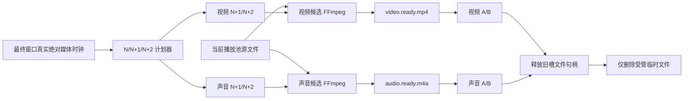

# N/N+1/N+2 音视频临时文件滚动处理实施计划

> 日期：2026-08-26
>
> 状态：本计划只继续约束普通声音 A/B 候选和可复用的进程/文件生命周期；其全部视频临时文件内容已废止。视频主链见 [`mpv/libplacebo 实时 GPU 主链实施方案`](./2026-08-28-mpv-libplacebo实时GPU主链实施方案.md)。
>
> 平台：Windows 10/11 x64 本地桌面端
> 范围：Rust/Tauri、React 最终效果窗口、本地 FFmpeg/FFprobe、普通声音处理与缓存生命周期

> 覆盖声明（2026-08-28）：本文中视频 A/B、视频 N/N+1/N+2、视频 `.partial/.ready`、MSE 和逐周期 FFmpeg 皆为已废止内容，不得作为当前实施依据。

## 1. 当前决策

普通声音继续采用“先生成临时处理文件，校验成功后切换播放”的本地处理方式。视频优先采用实时 GPU 参数提交，未适配参数本周期排除；只有实时渲染初始化、提交或同步失败时，才使用本计划的视频有界临时文件链。两者继续复用独立周期语义，不合并为一个候选。

视频和声音都采用 N/N+1/N+2：视频和声音的 N+1 都只生成各自用户周期覆盖的有界片段并附加最小切换缓冲；两者的 N+2 都只预选参数，均不是永久输出或离线版本：

- 视频 N：当前正在展示的源视频或处理后 MP4；视频 N+1 是唯一生成中/已校验/已预载的下一 MP4；视频 N+2 只保存画面参数、周期、seed 和目标时间。
- 声音 N：当前正在输出的源音轨或处理后音频文件；声音 N+1 是唯一生成中/已校验/已预载的下一音频文件；声音 N+2 只保存声音参数、周期、seed 和目标时间。
- 画面周期和声音周期分别读取用户输入的 `1–60s` 区间，分别到期、分别提交、分别计数；禁止再取两者的最早目标合成一个 MP4。
- 视频候选只承担画面处理；声音候选只承担普通声音处理。最终窗口使用视频 A/B 和音频 A/B 两组独立槽位，共享同一真实媒体时钟。
- 原始素材始终只读；两类临时产物都不进入播放池、不上传服务端、不跨会话复用、不作为用户资产。
- 原始素材始终只读；临时产物不进入播放池、不上传服务端、不跨会话复用、不作为用户资产。

命名是状态机契约，不允许再把 N 写成 N1，也不允许把 N+1 写成 N2。文件名保留历史名称以避免大量链接失效，正文和后续代码统一使用 N/N+1/N+2。

本计划是普通声音候选和可复用生命周期的历史实施入口；视频当前唯一实施入口为上方单视频流方案，不保留双视频路径。

### 1.1 2026-08-27 历史实现事实与当前偏差

- 已删除 MSE/fMP4 实时视频流 IPC、前端控制器、权限和对应测试入口。
- 当前实现由视频、声音各一个受管 FFmpeg Worker 生成处理后候选；两类输出都使用各自周期对应的有界 seek/duration。候选通过 FFprobe、完整文件校验和原子改名后，由最终效果窗口各自的 A/B 媒体槽预载、对时并提交。页面卡片、控件、布局和 CSS 不变。
- 视频候选只固化画面参数，声音候选只固化普通声音参数；两者不再共用 pending/current 身份。插话、固定话术和测试音仍保留原有独立能力。
- 同一时刻视频、声音各最多安装一个媒体 Worker；同领域后续周期请求采用 UI latest-wins 排队。停止、换源、关窗和退出会取消并 Join 两个 Worker。
- Windows 进程树回收采用隐藏窗口的系统 `taskkill /PID <pid> /T /F`，随后执行子进程 `kill/wait` 收口；正常退出清理缓存，异常退出遗留文件由下次启动清理。
- 软件编码线程数按逻辑核动态计算，至少 1、预留 1 个逻辑核、最多 8；编码器继续支持 Intel QSV、Media Foundation 和软件 H.264 回退。
- 已映射的 FFmpeg 音频参数进入候选文件；MFCC、信噪比目标和共振峰等尚未映射字段仍标记为“正式需求·待实现/未接入”，但不再阻断其他已实现音频效果。
- 本次自动化覆盖核心切换、显式提交、安全释放、进程取消和参数契约。30 分钟/100 次切换以及 NVIDIA、AMD、Intel-only、纯软件机器仍属于发布前实机验收，不得把自动化通过表述为已完成跨硬件验收。
- 2026-08-27 本机冒烟结果：开启画面后主播放未卡死，画面与声音同时开启时 FFmpeg 始终只有 1 个，工作集约 200 MB；停止后 FFmpeg 数量归零且 `.partial` 文件归零。与此同时，启用大量高级视觉效果的整文件候选运行 5 分钟仍未完成首次切换，证明“周期到点后才启动整文件处理”不符合 N/N+1/N+2 语义，也是周期到达但参数不变化的直接原因。
- 2026-08-27 环境声回归修复：主音频或任一 `audio_variants` 的环境声混合比例大于 0 时，都必须解析并验证随包 `ambient/low-level-room-tone.wav`；只有用户显式选择路径时才覆盖内置素材。不得因主参数为 0、变体参数非 0 而把候选误判为“未提供环境声输入”。
- 离线渲染器的二次参数校验必须以 `MediaRenderRequest.ambient_input_path` 是否存在判断环境声输入是否可用，不得写死为不可用。
- 构建离线 FFmpeg 音频滤镜图时，`realtime` 固定为 `false`，环境声可用性必须传入 `ambient_input_path.is_some()`；两者不得颠倒。
- 独立 AAC/M4A 声音候选接管普通声音时，PortAudio 正式主音轨出口保持关闭；即使旧状态仅残留 `preferred_portaudio=true` 且未运行，也必须主动清除，避免把正常 WebView 文件音轨误报为“PortAudio 已回退”。
- 前端分别建立视频与声音 N+1/N+2 两级计划：各自 N+1 在 N 播放期间立即准备，各自 N+2 只保存参数；各自到期只提交已经 `ready + preloaded + identity-valid` 的候选，成功切槽后才更新对应参数和变化次数。
- 已修正声音配置 revision 竞态：Rust 在同一临界区提交声音配置并返回实际 `audio_stream_revision`，前端随后使用该 revision 完成 ready/current/commit 身份校验；重复提交相同声音配置不再无条件增加 revision。该缺陷会使候选持续被判定为过期，是“时间到了但参数不变化”的直接代码原因之一。
- A/B 待机槽启动、对时或提交失败时保留当前 N，并携带完整四元身份调用 Rust 废弃候选；Rust 在锁外按有界退避删除 ready 文件。成功切换后旧槽先移除 `src` 并 `load()` 释放句柄，再通知 Rust 删除旧受管文件。
- 实机冒烟发现候选处理耗时超过用户周期后，旧逻辑会按有效窗口终止 FFmpeg，导致同一 sequence 反复渲染且变化次数始终为 0。当前规则改为：处理中的候选不因周期到达而 discard；视频和声音 N+1 都保持各自周期的有界片段，两条链独立完成。停止、换源、关窗、退出或明确取消仍由各自监督器 cancel、终止并 Join。
- 自动视频周期覆盖画面面板全部当前已接入的 `VideoEffectParams + AdvancedEffectParams`；恢复上一 Git 提交的低感知范围与稳定开关拓扑，亮度约 `±0.1～0.35%`、对比度/饱和度约 `±0.1～0.3%`、色相约 `±0.05～0.2°`，其余参数同样进入真实处理快照。不得静默退回只变化四个参数。
- 循环源在进入离线音频滤镜前必须按候选时长截断输入；不能只限制输出，否则 `areverse` 等需要 EOF 的滤镜会在 `-stream_loop -1` 下无限缓存，表现为候选持续缓冲、内存上涨且周期永不提交。
- `volumedetect` 诊断由有界 stderr 尾部压缩为单行后，`max_volume` 后面可能仍有直方图和汇总字段；解析器必须读取 `max_volume:` 后的首个数值 token，不能要求整段文本以 `dB` 结尾，否则会把有声候选误判为不可读并触发连续重试。
- 已确认低于静音阈值的声音候选不得进入 A/B 活动槽：继续播放当前 N，并把 N+2 晋升后有界重试；连续静音自动重试最多两轮，超过预算停止该声音链，避免 FFmpeg 重试风暴和 CPU 过载。
- 源媒体探测记录相对容器时间轴的有效音轨区间 `[audio_start_ms, audio_end_ms)`。声音 N+1 与该区间完全无交集时在创建 FFmpeg Worker 前静默跳过，避免容器无声头尾经 `apad` 补零后生成 `max_volume=-91dB` 的无意义产物；部分相交仍按原窗口处理。React 负责提前规划门禁，Rust 负责同源快照兜底；多项池等待实际换源，单项池才按源时长周期绕回。稳定跳过不进入失败或退避，未知旧元数据继续交给既有内容校验。
- WebView 待机视频或处理音频首次 `playing/timeupdate` 若与权威绝对媒体时钟相差超过门限，最多执行两次主动 seek 校时并在 6 秒确认窗口内重新判定；校时未成功前始终保留当前 N，不提前提交、遮挡画面或静音。
- 视频 A/B 待机槽的内部 seek 必须标记为程序校时，不得递增用户时钟 epoch/source revision；否则每次切换都会把音视频 N+1/N+2 队列误清空并让 sequence 反复从 1 开始。用户主动拖动进度仍按原时钟不连续规则处理。
- 2026-08-27 实机修正：A/B 切槽、恢复位置和旧槽释放会由 WebView 产生多个 `seeking` 事件。程序校时必须按具体媒体槽隔离，旧的非活动槽事件不得消费新槽的校时门禁，也不得把队列从 `s2/s3` 重置为 `s1`。
- 单项源视频到 EOF 时不得无条件提交 Rust 中的 pending 视频；候选可能已错过有效窗口，强制提交会把有界片段误当整个源文件并在同一位置循环。过期候选必须删除产物、保持当前 N，再从最新绝对媒体位置把 N+2 晋升为新 N+1。
- 已提交的有界视频片段到 EOF 时，若下一候选尚未通过门禁，必须按真实绝对时钟回到源视频同一位置继续播放；不得调用播放池换项，不得重播已结束片段，不得重置 sequence。
- 当前临时产物仍沿用既有 `app_cache_dir/media-processing` 受管目录；已覆盖启动/退出清理、候选废弃、切槽后旧文件删除、停止播放释放 current/pending，以及最终效果窗销毁后整个会话缓存清理。独立 session/generation 目录与文件数硬上限 3 尚未落地，不能把第 7 节目标状态误报为已完成。
- 当前 UI 已删除“应用声音参数”及 `schedulePeriodMediaRender` 手动链；普通声音只由 `prepare_audio_media_candidate` 自动计划链生成。视频处理和重试固定传递 `scope=video`，不携带声音变体或环境声输入；Rust 仅为旧客户端保留 `audio/both` 兼容枚举。

### 1.2 本轮实施结论

- 删除“周期到达便取消正在处理候选”的路径，不保留反复重启分支；首次开启、换源和参数变更只安装或替换 N+1，不得直接把未完成结果提交为 N。
- 复用现有 `MediaCycleQueue`、绝对媒体时钟、FFprobe 校验、原子改名、受管缓存和媒体槽释放确认；不增加新的队列库或状态管理库。视频与声音分别使用一个受管 FFmpeg Worker，同领域保持单飞，跨领域互不阻塞。
- 视频和声音 N+1 都从各自目标媒体位置开始，只覆盖到本领域 N+2 目标并附加最小切换缓冲；ready 后按绝对媒体时钟对齐待机槽。
- N+2 原样晋升为 N+1 后，先绑定最新 generation/revision，再启动唯一 FFmpeg；同时抽样新的 N+2，用它确定新 N+1 的输出终点。
- 到达 N+1 目标时只允许提交已经 `ready + preloaded + identity-valid` 的候选，禁止此时才启动渲染。候选迟到时继续 N，媒体时钟不暂停、不黑屏、不静音，也不提前修改参数或变化次数。
- 已提交的有界视频 N 到达片段 EOF 时，接近 EOF 的 `timeupdate` 不得按源媒体边界提前 seek 到 0；只有真实 `ended` 才调用获准的 `restore_original_video`，按绝对源时钟回到源视频并释放旧片段。
- 页面结构、卡片布局、控件和样式不变；只修正调度、状态投影和运行诊断数据。

## 2. 目标与非目标

### 2.1 目标

- 用户点击播放后立即保持当前源媒体可播放；处理候选在后台生成，未就绪时不得卡住画面或静音。
- 视频周期和声音周期继续读取用户保存的 `1–60s` 区间，每轮按真实媒体时间重新随机；区间相等时使用固定值。
- 始终分别维护声音和视频目标。两个开关、周期区间、候选文件、预载槽、提交和变化次数都彼此独立；不保留将两个周期联动成单一候选的运行路径。
- 候选只有完成 FFprobe、时长、音视频流和完整文件校验后才能进入待切换状态。
- 切换失败继续当前文件或源文件，不允许黑屏、无声或重复推进周期。
- FFmpeg、线程、内存、文件数和磁盘占用全部有硬上限，并在停止、换源、关闭窗口、退出应用和下次启动时可回收。
- Windows Intel 机器必须可用；硬件编码不可用时使用随包软件编码器回退。

### 2.2 非目标

- 不生成整部素材的 N 个永久 MP4，不提供版本列表、导出队列或服务端媒体任务。
- 不让 N+2 创建文件、进程、线程、PCM 队列或浏览器媒体元素。
- 不同时运行多个候选渲染器，不为全部参数组合预生成文件。
- 不恢复 speech-to-speech、VAD/ASR/LLM/TTS、实时话术换轨、RTMP 或 OBS。
- 不用 CSS 模拟画面效果。

## 3. 总体链路



运行中最多存在：

- 至多一个正在播放的处理后视频 N 和一个处理后声音 N；
- 视频、声音各至多一个 N+1 候选，状态为 `.partial` 或 `.ready`；
- 视频、声音各一个不占用执行资源的 N+2 计划；
- 受管 FFmpeg 并发必须有硬上限；视频编码与声音渲染不得同时无上限占满 CPU；
- 一个短生命周期 FFprobe 校验进程，且只在 FFmpeg 已退出后启动。

## 4. 周期和片段规则

### 4.1 计划生成

1. 最终效果窗口发布 `playback_generation + source_revision + absolute_position_ms`。
2. 视频调度器建立自己的 N+1/N+2，仅固化 `VideoEffectParams + AdvancedEffectParams`。
3. 声音调度器建立自己的 N+1/N+2，仅固化 `AudioEffectParams` 及变体和环境声来源。
4. 两条队列使用各自 target，不取最早目标、不合并候选身份。
5. 各自 N+2 只保存参数与目标；对应 N+1 提交、取消或失效后，才在该领域内原样晋升并绑定最新 generation/revision。

### 4.2 片段生成

- FFmpeg 从 N+1 目标对应的源位置读取，输出时长覆盖到 N+2 目标，并保留最小切换安全尾部。候选的参数快照属于 N+1，N+2 参数不得进入这次滤镜图。
- 视频和声音 N+1 都由 `source_start = N+1.target % source_duration`、`duration = N+2.target - N+1.target + safety_tail` 得到有界输入与输出。两者都必须先固化 N+1 参数，N+2 不得进入当前滤镜图。
- 跨源文件 EOF 的片段按播放池/单项循环规则读取，不允许用无限媒体时长替代真实条目边界。
- 视频处理开启时，视频 N+1 必须解码、处理并重新编码为 WebView2 可播放的 H.264 MP4、`yuv420p` 和单调时间戳；普通声音由独立声音链输出，不把视频 MP4 中的音轨当作处理后声音事实源。
- 声音处理开启时，声音 N+1 必须从当前源媒体的音轨应用完整声音快照，生成并校验独立 AAC/M4A 候选。
- 输出先写 `.partial`，FFmpeg 正常退出并关闭文件句柄后才执行 FFprobe、完整文件校验和同目录原子改名。

### 4.3 迟到和积压

- 候选到目标时间仍未就绪时继续播放当前 N，不切空文件，不暂停媒体时钟。
- 同一代次只保留一个 latest-wins 待处理计划；不得形成无界队列。
- 已经开始的同代次候选默认完成，不因每次 UI 刷新反复取消；停止、换源、seek 导致时间轴失效或 generation/revision 改变时立即取消。
- 候选迟到后只有仍覆盖当前绝对媒体位置且身份有效才允许切换，否则删除并从最新时钟重建。

### 4.4 精确滚动时序

```text
播放 N
  ├─ N+1：rendering → verifying → ready → preloading
  └─ N+2：仅参数/周期/seed/绝对目标

到达 N+1.target
  ├─ N+1 ready 且已预载：N+1 → N，释放并删除旧 N
  │                         N+2 → N+1，抽样新 N+2，立即渲染新 N+1
  └─ N+1 未就绪：继续 N，不暂停；记录 deadline_missed，完成后仅在覆盖范围仍有效时提交
```

约束：

- N 是当前播放事实源；只有媒体槽切换成功后，参数快照、变化次数和当前 sequence 才能一起提交。
- N+1 的准备必须发生在 N 播放期间；到期处理函数不得调用整文件 `start_media_processing`。
- N+2 晋升时保留原有参数、seed、period 和 target，不重新抽样；新抽样只补队尾。
- 视频只在视频 target 到达时尝试提交视频 N+1，成功后只推进视频队列。
- 声音只在声音 target 到达时尝试提交声音 N+1，成功后只推进声音队列。任一领域的到期不能提前消费另一领域的计划。
- 单项循环的视频和声音有界候选跨 EOF 时都按源时钟连续读取；多项播放池到条目边界时结束当前 generation，由下一项建立新的 N/N+1/N+2，不把两个不同源文件混入同一候选。

### 4.5 首轮、开关和恢复

- 用户点击播放后立即播放源文件作为初始 N，并立即建立 N+1/N+2；不得等待首个候选才开始播放。
- 播放中打开或关闭画面/声音处理，只废弃并重建 N+1/N+2；当前 N 连续播放。新开关状态在下一次成功切换时生效。
- 暂停冻结绝对媒体时钟；已经运行的 N+1 可继续完成并等待，恢复后重新校验 generation/revision/target。停止、seek、换源和 generation 变化必须取消并 Join 旧 N+1。
- 最终窗口关闭或时钟停滞时禁止推进计划；恢复成功后从最新绝对位置建立新的 N+1/N+2，不补跑全部错过周期。

## 5. 无感切换

最终效果窗口使用两个视频槽 A/B 与两个处理音频槽 A/B，每组任意时刻只有一个 active：

1. standby 加载 N+1 文件，定位到与当前绝对媒体时间对应的位置。
2. 必须同时满足 `loadedmetadata`、可解码音视频流、`canplay`、位置误差门槛和候选身份校验。
3. standby 先以视觉隐藏、主音频增益为 0 的状态启动；确认 `playing/timeupdate` 后才提交切换。
4. 画面在少量帧内交接，主音频使用短交叉淡化；不得同时长期输出两条音轨。
5. 切换提交成功后，新槽成为 active；旧槽停止、移除 `src`、调用 `load()`、撤销对象 URL，并向 Rust 回报“文件句柄已释放”。
6. Rust 收到释放确认后删除旧 N 文件；删除完成后才允许该文件槽位被下一候选复用。

如果 standby 播放、对时或音频启动失败，保持当前 active，不改变当前参数事实源和变化次数。

普通声音以独立处理音频文件为主输出。该音频就绪并成功启动后，必须对视频槽中的源音轨和 Web Audio 干声输出静音；关闭声音处理或实际回退时对称恢复，避免双声和无声。插话与固定话术继续使用现有 duck 和抢占规则。

## 6. FFmpeg 进程和线程回收

### 6.1 分领域单一所有者

- Rust 对视频与声音保存独立 pending/current 身份，并分别由 `video_media_worker`、`audio_media_worker` 独占对应 FFmpeg、FFprobe、JoinHandle 和取消令牌；每个领域仍只有一个所有者。
- 任意时刻每个领域最多一个候选 FFmpeg；视频 Worker 与声音 Worker 独立，只有同领域忙时等待下一调度 tick。停止、换源、关窗或退出必须取消并 Join 两个 Worker。
- 禁止丢弃 `JoinHandle`，禁止在持有播放状态锁或文件租约锁时等待进程退出。
- Windows 子进程统一使用 `CREATE_NO_WINDOW`；取消或退出时先使用系统 `taskkill /T /F` 终止整棵进程树，再执行子进程 `kill/wait` 确认回收。异常退出遗留缓存由下次启动兜底清理。

### 6.2 正常结束和取消

正常完成：

1. 持续读取 `-progress pipe:1`，stderr 由独立读取任务排空并只保留有界尾部。
2. FFmpeg 退出后 Join 读取任务，关闭所有管道和文件句柄。
3. 再启动 FFprobe 校验；校验完成后 Join 并原子提交文件。

取消、停止、换源或退出：

1. 先使 operation token 失效并关闭新请求入口。
2. 通知 FFmpeg 正常退出并等待有限宽限期。
3. 超时后调用 `taskkill /T /F` 终止进程树。
4. 在锁外等待子进程与读取线程 Join。
5. 删除 `.partial` 和未提交 `.ready` 文件并发布真实取消结果。

不得使用无限 `wait_with_output` 累积日志；进度和错误输出都必须持续消费，错误尾部设固定字节上限。

### 6.3 CPU 线程预算

- 软件编码线程数从 `available_parallelism()` 计算：至少 1，预留一个逻辑核，最大 8；滤镜线程单独受同一上限约束。
- 硬件编码仍限制滤镜线程，不能因编码在 GPU 上就让 CPU 滤镜无限并行。
- 渲染进程使用低于播放器/UI 的调度优先级；播放、WebView 和音频输出线程优先保持响应。
- 首选编码器按实际短样本启动验证选择：NVENC → AMF → Intel QSV → Media Foundation → 随包软件 H.264；名称存在但启动失败视为不可用。
- 连续处理速度不足时不增加并发进程；保持当前 N，候选状态显示迟到/降级，并允许降低内部处理分辨率或旁路明确标记的重滤镜后重试。

## 7. 内存、磁盘和文件删除

### 7.1 目录与文件租约

临时文件只允许写入：

```text
app_cache_dir/media-cycle-artifacts/<session-id>/<playback-generation>/
```

每个产物必须带 `session_id / generation / source_revision / sequence / params_version`。所有删除操作先规范化路径，并验证目标仍位于 `media-cycle-artifacts` 专用根目录内；禁止对应用缓存根、用户目录或源文件执行递归删除。

### 7.2 有界资源

- 媒体字节直接写文件，不通过 Rust 无界内存 Channel 搬运。
- 进度事件有界合并，UI 消费慢时只保留最新进度。
- 单会话正常最多保留 N 与 N+1 两个已提交/候选文件；删除重试期间文件总数硬上限为 3。达到上限时停止创建新候选并报告清理阻塞，不能继续堆积。
- 生成前按预计码率、片段时长和安全系数检查剩余磁盘；空间不足时保持当前媒体并拒绝启动候选。
- 缓存只保存当前会话临时产物，不保存完整媒体库副本或历史参数版本。

### 7.3 使用后删除

- 切换成功且旧媒体元素确认释放后，立即删除旧 N 文件。
- Windows 返回文件占用时使用有界退避重试，不忙循环；总预算耗尽后写入当前会话的待清理集合，并阻止文件数突破硬上限。
- 候选失败、过期、取消或被新 generation 替代时，在进程和探测句柄全部 Join 后立即删除 `.partial/.ready`。
- 停止播放、清空播放池、替换当前项和关闭最终效果窗口都必须释放对应媒体元素并删除该 generation 的临时文件。

### 7.4 软件关闭和异常退出

正常退出顺序固定为：停止调度 → 拒绝新任务 → 取消 FFmpeg/FFprobe → 有界等待并强杀进程树 → Join 线程 → 关闭最终窗口媒体句柄 → 删除媒体处理缓存目录 → 退出进程。

每次进程使用独立 session 目录和锁文件。应用启动时只清理由当前进程确认没有活跃锁的遗留 session；这覆盖崩溃、断电或强制结束导致正常退出钩子未执行的情况。启动清理和退出清理都必须记录文件数、字节数、结果和安全原因，但不得记录用户源文件内容。

## 8. 状态与错误

统一状态：

```text
idle → rendering → verifying → ready → preloading → switching → active
                         ↘ cancelled / failed / stale
```

运行快照至少包含：当前/候选 sequence、源代次、周期目标、当前参数版本、FFmpeg PID、处理速度、输出大小、最近推进时间、文件数、缓存字节、删除重试数和结构化失败原因。

UI 只在切换成功后更新“当前参数”和变化次数。渲染中、校验中、迟到、清理阻塞和失败必须显示真实状态；不得以计划生成、参数随机化或文件存在冒充已生效。

## 9. 分阶段实施

### Phase 0：冻结 N/N+1/N+2 契约并建立失败测试

- 修正所有把 N/N+1 写成 N1/N2 的运行时名称和文档，不修改页面 UI。
- 为“N 播放期间启动 N+1”“到期只提交不渲染”“N+2 无执行资源”“成功后 N+2 原样晋升”先写失败测试。
- 删除周期到期调用整文件渲染、重复普通声音主输出以及被新方案取代的状态分支；用户已明确确认与当前决策相反的内容直接删除。

### Phase 1：把现有整文件请求收窄为有界候选请求

- 扩展既有媒体渲染请求，增加 `plan_id/sequence/generation/revision/source_start_ms/output_duration_ms/target_absolute_position_ms/valid_until_absolute_position_ms`；所有整数执行范围和溢出校验。
- 视频和声音 FFmpeg 都使用各自周期对应的有界 seek/duration；保留现有滤镜、环境声、编码器回退和 `.partial → verify → ready`，由两个领域监督器分别管理，禁止同领域并行生成多个候选。
- FFprobe 除流/时长/时间戳外校验候选覆盖窗口与身份；打通一个固定参数的 8～15 秒候选片段。

### Phase 2：前端恢复真正的双链 N/N+1/N+2 调度

- 复用 `media-cycle-planner.ts`，在视频队列或声音队列创建/晋升后，分别立即准备对应 N+1。
- 删除 `resolveNextMediaCycleBoundary` 及任何“取两个队列的最早目标生成统一 MP4”路径。
- 视频链和声音链都以各自 N+1/N+2 的绝对目标计算有界源窗口；两者同时开启时也不共享 plan ID 或 sequence。
- 各自到期只向对应 A/B 槽提交候选；失败保持该链 N。成功后只提交该链的参数/次数，推进该队列并立即准备下一 N+1。

### Phase 3：A/B 对时切换和文件生命周期

- 复用现有不可见媒体槽，补齐候选片段相对时间到绝对媒体时间的映射、`canplay/playing/timeupdate` 门禁和短音画交接。
- 切换成功后释放旧槽；旧 N 是受管临时文件时才通知 Rust 删除，源文件永不删除。
- 停止、换源、seek、关闭和退出依次取消任务、终止进程树、Join 管道线程、释放媒体元素并清理受管文件。

### Phase 4：吞吐、降级和跨机验收

- 记录每个候选的 `rendered_media_ms / wall_ms`、deadline 余量和迟到次数；慢机器不增加并发，也不暂停当前播放。
- 编码路径继续实际探测 NVENC → AMF → QSV → Media Foundation → 软件 H.264；硬件失败自动回退，不能按显卡品牌假定可用。
- 覆盖慢编码、磁盘不足、文件锁、FFmpeg/FFprobe 崩溃、候选迟到、seek、暂停、换源、窗口关闭和应用退出。
- 在 NVIDIA、AMD、Intel-only 和纯软件回退 Windows 机器完成 30 分钟、100 次切换和异常退出后重启清理验收。

### Phase 5：清理和收口

- 搜索并删除本次改造后不再使用的整文件周期排队字段、PortAudio 普通主轨分支、重复状态和测试夹具；删除前由用户确认审核结果。
- 保留手动首次处理所需的共用底层渲染函数，但它不得被自动周期路径调用；若没有真实调用方则一并删除。
- 完成 Rust 格式化/测试/Clippy、React 测试/类型检查、本地生产构建和文档一致性检查；禁止服务器构建。

## 10. 自动化和手工验收

自动化至少覆盖：

- N+2 不创建文件、PID、线程或 IPC 执行对象；
- FFmpeg 并发始终 `<= 1`，FFprobe 只在 FFmpeg 退出后运行；
- generation/revision/sequence 过期候选永不切换；
- `.partial` 不可播放，只有校验并原子提交的 `.ready` 可预加载；
- 切换失败保持当前文件和音频，成功后旧文件释放并删除；
- 文件数硬上限、磁盘不足和 Windows 文件锁重试；
- 停止、换源、关闭窗口、正常退出和下次启动清理；
- stderr/进度缓冲有界，取消后所有进程与线程均完成 Join；
- 视频项处理文件同时具有有效视频流和音频流，音画时长及起点误差在门槛内。

Windows 手工验收至少覆盖：

- 用户周期 `1s`、相等区间、默认声音 `3–5s`、默认视频 `8–15s` 和 `60s`；
- 画面具有客观非零帧差，正常观看人眼难以察觉；切换无明显停顿、黑帧、闪烁、回到开头或声音中断；
- 开启画面和声音处理后，最终输出同时具有真实画面和声音变化；
- 连续 100 次切换后 FFmpeg 数量不超过 1，CPU 不因残留进程逐轮上升，RSS/句柄/缓存文件数保持有界；
- 正常关闭后 session 目录为空；任务管理器强制结束后再次启动可以清理遗留文件和子进程；
- Intel QSV 可用时使用 QSV，不可用时软件回退仍可播放且状态真实。

## 11. 完成定义

- 当前媒体处理只使用本计划定义的视频临时文件链和声音临时文件链。
- 视频与普通声音的周期、候选身份、当前文件、预载槽、提交和计数完全分开，不存在统一最早边界。
- N/N+1 文件滚动、N+2 轻量计划、真实媒体时钟和用户周期全部生效。
- 任意时刻 FFmpeg 渲染进程最多一个，所有子进程和线程都有取消、超时、Join 与 Windows 进程树终止兜底。
- 使用完成的文件立即删除；停止、换源、关闭窗口和正常退出删除当前会话文件；异常退出由下次启动清理。
- 连续切换、跨 EOF、暂停、seek、多项播放池和四类 Windows 编码路径通过自动化与实机验收。
- Rust 格式化/测试、React 测试/类型检查、文档一致性检查和本地构建全部通过；不在服务器构建。
