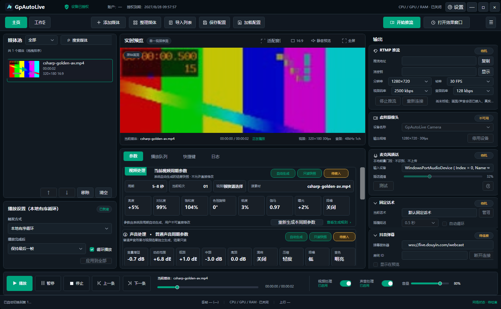
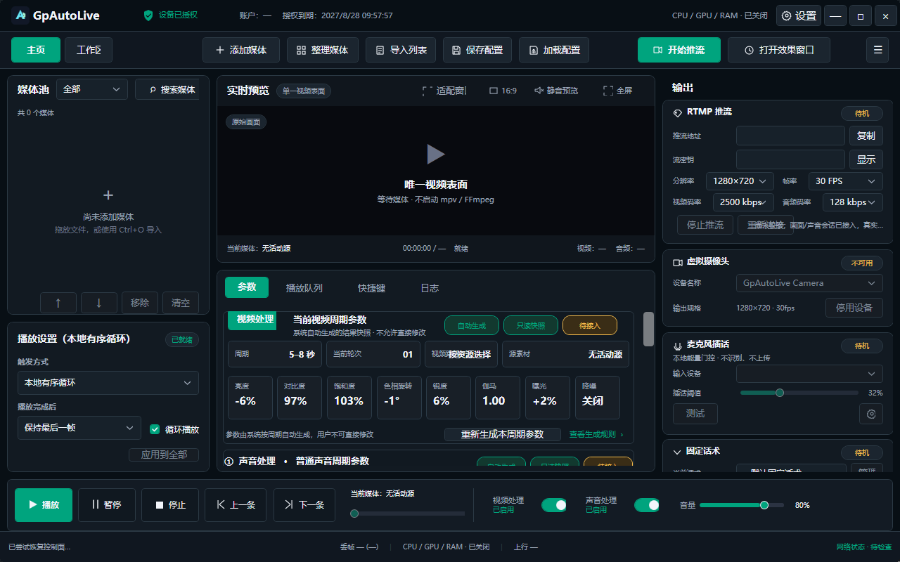

# C# 复刻 Rust 桌面端开发日报

日期：2026-09-04；本次追加：2026-09-05  
依据方案：[`2026-09-04-CSharp与Rust桌面端功能同步长任务实施方案.md`](./2026-09-04-CSharp与Rust桌面端功能同步长任务实施方案.md) v1.39  
实施范围：`desktop-csharp-windows`；Rust `desktop` 仅作只读参考

## 进度百分比

- 今日任务完成率：100%（本日报、真实夹具复验、C# 桌面端重开均已完成）。
- C# 复刻 Rust 桌面端整体进度：约 **70%**。

统计口径：按同步矩阵中 12 项当前实施能力统计；“代码已接入·待验收”按约 70% 计入，表示主链路已经存在并有自动化/夹具证据，但真实设备、外部服务、长稳或发布门禁仍未全部通过；“实时话术幻化”属于非当前范围，不计入分母。因此该百分比是开发完成度，不是正式发布完成度。

## 1. 今日完成

1. 普通声音参数与 Rust realtime 链同步：C# 低/中/高 EQ 中心频率统一为 `200/1000/8000 Hz`，低频从 `120 Hz` 修正为 `200 Hz`；动态范围、压缩仍未伪造，本轮已补充自然动态和确定性本地音色预设的实际消费。
2. C# 媒体真实闭环复验：使用 `E:\下载\csharp-golden-av.mp4` 完成 FFprobe 导入、媒体池原子提交、mpv 播放、CPU4/GPU83 参数回读和 FFmpeg/PortAudio 音频输出验证。
3. WPF 主窗口路径复验：真实完成“导入→FFprobe→原子入池→首项选中→mpv 播放”；无效 PortAudio 设备时，视频仍保持播放，验证视频和声音故障隔离。
4. CPU4 像素效果门禁已有一次 `1/1` 通过记录：通过现有 WGC/D3D11→YUY2 捕获链，对比 Original 与 CPU4 参数提交后的最终视频帧 SHA-256，确认最终画面确实发生变化；本日同机复跑因预留子 HWND 返回 `ItemUnavailable`，未将复跑计为通过。
5. 补齐播放态视频效果的有效回显门禁：C# 通过 mpv `estimated-frame-number` 在参数回读后观察下一帧号前进；播放态未观察到下一帧返回 `EffectiveFrameNotObserved`，暂停态不伪造等待结果。CPU4 与完整 GPU83 真实夹具各 `1/1` 通过，Original 关闭效果分支也纳入验证。
6. 补齐播放启动首帧门禁：主窗口和真实夹具在控制器标记 `Playing` 前，以同一 `estimated-frame-number` 属性确认首帧号大于 `0`；2 秒内未出现返回 `FirstFrameNotObserved` 并清理运行时。CPU4、完整 GPU83 真实夹具各 `1/1` 通过。
7. 自动化结果：当前版本按稳定分组复验合计 `502/502`；Contracts `28/28`、Installer `15/15`、Core `77/77`、Media `115/115`、Windows `211/211`，App 常规测试 `54/54`，两个真实视频窗口用例分别单独运行 `1/1+1/1`。App 两个真实窗口用例若连续放入同一 WPF 测试宿主，宿主收尾仍可能挂起，已记录为测试宿主生命周期风险，不计作业务失败。
8. 测试资产规则已固化：后续外部测试文件优先从 `E:\下载` 查找；本日未读取 `E:\下载\load_log`。
9. WGC 最终表面门禁复核：尝试在同一 C# WPF 预留视频子 HWND 上复跑 CPU4/GPU83 像素夹具，`GraphicsCaptureItemInterop.CreateForWindow` 均返回 `ItemUnavailable`；已确认这是当前窗口捕获环境门禁，未把该次复跑计入通过，也未留下临时诊断代码或日志。
10. WGC 会话消费修复：`CreateFreeThreaded` frame pool 已注册 `FrameArrived`，事件只唤醒专用线程，线程集中排空 `TryGetNextFrame`、调用同设备 D3D11 转换并在停止时取消订阅；停止/释放竞态有界处理。该修复已通过构建和全量自动化校验，但由于同机子 HWND 仍返回 `ItemUnavailable`，没有把它计为最终像素验收。
11. WGC WinRT 工厂调用修复：C# 通过 `GraphicsCaptureItem` activation factory 调用 `IGraphicsCaptureItemInterop.CreateForWindow`，补齐目标 IID、窗口句柄和 `ref` ABI 签名，并释放原始 COM 指针；高版本 API 仍优先使用。该修复已通过格式、构建和全量测试，但同机子 HWND 仍未通过 `ItemUnavailable` 门禁，因此不计入像素验收。
12. WGC 绑定目标修正：虚拟摄像头/WGC 现在绑定最终效果窗口顶层 HWND，mpv 继续使用视频子 HWND；没有创建第二个窗口或播放器。随之复跑的可选像素夹具未在有界时间内完成，已中止并清理测试宿主，不计为像素通过。
13. Rust 实时声音预设同步：C# 将系统生成的“随机预设”映射为 `NaturalDynamic` 4 秒低幅度响度包络，并将预设 ID 映射为确定性本地 EQ；新增滤镜链测试验证两项字段真实进入 FFmpeg `-af`，同一预设 ID 输出稳定。动态范围、压缩等无正式对应字段的值继续保持未接入标记。
14. C# 桌面端真实 UI 自动化复验：重新打开 `GpAutoLive`，通过本机 WPF UI Automation 完成“添加媒体→选择 `csharp-golden-av.mp4`→导入→媒体池显示 1 项→点击播放”；随后分别关闭再开启视频处理和声音处理，播放状态、媒体池和当前媒体均保持稳定。截图已更新为导入并播放状态。
15. WGC 窗口边界复验：新增两个 C# WPF 测试，分别用普通可见 WPF 窗口和实际 `FinalEffectWindow` 顶层 HWND 启动、停止真实 WGC frame pool，`2/2` 通过；这证明 WGC 会话和顶层目标窗口边界可工作，但 mpv 挂载到预留子 HWND 后的最终视频像素仍未计为通过。
16. WGC 可选像素夹具等待收敛：测试辅助改为有界 `DispatcherFrame` 和有界后台线程帧等待，移除嵌套同步 `Dispatcher.Invoke` 及临时诊断日志；生产播放/WGC 路径未改，mpv 挂载后的最终像素仍按未验收处理。
17. WGC 无帧门禁复验：C# 按 Rust 入口使用 activation factory + `CreateForWindow`，并在同一捕获线程增加 100ms 有界轮询；原生 Win32、普通 WPF 和实际 `FinalEffectWindow` 都能进入 `Running`，但当前 Windows 11 26200/虚拟显示适配器环境仍未在 5 秒内产生帧，未计入像素通过。临时强断言、置顶/改字和阶段日志已移除，隔离测试恢复为 `2/2`。
18. 运行时链路补充复核：对已打开的 C# 实例读取受管 mpv 命名管道，确认 `path` 为 `E:\下载\csharp-golden-av.mp4`、`pause=false`、`time-pos` 与 `estimated-frame-number` 可读；进程命令行包含 `--vo=gpu-next`、完整资源包 `gpu83.hook`，FFmpeg 子进程实际消费增益、周期响度包络、确定性 EQ、倍速和降噪 `-af` 链。该证据补强真实运行链，不替代 GPU83 最终像素和 WGC 下游验收。
19. WGC D3D11 初始化对齐：C# 创建 WGC 用 D3D11 设备时补齐 `D3D11_CREATE_DEVICE_VIDEO_SUPPORT`，与 Rust 只读参考的 `BGRA_SUPPORT|VIDEO_SUPPORT` 能力声明一致；新增改动通过格式检查、Release 构建和 Windows 测试，Rust 端未修改。
20. 媒体池替换边界修复：`MediaPoolOwner.ReplaceAll` 不再把旧池长度叠加到替换候选上；已有 100 项时重新导入 1 项现在按替换后长度原子提交，`Append` 仍严格限制旧池与新候选合计不超过 100 项。新增回归测试先复现后修复。
21. 并行开发流程固化：通过侧边栏子任务分别处理媒体黄金路径和 WGC/D3D11 硬件链，主任务完成统一代码总监审查；两个子任务均直接使用当前工作区，Rust 仅只读。
22. 2026-09-04 主任务复验新增计数：锁定 SDK 下 Core `77/77`、Windows `210/210`、C# Windows 项目 Release 构建 `0` 警告/`0` 错误；App 常规 `53/53` 与两个真实窗口用例单独 `1/1+1/1` 通过，稳定分组总计 `500/500`。
23. 2026-09-05 声音链路修复：独立 `WindowsRtmpAudioSession` 现在接收 WPF 当前 `AudioEffectParams`；声音处理开启时进入既有 FFmpeg `-af` 链，关闭时保持原始 PCM。失败先行测试修复前为 `StartFailed`，修复后在 RTMP 宿主启动前正确返回 `InvalidArguments`；Windows 全量 `211/211` 通过。
24. 2026-09-05 虚拟摄像头链路修复：主窗口将播放态、视频源、暂停/停止和媒体身份同步到 `VirtualCameraOutputContext`；WGC 首个成功 GPU→YUY2 回读后标记有效帧，启动/停止/释放清除旧帧事实。接线测试 `1/1` 通过；没有将进程存活、IPC 或帧号当作最终像素通过。
25. 2026-09-05 主线程代码总监复核：App 常规测试 `54/54`，两个真实视频窗口用例分别 `1/1+1/1`，App Release 构建 `0` 警告/`0` 错误，`dotnet format --verify-no-changes` 通过，稳定分组总计 `502/502`。Windows 全量首次清理时出现一次临时 `mpv.exe` 占用，单独重跑后 `211/211` 通过。
26. 2026-09-05 C# 桌面端重开截图：重新启动今天生成的 C# Release `GpAutoLive.exe`，窗口标题确认是 `GpAutoLive`，使用已校验的 `csharp-gpu83-real-v2` 运行时；实际窗口截图显示主界面、媒体池、预览区、输出卡和播放栏均正常加载。本次截图是刚启动的空媒体池状态，不把它计作导入或播放验收；导入并播放证据继续使用上一张真实业务截图。

## 2. C# 桌面端截图

C# 桌面端已重新打开，窗口标题为 `GpAutoLive`，使用项目现有 `start-csharp-development.cmd` 启动，并注入 `artifacts/csharp-gpu83-real-v2` 媒体运行时。已完成当前窗口截图：

本日再次重开 C# Release 桌面端后的实际窗口截图（空媒体池启动态）：

## 当前未完成

- GPU83 像素级完整效果、目标显卡矩阵和 mpv 挂载后的 WPF 最终视频表面首帧；mpv 启动首帧及播放态下一帧号观察已接入，普通 WPF/实际最终效果窗口的 WGC 隔离测试 `2/2` 已通过，但不等同于 GPU83 最终像素验收。本机可选像素夹具本次未有界完成，仍待可捕获窗口环境重新验收。
- 真实声卡拔插、睡眠唤醒、过载重建和长稳。
- ZLMediaKit RTMP/RTMPS 远端握手与恢复。
- AkVirtualCamera 下游、签名安装卸载和抖音真实 sidecar。
- Codex 原生 CUA 服务不可用；本机 WPF UI Automation 已完成 C# 桌面端导入、播放和视频/声音处理开关往返复验。仍未覆盖完整人工体验、焦点/DPI、多屏和权限拒绝路径。

## 3. 验证状态

- 代码检查：通过；`dotnet format GpAutoLive.Windows.slnx --no-restore --verify-no-changes` 通过，未发现本轮新增的临时诊断引用、占位异常或未使用依赖。
- 自动化测试：通过（稳定分组口径）；非 App 项目 `446/446`，App 为 `54/54+1/1+1/1`，合计 `502/502`。两个真实视频窗口用例分别单独运行通过；同一 WPF 宿主连续运行这两个用例仍有收尾挂起风险，未把一次宿主级挂起写成业务失败。
- 本地构建：通过；C# Windows Release 构建和 App Release 隔离输出构建均为 `0` 警告、`0` 错误。App 本轮使用 `dotnet build src/GpAutoLive.App/GpAutoLive.App.csproj --no-restore --configuration Release -p:Platform=x64 -p:OutDir=artifacts/verify-app-build-v138/`。
- 容器健康：不适用；本任务不使用服务器或容器构建。
- 页面点击：通过；既有本机 WPF UI Automation 已完成“导入→媒体池→播放”及视频/声音处理开关关闭/开启往返；本日重新打开最新 C# Release 并完成实际窗口截图，截图本身为真实空媒体池启动态；Codex 原生 CUA 服务不可用。
- 外部模型返回：不适用；本日未调用模型。
- 真实业务结果：`E:\下载\csharp-golden-av.mp4` 的 FFprobe、mpv、FFmpeg/PortAudio 和 CPU4/完整 GPU83 参数回读夹具通过；独立 RTMP 声音参数校验和 WGC 输出上下文接线测试通过；普通 WPF/实际最终效果窗口 WGC 启停隔离夹具 `2/2` 通过；真实 ZLMediaKit、声卡可听性和 mpv 挂载后的 WGC 最终像素仍未验收。

## 4. 消融实验结果

- 删除：本轮调试产生的 WGC 临时诊断代码和仓库内临时日志写入；`E:\下载` 仅保留用户指定媒体夹具，未读取 `load_log`。
- 删除：视频子任务中错误假设的 XAML 点击处理/测试和与默认黑帧等价的初始上下文同步；音频子任务未新增临时抽象、队列或依赖。
- 保留：事件驱动取帧、停止/释放竞态保护、WinRT activation factory ABI 兼容路径、顶层最终效果窗口绑定、声音参数进入既有 FFmpeg 计划、有效帧生命周期和 WGC 隔离测试；它们分别对应真实帧消费、窗口捕获创建、WinRT 对窗口目标的生产边界、最终 PCM 参数消费和回归证据。预装 WGC 的实验性像素夹具改动未保留，避免引入无界等待。
- 结论：黄金路径“导入→媒体池→播放→视频/声音效果输出”保持不变，安全、资源释放和 WGC 未验收门禁保持不变；没有为提高百分比删除验收限制。

## 约束确认

- 本日报及本日 C# 测试改动未修改 Rust 源码、依赖、锁文件、生成物或测试产物。
- 未使用服务器构建。
- 未引入第二播放器、第二音频后端或新的第三方依赖。
