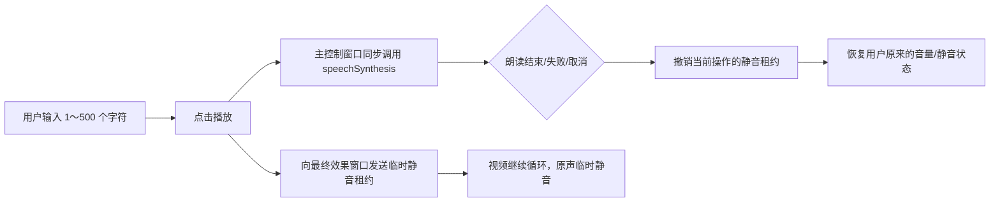

# 固定话术系统朗读精简实施方案

> 状态：已实施；当前事实以桌面端代码和自动化测试为准
> 日期：2026-08-16  
> 适用范围：Rust/Tauri 桌面客户端的“固定话术播放”功能及其 Windows 本地打包链路

> 当前版本范围声明（2026-08-19）：本版本不开发实时话术幻化。本文涉及的实时音频幻化 Worker、speech-to-speech 和相关模型链仅作为历史/后续版本保留项；本方案当前只确认固定话术的本地系统声音朗读，不代表实时话术能力属于本版本。

## 1. 结论

固定话术播放改为“用户输入文字 → Windows WebView2 的系统语音直接朗读”。固定话术不再识别视频人声、不再分离人声、不再克隆音色、不再生成音频文件，也不再依赖 Python、Demucs、faster-whisper、XTTS、PyTorch、语音 Worker、语音模型或固定话术缓存。

首选实现使用前端原生 `window.speechSynthesis` 与 `SpeechSynthesisUtterance`，不新增第三方依赖。当前开发构建已按系统语音能力门禁实施；正式 EXE 发布前仍需完成真实 Windows WebView2 系统朗读烟测，失败时报告不可用并保持原音轨，不回退到已废止的模型链。

固定话术朗读期间，最终效果窗口中的视频继续播放，但原视频声音临时静音；朗读结束、失败、取消、页面卸载或超时后，恢复用户原来的静音/音量状态。首版自动选择本机系统声音，不提供音色克隆、手工音色选择、语速、音调或音量调节。只允许 `SpeechSynthesisVoice.localService === true` 的本地声音，不能静默回退到可能联网的声音。

本方案只精简“固定话术播放”。实时音频幻化本版本不开发，相关 Worker、speech-to-speech 和模型链仅作为历史/后续版本保留；本方案不修改或删除这部分代码。视频处理、普通声音处理和 FFmpeg 媒体能力继续按当前版本实施；本地声音/视频研究分析已不属于当前产品，遗留代码是否删除另立清理任务。

## 2. 目标与非目标

### 2.1 目标

- 用户输入任意普通文本并点击播放后，桌面端用系统声音念出文字。
- 不采集麦克风，不识别人声，不读取或上传视频中的音频用于固定话术。
- 固定话术不经过 Rust 任务队列、Python Worker、模型下载、预生成、缓存或临时音频文件。
- 朗读与单视频循环共用现有单实例最终效果窗口，不重建窗口、不切换视频源、不产生黑屏。
- 删除只服务于旧固定话术人声克隆的代码、测试、配置、依赖、构建脚本和生成资源。
- 在本机完成完整测试和 Windows EXE 打包；源码不放到服务器构建，不使用 Git worktree。

### 2.2 非目标

- 不保留原视频背景声，也不做伴奏/人声分离；朗读期间直接临时静音原视频声音。
- 不识别视频中“什么时候有人说话”，不做声纹、人声检测、ASR 或口型同步。
- 不克隆视频人物音色，不承诺与原视频说话者相似。
- 不生成 N 个 MP4、不生成离线话术版本、不创建版本队列。
- 不改造实时音频幻化 Worker，也不把该 Worker 作为当前版本依赖；`speech_to_speech_adapter.py`、FFmpeg/FFprobe 或公共 Windows 子进程策略如保留，仅供后续版本/历史审计。
- 不在本次任务中追求单文件便携 EXE。正式交付包含 NSIS 安装程序 `.exe`，并同时保留“可执行 EXE + 必需的外部运行资源目录 + ZIP”的便携包结构。

## 3. 当前实现与精简依据

历史固定话术链路曾是：视频参考音频 → Demucs 分离 → faster-whisper 转写 → XTTS-v2 克隆/合成 → WAV 缓存 → Rust 播放状态 → 最终效果窗口替换音轨。当前实现已经移除这条链路，改为系统语音直接朗读；旧链路仅保留在历史迁移记录中。它曾带来了以下与当前需求无关的成本：

- 前端维护模型准备、Worker 准备、能力状态、预生成、缓存命中、任务取消和替换音轨状态。
- Rust 维护固定话术任务进程、IPC 命令、预生成计划、替换音轨、播放状态、缓存和运行资源状态。
- 本地包包含 PyTorch、XTTS、Whisper、Demucs 等大资源。现有打包烟测目录中的语音 Worker 约 2.04 GB，XTTS 模型约 1.75 GB，Whisper 等模型约 0.54 GB；固定话术相关资源合计约 4.3 GB，最终以清理后的实测结果为准。
- 固定话术构建链需要准备 Python Worker 和语音模型，延长构建、首次准备和故障排查路径。

上述链路的核心价值是“识别并模仿原视频人声”，而当前需求只要求“把用户输入的文字念出来”，因此应整体移除，而不是继续裁剪模型参数。

## 4. 目标架构



### 4.1 为什么由主控制窗口朗读

点击事件发生在主控制窗口。这里同步调用 `speechSynthesis.speak()` 可以保留真实用户手势，降低最终效果窗口经跨窗口消息后触发自动播放限制的风险。最终效果窗口只负责按操作 ID 临时静音视频，不承担语音合成。

### 4.2 前端职责

新增一个小型功能模块 `desktop/ui/src/fixedSpeech.ts`，只负责：

- 检查 `speechSynthesis` 和 `SpeechSynthesisUtterance` 是否可用。
- 校验并规范化文本：去除首尾空白，限制 1～500 个 Unicode 字符。
- 枚举本地声音：优先 `zh-CN`/`zh` 的 `localService` 声音，任意本地声音兜底；没有本地声音时明确失败，禁止选择在线声音。
- 构造 utterance，并统一 `start`、`end`、`error`、`cancel` 生命周期。
- 定义固定话术静音消息及运行时守卫。

`App.tsx` 继续拥有界面和生命周期：同一时刻只允许一条固定话术；播放中按钮进入“正在播放”，用户可取消；视频切换、停止播放、组件卸载和窗口关闭都必须取消语音并释放静音租约。不新建 Store、服务层、Trait 或通用 `utils` 目录。

页面初始化时可监听 `voiceschanged` 预热声音列表，但等待必须有短超时和对称清理。点击播放时只能使用已经确认的本地声音；声音列表未就绪或没有本地声音时 fail-closed，不把用户文字交给在线语音服务。

### 4.3 跨窗口静音协议

在现有播放控制消息边界中加入版本化消息：

```ts
type FixedSpeechDuckMessage = {
  kind: 'fixed-speech-duck'
  version: 1
  operationId: string
  active: boolean
  expiresAtMs: number
}

type FixedSpeechDuckAckMessage = {
  kind: 'fixed-speech-duck-ack'
  version: 1
  operationId: string
  active: boolean
}
```

规则如下：

- 每次朗读生成唯一 `operationId`，激活和撤销必须携带同一个 ID。
- 最终效果窗口只接受当前操作的撤销消息，旧操作的迟到消息不能解除新操作的静音。
- 最终效果窗口应用或撤销静音后返回同一 `operationId` 的 ACK；主窗口在点击手势中开始朗读，但 2 秒内收不到激活 ACK 时取消朗读并提示“最终效果窗口未响应”，避免固定话术与视频原声长期重叠。
- 静音租约设置安全过期时间，建议 10 分钟；即使主窗口崩溃或丢消息，最终效果窗口也会自动恢复。
- 实际静音值应为“用户主动静音、固定话术临时静音、其他合法静音来源”的逻辑或，撤销固定话术时不得擅自取消用户主动静音。
- 最终效果窗口未打开或未响应时本次固定话术失败，原视频状态不变；不得因此启动旧模型链。

### 4.4 状态与错误

固定话术只保留四种 UI 状态：`idle`、`speaking`、`cancelled`、`failed`。状态完全由前端当前 utterance 所有，不再写入 Rust 全局快照。

| 场景 | 行为 |
|---|---|
| 能力不可用或没有本地声音 | 禁用播放并提示当前 Windows/WebView2 缺少本地系统声音；原视频声音不变，不使用在线声音 |
| 空文本或超过 500 字 | 阻止播放并给出可操作校验提示 |
| 播放中再次点击播放 | 不并发创建第二条；用户需先取消或等待结束 |
| `onend` | 释放静音租约并回到 `idle` |
| `onerror` | 释放静音租约、保留文本、显示错误，不自动重试 |
| 用户取消 | 调用 `speechSynthesis.cancel()`，释放静音租约 |
| 切换视频/停止/卸载 | 取消当前朗读并对称清理 |
| 消息丢失或主窗口异常 | 最终效果窗口在租约到期后恢复原声 |

## 5. 系统语音能力门禁

旧代码和资源的不可逆清理必须以此门禁为前置条件：

1. 在 Windows 本机启动 Tauri 开发构建，不使用普通浏览器代替。
2. 验证 `speechSynthesis` 与 `SpeechSynthesisUtterance` 存在。
3. 验证可以筛选到 `localService === true` 的声音，优先中文本地声音，并用它朗读中文短句。
4. 验证 `start`、`end`、`error` 事件可观测，`cancel()` 能停止朗读。
5. 验证首次加载时声音列表为空时会有限等待 `voiceschanged`，超时明确失败且可取消，不回退到在线声音。
6. 验证打包后的 release EXE 与开发构建行为一致。

门禁失败则停止后续删除，在文档中记录系统版本、WebView2 版本和失败现象，再评审 Windows SAPI/WinRT 原生适配器。该备选方案必须保持“无识别、无克隆、无 Python、无大模型资源”，但不在本方案中预先引入依赖。

## 6. 文件级改动与删除清单

### 6.1 前端保留并改造

| 文件 | 计划 |
|---|---|
| `desktop/ui/src/App.tsx` | 删除模型/Worker 准备、克隆任务、预生成、替换 WAV 和相关轮询；接入系统朗读及取消生命周期 |
| `desktop/ui/src/playback-control-message.ts` | 增加固定话术临时静音消息类型、解析和版本校验 |
| `desktop/ui/src/interlude-player.ts` | 删除 `voice_clone` 基础音源和克隆状态依赖；按新的固定话术活动状态协调插话 |
| `desktop/ui/src/voiceClonePresets.ts` | 重命名为 `fixedSpeechPresets.ts`，只保留确实仍在使用的文本预设和 500 字约束；把旧 localStorage key 一次性迁移到新 key，避免升级丢文案 |
| `desktop/ui/src/runtimeResources.ts` | 删除 `voice` 资源组件、固定话术消费者和 Worker/模型文案，只保留媒体资源及仍存在的消费者 |
| `desktop/ui/src/fixed-speech-playback.test.mjs` | 改写为系统朗读、静音租约、取消与恢复契约测试 |
| 相邻消息/插话测试 | 更新为固定话术新协议，覆盖旧消息、乱序和超时 |

### 6.2 前端新增

| 文件 | 单一职责 |
|---|---|
| `desktop/ui/src/fixedSpeech.ts` | 系统朗读能力、文本校验、utterance 生命周期和消息守卫 |
| `desktop/ui/src/fixedSpeech.test.mjs` | 使用假的 SpeechSynthesis 对象验证成功、失败、取消、并发和清理 |

### 6.3 前端删除

- `desktop/ui/src/voiceCloneStatus.ts`
- `desktop/ui/src/voiceCloneStatus.test.mjs`
- 旧的 `voiceClonePresets.ts` 与测试在重命名完成后删除，不同时保留两套导出。

### 6.4 Rust/Tauri 删除

- 删除 `desktop/src-tauri/src/voice_clone.rs`。
- 从 `commands.rs` 删除固定话术 Worker 进程、任务、探测、缓存、预生成、替换音轨和全部 `voice_clone_*` 命令。
- 从 `lib.rs` 删除 `VoiceCloneReplacementState`、`VoiceClonePlaybackState`、预生成计划/状态/错误和快照字段。
- 从 `main.rs` 删除旧固定话术命令注册。
- 从 `runtime_resources.rs` 与 `runtime_resource_task.rs` 删除 `Voice` 运行资源组件、`voice-worker`/`voice-models` 路径、状态和下载/安装分支。
- 从 `interlude_player.rs` 删除只为 `voice_clone` 音源存在的枚举值和状态分支；保留通用插话能力。
- 删除以下旧契约测试，并以“旧符号不存在”和新前端行为测试替代：
  - `desktop/src-tauri/tests/voice_clone_contract.rs`
  - `desktop/src-tauri/tests/voice_clone_runtime_contract.rs`
  - `desktop/src-tauri/tests/voice_clone_capability_contract.rs`
  - `desktop/src-tauri/tests/voice_clone_asset_scope_contract.rs`
- 更新运行资源和插话相关 Rust 测试，确认媒体资源仍正常且语音资源组件已不存在。

### 6.5 Worker、依赖与构建脚本删除

- `desktop/worker/voice_clone_adapter.py`
- `desktop/worker/test_voice_clone_adapter.py`
- `desktop/worker/requirements-voice-clone.txt`
- `desktop/worker/requirements-voice-clone-build.txt`
- `desktop/worker/本地语音适配器说明.md`
- `desktop/voice-models/README.md`
- `desktop/src-tauri/voice-worker/.gitkeep`
- `desktop/worker/pyinstaller_hide_windows_subprocesses.py`，仅在复核没有其他 Worker 引用后删除。
- `desktop/tools/准备语音模型资源.mjs`
- `desktop/tools/准备语音模型资源.test.mjs`
- `desktop/tools/准备语音Worker资源.mjs`
- `desktop/tools/准备语音Worker资源.test.mjs`
- 从 `desktop/tools/generate-runtime-resource-tree.mjs` 及测试删除 `voice-worker` 和 `voice-models` 发布项。
- 从 `desktop/tools/start-desktop-dev.mjs` 及测试删除固定话术 Worker/模型准备和 `AUTOLIVE_VOICE_CLONE_*` 环境变量。
- 从 `desktop/ui/package.json` 删除语音 Worker/模型准备脚本及其在测试、开发、构建链中的调用。
- 更新 `desktop/tools/lightweight-desktop-build.test.mjs`，断言便携包不再包含固定话术大资源。
- 更新 `.github/workflows/desktop-package.yml`，删除 Python/Coqui/公共语音模型准备、上传和下载阶段；构建矩阵只准备仍需的媒体资源。
- 更新 `.gitignore`，删除不再存在的固定话术虚拟环境/模型/Worker 规则，并补充确属临时烟测产物的忽略规则。

必须保留：

- `desktop/worker/speech_to_speech_adapter.py` 及实时音频幻化依赖（后续版本预留，不属于当前版本功能）。
- `desktop/worker/windows_subprocess_policy.py`，因为它仍被实时 Worker 使用。
- FFmpeg、FFprobe 及内部媒体依赖准备/校验链，因为视频处理和普通声音处理仍需要它们；实时话术 Worker 不属于当前版本依赖，这些依赖也不作为桌面端独立“运行资源”产品区域展示。

### 6.6 生成资源清理

代码切换并通过门禁后，才清理本机生成目录中的旧固定话术资源：

- 仓库根目录 `.venv-voice-clone`。
- `build/autolive-voice-clone-worker`。
- `desktop/voice-models`。
- `desktop/src-tauri/voice-models` 与 `desktop/src-tauri/voice-worker`。
- `desktop/src-tauri/target/voice-model-cache` 与 `desktop/src-tauri/target/voice-worker-build`。
- `desktop/.codex-worker-smoke` 中只属于固定话术 Worker 的内容。
- `desktop/package-smoke`、`desktop/package`、`desktop/resource-release` 中精确定位出的 `voice-worker`、`voice-models` 和旧固定话术产物。
- 其他由资源脚本生成且可证明只服务于固定话术克隆的缓存目录。

实际删除前必须逐个解析为绝对路径，确认目标位于 `E:\\aotlve` 且不是工作区根目录；不得用宽泛通配符递归删除 `package`、`build` 或 `desktop` 整体。删除后在交付报告中列出路径、大小及是否可由旧构建重新生成。

对于已安装旧版本产生的应用数据，增加一次性升级清理：只能通过 Tauri 应用数据目录 API 定位受控根目录，只删除已知的 `voice-worker`、`voice-models` 和固定话术 `voice-clone` 缓存子目录；规范化路径并确认仍在应用数据根内，拒绝符号链接/重解析点和未知目录。成功后写入迁移标记，失败只报告可操作错误，不影响媒体播放，也不得扫描或删除用户导入的视频。

## 7. 文档同步范围

实施时同步更新以下当前事实源：

- `产品需求文档.md`：把固定话术定义为自动选择本地系统声音朗读，明确无 ASR/分离/克隆和在线语音回退；同时明确实时话术幻化本版本不开发。
- `系统架构总览.md`：删除固定话术模型 Worker 和服务器/客户端资源关系。
- `桌面客户端架构.md`：重写固定话术数据流、状态、错误、窗口同步和 IPC 边界。
- `媒体参数范围与默认值.md`：若存在固定话术模型参数则删除；仅保留文本 1～500 字契约。
- `长任务开发总计划.md`：将旧克隆链标记为已废止，并加入本次迁移和清理验收。
- 删除 `desktop/worker/本地语音适配器说明.md`，因为它整份只描述已废止的固定话术克隆 Worker；实时 Worker 的真实说明保留在其自身文档或当前桌面架构中。

旧人声克隆相关的 `docs/superpowers/specs`、`docs/superpowers/plans` 和 `tasks/prd-voice-clone-current-playback*` 已按文档审计结果删除；当前固定话术只以本文、桌面端代码和自动化测试为准。

## 8. 实施顺序

1. **冻结边界与记录基线**：保存当前 `git status`、旧资源目录大小、旧包大小和既有失败测试；当前工作区已有其他未提交改动，实施前先确认其归属并避免覆盖，不执行 reset/checkout。
2. **先写失败测试**：建立系统朗读、文本校验、单实例、取消、错误恢复、乱序消息、静音租约超时和用户静音保持测试。
3. **通过能力门禁**：在真实 Tauri/WebView2 中完成开发构建和 release EXE 系统朗读烟测。
4. **切换前端入口**：实现 `fixedSpeech.ts`，把固定话术按钮切到系统朗读，完成最终效果窗口静音协议。
5. **拆除旧调用链**：确认前端已无旧 IPC 调用后，删除 Rust 命令、状态、任务、缓存和运行资源组件。
6. **拆除 Worker 与构建链**：删除固定话术 Python/依赖/准备脚本，收紧资源清单和打包测试；将 Windows 正式打包从强制 `--no-bundle` 改为 NSIS 安装程序构建，同时保留 portable 归档。
7. **更新当前文档并标记历史方案**。
8. **精确删除生成资源**：按绝对路径和用途清单执行，不删除 FFmpeg 或实时 Worker 资源。
9. **代码总监复审**：检查是否仍有旧符号、重复状态、未使用导入/依赖、资源泄漏、静音恢复竞态和越界删除。
10. **全量验证并本机打包**：测试通过后生成 Windows release EXE、便携目录和 ZIP，记录大小变化和 SHA-256。

前端、Rust、构建/文档三个独立方向可以使用子线程并行，但只能在当前分支和同一工作区内工作，不创建 worktree；主线程统一审查 diff、解决交叉修改并执行最终验证。

## 9. 验证矩阵

### 9.1 自动化验证

| 层级 | 必测内容 |
|---|---|
| 前端单元 | 能力检测、本地声音筛选、拒绝在线声音、旧预设迁移、空文本、500 字边界、超过上限、开始/结束/失败/取消、禁止并发、卸载清理 |
| 消息契约 | 版本、非法输入、旧操作撤销、新操作覆盖、租约超时、用户静音不被覆盖 |
| 前端集成 | 固定话术按钮不再调用任何 `voice_clone_*` IPC，不再渲染模型/Worker/预生成状态或替换音频元素 |
| Rust | 编译与测试通过；快照、命令、资源枚举中没有固定话术克隆状态 |
| 资源发布 | 清单和便携包中没有 `voice-worker`、`voice-models`、XTTS、Whisper、Demucs、PyTorch |
| 静态清理 | 生产代码和构建脚本中无 `AUTOLIVE_VOICE_CLONE`、`voice_clone_adapter`、`XTTS`、`faster-whisper`、`Demucs` |

历史文档目录可从生产代码静态门禁中排除，但必须带废止标记。

### 9.2 建议执行命令

在 `E:\\aotlve\\desktop\\ui`：

```powershell
pnpm test
pnpm exec tsc --noEmit
pnpm run build
pnpm tauri:build
```

在 `E:\\aotlve\\desktop\\src-tauri`：

```powershell
cargo fmt --all -- --check
cargo test --workspace
cargo clippy --workspace --all-targets -- -D warnings
```

构建/资源脚本的 Node 测试由 `pnpm test` 统一运行；如果脚本未纳入统一入口，则逐个执行相邻 `*.test.mjs`。所有命令在本地开发机执行，不上传源码到服务器构建。

### 9.3 Windows 手工烟测

- 导入带声音的任一受支持视频格式，最终效果窗口持续循环且不重建。
- 输入中文、英文、数字、标点和混合文本，均能用自动选择的本地系统声音朗读。
- 朗读期间视频画面不中断，原视频声音静音；结束后恢复原状态。
- 用户本来已静音时，朗读结束后仍保持静音。
- 播放中取消、切换视频、停止播放、关闭主窗口，均不会留下永久静音或残余朗读。
- 快速连续点击、连续播放两条、旧消息迟到，不会并发朗读或错误恢复音量。
- 无语音模型下载、无 Python Worker 启动、无额外控制台窗口。
- 断网环境下验证本机已安装系统声音的朗读行为；若系统没有可用声音，给出明确错误而不是下载模型。
- 监测固定话术期间的网络请求，确认文本不会被提交给在线语音服务。

## 10. EXE 交付与体积验收

Windows 打包在仓库现有本地发布流程上做一处明确调整：`desktop/tools/build-desktop-artifact.mjs` 不再在 Windows 强制 `--no-bundle`，而是调用 Tauri 官方 NSIS bundle；`desktop/tools/archive-desktop-artifact.mjs` 同时归档 NSIS 安装程序和 portable ZIP。预期产物包括：

- `desktop/src-tauri/target/release/autolive-desktop-core.exe`
- `desktop/src-tauri/target/release/bundle/nsis/*-setup.exe`（正式安装程序，实际名称以 Tauri 输出为准）
- `desktop/package/v0.1.0/x86_64-pc-windows-msvc/portable/autolive-desktop-core.exe`
- 同一便携目录中的 `runtime-resources.json` 与仍需要的 `embedded-runtime-resources`，其中保留 FFmpeg/FFprobe 等媒体资源。
- 对应便携 ZIP 和 SHA-256。

“打包成 EXE”优先由 NSIS 安装程序满足：用户运行 setup EXE 完成安装，安装内容包含应用和必要媒体资源。portable 版本中的原始 EXE 旁边仍有资源目录，不能把它宣称为可脱离资源目录运行的单文件版。若要求真正单文件、无安装且无任何旁车资源的 EXE，需要另行评估 FFmpeg 嵌入、解压、许可证、杀毒误报和启动成本。

体积验收以新旧便携目录和 ZIP 的实测差值为准。预期至少移除约 4.3 GB 的固定话术语音资源，但不把估算值作为硬性通过标准；硬性标准是发布树中不存在旧语音 Worker、模型和依赖。

## 11. 验收标准

- 固定话术只需输入文字和点击播放，不需要视频人声准备或模型准备。
- 固定话术代码路径不访问麦克风、不读取视频音轨做识别、不调用 ASR/分离/克隆模型。
- 播放、结束、失败、取消、切换视频和窗口关闭均能对称恢复声音状态。
- 旧固定话术前端状态、Rust IPC/任务、Python Worker、模型资源、构建脚本和生成资源已按清单删除。
- 固定话术相关代码未误删；实时音频幻化仅作为历史/后续版本保留，不属于本版本验收。
- 无未使用代码、导入、导出、依赖、配置、资源或调试日志。
- 前端测试/类型检查/构建与 Rust 格式化/测试/Clippy 全部通过。
- Windows 本机 release EXE 烟测作为发布前门禁；便携包和 ZIP 已生成，产物哈希与体积已记录。
- 当前架构文档已更新，历史克隆方案已明确标记废止。

## 12. 回滚与风险

### 12.1 回滚点

- 门禁通过前不删除旧资源，失败时只撤回尚未合并的新系统朗读代码。
- 前端切换、Rust 拆除、资源脚本拆除和物理资源删除分阶段提交或至少分阶段保存 diff，便于定位回退。
- 物理删除的模型和 Worker 都应属于可由旧构建重新生成的产物；源代码删除依赖版本控制恢复，不手工保存第二套隐藏副本。

### 12.2 主要风险

| 风险 | 控制措施 |
|---|---|
| Tauri WebView2 不暴露或限制系统朗读 | 先做真实开发/release 门禁；失败即停止删除并评审 SAPI/WinRT |
| 系统没有中文声音 | 选择任意 `localService` 本地声音兜底；完全没有本地声音时明确提示安装 Windows 语言/语音包，不捆绑大模型 |
| `voiceschanged` 时序不稳定 | 初始化时有限等待并缓存本地声音；超时明确失败且可取消，不使用在线声音兜底 |
| 主窗口异常导致视频一直静音 | 带操作 ID 的有限期租约，最终效果窗口到期自动恢复 |
| 取消与 `onerror`/`onend` 重入 | 所有完成路径执行幂等清理，只允许当前操作释放自己的租约 |
| 误把实时音频幻化当作当前功能 | 按真实调用搜索逐项复核；文档明确其为后续版本/历史保留，不作为当前入口或验收 |
| 当前工作区已有未提交修改 | 开始实施前记录基线并确认重叠文件，不 reset、不 checkout、不覆盖其他任务改动 |

## 13. 产品决策（已确认并执行）

本方案已按以下产品决定落地：

1. 固定话术自动选择 `localService` 本地系统声音，中文优先；首版不提供手工声音选择和参数调节。
2. 朗读时视频继续播放，但原视频全部声音临时静音。
3. 固定话术不保留背景声，不识别人声，不克隆音色。
4. 固定话术相关 Python/模型链删除；实时音频幻化代码如仍保留，仅作后续版本/历史兼容，不能据此宣称本版本已开发。
5. 交付形式为 Windows NSIS 安装程序 EXE，以及可直接解压运行的 portable 目录/ZIP；不承诺单文件便携 EXE。

## 14. 实施记录（2026-08-16）

- 前端已切换为 `fixedSpeech`：主窗口通过 BroadcastChannel 控制 `final-effect` 窗口，最终效果窗口只使用 `SpeechSynthesisVoice.localService === true` 的 WebView2 本地声音；保留 1～500 Unicode 字符校验、预制文本迁移、取消、超时、乱序消息、`pagehide`/卸载清理和静音恢复。
- 已删除固定话术的 Rust IPC/状态/Worker、Python 适配器、模型准备脚本、语音依赖和旧契约测试；实时 `speech_to_speech`、FFmpeg、视频/普通声音处理保留，本地研究分析仅作为遗留代码审计项。
- 已按受控绝对路径清理旧生成资源：虚拟环境、模型、Worker 构建缓存、旧内嵌资源、旧发布目录和旧包 smoke 目录；FFmpeg/FFprobe 未删除。资源清单重新生成为 media-only，仅 2 个文件。
- 已生成 Windows 产物：
  - `desktop/src-tauri/target/release/autolive-desktop-core.exe`
  - `desktop/src-tauri/target/release/bundle/nsis/autolive-desktop-core_0.1.0_x64-setup.exe`
  - `desktop/package/v0.1.0/x86_64-pc-windows-msvc/portable/` 与 portable ZIP。
- 当前实测包体：NSIS 约 76.2 MB，portable EXE 约 17.6 MB，便携 ZIP 约 100.7 MB；内置 FFmpeg/FFprobe 各约 114 MB。便携清单为 2 个 `media` 文件，包树无旧 voice clone/模型/Worker 命名产物。最新 SHA-256：NSIS `3D89707906670955A62CC9A767DFF6B4C2075E50919DBBD5B67F7C15FC725341`，portable EXE `F88A3AA66251DD8650764742755E30D4DA6E0E0F4336221FAACB7CFEBAB5C7D8`，portable ZIP `3637AF1D3A410547E0A0D21D72327CAE6C2EA729DB9BD61B363349F04F431DF7`。
- 自动化验证已通过：前端 Node 测试 77/77、直接 `tsc --noEmit`、Vite 构建、Rust `cargo fmt --check`、`cargo test --workspace`、`cargo clippy --workspace --all-targets -- -D warnings`、NSIS/portable 归档测试。
- 后续修正：应用启动不再读取上次视频路径、不再自动恢复或使用 `<video autoPlay>`；必须点击“导入视频并播放”并由用户选择受支持视频格式。固定话术从 `starting` 阶段开始暂停当前随机插话，朗读完成、取消或失败后恢复原插话，不再被 250ms 调度器清空。
- 已在 Windows portable EXE 的真实 WebView2 窗口完成系统语音冒烟：中文文案朗读进入“准备中/朗读中”并完成恢复；英文文案完成恢复；336 字长文案取消后显示“已取消，原声已恢复”；用户原本处于静音时朗读完成后仍保持“取消静音”状态；朗读中关闭 `final-effect` 窗口后主窗口同样收到“已取消，原声已恢复”。无本地声音、源切换和网络抓包分支仍由协议/静态契约覆盖，发布到其他机器时需按同一清单复测。
