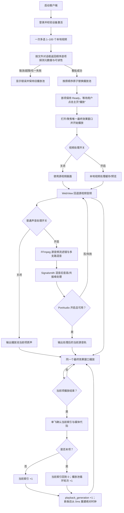
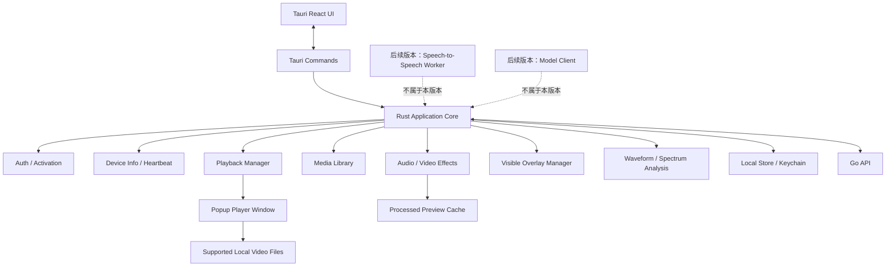
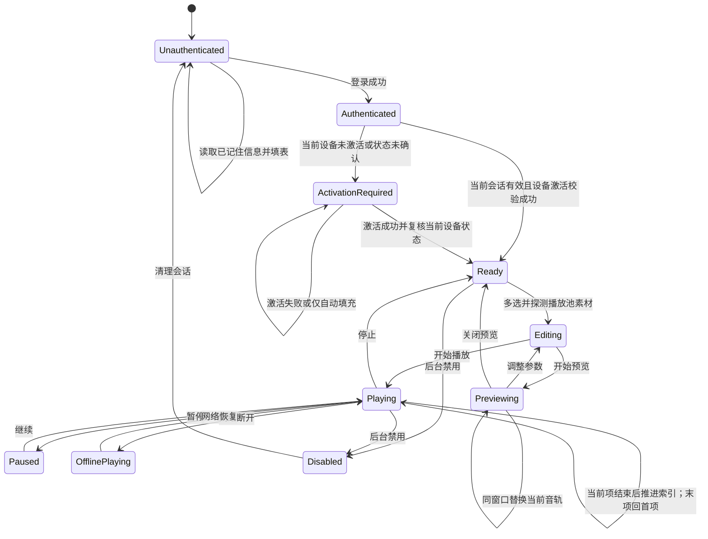
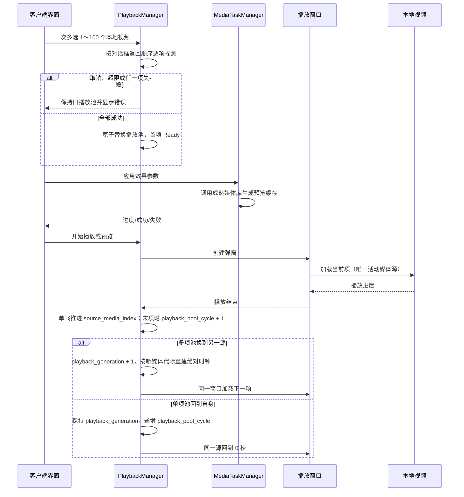

# 桌面客户端架构：Rust + Tauri

> 当前实现事实源：`desktop/src-tauri`、`desktop/ui` 及其自动化测试。本文只描述当前桌面代码已经实现的行为；历史设计不得覆盖本口径。
>
> 当前版本范围声明（2026-08-24）：本版本不开发实时话术幻化。speech-to-speech、VAD/ASR/LLM/TTS、实时话术候选换轨和模型租约直连均不属于当前桌面产品入口、验收或发布范围。参考图媒体参数全部是正式需求；当前参数面板只使用“已接入 / 正式需求待实现 / 待确认”三态。

> 用户可见命名（2026-08-25）：桌面端界面品牌、启动页与窗口标题统一显示 `GpAutoLive`；空间受限或需要缩写时统一显示 `GPAL`。内部产品代码 `autolive`、Rust/前端包名、Tauri 应用标识符、可执行文件名、环境变量和本地存储键继续保持现有兼容名称，不进入本次展示品牌重命名范围。

> V2.94 门禁与分发状态（2026-08-24）：桌面端 `#/login` 只保留账号和密码；单次提交按登录、查询当前设备、必要时按账号激活授权自动绑定设备、服务端确认 Ready 执行，桌面端不再输入、保存或提交激活码明文。失败保持登录页并显示账号无授权、授权过期、设备额度已满、绑定冲突或设备禁用等稳定原因。Windows 10/11 x64 正式跨机交付采用携带 WebView2 离线安装器、FFmpeg/FFprobe 和 PortAudio 的 NSIS 安装包；便携 ZIP 只作内部测试。真实 HTTPS/DNS/TLS、Credential Manager 异常和 Authenticode 证书签名仍需发布验收。

> V2.91 联调事实（2026-08-21）：服务端模型账号 API Key 的写入、脱敏列表、设备激活、客户端模型租约申请/释放已通过临时 HTTP 控制面联调；桌面端可获得的租约响应只包含 `direct_base_url`、状态和过期时间，不包含供应商 API Key 或短期凭证。当前桌面产品不启动模型直连或实时话术，不能把该联调描述为模型调用已完成。

> V2.92 测试环境配置（2026-08-21）：桌面本地开发默认使用 `http://101.96.208.132:9090`，Tauri 开发默认选择仅测试使用的 `test-control-plane` capability；`tauri:build:test` 生成的 Windows 安装包固定使用同一地址。控制面客户端自动拼接 `/api/v1`，生产 `tauri.conf.json` 和 HTTPS 门禁保持不变。

> 多产品控制面规划（2026-08-22，未实施）：服务端计划为 `autolive`/`douyin_desktop` 建立产品会话与硬隔离，并让 Profile 返回服务端时间、6 小时建议复核、24 小时签名离线硬截止和权益 revision。douyin-desktop 首版计划使用本地 BYOK；供应商不支持可撤销、受限、绑定租约的短期凭证时不启用托管直连。当前 autoLive 桌面行为、当前版本不开发实时话术幻化的范围及现有部署均不因该规划改变。

## 普通声音周期预热（2026-08-20）

普通声音和视频随机周期采用滚动 N/N+1/N+2：N+1、N+2 提前保存周期与完整参数快照，但只有 N+1 能绑定最新声音 revision、取得 candidate ID，并在预选后立即进入 Rust 启动 Scheduled FFmpeg；N+2 不创建 PCM、PID 或 FFmpeg。最终效果窗口以真实 `<video>`、`source_media_pool` 当前条目、`source_media_index`、`playback_pool_cycle` 和时钟 epoch 发布 `playback_generation + duration_ms + position_ms + absolute_position_ms`；绝对媒体时间只在当前媒体代际内连续。候选目标严格限制在当前绝对媒体时间之后且不超过 `60000ms`；同一 generation/loop 的迟到同步请求以 Rust 最新位置重锚，已到期目标返回暂态 stale，由主窗口从最新时钟重建或推进，继续旧轨且不进入最终效果窗口。多项池每次按顺序切换到另一个源条目都递增 `playback_generation`、取消旧候选并从新条目 0ms 重建时钟，不把上一条目的时长或位置累计到新源；单项池回到自身时保持 generation，递增池循环轮次并继续同一媒体代际。后端先校验 generation/revision 才可替换 pending；旧 revision 错误会删除旧 candidate，主窗口读取最新快照后分配新 candidate ID，禁止重试旧 revision。声音与视频默认维护独立目标；开启联动后使用两个区间的交集并共享目标，无交集时拒绝启用。Rust 仍只保留一个当前 FFmpeg 任务和一个候选任务；普通声音周期候选使用有界 CatchUp，只有覆盖“prepare 已用时间 + 130–750ms 提交安全尾部”后才可提交，其有界队列容量为 `5000ms + 提交安全尾部`（`5130–5750ms`）。覆盖不足时继续由 current 出声并返回可重试状态，不按固定 `750ms` PCM 提前切轨。只有提交成功才更新 `PlaybackCore` 配置和 revision。暂停、停止、拖动、换源或配置变化会取消候选并 Join 任务；恢复后重新预选并立即处理 N+1。

当前已完成预热调度和输出所有权 Phase 1–2：`AudioMixerTask` 只生产有界 PCM，`audio_cycle_output` 按值持有唯一 PortAudio 流并独占 SPSC 环缓写入，周期提交执行样本域 30ms 双向线性交叉淡化。callback 只读环缓并补零，不持有业务 Mutex，也不执行 FFmpeg 或 UI IPC。实机 50 轮/30 分钟漂移与听感验收仍未完成，不能把当前能力描述成完整 DAW。

## 1. 职责范围

Rust 桌面客户端是系统的执行面，负责：

当前功能链路见 [`桌面端功能流程图.md`](./桌面端功能流程图.md)。

- 使用与后台一致的账号登录
- 账号密码登录后，由服务端按账号激活授权自动绑定当前设备；桌面端不接触激活码明文
- 采集并上报基础设备信息
- 管理 `.mp4`、`.mov`、`.mkv`、`.avi`、`.webm`、`.m4v`、`.ts`、`.m2ts`、`.flv`、`.wmv`、`.3gp` 本地视频素材和最多 100 项的有序播放池状态
- 管理单窗口顺序循环、当前索引和播放池循环轮次；本版本不管理 speech-to-speech 音频变体决策
- 调整合规的音频/视频效果并进行非破坏性预览
- 弹出一个持续存在的窗口，按 `A → B → … → A` 顺序播放池中有效视频；任意时刻只有一个活动媒体源，不创建第二个视频窗口
- 展示波形、频谱、响度和基础视频参数
- 添加可见的文字、图片、Logo、贴纸和光效叠加层
- 管理视频处理缓存、普通声音处理、插话和固定话术系统朗读状态；实时音频候选和 speech-to-speech 状态仅作历史兼容审计
- 参考图中的音频、视频、高级视觉、挂件、切片、检测和修复参数全部属于正式产品需求；未映射参数必须显示“正式需求待实现”，语义尚未确认时显示“待确认”。不可见水印和随机扰动只作为普通媒体效果，不输出内容相似度、媒体鲁棒性、内容指纹或平台检测规避结论
- 本版本不提供本地实时话术幻化入口
- 使用一个持续存在的独立弹窗展示播放池当前项和处理效果
- 默认采用本地有序播放池循环：一次多选按文件对话框返回顺序逐项探测 `1–100` 个条目，只有整批成功才原子替换旧池；取消选择、超过 100 项或任一条目探测失败都保持旧池并显示错误。首项保持 `Ready`，用户点击主页“播放”才打开/聚焦最终效果窗口；当前项结束进入下一项，末项回首项并递增播放池循环轮次，单项池自循环
- 支持以用户所选插话目录为根递归扫描其子目录、随机插话、主音轨 duck、插话独立音轨选择，以及普通声音处理中的单轨/多轨预设混合；普通声音与随机插话共用同一份 22 套、每套精确 35 字段的预设定义。插话以 `audio_selection_mode=fixed|random` 区分固定单轨与所选池随机，默认 `random`。`audio_fixed_preset_id` 可固定选择 `p01–p22`、默认 `p01`；随机模式的 `audio_preset_ids` 可多选或一键全选全部 22 项，以 `audio_mix_enabled + audio_mix_pick_min/audio_mix_pick_max` 表达随机单轨或每次 `1–4` 支路多轨合一，以 `audio_variation_mode=each_playback|periodic` 表达变化策略；默认随机池为 `p01–p20`，`p21/p22` 只有用户显式选择后参与，其余默认 `false/1/2/each_playback`。两条业务链共享预设事实源，但分别保存选择状态和运行快照
- 音频输入以源视频音频流为准；普通声音处理走 FFmpeg/PortAudio，插话和固定话术走当前本地播放链路。实时 speech-to-speech 输入仅作后续版本预留
- 网络异常时保持本地播放
- 通过 Go 管理控制面账号和租约；本版本播放不申请实时话术租约、不调用 OpenAI-compatible 大模型

客户端不负责：

- 用户和激活码管理
- 模型 API Key 管理
- 服务端数据库读写
- 视频云端存储
- 面向平台审核/检测的规避、自动发布、平台接入和独立算法报告任务不属于当前客户端职责

### 1.1 参考界面功能映射

截图展示的是一个“本地视频素材处理与预览工作台”，不是后台管理页面。桌面端吸收其深色、高密度工作台的视觉结构、信息层级和可辨识媒体参数需求；截图中的品牌、硬编码能力数量、平台指标和示例数值不直接继承。实际状态仍以本项目代码与有效契约为准。

| 截图区域/能力 | 桌面端处理方式 | 优先级 |
| --- | --- | --- |
| 左侧“导入视频”和视频素材库 | 从受支持格式白名单一次多选 `1–100` 个文件，按文件对话框返回顺序逐项探测，整批成功后原子替换当前有序播放池；本版本不追加、不重排、不删除池内条目 | P0 |
| 播放、进度、音量和状态 | 左栏主窗口播放控制，支持有序播放池循环、当前索引和播放池循环轮次；播放速度由普通声音预设/周期随机化更新并只读展示，不提供随机播放或手动倍速 | P0 |
| 画中画播放 | 左栏提供打开/聚焦独立最终效果窗口的控制；窗口可关闭、恢复和调整大小 | P0 |
| 音频转换开关、音频参数重置 | 合规音频效果开关、参数面板和默认值恢复 | P0 |
| 视频转换开关、视频参数重置 | 合规视频效果开关、参数面板和默认值恢复 | P0 |
| 实时幻化或模型换轨 | 不映射到当前 UI；不显示入口、不启动 speech-to-speech、不生成实时变体、不申请模型租约 | 非当前范围 |
| 音频实时变化、响度、波形、频谱 | 采用成熟媒体分析库显示实时或近实时诊断信息 | P1 |
| 音频/视频/高级正式参数 | 中栏逐字段展示 Rust 正式契约；左栏为普通视频与高级视觉，右栏为普通声音。展示卡与周期状态只读，右侧声音栏的两个具名分组不整体定义为编辑区；上述 9 项只读展示并随预设/周期随机化刷新，算法三态独立展示 | P1 |
| 随机几何、抽象几何脸、同源画中画与局部效果 | 复用打包 FFmpeg 单一滤镜图，支持数量、大小、透明度、时间区间和受控空间变换 | P1 |
| 音频状态卡片 | 区分当前可调参数、实际 PortAudio/WebView 出口、波形/频谱/响度/噪声底/MFCC/SNR/LPC 共振峰只读诊断和普通声音随机周期；倒计时只读且随播放状态暂停/恢复 | P1 |
| 最终效果窗口与实时处理引擎卡片 | 分别映射唯一最终效果窗口和真实的“探测/处理/校验/输出”状态，不展示截图原产品的变声或模型步骤 | P1 |
| 正式媒体参数 | 统一通过 `MediaEffectParams` 展示；每项显式标注“已接入 / 正式需求待实现 / 待确认”，状态不等于编辑权限 | 正式需求，分阶段实现 |
| 独立算法报告、变体 MP4、内容指纹、OBS/RTMP | 当前版本不提供入口，也不作为桌面端验收或发布能力 | 非当前范围 |

桌面 UI 不展示独立“运行资源”卡片，不向用户提供运行资源安装、取消、选择目录或清理按钮。正式包优先使用 Tauri bundle 内置的 FFmpeg/FFprobe；内置资源不完整时，Rust 使用已校验的应用数据目录下载/安装路径作为兜底。Windows release 中所有 FFmpeg/FFprobe 子进程必须通过共享后台命令构造器设置 `CREATE_NO_WINDOW`，不得在探测、处理、普通声音或插话链路弹出终端；后台启动不吞掉 spawn、stderr、退出码、超时或取消错误，结构化失败仍沿原调用链返回。资源缺失、探测失败或处理失败通过导入/处理错误反馈。

UI 控件优先复用 Ant Design；媒体内核和滤镜能力优先采用成熟库，不自行实现工具链。

### 1.2 桌面主界面视觉与交互基线

- 主界面采用参考图映射后的深色高密度三栏工作台。顶栏固定为 `36px`；以 `1728×1044` 同视口截图为桌面视觉基准时，主工作区使用 `320px / minmax(0, 1fr) / 272px` 三列、`12px` 外边距和 `12px` 栏间距。`≤1199px` 时外层工作区按素材 → 视频/参数 → 声音/输出重排，保证 `960px` 最小窗口能够进入真实窄屏布局。
- DOM、Tab 和读屏顺序固定为“素材与播放控制 → 视频/参数工作区 → 普通声音/输出状态”。视觉位置不得通过 CSS 排序打乱键盘和辅助技术顺序。
- 三栏各自拥有内部滚动容器，顶栏不随内容滚动；页面根节点不得再出现与栏内滚动竞争的无界纵向滚动。窗口变窄或系统缩放增大时，按上述 DOM 顺序降级为较少列或单列，并保持所有关键按钮、状态和错误可访问，不允许仅做横向裁切。
- 左栏是本地有序播放池和播放控制。播放池最多 100 项，按文件对话框返回顺序展示；本版本不追加、不重排、不删除池内条目，也不提供随机播放。播放会话任意时刻只有一个活动源素材；当前项结束进入下一项，末项回首项，单项池自循环。该本地源文件播放池不是生成版本队列。播放区保留播放、暂停、继续、停止、当前项进度、音量和画中画/最终效果窗口入口；不提供独立倍速控制，播放速度只读展示并由普通声音预设/周期随机化更新。
- 播放池标题区常驻带文字的“导入视频”按钮；未导入时显示“选择视频文件”主按钮，已有播放池时显示“重新选择视频”。三个入口只调用同一个支持多选的文件选择、资源准备、逐项 FFprobe 探测和原子快照替换函数。取消选择、超过 100 项或任一条目探测失败都保持旧池并显示明确错误；不提交部分播放池。
- 中栏顶部固定展示六张紧凑状态卡，且只展示真实状态：播放、循环、视频处理、普通声音处理、源规格、最终效果窗口。禁止以硬编码或推测值展示“真人率”“风险分”“增强到 2160p”等截图原产品指标。
- 中栏参数主面板填满中栏实际可用宽度，不设置约 `880px`、`860–900px` 或其他固定最大宽度，并以外层双主栏呈现全部正式媒体参数：左栏依次包含普通视频与高级视觉，右栏包含普通声音。参数卡与周期状态保持只读；右侧声音列的“音高、变速与共振峰”“特征、信噪比与空间混合”只作为具名展示/配置分组，不整体定义为编辑区，其中 MFCC 偏移、MFCC 维度、SNR 浮动、频谱盲区、干湿比、环境声混合、高质量音高、播放速度和共振峰偏移只读展示。每个主栏内部的参数卡网格根据该栏实际可用宽度自动决定列数并自然换行，不限制每排卡片数量，也不设置固定列数或卡宽；极窄时外层双主栏按 DOM 顺序降为单列，全程不横向裁剪。普通参数卡固定为统一 `80px` 紧凑高度，只显示参数名、当前值或进度和“已接入 / 正式需求待实现 / 待确认”三态标签；卡片底部不再显示范围、单位、接入情况或待实现原因说明句。固定视觉频段权重使用独立 `196px` 固定高度卡片，跨满所属栏并完整显示三列，不得裁剪。已接入字段仍可进入真实应用，待实现或待确认项仍由三态标签准确表达，三态差异不开放输入。范围、默认值和能力状态事实仍保留在契约、校验与媒体边界。每张参数卡或独立参数模块按《媒体参数范围与默认值》集中定义的参考图五色色板分配自己的颜色，不按大分类固定一种颜色；五色可循环复用，分配顺序尽量避免视觉相邻项同色，并在挂载期内保持逐卡映射稳定。挂载后的卡片显示 `value` 实际变化时按该卡自己的颜色执行一次约 `900ms` 高亮，先短暂增强再平滑淡出，减少动态效果时禁用。颜色不表达算法状态，算法状态继续由三态文字标签表达。
- 主参数区在参数网格之外同时保留“视频周期”和“声音周期”两个只读状态模块，两者都展示各自现有配置范围、当前真实变化次数，并以各自同一条 N+1 真实计划的目标时间和周期长度计算进度；旧版仅显示视频周期主状态的布局不得继续作为当前实现。声音状态标签直接读取现有真实 `audio processing status`。独立模式下两条状态按各自计划推进；联动模式下仍分别可见，但共用同一个真实联动目标。对应处理关闭、播放暂停、周期未启用或尚无真实计划时，进度归零并保持非活动，次数沿用现有调度器状态；不得通过前端计时器、轮询或渲染次数伪造变化。本条只增加状态投影，不改变现有调度、配置范围、默认值或后端算法。
- 右栏依次承载最终效果窗口入口、普通声音运行摘要与 PortAudio/WebView 实际出口、波形/频谱/响度/噪声底/MFCC/SNR/LPC 共振峰等只读诊断，以及真实的“媒体探测 → 本地处理 → 产物校验 → 当前输出”处理链。普通声音摘要常驻显示 `audio_stream_variant_count` 投影的实际多轨支路状态，以及当前周期已提交预设 ID 映射出的全部预设名称；首轮尚未提交时显示等待态，名称允许自然换行，不得从 `audio_stream_params/audio_stream_variants` 数值反推预设身份。插话和固定话术只提供紧凑入口，详细配置放入抽屉，避免挤占持续诊断区域。
- 参考图同时定义视觉结构与正式媒体参数需求。当前 UI 不出现实时话术幻化、speech-to-speech、旧报告/变体 MP4 产物、内容指纹、OBS 或 RTMP；像素扰动、帧率扰动和 `65Hz–20000Hz` 视觉频段可按能力状态展示，但未映射时不得宣传为已生效，更不得宣传检测规避。
- 深色背景必须从应用启动壳到 React 首次可交互帧保持一致，避免白色启动闪烁。所有颜色、间距、字号、圆角和控件状态通过现有 Design Token、Ant Design 公开 Props 和外层布局实现，不覆盖 `.ant-*` 内部样式。

#### 1.2.1 三个声音抽屉统一规范

- “高级声音”抽屉的桌面目标宽度为 `760px`，“随机插话”和“固定话术”抽屉的桌面目标宽度均为 `560px`；三者最终宽度都不得超过 `100vw`，窄窗口下收敛到当前可用视口宽度，不产生抽屉外的横向滚动。
- 三个抽屉统一使用深色中性主题，不以高饱和色块区分业务。头部采用双行结构：第一行显示明确标题和关闭入口，第二行显示来自当前配置、播放快照或本地能力探测的真实状态摘要；无状态数据时显示可解释的等待、未配置或不可用，不使用占位成功文案。
- 正文按业务职责拆成卡片分区，正文区域独立纵向滚动；标题区和底部操作区保持固定。底部只保留当前流程最重要的主操作，并让取消、关闭或恢复默认等次要操作保持清晰但不抢占主操作层级。
- 所有表单控件必须持续显示可感知标签，不能只用 placeholder、Tooltip 或当前值代替字段名。桌面宽度允许相关字段并排，窄屏时字段统一降为单列，错误说明、单位、范围和不可用原因不能被截断。
- 删除用户预设前必须显示明确确认，说明将删除的预设名称和影响；用户取消后不得改变当前选中预设、参数或播放状态。删除完成后应选择仍存在的有效预设或回退到明确默认值，不得留下失效引用。
- 抽屉优化只调整信息结构和交互密度：高级声音抽屉保留 PortAudio、多轨与预设、声音周期、状态和缓存管理；“音高、变速与共振峰”“特征、信噪比与空间混合”位于主页声音列且不在抽屉重复，上述 9 项在主页与抽屉都不得提供手动输入。随机插话使用本地目录、随机间隔、音量、主音轨 duck、`audio_selection_mode=fixed|random`、`audio_fixed_preset_id`、独立选择的 `p01–p22` 多选预设池及一键全选、`audio_mix_enabled`、`audio_mix_pick_min/audio_mix_pick_max`、`audio_variation_mode=each_playback|periodic` 和 `audio_variation_period_min_ms/audio_variation_period_max_ms`。触发间隔在 UI 中以秒显示/输入，范围 `0.5–60s`、默认 `8–13s`，提交时换算为既有毫秒 IPC 字段；duck 攻击/释放仍以毫秒显示，均允许输入 `0`。选择模式默认 `random`，固定预设默认 `p01`，默认随机池为 `p01–p20`，`p21/p22` 只有用户显式选择后参与；其余默认 `false/1/2/each_playback`，周期默认 `8000–15000ms`。`fixed` 时这些随机字段仍保留并按同一范围校验，只在运行时不消费，界面应明确标记为当前不生效且不得清空用户选择。固定话术仍只使用 WebView2 `localService` 本地系统声音。三个抽屉都不得新增实时话术幻化、speech-to-speech 或模型租约。
- 高级声音抽屉底部应用操作从现有开关派生处理范围，不维护第二份状态：仅声音开启时使用 `audio` 并显示“应用声音参数”，音视频同时开启时使用 `both` 并显示“音视频同时应用”。视频开启本身不得禁用该操作，因为 Rust `start_media_processing` 会读取当前两个开关并在 `both` 路径先提交声音流配置、再更新视频缓存；声音关闭、缺少素材/参数、媒体处理忙或运行资源忙时仍禁用。该入口复用现有 `applyMediaProcessing`、排队和错误链路，不新增 IPC。
- 随机插话保存和高级声音人工应用成功后复用 `<AntApp>` 上下文的 `message` 提示“保存成功”，不新增提示状态、定时器或 CSS；现有失败展示保持不变，高级声音自动周期调用不产生消息。
- 账号/退出、激活有效期和会话提示是工作台页面级 fixed 状态层，层级必须低于 Ant Design Drawer/Modal 等弹层。声音抽屉打开后，遮罩和面板应完整覆盖这些背景状态，标题、关闭按钮、正文和底部操作不得被穿透覆盖；不得用 `.ant-*` 内部选择器或给标题局部抬高层级修补。`Drawer` 通过公开属性保持打开后自动聚焦、Esc 关闭与焦点归还，头部/底部固定，正文独立滚动，窄屏字段继续单列。

#### 1.2.2 全量正式参数面板

- 中栏 `MediaParameterPanels` 的参数内容容器使用中栏实际可用宽度，不设置约 `880px`、`860–900px` 或其他 `max-width` 上限；容器必须随中栏一起扩展和收缩，不能因居中上限留下大面积横向空白。容器保持等分伸缩的外层双主栏：左栏按 DOM 顺序放置“普通视频”“高级视觉”，右栏放置“普通声音”；两个主栏内部各自使用基于实际可用宽度自动计算列数的参数卡网格，卡片自然换行且每排数量不设上限。参数区极窄时，外层双主栏按“普通视频 → 高级视觉 → 普通声音”降为单列。这不改变桌面工作区外层素材/参数/输出三栏。字段定义与 Rust 三个正式参数结构逐字段一致；增加或删除 Rust 字段时，契约测试必须要求面板同步修改。
- 全量参数卡、只读诊断和周期状态不接收用户输入；右侧声音参数列可保留“音高、变速与共振峰”“特征、信噪比与空间混合”两个具名分组，但 MFCC 偏移、MFCC 维度、SNR 浮动、频谱盲区、干湿比、环境声混合、高质量音高、播放速度和共振峰偏移必须使用只读展示，不提供 `onChange`、输入手柄或抽屉重复入口。9 项由普通声音预设/周期随机化更新，更新后刷新受控快照展示并继续进入既有校验和运行链路。目标 SNR 为 `null` 时显示“自动”，环境声来源显示“用户素材”“随包内置真实环境声”或混合值为 `0` 时的“未加载”。
- 普通卡片固定为统一 `80px` 紧凑高度；每个主栏内部的卡片网格按实际可用宽度自动决定列数并自然换行，不设置固定列数或固定/目标 `270–290px` 卡宽。窗口缩放时网格持续重排，极窄时才允许外层主栏降为单列；各级布局均不得横向裁剪。普通卡只保留参数名称、当前值或进度和三态标签，禁止渲染底部范围、单位、接入情况或待实现原因说明句。固定视觉频段权重卡使用独立 `196px` 固定高度并跨满所属栏，完整保留三列频段名称与当前权重，并继续使用卡级三态标签，不得裁剪。
- 状态固定为“已接入 / 正式需求待实现 / 待确认”，它只描述算法接入能力，与字段是否可编辑分开；三种状态在主面板均不可修改。运行是否真的生效仍以 Worker 成功输出和播放快照为准，不能由显示值推断。
- 参数显示接收受控不可变快照；目标/核心频率、切片长度/间隔、异步旋转最小/最大等关系由上游调度或引擎在更新快照前维护。错误、加载和空状态使用 Ant Design 公共能力，主面板不维护编辑或禁用模式，也不覆盖 `.ant-*`。
- `audio_stream_params/audio_stream_variants` 仍作为已提交普通声音支路的运行事实源用于状态区；不得通过 `Object.values(...)` 把含枚举/空资源 ID 的合法 DTO 当作非法，也不得从参数值反推预设身份。
- 每次面板挂载时，每张参数卡或独立参数模块分别从《媒体参数范围与默认值》第 3.5 节五色色板分配自己的颜色，不再让普通视频、高级视觉、普通声音各自共用一种分类色。五色允许循环复用，分配顺序应尽量避免视觉相邻项同色；逐卡颜色映射在本次挂载、重新渲染、值更新和排序期间保持稳定。参数卡挂载后，只要该卡接收的显示 `value` 实际变化，就使用该卡自己的颜色执行一次约 `900ms` 高亮，先短暂增强再平滑淡出；初始挂载、相同值、仅重排和没有改变 `value` 的普通重新渲染不得触发，`prefers-reduced-motion: reduce` 下完全禁用。颜色不表达算法状态，状态仍以三态文字为唯一表达。该规则不假设全量面板具有 `runtime`、预热或失败属性。无可见消费方的旧参数卡闪动 token、预设参与闪动和对应 CSS/测试已经删除；本轮新反馈必须基于显示值建立最小新状态，不复用旧 token，也不从 UI 值推断预设或运行态。
- `MediaParameterPanels` 的周期状态层同时消费现有视频调度快照和声音调度/处理快照，为视频周期、声音周期各保留一个状态模块。每个模块展示对应配置范围、真实已提交或已应用的变化次数，并以各自当前 N+1 计划的 `targetAbsolutePositionMs` 与 `periodMediaMs` 计算进度；尚无下一计划时进度必须为 `0`。声音模块的标签必须直接投影现有 `audio processing status`，不能复用视频标签或根据倒计时猜测。独立模式分别消费各自目标；联动模式分别渲染但引用相同真实联动目标。关闭、暂停、未启用或缺少真实计划时，进度保持非活动，次数按现有调度器状态显示。该投影不得新增调度计时器、改变区间采样、修改 IPC/后端字段或影响候选提交。

### 1.3 当前首版功能流程图



当前流程只在桌面进程内维护有序播放池，不创建第二个视频窗口、不生成离线版本或生成版本队列。任意时刻只有一个活动媒体源；每次换源都停止并回收旧条目的媒体/声音资源、递增 `playback_generation`，再从新条目 0ms 建立绝对媒体时钟。本版本不执行实时话术候选或换轨，相关代码仅作历史/后续版本兼容。

## 2. 技术选型

推荐使用 **Tauri 2 + Rust 核心 + React 界面**：

- Rust：系统能力、文件系统、凭证、安全、播放状态和后台任务
- React：登录、激活、播放控制和设置界面
- Tauri 中的 React 界面同样遵守项目 Ant Design 约束；已有组件优先复用，不覆盖 Ant Design 内部样式
- Tauri：窗口生命周期、Rust/React 通信和安装包
- 媒体能力：使用成熟媒体库/官方 SDK 处理编解码、滤镜、音频分析和播放；不自行实现编解码器、滤镜算法或频谱算法
- HTML5 Video：用于 WebView 能直接解码的已探测源视频；`.mov`、`.mkv`、`.avi`、`.webm`、`.m4v`、`.ts`、`.m2ts`、`.flv`、`.wmv`、`.3gp` 等容器若不能直接播放，当前返回明确导入/处理错误，不承诺自动兼容转码

具体媒体库按目标平台、许可证、打包体积和 CPU 表现验证：当前采用随 Tauri 安装包分发的 FFmpeg/FFprobe 资源，并引入 MIT Signalsmith Stretch 执行混音后高质量音高与共振峰偏移；普通变速继续由 FFmpeg `atempo` 执行。libmpv、GStreamer 等仍只是未采用的候选方案。

FFmpeg 首版打包目标为 `x86_64-apple-darwin`（macOS Intel）、`aarch64-apple-darwin`（macOS M 芯片）和 `x86_64-pc-windows-msvc`（Windows x64）。正式包通过 `bundle.resources` 同时携带运行资源清单和已验证的 `embedded-runtime-resources`；Rust 优先从内置目录定位，内置资源不完整时才切换到应用数据目录的下载/安装布局。开发环境可用环境变量覆盖；正式包不依赖系统 PATH。缺少目标资源时，下载/安装或能力探测必须返回结构化错误，许可证和发布验收仍需单独检查。该资源准备能力不形成桌面端独立运行资源页面或用户操作流程。

Signalsmith Stretch 通过 Rust 本地依赖在目标平台构建并链接到桌面产物，不作为运行时网络下载资源。Cargo 版本约束和 `Cargo.lock` 是可复现版本事实源；Windows/macOS 目标必须具备兼容 C++ 构建工具链。商业包无需购买 Rubber Band 专有许可，但必须携带 Signalsmith Stretch 与 Signalsmith Linear 的 MIT 版权/许可文本。发布验收同时覆盖静态链接产物、包体变化、连续播放 CPU/内存、算法输入/输出延迟和音质；源码只在本机或 CI 构建，不上传服务器构建。

Windows x64 的 PortAudio 使用动态运行库 `portaudio_x64.dll`。正式安装包和便携包必须同时携带该 DLL；NSIS 安装完成后将其复制到应用 EXE 同目录，卸载前删除该副本，避免 Windows 在进程启动阶段找不到动态库。其他 Windows x64 电脑无需单独安装 PortAudio。Windows 10/11 x64 正式安装包同时采用 Tauri `offlineInstaller` 模式携带 WebView2 安装器，因此不要求目标电脑联网下载 WebView2；便携 ZIP 仍依赖目标系统已有可用 WebView2，只作为内部测试产物。Host API 选择器始终显示 `ASIO`，但只有 PortAudio 运行时真实枚举到 ASIO 输出设备时才启用；当前随包 DLL 的 ASIO 为关闭状态，因此 UI 显示禁用和“运行时未检测到设备”，默认出口仍保持系统默认/WASAPI。正式对外发布还必须为安装器和主 EXE 完成 Authenticode 签名，签名证书不进入仓库。

Windows NSIS 安装包与 portable/ZIP 测试包必须同时携带固定资源 `ambient/low-level-room-tone.wav` 和 `ambient/LICENSE.txt`。Windows 测试构建开始前只清理受约束的 NSIS bundle 输出目录，不得扩大到 `target/release`；portable 归档阶段必须恰好检测到一个本轮当前 EXE，检测到零个或多个都必须失败，避免旧安装器或旧可执行文件混入。portable 归档生成时缺少任一固定环境声资源也必须失败，不得产出可分发归档；打包只按这两项白名单复制，禁止递归复制 `ambient` 目录中的其他文件。

- AI 生成阶段优先使用成熟本地工具或受控 Worker：Faster-Whisper/FunASR、GPT-SoVITS/CosyVoice/F5-TTS 等；Go 负责 OpenAI-compatible 账号登记、连通性测试、租约和调用记录；LLM 仅在当前直连租约包含供应商委托凭证时由 Rust 调用。
- 本地合成、媒体分析和参数实验优先使用成熟媒体工具；不接入 OBS，也不实现 RTMP 推流。
- 本地视频效果输出必须经过解码、处理和重新编码，不使用视频流 `copy`；FFmpeg 作为随桌面端分发的本地媒体处理工具，不承担 RTMP 推流、断线重连或推流子进程管理。
- 参数范围、单位、默认值和自动读取源素材规则统一见 [`媒体参数范围与默认值.md`](./媒体参数范围与默认值.md)。

## 3. 运行结构



## 4. 客户端目录建议

```text
desktop/
  src-tauri/
    auth/
    activation/
    device/
    local_store/
    playback/
    model_client/
    media_library/
    media_pipeline/
    audio_effects/
    video_effects/
    overlays/
    analysis/                 # 仅波形、频谱和基础媒体诊断
    profiles/
    telemetry/
    commands/
    errors/
    main.rs
  ui/
    login/
    activation/
    player/
    final-preview/
    settings/
    status/
```

## 5. 客户端状态机



状态规则：

- 未登录不能激活和播放受保护功能。
- 已登录但当前设备尚未获得账号授权或服务端状态尚未确认时保持在登录门禁；客户端自动请求服务端按登录账号分配设备额度，不再等待用户补填激活码。历史缓存、已记住账号密码和自动填充都不能把状态推进到 Ready。
- 只有当前登录会话有效且服务端确认当前 `user_id + device_id` 已激活后，才可以进入 Ready、选择本地视频并播放。深链、后退和直接修改 Hash 路由必须经过同一门禁。
- 多选条目整批探测成功并原子替换播放池后可以进入 Editing；取消选择、超限或任一条目失败都保持原状态并显示明确错误，不提交部分播放池。效果预览进入 Previewing；参数调整必须可见、可关闭和可重置。
- `FinalPreviewController` 只允许一个 `PlayerWindow` 实例；该窗口只渲染当前媒体表面，不渲染 Ant Design Alert、内部错误、诊断或操作提示。播放、音频、候选、通信和窗口尺寸错误只通过跨窗口诊断通道进入主操作窗口；错误发生时保持当前可用媒体/旧轨，实时话术仍不属于本版本。
- 网络断开不影响已打开的本地播放窗口。
- 后台禁用用户或设备后，客户端在下一次鉴权/心跳时进入 Disabled。

## 6. 核心模块

### 6.1 AuthManager

- 登录和退出
- Access Token 刷新
- 受保护请求 `401 → 单飞 Refresh → 原请求只重试一次 → 失败清理会话`
- 处理用户禁用和 Token 失效
- 登录页提供显式“记住账号和密码”选择，并提供清除已记住登录信息的入口；未勾选不得持久化，取消勾选或清除后同时删除账号偏好与密码凭据
- 账号可作为普通界面偏好写入 LocalStore；密码只能通过受限 Tauri 命令保存到系统 Keychain/Credential Manager，不得进入 Web Storage、普通配置、日志、埋点、错误正文或测试快照
- 读取已记住的账号/密码只填充表单且保持密码遮罩，不自动触发登录；Keychain 不可用或读写/删除失败时显示真实状态，不伪造“已记住”，但允许用户继续手动登录
- 保存账号密码和清除已保存凭据复用同一成功提示生命周期：成功提示在 `4` 秒后自动消失，新登录、保存或清除操作开始时先清理旧成功提示。计时器绑定产生它的提示代际，旧回调不得清除后续成功、警告或错误；提示替换或组件卸载时必须取消计时器。警告和错误不启用自动隐藏。
- 登录门禁页展示产品 Logo 和“登录”标题，沿用桌面顶栏，显示最小化、最大化/还原和关闭窗口按钮，并保留标题栏拖拽；小窗口和系统缩放下表单正文独立滚动，账号、密码和主操作均可到达

### 6.2 ActivationManager

- 账号密码登录后请求服务端自动绑定当前设备
- 服务端从该账号的有效激活授权中分配设备槽位
- 查询当前设备的账号授权状态
- 处理无有效授权、授权过期、设备数量超限、绑定冲突和设备禁用
- 在 Ready 状态显示当前账号授权剩余有效期，并在过期时明确标识
- 门禁不提供激活码输入、记住或清除入口；升级时只对旧版本遗留的激活码 Keychain 项执行尽力删除，不读取或恢复其明文
- 工作台门禁必须在当前会话有效后，使用服务端返回的当前用户/设备状态确认授权；`ACCOUNT_ACTIVATION_REQUIRED`、`ACCOUNT_ACTIVATION_EXPIRED`、`DEVICE_LIMIT_EXCEEDED`、`DEVICE_BINDING_CONFLICT`、`DEVICE_DISABLED` 等结果保持 ActivationRequired，并原样保留稳定 `code` 与面向用户的操作说明

激活流程：

```text
登录
  ↓
生成/读取本地设备标识
  ↓
提交当前 device 信息，不提交激活码
  ↓
后台校验并绑定
  ↓
保存设备凭证；尽力删除旧版本遗留的激活码系统凭据
  ↓
重新读取当前用户/设备激活状态
  ↓
会话有效且激活校验成功后进入 Ready
```

### 6.3 DeviceInfoCollector

采集最小必要信息：

- 设备名称
- 操作系统和版本
- 客户端版本
- CPU 概要
- 内存总量
- 磁盘剩余空间
- 屏幕分辨率
- 当前播放文件和状态

默认不采集 MAC 地址、硬盘序列号、摄像头、麦克风和用户目录文件列表。

### 6.4 HeartbeatService

- 定时上报设备状态
- 网络失败时指数退避
- 恢复后补发最后必要状态
- 不阻塞播放线程
- 重复心跳必须幂等
- 网络超时、连接失败、429 或 5xx 时，只在本地按 `user_id + device_id` 保存一条最新心跳，不积累无限历史
- 下次发送心跳时先使用持久化的 `Idempotency-Key` 补发，再发送当前最新状态；鉴权/参数类错误不进入补发队列
- 本地补发记录只包含设备运行摘要和播放状态，不包含 Access Token、Refresh Token、激活码或模型密钥

### 6.5 PlaybackManager

- 管理当前进程内最多 100 项的 `source_media_pool`、`source_media_index`、`playback_pool_cycle` 和 `playback_generation`
- 一次多选按文件对话框返回顺序逐项独立探测；只有全部条目成功才以整批条目原子替换旧池，任一失败不提交任何新条目；不追加、不重排、不删除条目
- 播放当前索引对应的唯一活动源视频
- 当前项完成后按 `(source_media_pool 当前条目, source_media_index, playback_generation)` 单飞推进；非末项索引加一，末项回到索引 `0` 并递增 `playback_pool_cycle`，单项池自循环
- 每次换源递增 `playback_generation`，取消并 Join 旧媒体/声音候选，从新条目 0ms 重建绝对媒体时钟；重复 `ended/timeupdate` 不得跳过条目
- 不生成离线视频版本，不把本地源文件播放池伪装成生成版本队列
- 暂停、继续、停止
- 记录当前条目、当前索引、当前项播放进度和播放池循环轮次

### 6.6 MediaLibrary

- 一次选择 `1–100` 个本地视频文件，扩展名白名单为 `.mp4`、`.mov`、`.mkv`、`.avi`、`.webm`、`.m4v`、`.ts`、`.m2ts`、`.flv`、`.wmv`、`.3gp`；本版本不提供播放池目录导入
- 按文件对话框返回顺序展示文件名、路径摘要、格式、大小、时长、分辨率、帧率、音频采样率和状态
- 只有整批探测成功才按原顺序原子替换本地有序播放池，不提供追加、重排或删除；该源文件播放池与生成版本队列无关
- 扩展名只用于选择过滤；每个候选条目必须由 FFprobe 独立校验实际容器、视频流、音频流、时长和可读性，当前不承诺 WebView 无法直接解码时自动生成兼容本地预览缓存
- 取消选择、超过 100 项或任一条目探测失败时都不修改旧池，并返回可展示的明确错误；不得提交部分成功结果
- 对损坏文件、扩展名与容器不一致或内部编码不受支持的素材给出明确状态
- 不上传原始视频，不把用户路径直接发送到后台

### 6.7 AudioEffectEngine

- 提供音频效果总开关和恢复默认参数
- 普通声音处理开关关闭时，跳过普通音频效果并保留当前基础音轨
- 普通源首次启动、PCM 恢复和跳转使用受控 `-readrate max(2, playback_speed + 1) -readrate_initial_burst 0.5` 追赶绝对画面时钟。普通声音 N+1 周期候选在预选后立即启动并 seek 到目标前 250ms；为覆盖 `3–5s` 周期中的 loudnorm 冷启动与 EOF 重启，它仅在该路径使用经用户素材压力验证的 `-readrate max(3, playback_speed + 1) -readrate_initial_burst 1.0`。prepare 阶段的所需 PCM 覆盖随单调时钟增长，等于“已用准备时间 + max(130ms, 当前动态播放水位)”，提交安全尾部最高 `750ms`；内部有界队列容量为 `SWITCH_CATCH_UP_MAX_MS + 提交安全尾部`，即 `5130–5750ms`。未达到安全水位时继续由 current 供料并返回可重试状态，不得按固定 `750ms` PCM 提前换轨。即时插话不是远期周期候选，继续使用 `playback_speed × 1.1` 的 RealTime 固定窗口，只预热当前硬件水位。所有任务都受 5 秒准备预算和代际取消约束，失败时保持旧轨。该短周期运行策略不改变声音周期的参数范围、默认值或用户入口。
- 普通声音处理配置由播放核心保存并带流版本号；普通声音与随机插话共用 p01–p22 的单一预设事实源，每套精确包含 35 个预设可写字段。p01–p20 为默认低感知池，p21/p22 只有用户显式选择后参与。FFmpeg 从源视频音频流执行基础滤镜；`ambient_sound_mix_percent = 0` 时不创建环境声第二输入，值大于 `0` 时优先使用用户可选的真实本地素材，未选择时解析随包内置真实环境声音频。用户素材必须位于授权路径，随包素材必须位于受控资源目录；两者都要通过格式、可读性和 FFmpeg 实际解码验证，任一失败都保持原声并返回可恢复错误。最多四条预设支路和有效环境声 `amix` 为双声道 f32 PCM。分支增益/EQ/空间参数可不同，高质量音高、播放速度、共振峰偏移、MFCC 偏移/维度、SNR 浮动、频谱盲区、干湿比和环境声混合等共同字段由本轮主预设统一执行，继续参加周期随机化，但不接受用户手动编辑。随机化结果必须先经过现有参数范围与组合校验，再进入 N+1 候选准备/提交和运行状态更新，同时刷新只读展示。`start_media_processing` 在该实时图通过环境声解析与校验后保存声音配置；随后内部仅视频缓存请求清空 `audio_variants` 并复制源音频，不能在没有第二音频输入的离线视频请求上重复校验声音变体。`random_change_period_ms` 是预设外的全局调度结果。
- 补充音频链由 `media_audio_effects` 生成：自然动态使用慢速增益包络，本地音色 ID 映射确定性轻量 EQ，`spectral_perturbation_percent` 使用有界 `afftfilt` 幅度调制，高频扰动只门控约 6kHz 以上频段，频谱盲区使用 8kHz 中心带阻，干湿比使用完整处理声的短反射湿声支路。`audio_pcm_effects` 以 1024 点 STFT、40 个 Mel 滤组、DCT-II/III 和原相位重建执行 1–40 维 MFCC，以滚动 RMS 只在目标 SNR 低于实测值时注入增量噪声；更高目标保持旁路，因为加噪不能改善 SNR。
- 声音处理播放期间自动创建或重新配置 PortAudio，不提供手动硬件出口开关。先启动静音暂停态 callback，并按 `max(200ms, 8 × callback 帧时长)`、最高 500ms 且不超过容量的动态水位为首轨原子预填；WebView 在首轨就绪前保持出声，成功后才自动切换。CatchUp 预热和提交共用同一个单调时钟，提交前每 10ms 按最新绝对画面时间、环缓和 DAC 延迟动态检查覆盖，最多等待 5 秒；覆盖不足返回可重试状态并保留 WebView/旧轨。周期换轨必须同时取得旧/新轨 30ms 样本和新轨额外 100ms 淡化后尾部；候选提交安全尾部取 `max(130ms, 当前动态播放水位)`，最高 `750ms`，prepare 就绪水位还必须加上已经过去的准备时间。切换前无消费地比较对齐窗口的峰值：旧轨明显有声而候选首个安全尾部仍为数字静音时，使用稳定码 `audio_mixer_candidate_silent` 跳过该轮并继续旧轨；这是预期保护结果，不显示持续错误条。旧轨与候选均静音时允许正常切换，不能误伤素材真实静音或合法淡入。一次性把完整 30ms 双向线性 ramp 追加到环缓后才切换 current；等待新轨或旧轨取得完整淡化样本期间仍继续把可用 current PCM 供给物理环缓，不能因存在 pending switch 停止旧轨续料。提交调度从目标绝对媒体时间中扣除环缓实际待播时长和硬件输出延迟；过早请求返回可重试状态并保留候选。普通换轨不清空已有环缓，失败或候选过期继续旧轨。
- Host API 和输出设备仍由 PortAudio 统一枚举。UI 不过滤 ASIO 设备，并固定展示 `ASIO` 筛选项；只有枚举结果存在 `host_api=asio` 时该项可选。当前随包运行库未启用 ASIO，禁用态只表达运行时能力不足，不影响系统默认/WASAPI 自动出口和 WebView 回退。
- 应用侧 SPSC 内存容量默认 1024 KiB、允许 128～2048 KiB，仅决定可分配容量，不控制 256-frame 硬件 callback，也不等于播放延迟。输出线程按动态水位逐步供给，不能让 FFmpeg 填满整个物理环缓；SPSC 写入支持跨越环尾。
- 设备启动、FFmpeg 预热和源同步在 Tauri blocking worker 上执行。输出响应或 FFmpeg 退出等待期间不持有全局状态锁；30ms 提交使用独立原子门禁，避免新 prepare/cancel 在“输出已切换、状态槽尚未替换”的短暂窗口使候选失效。暂停直接暂停 callback 并取消候选，停止先从状态槽取出任务，再在锁外停止并 Join 当前/候选 FFmpeg 与输出线程，清空环缓后返回。运行态记录当前/候选 PID 和任务数量，最多为 1 个 current 加 1 个 candidate，PortAudio 流最多 1 个。
- 输出线程以 callback 实际消费的 PCM frame、实际采样率和 `PaStreamInfo.outputLatency`/DAC 提前量维护可听绝对媒体时间；callback 次数只证明硬件线程仍在调用，补零不算 PCM 进度。PortAudio `running` 必须同时满足硬件 active、未暂停、当前 mixer 存在且无失败、时间轴存在、callback 与有效 PCM 都未停滞；空轨 Resume 直接拒绝。有效 PCM frame 连续 `1500ms` 不推进仍判定为真实生产断粮，不能因 `5130–5750ms` current 候选容量而放宽或隐藏；暂停态不观察该计数，数值为零但实际存在的静音 PCM 仍属于有效 frame。持续 callback 欠载表示生产侧没有稳定供给 PCM，应产生 `recovery_required=true`，不能归为消费者不可恢复而跳过生产者重建。检测到“硬件仍消费但 PCM 停产”时最终效果窗立即解除 WebView 静音，并仅请求一次生产者重建；后端保留旧 current 和旧环缓，以当前绝对视频时钟启动一个 pending CatchUp 生产者，达到动态水位后才交叉淡化并在锁外停止旧任务。恢复失败才关闭 PortAudio 偏好并完整回退 WebView。环缓待播量和硬件延迟属于墙钟时间，加入媒体位置前必须按 playback rate 缩放。UI 用视频绝对时间计算 `av_offset_ms`。连续 3 次 2 秒轮询超过 80ms 才触发一次源重对齐，并设 10 秒冷却，避免瞬时抖动形成 IPC 风暴。主窗和最终效果窗的完整快照最多每 1 秒读取一次，PortAudio 状态最多每 2 秒读取一次，同类请求在途时不重复入队。
- 最终效果窗口是活动 PortAudio 源同步的唯一所有者，因为只有它掌握当前 `playback_generation` 的真实绝对媒体时钟；主窗口只在硬件未激活时调用出口创建/重启，硬件 `active` 后不得再调用普通源同步。只要用户仍偏好 PortAudio 且硬件保持 `active`，声音周期就继续走 N+1 候选准备/提交，即使健康快照因 PCM 暂停产出暂时显示 `running=false`；主窗口不得退回直接应用 profile 并递增 revision，以免反复使最终效果窗口的恢复候选过期。候选目标保持为跨循环绝对媒体时间，Rust 用最近一次源内位置、循环序号、位置上报后的墙钟时间和当前播放速度推算实时绝对位置后执行 60 秒前视门禁；FFmpeg seek 才对当前源时长取模，不能把源内位置与绝对目标混用。普通声音处理开启时，PortAudio 输入固定解析为当前播放池条目的源素材音轨；同一条目的视频缓存引用变化不改变音频输入身份。按顺序切换到下一条目时必须递增 `playback_generation`、取消旧候选、停止并 Join 旧 FFmpeg/解码任务，清空旧时间轴后从新条目 0ms 建立音频输入；不同源之间不得保留普通 N+1 候选。状态为“已选择但尚未输出”时，最终效果窗口先解除 WebView 静音，再按冷却门禁串行执行一次普通同步；明确的 PCM 停产则执行生产者恢复。
- 普通源同步和 PCM 恢复共用独立原子占位，覆盖创建、追赶和提交全程，不依赖 pending 槽是否为 `None` 判断所有权。占位期间 N+1 prepare 及无匹配候选 cancel 不得递增全局音轨 token；cancel 必须先与候选 prepare 串行，等候选入槽后再按 candidate ID 匹配，旧 ID 不能使正在创建的新候选 stale。N+1 返回 `audio_candidate_recovery_in_progress` 后按 500ms 退避并继续使用原计划，若 revision 已变化则由现有 stale 校验丢弃并重建。同步候选因 generation、媒体身份或 `audio_stream_revision` 变化而失效时返回可重试 `audio_mixer_candidate_superseded`，只停止该候选，不关闭 current、PortAudio 或偏好；`audio_mixer_candidate_stale` 与 `audio_mixer_start_stale` 表示更新的停止、暂停或切换请求抢占准备操作，也必须返回可重试状态，不能进入硬回退分支。暂停、停止仍可立即取消，前端不得把该主动取消误报为音频源不可用。出口 DTO 使用 `reason_code/retryable` 保留暂态语义，前端临时启用 WebView 并按最新快照串行重试；最新请求成功后只清除旧 PortAudio 源同步/PCM 恢复错误，保留视频、自动播放和插话等无关错误。声音处理 profile 仅在值实际变化时递增 revision。
- 最终效果窗口对 `timeupdate`/`ended` 使用同一个条目完成单飞门禁；提交完成前不能二次推进当前索引。自然结束边界可能按 `pause→timeupdate→ended`、`timeupdate→pause→ended` 或其他顺序到达；其中内部 `pause` 只参与前端边界抑制，不得调用后端暂停、把播放状态改成 `paused` 或取消在途完成提交，`complete_playback_item` 仍须完成多项池 `A→B`。推进请求必须携带 `(source_media_pool 当前条目, source_media_index, playback_generation)`，重复请求按目标状态幂等跳过，避免一次结束跳过两个条目。若恢复时物理环缓和旧轨 PCM 已同时枯竭，已预热候选使用全零旧样本完成 30ms 淡入后接管；健康路径仍使用旧/新轨双向交叉淡化。
- Web Audio 诊断图按最终效果窗口生命周期只创建一次；React StrictMode/HMR 的短暂重挂载会复用原 AudioContext，延迟清理只在窗口真正卸载后执行，避免同一媒体元素重复绑定 `MediaElementSourceNode`。
- 普通声音处理的用户入口提供声音预设；自然动态、音色 ID、目标 SNR 和辅助音频入口继续按各自现有契约处理。MFCC 偏移、MFCC 维度、SNR 浮动、频谱盲区、干湿比、环境声混合、高质量音高、播放速度和共振峰偏移位于主页声音参数列并只读展示，只能由普通声音预设或周期随机化更新；高级声音抽屉不得重复提供这 9 项输入，只保留 PortAudio、多轨与预设、周期、状态和缓存管理。p21、p22 都是明显可听的显式验收预设，均不进入默认随机池。独立压缩及尚无正式字段的能力保持 `unavailable`。
- `audio_stream_params/audio_stream_variants` 继续作为已提交普通声音支路的运行事实源；全量正式参数面板展示当前配置和能力三态，不按参数数值反推预设身份，也不维护无可见消费方的旧参数卡闪动状态。
- 播放暂停时 output worker 暂停 callback 并让其补零；停止时清空环缓并在锁外停止、Join FFmpeg/解码/output 线程，避免按钮返回后仍有残余声音。停止后重新播放按当前条目位置重新预热；条目结束边界由后端单飞确认下一索引和新 `playback_generation`，最终效果窗口显式从新条目 0ms 重建 PortAudio 绝对媒体时钟并令旧候选失效。HTML 视频自然结束产生的内部 `pause` 不得调用后端 `pause_playback`，只有用户暂停才可暂停 PortAudio 和取消候选。
- 实时 PortAudio 解码每次只处理当前条目的一遍有限输入；FFmpeg 成功到达 EOF 后等待旧进程退出并 Join，由播放池推进结果决定下一源文件，不能在解码线程内从旧源 0ms 自行重启，也不能依赖单个 `-stream_loop -1` 进程长期跨越媒体边界。普通声音周期轨提交为 current 后使用 `5130–5750ms` 有界候选容量吸收同一条目内的追赶抖动；不得把容量误写成固定提交 readiness，也不得取消 `1500ms` 真断粮检测、一次恢复和失败回退。实时链禁止需要缓存完整输入的 `areverse`；实时淡出参数安全跳过，`areverse → afade → areverse` 仅用于有限输入离线链路。即时插话的 RealTime 使用按 `playback_speed × 1.1` 限速的有界 `-readrate`；普通源启动/恢复/跳转的 CatchUp 使用 `max(2, playback_speed + 1)` 和 0.5 秒初始突发；普通声音周期 CatchUp 独立使用 `max(3, playback_speed + 1)` 和 1 秒初始突发，三者不得混写为同一个速度策略。
- 提供响度稳定、实时波形、频谱、噪声底、SNR、MFCC 和 LPC 共振峰诊断；诊断值只读，不作为处理参数提交。`audio_cycle_output` 在写入最终混音后的 stereo f32 PCM 时同步维护固定 96 点、180Hz 低通和特征分析快照，包含低频震动线、RMS、峰值、低频 RMS、1–40 维 MFCC、滚动噪声底/SNR、F1/F2/F3、采样率和捕获帧数；不在 PortAudio callback 内执行分析。最终效果窗口通过 `get_audio_cycle_diagnostic` 轮询并经 `autolive-playback-ui-v1` 转发给主窗口，数据过期、样本不足或无 PCM 时显示等待/回退状态。
- 将用户配置、只读诊断、资源统计和运行状态分成不同字段；只完成配置保存或校验时不得标记为 `runtime`
- 每个参数返回 `disabled/configured/processing/ready/failed/unavailable` 状态；`configured` 只表示已校验/保存，只有当前 FFmpeg/Signalsmith 处理链确认产生有效 PCM 才可标记 `ready/runtime`，未接入 DSP 或分析器时保持 `unavailable`
- `下一次声音变化`只表示普通声音随机周期，由本地播放状态驱动并展示剩余秒数和进度条；暂停、停止、切换媒体时暂停或重置倒计时，不得与实时话术幻化混同
- 基础效果与播放速度由 FFmpeg 执行，高质量音高与共振峰偏移由 Signalsmith Stretch 执行；Rust 负责参数模型、任务编排、延迟门禁和错误转换，Web Audio 不作为声音效果处理器
- `formant_shift_percent`、频谱/高频扰动、MFCC、SNR 和 LPC 共振峰诊断均已接入；`current_formant_hz` 只读投影 F1，非空值不得作为配置提交。旧报告任务和报告导出不恢复，内部调度随机种子不能伪装为运行能力
- 本节不扩展实时音频幻化参数；本版本不启动独立 Worker，相关参数和契约只作后续版本/历史审计

### 6.8 VideoEffectEngine

- 提供视频效果总开关和恢复默认参数
- 视频处理开关关闭时，不执行视频画面效果，播放器仍使用源视频
- 视频只提供一种自动低感知模式，不提供模式选择器。每轮以一个种子生成完整的 `VideoEffectParams + AdvancedEffectParams` 不可变快照；水平翻转和垂直翻转为兼容字段且固定忽略，其余具有真实 FFmpeg 路径的正式字段全部参与。连续字段使用非中性低幅值，依赖开关的画中画、挂件、随机图形和抽象图形保持启用，数量、大小、位置、时间和强度等从属字段保持非零。
- 基础色彩/清晰度/几何效果，以及高光/阴影/暗角、红通道保护、BT.601→BT.709 色彩空间混合、图像修复、旋转、裁剪插值、帧率/帧内/帧间扰动均进入 Worker；不能只更新前端 CSS 或参数显示。`media_video_effects` 负责高级单链和 complex graph：波频/通道/空间调制、帧扰动概率、随机几何、抽象几何脸、同源画中画锁定/解锁时间轴、切片调度与源片段最小长度、局部模糊、边缘填充/羽化、高光扰动、异步旋转、变换平滑、边缘柔化和源帧率锁定均已接入。12 个 `65–20000Hz` 权重属于视频空间频段，按对数映射到每幅画面 `1–32` 个空间周期，并与目标/核心频率和动态均衡阈值共同驱动画面载波调制，不进入音频频谱。
- `picture_in_picture_opacity_percent` 是画中画正式透明度字段；FFmpeg 在同源画中画支路先设置 alpha，再执行 overlay。低感知模式仍要求该值非零，不能用不透明小窗或仅打开开关代替真实处理。
- 微量参数映射必须保留契约量级：不得把亚像素位移静默取整为整像素，不得把任意非零强度提升到固定最小滤镜档，也不得用整数取模等方式把低概率帧事件放大。底层滤镜不支持所需精度时保持中性/旁路或使用明确的连续表达，禁止以“参数非零”为由制造肉眼可见的最小效果。
- 输出到临时预览或导出缓存，不覆盖原始素材
- 显示处理进度、取消、失败和回退原片状态
- 具体滤镜由成熟媒体库执行，不自行编写视频编解码和滤镜算法；只要启用视频效果，输出必须重新编码

### 6.9 OverlayManager

- 当前已接入随机几何挂件、抽象几何脸和同源画中画；不检测或合成真人
- 支持位置、大小、透明度、时间区间和启停；外部文字/图片/Logo/贴纸素材及层级编辑仍待素材契约
- 支持抽象几何脸数量/大小/透明度、随机图形开关/数量/透明度/大小、画面偏移、切片长度、源片段最小长度和切片触发间隔；源片段最小长度仅约束解锁画中画的延迟可见窗口，不生成离线切片文件
- 支持预览、清除和恢复默认
- 叠加层配置与素材/效果配置分开保存
- 不可见水印是正式普通媒体效果需求，但当前尚未接入；只允许版权/溯源用途，不提供平台检测规避结论

### 6.10 AnalysisPanel

- 展示实时波形、频谱、音量/响度、采样率、声道等音频信息
- 展示分辨率、帧率、时长、编码格式和当前媒体处理状态；哈希只在明确启用的媒体处理链路中展示
- 分析任务异常时显示降级状态，不阻塞播放和主窗口

### 6.11 ProfileManager

- 保存和恢复视频处理开关、声音处理开关、音频/视频/叠加层参数；实时幻化字段如仍存在，只作兼容字段
- 配置带版本号和默认值
- 配置失效时回退默认参数并提示用户
- 只保存参数和素材引用，不复制或上传原始视频

### 6.12 正式参数模型与旧报告边界

- 当前正式参数模块为 `media_effect_params`，公开 `MediaEffectParams`、`AudioEffectParams`、`VideoEffectParams`、`AdvancedEffectParams`、`get_default_media_effect_params` 和 `validate_media_effect_params`。
- 旧 `research_params`、报告 Worker、状态轮询及其 IPC 已移除，禁止重新引入；历史迁移或历史文档不作为当前运行契约。
- 当前产品不创建离线算法报告任务，不生成变体 MP4，也不提供内容相似度、媒体鲁棒性、内容指纹或平台检测规避结论；本地播放池的当前索引、池循环轮次和播放代际只用于当前进程播放状态。正式水印、扰动、频段、挂件和切片参数仍按三态能力逐步接入。
- 实时音频幻化不属于本版本；代码中如仍保留 `SpeechToSpeech` 链路，只用于历史兼容审计，当前不得启动 Worker。

### 6.13 MediaTaskManager

- 管理媒体分析、效果预览、导出和缓存清理任务
- 每个任务有进度、取消、超时、失败和回退状态
- 任务不能阻塞 UI、心跳和播放控制
- 限制并发数和缓存大小，避免长视频耗尽 CPU、GPU 或磁盘

### 6.14 InterludePlayer

- 插话配置进入播放链路前先规范化用户所选目录路径，并将其作为扫描根目录；要求根目录存在、可读，递归遍历根目录及任意层级子目录，且至少发现一个允许格式的普通文件，不要求音频文件直接位于根目录。扫描结果只保留规范化后仍位于所选根目录内、可读且扩展名受支持的文件；目录链接或其他路径解析结果不得越出该根目录。启用但未选择目录、目录不可用/不可读或无可用文件时状态为不可播放，不得伪造等待或播放成功。
- 插话目录按流式递归目录迭代扫描，可播放文件最多 `256` 个；目录和单文件规范化路径最多 `4096` UTF-8 字节，根目录与全部文件路径累计最多 `512 KiB`。任一上限超出时整体拒绝配置并返回稳定错误码，不保留部分目录结果；递归发现不改变既有格式白名单、安全校验或容量边界。
- 插话配置持有一份独立于普通声音配置的选择模式、固定预设、随机预设池和参数快照，保存配置不得修改普通声音的选择状态、当前支路或参数 revision；两者引用同一份 22 套精确 35 字段预设定义。`audio_selection_mode` 只接受 `fixed | random`、默认 `random`；`audio_fixed_preset_id` 只接受 `p01–p22`、默认 `p01`。无论当前模式为何，`audio_preset_ids` 都必须保存并校验为 `1–22` 个互不重复的 `p01–p22` 合法项，以便用户切回 `random`；池可多选或一键全选全部 22 项，默认随机池为 `p01–p20`，`p21/p22` 只有用户显式选择后参与。`fixed` 始终使用固定预设的单一支路，运行时不消费已校验的 `audio_preset_ids`、`audio_mix_enabled/audio_mix_pick_min/audio_mix_pick_max`、`audio_variation_mode` 和随机周期；`random` 才从所选池抽样。随机模式下 `audio_mix_enabled=false` 时每次从池中选择一项；开启时按 `audio_mix_pick_min/audio_mix_pick_max` 从池中随机选择 `1–4` 项，字段默认 `1/2`，池不足时不得重复扩充超过实际可选项。`audio_variation_mode` 只接受 `each_playback | periodic`，默认 `each_playback`；`periodic` 使用默认 `8000–15000ms` 周期更新待应用组。周期到期或用户保存配置只标记下一段应用新固定选择或重新抽样，当前插话继续使用启动时快照播放到自然结束，不得中途重启、取消、换组或交叉切换。
- 随机插话触发间隔的展示模型与运行契约分离：React 抽屉以秒显示和输入 `0.5–60s`，默认 `8–13s`；提交和快照回显边界换算为 Rust/IPC 的 `interval_min_ms/interval_max_ms`，字段范围仍为 `500–60000ms` 且下限不得大于上限。`ducking_attack_ms` 范围为 `0–1000ms`、默认 `50ms`，`ducking_release_ms` 范围为 `0–3000ms`、默认 `250ms`；攻击为 `0` 时立即把主轨压低到目标增益，释放为 `0` 时立即恢复主轨，不创建负时长或隐式最小时长。
- PortAudio 接管时，固定模式和随机单轨只使用一条滤镜支路；随机多轨合一在同一个 FFmpeg 滤镜图内 `asplit` 为最多 `4` 条支路、分别应用本次完整参数后经 `amix` 合成一条 PCM，随后按当前采样率和声道重采样/适配，由唯一 `audio_cycle_output` 线程混入同一输出流并继续对主轨执行 duck。WebView 是实际声音出口时，Rust 以同一预设快照和同一环境声解析结果为所选插话生成短期处理音频缓存，最终效果窗口播放该缓存并执行 duck；只有生成、校验或播放处理缓存失败时才明确回退该段原声并保留主音轨。无论随机池是否全选 22 项和本次支路数，都只允许一个受管插话任务、一个 FFmpeg 处理图、一个 PortAudio 硬件输出和最多四条实际支路；不得按 22 个预设创建常驻音轨/任务、预生成组合或另建第二硬件流，且必须抑制 WebView 插话副本，避免双播。
- `InterludePlayer` 只负责当前本地插话音轨、固定预设、独立随机预设池和有界周期状态，不启动 speech-to-speech、VAD/ASR/LLM/TTS、实时话术候选或模型租约。固定单轨、所选池随机、周期更新与随机多轨合一属于当前本地普通插话处理，不属于实时话术幻化。
- 用户暂停时暂停当前插话和随机计时，继续播放后从当前插话位置恢复。配置变化只更新 playback snapshot、标记下一段应用新固定选择或重新抽样，并保留当前 generation、滤镜图、PCM、短期处理缓存、音量和 duck 包络；当前插话自然结束后释放该段短期缓存、旧配置和旧目录的精确 asset scope。停止播放、切换素材、出口切换或最终效果窗口卸载会使当前 generation 失效，取消计时器、缓存生成、滤镜/文件加载/解码和活动插话，恢复主轨后再有界 Join 任务并删除短期缓存；应用启动时还要清理上次异常退出遗留且已过期的插话缓存。不允许按钮返回后残留插话、缓存、支路任务或 duck。
- 固定话术拥有更高播放优先级。朗读开始前挂起当前插话，再进入固定话术的主轨静音租约；朗读结束、失败或取消后先恢复主轨，再恢复被挂起的插话。固定话术活动期间不得启动新插话。
- 单文件加载/解码失败可跳过该次插话并保留主轨；空预设池、随机选择、滤镜图构建、短期缓存生成/校验、出口切换、重采样、混音或输出失败时结束或跳过本次插话、取消对应计时与处理任务、恢复 duck 并保持当前主出口。停止播放、切换素材、出口切换或窗口卸载必须使当前 generation 失效，并在既有超时预算内停止 FFmpeg、删除短期缓存、清空最多四支路的有界 PCM 状态和 Join 受管任务；运行时致命失败也必须清理失败任务，但配置变更不得走该取消路径。状态快照至少区分禁用、目录无效/不可读/无可用文件、预设池无效、等待、暂停、固定话术抢占、WebView 处理缓存播放、WebView 明确原声回退、PortAudio 单轨/多轨混入及随机/滤镜/加载/解码/缓存/混音/输出失败，并携带可展示的结构化原因。该播放器不调用实时话术幻化、speech-to-speech 或已删除的旧报告链路。
- 随机插话保存命令校验目录、`audio_selection_mode`、`audio_fixed_preset_id`、`audio_preset_ids`、`audio_mix_enabled`、`audio_mix_pick_min/audio_mix_pick_max`、`audio_variation_mode`、周期范围、Tauri asset scope 和持久化锁后，把有效配置提交到同一份 playback snapshot，并使下一段应用新固定选择或重新抽样。两种模式都必须保存并校验随机池为 `1–22` 个互不重复的合法项，允许池包含全部 22 项；`fixed` 运行时只是不消费随机池、多轨和变化策略。保存路径不得调用 `StopInterlude`、等待旧输出停止或使当前 generation 失效；当前活动插话继续持有启动时快照和旧目录精确授权至自然结束。目录/范围/asset scope/锁损坏等真实校验错误直接拒绝保存并保留当前活动插话；Tauri 命令返回结构化 `message`，React 必须展示该 `message`，不得降级为无法定位原因的通用错误。

### 6.15 FinalPreviewController

- 接收最多 `100` 个按文件对话框返回顺序排列、且已全部探测成功的本地源视频和当前项的可选视频处理缓存；自动兼容预览缓存仍属于后续能力
- 只创建一个 `PlayerWindow`，窗口生命周期内始终只有一个活动媒体源，并在项结束时切换到播放池下一项；末项结束后回到首项，单项池自循环
- 首项进入 `Ready` 后等待用户点击“播放”，再使用当前项原声开始播放；普通声音处理从当前项音频流经 FFmpeg/PortAudio 输出，不替换视频文件；本版本不执行实时话术换轨
- 当前视频引用只允许两种像素事实源：已完成可读性校验并提交的 FFmpeg 处理缓存，或处理关闭/失败时明确选择的源视频。`PlayerWindow` 不得再对任一路径应用 CSS `filter` 或 `transform` 视频伪效果；布局层只负责让单个视频表面填满窗口。源视频回退也不得保留上一份处理缓存的 CSS 状态。
- 支持播放、暂停、停止、进度、音量和有序播放池循环；播放速度由普通声音预设/周期随机化更新并同步音视频，不接收手动倍速控制；跨窗口 seek 必须携带当前 `playback_generation`，最终效果窗口拒绝换源后迟到的旧代次 seek
- 当前窗口只处理源音轨、普通声音处理、插话和固定话术朗读；`realtime_variant` 候选不属于本版本，保留窗口位置、尺寸和用户控制状态
- 预览失败时显示明确错误，不影响主窗口、登录状态和本地播放/Worker 状态
- 只读取用户选择的本地源视频和本地处理缓存，不上传视频、不连接 RTMP

### 6.16 ContinuousPlaybackCoordinator

- 本地有序播放池是默认播放策略，最多 `100` 项；协调器负责 `source_media_pool`、`source_media_index`、`playback_pool_cycle`、多项池每次换到另一源时递增的 `playback_generation` 和当前音频槽状态
- 一次多选按文件对话框返回顺序作为候选池；只有全部文件通过可读性、容器和权限探测后才原子替换旧池并让首项进入 `Ready`。取消、超限或任一文件失败都保持旧池并显示错误，不提交部分成功项；不提供追加、重排或删除
- 视频处理开关开启并应用参数后，视频效果写入临时预览缓存；校验成功后立即切换当前视频引用，失败时回退源视频，不改变原文件
- 声音处理开关开启时，普通声音处理由 FFmpeg 从源视频音频流解码并交给 PortAudio 输出；PortAudio 关闭或失败时 WebView 播放源视频音频。后续版本的 `realtime_variant` 兼容音轨不套用普通声音滤镜；本版本没有该音轨，关闭时不执行普通声音处理
- 本版本不启动实时幻化开关、speech-to-speech、VAD/ASR/LLM/TTS，不申请模型租约，不生成音频候选；只暴露有序播放池摘要、当前项、当前索引、池循环轮次、播放代际、普通声音处理状态、插话状态和固定话术状态

连续优先模式只针对播放池当前项和普通声音处理/插话音轨；下一项来自用户本次原子提交的本地有序播放池，不生成下一项视频，也不维护版本预生成队列。实时话术生成属于后续版本，本版本不启动；当前媒体处理无法及时完成时，继续播放当前项和当前可用源音轨，不暂停、不黑屏、不切换空媒体源。

实时音频幻化的连续流程（后续版本，当前不开发）：

```text
导入一个源视频
    ↓
同一个 PlayerWindow 原声循环播放
    ↓（实时幻化开关开启）
输入音轨：文件 / 受控实时流
    ↓
speech-to-speech：VAD / ASR / LLM / TTS
    ↓
LLM 决定沿用原文或生成改写话术
    ↓
沿用：当前基础音轨；改写：生成实时音频变体
    ↓
当前窗口安全边界替换正在播放视频的音轨
```

本节只保留后续版本历史方案。本版本不执行 speech-to-speech、LLM、TTS、候选暂存、候选提交或 `start_at_ms` 实时换轨；当前播放直接使用源音频或普通声音处理链。

历史代码可能已经落地实时话术纵切片，但它不代表本版本功能已开发或已验收。当前版本不得启动该 Worker、适配器或模型调用；后续恢复时须重新更新 PRD、接口契约和验收标准。

播放和效果预览流程：



### 6.17 PlayerWindow

- 应用生命周期内最多创建一个最终效果窗口实例
- 窗口关闭前不因视频切换而销毁或重新创建
- 普通窗口和全屏
- 播放控制
- 当前支持在同一窗口内按有序播放池切换本地媒体项；任何时刻只有一个活动媒体源，末项回到首项，单项池回到自身。池内项不是离线生成版本；真实媒体音轨热替换仍需媒体引擎阶段接入
- 通过 Tauri `final-effect` 单实例窗口展示最终效果；窗口已存在时只显示并聚焦，不重复创建
- 当前最小版本由主窗口和最终效果窗口通过 `get_snapshot` 轮询同步 `source_media_pool` 当前条目、`source_media_index`、`playback_pool_cycle`、`playback_generation`、音轨状态和播放状态；最终效果窗口只使用当前进程内的 `PlaybackSnapshot` 解析当前项视频引用，不从 `localStorage`、上次路径或其他持久化状态恢复播放池。首次播放时 PortAudio 输出线程尚未创建只表示延后接管，`start_playback` 先成功并保持 WebView 原声；最终效果窗口建立媒体时钟后再按既有自动同步流程启动 PortAudio。候选 stale/superseded 作为暂态重建或推进，不展示全局错误。最终效果窗口不上传视频。后续若改为 Tauri 事件，必须先更新接口契约和长任务计划。
- 错误提示
- 窗口关闭时通知 PlaybackManager
- 播放窗口崩溃时不影响主界面和心跳服务

当前固定话术采用独立的本地系统朗读链路，不依赖本版本未开发的实时 speech-to-speech，也不与普通声音处理共用实现：主窗口通过 `autolive-playback-ui-v1` 的 BroadcastChannel 向同一实例的 `final-effect` 窗口发送版本化 `fixed-speech-command`，最终效果窗口只选择 `SpeechSynthesisVoice.localService === true` 的本地声音，调用 WebView2 的 `speechSynthesis` 朗读 1～500 个 Unicode 字符。朗读期间视频继续播放，但当前源/处理音轨临时静音、插话暂停；`start/end/error/cancel`、切换源视频、停止和窗口卸载都通过操作 ID 幂等清理并恢复用户原来的静音/音量状态。固定话术不识别人声、不分离背景、不生成 WAV/MP4、不调用 Rust 固定话术 IPC、不依赖 Python/Worker/ASR/TTS 模型；没有本地声音或 WebView2 能力时 fail-closed，保持原音轨。正式 EXE 必须通过真实 Windows WebView2 系统朗读烟测后才能发布。

### 6.18 ModelClient（后续版本预留，本版本不调用）

- 后续版本可向 Go 申请当前单账号 `direct_lease`
- 本版本不使用租约调用 OpenAI-compatible 供应商；若后续启用，必须只在租约包含供应商委托的短期直连凭证时调用
- 只在内存中保存当前租约，不缓存完整号池、长期 API Key 或任意上游地址
- 续租和释放租约；供应商不支持短期/可撤销凭证时返回不可用
- 直连链路完成后，将 request_id、usage、延迟和错误摘要回报 Go；调用摘要必须标记为客户端上报，不伪装成供应商权威账单。当前 Go 接口已提供，但 Rust 自动上报和可信租约注入尚未接通
- 后续版本模型失败、租约过期或网络异常时应回退当前可用音轨，不阻塞播放；本版本不发起该调用

租约操作重试规则：同一次申请、续租或释放操作在网络失败后复用原 `Idempotency-Key`；provider/model/purpose/时长或 lease ID 变化时生成新 key，成功后清理待重试状态。登录、Profile、激活、Heartbeat 和租约操作使用同一操作闸门，互斥执行；已有活动模型租约时禁止切换登录账号，必须先释放租约，避免服务端租约失去本地释放引用；响应提交前校验会话代际，防止旧账号或旧设备响应写入新会话。

当前本地有序播放池不创建服务端媒体任务、不上传池内容或路径，也不走实时话术模型租约绑定流程。Go 保留账号登记/测试、直连租约、Refresh Token 轮换、Logout 和调用摘要记录作为控制面能力；本版本桌面播放不发起实时模型调用。

客户端不接触完整供应商 API Key；当前 Go 只返回 `direct_base_url`，未实现凭证委托时客户端不得发起直连，并回退当前可用音轨。

### 6.19 LocalStore

保存：

- 用户显式选择记住的账号名；账号只是按控制面环境隔离的普通界面偏好，不包含密码、激活码或会话有效性结论
- 当前用户会话摘要
- 本地设备配置
- 视频处理开关、声音处理开关；实时幻化字段如仍存在只作兼容保留
- 音频/视频/叠加层效果配置
- 媒体缓存索引和清理状态
- 当前媒体处理配置、已启用链路的哈希状态和清理状态；不保存研究分析报告
- （后续版本）实时音频幻化的开关、当前输入、播放轮次、LLM 决策、音频候选、换轨状态和回退原因
- 未上报事件

登录密码、设备 Token、Refresh Token 等当前敏感凭证只能保存到操作系统 Keychain/Credential Manager；LocalStore 只保存账号等非敏感偏好、非敏感状态和安全存储引用。`source_media_pool`、文件路径、`source_media_index`、`playback_pool_cycle`、`playback_generation` 和播放位置只存在当前进程的 `PlaybackSnapshot`，不得写入 LocalStore 或跨重启恢复。登录密码和 Refresh Token 使用彼此独立、按当前设备与凭据类型区分的凭据项；登录账号偏好与同设备的登录密码作为一组记住或清除，不得误删 Refresh Token 或其他会话凭据。旧版本遗留的激活码 Keychain 项仅允许尽力删除，不再读取、保存或用于授权。LocalStore 中的历史 `activated` 标记、用户名或安全存储引用都不能作为工作台放行依据。

### 6.20 有界内存与统一退出

- 所有进入反序列化或字符串拼接的外部响应先按实际字节计数：FFmpeg/FFprobe 探测 stdout 最多 `512 KiB`，控制面响应最多 `1 MiB`，历史兼容模型响应最多 `2 MiB`，历史 speech-to-speech JSON 最多 `1 MiB`。`Content-Length` 只能用于提前拒绝，缺失或错误时仍以流式读取的实际字节为准；已删除的旧报告 Worker 不再产生响应。
- 模型兼容响应在总响应上限之外继续限制 `model <= 256` 字节、`choices <= 16`、单条 `content <= 512 KiB`、`finish_reason <= 128` 字节；该兼容链路仍不属于当前产品入口。
- 运行资源清单文件最多 `256 KiB`，最多声明 `16` 个文件，单个相对路径最多 `512` 字节，声明总大小最多 `1 GiB`；读取和解析前后均执行边界校验。
- 媒体缓存清理使用流式目录扫描；“最近 N 个”选择只保留至多 N 条候选路径，不把整个缓存目录收集到内存。当前/待切换文件继续受保护，过期 partial 和超额缓存按原规则清理。
- 最终效果窗口切换源或处理音轨时，`loadedmetadata/error/seeked/playing/timeupdate` 监听器及保险/交叉淡化定时器必须对称释放；清理旧 Effect 不得暂停已经提交给新 Effect 的活动媒体槽。
- 应用退出先关闭新任务门禁，再向媒体、运行资源及历史兼容 speech Worker 发出取消，并按现有协作式停止协议回收当前/候选音频任务；这些受管任务共用 `3s` 退出预算，轮询 `JoinHandle::is_finished` 后于锁外 Join。Worker 超时或锁损坏沿用强制退出策略，不能在退出过程中重新安装后台或音频任务；旧报告 Worker 已删除，不在退出链路中。

## 7. Tauri 通信接口

### 7.1 React 调用 Rust 命令

```text
probe_local_video
hash_local_artifact_sha256
get_device_runtime_info
start_playback
pause_playback
resume_playback
stop_playback
complete_playback_item
commit_media_processing_if_ready
set_processing_switches
set_audio_processing_profile
stage_audio_variant_candidate
commit_audio_variant_candidate
commit_audio_variant_candidate_if_due
discard_audio_variant_candidate
start_speech_to_speech_worker
cancel_speech_to_speech_worker
restore_original_audio
get_snapshot
get_media_engine_capabilities
start_media_processing
cleanup_local_caches_command
open_final_effect_window
close_final_effect_window
store_refresh_token
load_refresh_token
delete_refresh_token
```

登录、激活、心跳、模型租约和调用摘要通过 Tauri 官方 HTTP 插件访问 Go 控制面，不作为 Rust 本地媒体 IPC。视频媒体 Worker 已完成受控执行最小闭环；完整高级视频滤镜映射、真实 DSP Worker 和 direct lease 凭证仍需后续环境接入，未接入的算法不得由界面伪造为已生效。

### 7.2 Rust 主动发送给 React 的事件

当前最小版本不注册主动事件，React 通过 `get_snapshot` 轮询播放状态、按阶段产生的哈希状态和候选槽状态；导入探测默认不触发异步哈希，后续引入事件时必须先更新本节和接口契约，不得恢复旧任务/队列事件。

### 7.3 当前已落地的最小 IPC

本节区分目标契约与当前实现。多格式目标命令为 `probe_local_video` 和 `hash_local_artifact_sha256`；当前源码已完成 `probe_local_video`、11 种扩展名文件选择白名单和 FFprobe 实际探测，通用异步哈希 IPC 与自动兼容预览仍属于后续阶段。其他命令仍属于后续阶段设计时，也不应在界面中伪造已实现状态：

- `plugin:dialog|open`：目标文件选择白名单为 `.mp4`、`.mov`、`.mkv`、`.avi`、`.webm`、`.m4v`、`.ts`、`.m2ts`、`.flv`、`.wmv`、`.3gp`；一次多选最多 `100` 个视频，候选顺序以文件对话框返回顺序为准。当前不提供追加、重排、删除或目录导入。
- `probe_local_video`：仅接受主窗口调用，扩展名白名单校验后通过 FFprobe 读取实际容器和流元数据；返回规范化源路径、视频/音频流、时长、采样率和声道。一次多选必须逐项探测且全部成功后才原子替换播放池；取消、超限或任一项失败都保持旧池并显示错误，不保留部分成功项。成功后首项保持 `Ready`，不会自动打开窗口或播放；当前不生成自动兼容预览缓存。
- `probe_local_video` 返回的 `source_path` 必须经过路径规范化和受控目录校验；后续 Worker 只能使用该受控源路径或本地候选路径，不从前端自由拼接媒体路径。
- `hash_local_artifact_sha256`（目标；当前为 `hash_local_mp4_sha256`）：接受已探测的受支持源视频，对整个文件字节流计算通用 SHA-256；文件实际为 MP4 时额外填充 MP4 专用哈希字段，非 MP4 不得伪造 MP4 哈希。
- `start_playback`、`pause_playback`、`resume_playback`、`stop_playback`、`complete_playback_item`、`get_snapshot`：驱动有序播放池 `PlaybackCore` 状态机；主窗口和 `final-effect` 窗口共享同一状态。`complete_playback_item` 以 `(source_media_pool 当前条目, source_media_index, playback_generation)` 幂等单飞推进：多项池进入下一项，末项回到首项并递增 `playback_pool_cycle`，每次切换到另一源时递增 `playback_generation` 并重建新媒体代际的绝对时钟；单项池回到自身、递增池循环轮次并保持 generation。最终效果窗口始终只加载一个活动媒体源，视频处理和普通声音处理不创建第二个视频版本。
- `stage_audio_variant_candidate`：后续版本/历史兼容 IPC，本版本不接受或提交实时话术音频候选。
- `commit_audio_variant_candidate`、`commit_audio_variant_candidate_if_due`、`discard_audio_variant_candidate`：后续版本/历史兼容 IPC，本版本不执行实时话术候选提交或换轨。
- `get_media_engine_capabilities`：内部媒体流程调用，返回安装包内置或开发覆盖的 FFmpeg/FFprobe 版本和可用性；不可用原因归入导入/处理结构化错误，不驱动独立“运行资源”卡片。
- `start_media_processing`：主窗口启动后台本地媒体处理，结果写入待切换视频槽，不创建 N 个版本、不创建第二个窗口。
- `cleanup_local_caches_command`：主窗口按容量上限清理旧媒体缓存和过期临时文件，保护当前播放和待切换产物，不触碰源视频。
- `commit_media_processing_if_ready`：兼容保留的已校验视频缓存提交命令；当前 Worker 完成校验后会立即提交当前视频引用，不把循环边界作为视频处理结果的必要前置条件。
- `set_audio_processing_profile`：仅接受主窗口调用，校验当前完整预设、全局周期结果、环境声来源及参数范围；`ambient_sound_mix_percent = 0` 时跳过第二输入解析，值大于 `0` 时先解析用户可选本地素材，未选择时回退到随包内置真实环境声，并对最终来源执行路径、格式、可读性和 FFmpeg 解码验证。普通声音参数由 `start_media_processing` 保存到播放核心；只有验证成功时 FFmpeg 才混合源音频、环境声和干湿支路 PCM，失败时保持原声并返回可恢复错误。Signalsmith Stretch 处理共享音高/共振峰，realFFT/rustdct 与滚动 RMS 再处理 MFCC/SNR 后交给 PortAudio。播放速度由本轮主预设参与周期变化；独立压缩因没有正式字段保持 `unavailable`，只读诊断不得作为处理参数提交。
- `start_speech_to_speech_worker`、`cancel_speech_to_speech_worker`、`restore_original_audio`：后续版本/历史兼容 IPC；本版本不得从主窗口或最终效果窗口调用，不启动实时话术 Worker。
- 固定话术不注册 Rust IPC；主窗口与 `final-effect` 窗口只通过 BroadcastChannel 交换 `fixed-speech-command` 和 `fixed-speech-status`，文本、操作 ID、状态和错误均在两端校验。该链路不写入 PlaybackSnapshot，不进入音轨候选槽，也不触发内部媒体资源准备。
- 上述候选槽 IPC 和 `direct_model_chat` 均为后续版本/历史兼容面；本版本不得从当前 UI 调用，也不把代码注册视为当前能力已开发。
- `get_snapshot`：返回 `source_media_pool`、`source_media_index`、`playback_pool_cycle`、`playback_generation`、当前项、视频/普通声音处理开关、当前源/处理音轨状态、插话状态和固定话术状态；实时话术字段如仍存在，只作兼容字段。完整本地路径不离开当前进程。
- `get_default_media_effect_params`：返回正式 `MediaEffectParams` 默认值。
- `validate_media_effect_params`：校验正式媒体参数并返回结构化错误；校验成功不等于算法已映射。
- 旧默认值/校验 IPC、报告 Worker 命令和状态轮询已移除，禁止调用或重新注册。
- 当前项结束后显式推进到有序池下一项，末项回到首项；单项池显式回到自身 0 秒。这些项均是用户选择的本地源视频，不是“静默重复版本”或生成版本队列。
- `get_device_runtime_info`：仅允许主窗口调用，使用成熟 `sysinfo` 读取当前素材所在磁盘（无法匹配时读取首个可见磁盘）的可用空间，以及总/可用内存、逻辑 CPU 数、系统名、系统版本和内核版本，供 Heartbeat 上报；磁盘读取失败直接返回结构化错误，不使用占位值伪造采集结果；系统字段缺失时保留可选值，不阻断磁盘心跳。
- `get_speech_to_speech_worker_capabilities`：后续版本/历史兼容 IPC；本版本不从主窗口或最终效果窗口调用，不探测或准备实时话术 Worker。
- 目标真实预览：一次多选 `1～100` 个白名单文件后按返回顺序逐项调用 `probe_local_video`，仅当全部实际探测成功时才原子替换旧池；取消、超限或任一项失败都保留旧池并显示错误。当前项由 `convertFileSrc(canonical_path)` 生成 asset URL，能否直放由目标 WebView/编码器决定，失败进入导入/播放错误链路。新池首项保持 `Ready`，用户点击“播放”才由 `open_final_effect_window` 单实例创建/聚焦；项结束后在同一窗口按序换源，末项回首项，单项池自循环。主窗口和最终效果窗口通过 `get_snapshot` 轮询同步 `source_media_pool` 当前条目、`source_media_index`、`playback_pool_cycle`、`playback_generation`、当前/待切换视频、音轨状态和处理开关；视频处理校验成功后立即切换当前视频引用，不因后台处理或音频候选重新弹窗或创建第二个视频版本。

控制面请求使用 Tauri 官方 HTTP 插件，桌面本地开发默认使用测试控制面 `http://101.96.208.132:9090` 和 `tauri.test.conf.json`；也可通过 `VITE_CONTROL_PLANE_BASE_URL`/`AUTOLIVE_TAURI_CONFIG` 显式覆盖。生产构建必须显式设置 `VITE_CONTROL_PLANE_BASE_URL=https://<实际域名>`；缺少生产地址时客户端直接拒绝启动，避免把测试 HTTP 地址固化进正式包。仓库生产 capability 仅保留开发回环 HTTP 和明确的 `https://admin.example.com/**` 模板 origin，禁止本地旧地址和任意 URL 通配权限。测试安装包使用 `pnpm --dir desktop/ui tauri:build:test`，该命令固定注入同一测试地址并使用测试 capability；测试 capability 仅允许这个明确的 HTTP origin，不进入生产 `tauri.conf.json`。基础地址填写主机根地址，客户端会自动拼接 `/api/v1`，登录请求最终为 `http://101.96.208.132:9090/api/v1/auth/login`。正式发布仍必须使用 HTTPS 域名和默认配置。替换真实域名后必须从仓库根目录运行 `node tools/check-https-publish.mjs --env-file deploy/.env.example --reverse-proxy deploy/reverse-proxy/nginx.conf --capability desktop/src-tauri/capabilities/default.json --admin-nginx admin-web/nginx.conf` 并重新打包。桌面端 Access Token 只在 React 运行时内存中存在；Refresh Token 使用成熟 `keyring` 库经 Tauri 命令写入系统 Keychain/Credential Manager，登录和轮换后更新，启动时读取并刷新，退出或刷新失效时删除。钥匙串不可用时不阻断本次登录，但明确提示重启后需重新登录。

“记住账号密码”与会话恢复是不同职责：账号偏好由 LocalStore 读取，密码通过窄范围 Tauri 凭据命令写入独立 Keychain 项；只有用户显式勾选才写入，界面必须提供清除入口。读取结果只允许填充表单，不触发登录。升级时客户端对旧版本遗留的激活码 Keychain 项执行一次尽力清理，但不再提供激活码读取、保存或输入入口。Refresh 恢复可自动建立会话，但工作台路由仍须调用当前设备资料/账号授权校验；未得到当前会话与当前设备的成功响应时保持门禁，不能用已记住信息、历史 profile 或离线缓存降级放行。

命令失败统一返回结构化错误；浏览器开发环境没有 Tauri IPC 时，界面直接展示真实错误，不回退为伪造成功结果。

命令返回结构化错误，不让前端解析 Rust 的自由文本日志。

## 8. 与 Go 后端的交互

客户端使用锁定版本的 `openapi-typescript@7.13.0` 生成 `desktop/ui/src/api/openapi.generated.ts`，并由 `pnpm api:check` 校验；控制面客户端的错误、设备、登录、激活、心跳、资料、租约和调用摘要 DTO 从同一 `components` 派生，禁止再维护第二份字段定义。CI 的 `desktop-contract` 作业同时执行生成检查、类型检查、测试和构建。请求范围如下：

```text
POST /api/v1/auth/login
POST /api/v1/auth/refresh
POST /api/v1/auth/logout
POST /api/v1/client/activate
POST /api/v1/client/heartbeat
GET  /api/v1/client/profile
POST /api/v1/client/model-leases
POST /api/v1/client/model-leases/:id/renew
POST /api/v1/client/model-leases/:id/release
POST /api/v1/client/llm/call-records
```

客户端不直接访问 PostgreSQL，不直接读取后台密钥配置，也不把本地视频内容上传到 Go API。客户端先在本地探测源素材；媒体处理仅在明确启用对应链路时计算完整 SHA-256。当前播放无需创建媒体任务，Go 只承载登录、激活、号池/直连租约、账号测试、调用摘要和状态摘要。本版本不执行实时话术输入、输出、模型状态或换轨；正式媒体参数只在本地执行面处理。

## 9. 离线与恢复

### 网络断开

- 已登录且已激活的客户端继续播放本地视频。
- 心跳和播放事件进入本地待发送队列。
- 后续版本模型调用如启用，暂停或网络错误不得阻塞播放器；本版本播放不发起实时模型调用。
- 已生成的本地预览缓存可以继续使用；新的效果处理任务进入等待状态。

### 网络恢复

- 刷新 Token。
- 上报最新设备状态。
- 按事件 ID 补发未提交事件。
- 清理已确认的本地事件。
- 已移除的旧报告任务不纳入当前恢复流程；历史迁移状态只允许按数据审计处理。

### 应用重启

- 不读取或恢复上一次源视频路径、播放位置和播放状态，也不自动打开最终效果窗口。
- 启动后保持未导入状态；用户必须重新通过系统文件选择器一次多选 `1～100` 个受支持格式视频。只有整批实际媒体探测成功才替换为空进程中的播放池并让首项进入 `Ready`，仍须点击“播放”才开始；取消或任一项失败继续保持未导入状态。
- 清理过期的临时租约和失效会话。
- 可按用户显式选择恢复账号偏好，并从 Keychain/Credential Manager 填充已记住的密码；填充不自动提交。Refresh 会话恢复后仍须在线确认当前设备账号授权状态，必要时自动绑定，失败或无法确认时停留登录门禁。该冷启动门禁不改变已经进入工作台后断网继续既有本地播放的规则。
- 固定话术的进程内状态不跨重启恢复；当前版本不恢复实时话术或研究报告。

## 10. 安全边界

- 密码不得进入普通磁盘存储；只有用户显式勾选时才能通过受限 Tauri 命令进入系统 Keychain/Credential Manager，并必须支持清除。账号名可作为普通偏好保存，但不得与密码合并存储。桌面端不接收激活码；升级清理旧 Keychain 激活码项只能删除，不能恢复到界面。
- Token 不写普通日志。
- 自动填充不是认证或授权结论；任何工作台路由都必须重新满足有效会话与当前设备账号授权成功两项条件。门禁失败保留稳定服务端错误码，不使用通用成功缓存或前端布尔值绕过。
- 本地文件路径只用于播放器，不拼接系统命令。
- 后台返回的模型结果和错误信息不能包含供应商 API Key。
- 设备禁用后，客户端必须停止受保护的后台能力。
- 后续版本如启用客户端直连模型，只能使用单账号、短期、限额、可回收租约；本版本不发起实时话术模型调用，禁止下发完整号池、长期 API Key 或任意上游地址。
- 正式媒体效果必须可被发现、可关闭、可重置，并明确显示真实能力状态；独立算法报告任务不属于当前安全边界内的产品能力。
- 原始视频只读保留，处理结果使用缓存/导出目录并可清理。
- IPC 命令和本地 Worker 参数必须校验，不能通过路径拼接或 Shell 命令执行处理文件。
- 不提供内容相似度、媒体鲁棒性、内容指纹、平台评分或检测规避结论；不可见水印和随机扰动作为正式普通媒体效果，只能在真实算法映射后进入运行态。

## 11. 验证策略

### Rust 单元测试

- 登录、账号授权自动设备绑定和 Ready 状态转换
- 记住账号密码的显式选择、分层存储、读取、清除、Keychain 不可用及失败不伪造成功；旧激活码凭据只执行尽力删除
- 自动填充不触发登录；Refresh 恢复、直接路由和冷启动进入工作台前均执行“有效会话 + 当前设备账号授权成功”双门禁
- 账号授权失败状态映射：至少覆盖无有效授权、授权过期、设备额度已满、绑定冲突和设备禁用，并保留稳定错误码
- 有序播放池顺序、当前索引、池循环轮次和播放代际：覆盖 `A→B→…→A`、单项自循环、末项回首项、重复结束事件不跳项及换源后绝对时钟从新媒体代际重建
- 播放池一次多选 `1～100` 项、按对话框返回顺序整批原子替换、元数据读取和不兼容状态；覆盖取消、超限或任一探测失败时保留旧池且不提交部分成功项，并确认没有追加、重排、删除入口
- 音频/视频参数默认值、切换和重置
- 效果配置版本和失效回退
- 本地媒体 Worker 取消、失败和缓存清理
- 外部响应、Worker JSON、运行资源清单、插话目录和缓存目录的边界值/超限拒绝；退出期间拒绝新任务并在共享预算内取消、Join 全部后台 Worker
- 普通声音周期候选按 prepare 已用时间动态增长 readiness，并保留 `130–750ms` 提交安全尾部；`5130–5750ms` 有界容量不等于固定 readiness，跨 EOF 重启后 PCM 连续，真实 `1500ms` 停产仍触发恢复/回退
- Windows release 的媒体探测、处理、普通声音和插话 FFmpeg/FFprobe 全部使用 `CREATE_NO_WINDOW`，且启动/退出/超时错误仍可观察
- 播放窗口关闭处理
- 心跳重试和离线事件队列
- 模型租约过期处理
- 单个最终效果弹窗打开、关闭、顺序换源、单项自循环、播放控制和预览失败；验证任意时刻只有一个活动媒体源、换源时旧资源有界释放且窗口不重建，本版本不验收实时音轨替换
- 第 6.7 节普通声音处理字段的保存、重置、只读诊断隔离和 `disabled/configured/runtime/unavailable` 状态转换
- Signalsmith Stretch 的音高/共振峰默认旁路、非零处理、有限值/范围拒绝、算法延迟预热、实时循环跨 FFmpeg EOF 保持同一 DSP 实例、取消直接丢弃尾部及失败保持旧轨；flush 仅覆盖有限流/封装测试，多支路必须共享主配置音高/共振峰，普通速度仍由 FFmpeg `atempo` 处理
- 已接入视频效果参数、处理失败回退和原始文件保护
- 最终效果窗口显示边界：处理缓存和源视频回退都不附加视频 CSS 色彩/模糊/几何效果；整数像素位移在自动模式保持稳定方向，其他微量强度和概率映射不得经固定下限或错误整数概率采样被放大
- 明确启用的媒体处理链路的完整文件 SHA-256 与提交一致性
- （后续版本，不纳入当前验收）实时音频幻化成功、超时、模型失败、换轨门禁失败和回退上一条可用音轨

### 桌面端手工验证

- 验证记住账号密码需显式勾选，账号只进入普通偏好，密码只进入 Windows Credential Manager/系统 Keychain；取消勾选和清除操作确实删除对应记录，且不会误删 Refresh Token 等其他凭据
- 验证自动填充保持密码遮罩且不自动登录；钥匙串不可用、读写失败和删除失败有真实提示，日志、错误、截图和普通配置中没有密码或激活码；旧版本遗留激活码凭据被尽力删除且不再显示
- 验证有效会话但设备未获得账号授权、账号无有效授权、授权过期、设备额度已满、绑定冲突、设备禁用或授权状态网络不可确认时均停留门禁并展示稳定原因；深链、后退、直接修改 Hash、重启和已记住信息均不能绕过。只有会话与当前设备账号授权都成功才进入工作台
- `.mp4`、`.mov`、`.mkv`、`.avi`、`.webm`、`.m4v`、`.ts`、`.m2ts`、`.flv`、`.wmv`、`.3gp` 逐一选择、探测并验证直放能力或明确错误链路
- 循环播放
- 暂停、继续、停止
- 画中画预览
- 音频/视频效果开关、参数状态更新和一键重置；参数卡保持只读，主页声音列两个具名分组中的上述 9 项也只读展示并随普通声音预设/周期随机化刷新
- 主页右栏普通声音摘要在首轮等待、单轨和多轨场景分别显示明确状态；实际支路数来自播放快照，本周期预设名称在提交成功后更新，多套名称自然换行且不横向裁剪，N+1/N+2 预选不提前改写当前显示
- 波形、频谱和基础媒体参数展示
- 可见文字、图片、Logo、贴纸和光效叠加
- 处理失败回退原片，原始文件不被覆盖
- 分别播放 FFmpeg 处理缓存和源视频回退，检查最终窗口视频元素没有 `brightness/contrast/saturation/hue/blur/translate/scale` 等二次 CSS 效果；对同一素材保留原片/处理结果客观帧差证据，并以正常观看确认没有明显呼吸、跳位、闪烁、色偏或模糊变化。自动化测试只能守住显示和映射边界，不能替代这项主客观联合门禁
- 弹窗关闭和重新打开
- 断网继续播放
- 重启后不恢复源视频、不自动播放，必须重新选择受支持格式视频；独立保存的参数配置按各自契约恢复
- 旧独立报告入口不存在于当前产品验收范围；正式媒体参数按三态清单逐项验收
- 后台禁用设备后的客户端行为
- 在 `1728×1044` 同视口下与确认后的参考映射稿执行截图对比，核对 `36px` 顶栏、`320px / 1fr / 272px` 三栏、`12px` 边距/栏距、六张真实状态卡及三栏独立滚动
- 验证冷启动到 React 首次可交互帧始终为深色启动壳，无白色闪烁
- 验证 DOM/键盘顺序、可见焦点、系统缩放和窄屏降级；窄屏不得隐藏素材、播放、参数、声音或输出错误的唯一操作入口
- 验证高级声音抽屉桌面宽度为 `760px`、随机插话和固定话术抽屉为 `560px`，三者在窄屏均不超过 `100vw`，且不会引发页面级横向滚动
- 验证三个抽屉的深色中性主题、双行标题、真实状态摘要、卡片分区、正文独立滚动和固定底部主操作；内容滚动时标题与主操作必须保持可见
- 验证所有表单标签持续可见，窄屏字段单列，键盘焦点顺序与视觉顺序一致；删除用户预设必须确认，取消确认不得改变选择或播放状态
- 验证随机插话抽屉的遮罩和面板层级高于账号/退出、激活有效期与会话提示，标题、关闭按钮、正文、底部操作无遮挡且背景不可点击；滚动长正文时头尾固定，窄屏单列不溢出，Tab 不进入背景，Esc 关闭后焦点返回打开抽屉的入口
- 验证全量正式参数主面板逐字段覆盖 Rust 契约，参数内容区填满桌面中栏实际可用宽度，不受约 `880px`、`860–900px` 或其他最大宽度限制，宽中栏两侧没有由参数容器上限造成的大面积空白；外层双主栏为“左：普通视频 + 高级视觉 / 右：普通声音”。每栏内部卡网格根据实际可用宽度自动决定列数并自然换行，不限制每排数量。逐步放大和缩小窗口时验证列数同步增加或减少，极窄时外层双主栏按 DOM 顺序降为单列；全程不使用固定列数或固定/目标 `270–290px` 卡宽且不横向裁剪。参数卡、诊断与周期状态只读，主页声音列的两个具名分组不整体标为编辑区；验证上述 9 项没有滑块、输入框、步进器、`onChange` 或抽屉重复入口，普通声音预设/周期随机化改变其值后刷新展示，并继续经过既有范围/组合校验、N+1 候选准备与提交、失败回退和运行状态更新。能力状态明确为“已接入 / 正式需求待实现 / 待确认”且不决定编辑权限。验证普通参数卡固定为统一 `80px` 高度，只显示参数名、当前值/无手柄紧凑分段进度和三态标签，不渲染底部范围、单位、接入情况或待实现原因说明句；固定视觉频段权重固定为独立 `196px` 高度、跨满所属栏、三列完整且无裁剪。分别在 `1728×1044`、`1280×800`、`1200×760`、`960×680` 和 Windows `125%/150%` 缩放下验证满宽、自动列数、自然换行、外层单列降级、普通卡统一高度、频段卡跨栏、状态标签及每条进度末段不越界、不裁剪、不提前显示满格；验证每张参数卡或独立参数模块从五色色板获得自己的颜色，不按大分类固定色，五色允许循环且分配顺序尽量避免视觉相邻项同色，单次挂载期内逐卡映射稳定。挂载后显示 `value` 实际变化触发一次约 `900ms` 的该卡自身颜色高亮，先短暂增强再平滑淡出；初始挂载、相同值、仅重排和普通重渲染不反馈，减少动态效果时静止；颜色不表达算法状态。验证范围、默认值和能力状态契约仍用于进度、校验与媒体边界，默认值加载、现有调度和媒体引擎状态可继续更新显示，错误/加载/空状态可见、每项只有一个具名进度语义且不覆盖 Ant Design 内部样式；验证 Rust 对未接入非默认值给出具体字段错误，前端不静默归零
- 验证主参数区同时显示视频周期和声音周期两个状态模块；两者分别展示现有配置范围、真实变化次数，并以各自同一条真实 N+1 计划的目标时间和周期长度计算进度，声音状态标签与现有真实 `audio processing status` 一致。覆盖独立模式分别推进、联动模式两条状态共用同一真实联动目标，以及视频/声音处理关闭、播放暂停、对应周期未启用和真实计划缺失；无计划时进度为 `0` 且非活动，次数按现有调度器状态显示。确认 UI 不再只有视频周期主状态，也没有新增前端调度计时器或修改调度、范围、默认值及后端算法。
- 分别以 WebView 和 PortAudio 作为实际出口验证随机插话可听；确认普通声音与随机插话引用同一份 22 套精确 35 字段预设定义，默认随机池为 `p01–p20`，`p21/p22` 只有用户显式勾选或固定选择后参与。固定模式覆盖 `p01–p22` 任一固定单轨；随机模式覆盖多选和一键全选、关闭/开启多轨合一、每次 `1–4` 支路以及 `each_playback/periodic`，周期到期后只有下一段应用新组。PortAudio/FFmpeg 只构建一个 `asplit/amix` 图、一个插话任务和一个硬件输出流；WebView 使用同一完整预设快照和环境声解析结果生成短期处理缓存，生成、校验或播放失败时明确回退原声。验证自然结束、停止、切换素材、出口切换、窗口卸载和异常退出遗留缓存清理均不残留处理文件、任务、双播或 duck。
- 验证 `ambient_sound_mix_percent=0` 时不加载第二输入；非零时分别覆盖用户未选择而使用随包内置真实环境声，以及用户选择本地素材后优先覆盖。两种来源都覆盖路径/资源越界、格式不支持、不可读和 FFmpeg 解码失败，失败均保持原声并返回可恢复原因。
- 验证触发间隔在 UI 中只以秒显示和输入，边界 `0.5s/60s`、默认 `8s/13s` 均可无损换算并提交为 `interval_min_ms/interval_max_ms`，Rust 继续拒绝小于 `500ms`、大于 `60000ms` 或下限大于上限的值；验证攻击/释放 `0ms` 分别立即压低/恢复主轨，`1000ms/3000ms` 上界有效，默认仍为 `50ms/250ms`
- 验证所选插话目录中的直接文件和任意层级子目录文件均可递归发现，并覆盖目录缺失、不可读、无可用文件、规范化后越出所选根目录、集合超限、固定预设无效、任一模式下空预设池/重复项/非法项、随机/滤镜失败和单文件加载/解码失败；覆盖暂停/继续、停止、配置变化、切换素材、窗口卸载、出口切换和固定话术抢占。配置变化必须只让下一段应用新固定选择或重新抽样，不取消或改变当前插话；停止、切换素材和窗口卸载必须取消当前任务并有界 Join。确认主轨不被中断、duck 必定恢复、最多四条滤镜支路且只有一个 FFmpeg 图、一个受管插话任务和一个输出，后台任务无残留且状态原因可解释；确认未出现实时话术幻化或按 22 种预设预生成常驻音轨/任务/文件的链路
- 验证保存有效随机插话配置时只更新同一 playback snapshot，并标记下一段应用新固定选择或重新抽样，不调用 `StopInterlude`，当前插话继续使用启动时快照；两种模式都保存并校验 `audio_preset_ids`，目录、范围、池为空/重复/非法项、asset scope 和锁损坏仍拒绝保存并保留当前插话，React 展示 Tauri 结构化 `message`
- 在 Windows release 安装包中把普通声音周期设置为 `3–5s`，使用有声素材连续跨越多个音频 EOF 和不少于 50 个周期，确认 FFmpeg/FFprobe 不弹终端、PortAudio 不出现整轮数字静音或“PCM 生产已停止”；注入“旧轨有声、候选首段全零”时必须拒绝候选并保持旧轨，旧轨和候选同时静音以及合法淡入仍允许切换。另以真实停产故障确认 `1500ms` 检测仍触发一次恢复，恢复失败仍回退 WebView并显示原始原因
- 在干净的 Windows 10/11 x64 系统使用 NSIS 安装包完成离线安装/卸载，确认 WebView2、FFmpeg/FFprobe、PortAudio 和运行资源无需系统 PATH 或联网补齐；登录、设备激活、导入、播放和最终效果窗口冒烟通过。使用 `Get-AuthenticodeSignature` 或等价系统能力确认安装器和主 EXE 为有效签名；未提供证书的测试包只能记录为未签名，不能通过正式发布门禁
- 分别检查 Windows NSIS 安装包与 portable/ZIP 测试包，确认测试构建开始前只清理受约束的 NSIS bundle 输出目录且不清理 `target/release`，portable 归档阶段恰好检测到一个本轮当前 EXE，零个或多个 EXE 均失败；确认归档内固定包含 `ambient/low-level-room-tone.wav` 和 `ambient/LICENSE.txt`，缺少任一项时构建必须失败，且 `ambient` 目录中的其他文件不得因递归复制进入归档

## 12. 变更记录

- 2026-08-25：收口 Windows 测试包边界：构建前只清理受约束的 NSIS bundle 输出目录，不清理 `target/release`；portable 归档必须恰好检测到一个本轮当前 EXE，零个或多个均失败。NSIS 与 portable/ZIP 都固定携带 `ambient/low-level-room-tone.wav` 和 `ambient/LICENSE.txt`；portable 缺少任一文件即失败，打包禁止递归复制额外 `ambient` 文件。
- 2026-08-25（环境声来源最终澄清）：`ambient_sound_mix_percent = 0` 时不加载第二输入；值大于 `0` 时默认解析随包内置真实环境声，用户本地素材可选且优先覆盖。两种来源均须通过路径、格式、可读性和 FFmpeg 解码验证，失败保持原声并报可恢复错误。
- 2026-08-25（已被“环境声来源最终澄清”覆盖）：上一轮曾要求环境声非零时必须由用户选择本地素材并废止随包来源；该要求已撤回。零值不加载、完整输入验证和失败原声回退要求继续有效。
- 2026-08-25（视频低感知显示与映射边界）：最终效果窗口只渲染经校验的 FFmpeg 处理缓存或明确的源视频回退，删除视频元素上的二次 CSS 色彩/模糊/几何伪效果；整数像素位移在自动模式保持稳定方向，滤镜强度和帧概率不得经固定最小档或错误采样被放大。发布继续要求客观帧差与正常观看主观低感知同时通过。
- 2026-08-25（声音设置保存反馈）：随机插话保存和高级声音人工应用成功后提示“保存成功”，自动周期保持静默；未修改失败流程、IPC 或媒体算法。
- 2026-08-25（最终效果窗口与候选时钟）：最终效果窗口收口为面向客户的纯媒体表面，不再覆盖播放、空源、禁用、音频候选、通信或窗口尺寸提示；结构化诊断通过跨窗口通道保留在主操作窗口。普通声音候选继续严格满足 `current < target <= current + 60000ms`；同代次/同循环的迟到同步时钟重锚到 Rust 最新位置，过期候选按暂态 stale 从最新时钟重建或推进并保持旧轨。
- 2026-08-25（高级声音应用范围）：高级声音抽屉的应用按钮不再因视频处理开启而禁用；React 从当前视频开关派生 `audio/both` 范围，并同步切换文案和 loading，真实忙碌/缺少输入状态继续禁用。视频开启时复用现有完整音视频应用链，不新增 IPC、Worker 或媒体算法。
- 2026-08-25（主页多轨与预设摘要）：主页右栏普通声音处理区增加实际多轨支路与当前周期预设名称的常驻只读展示；支路复用播放快照，名称复用当前周期已提交预设 ID，首轮显示等待态且多套名称自然换行。未新增状态、IPC、处理算法或插话链路。
- 2026-08-25（声音参数只读随机化）：主页声音列不再把“音高、变速与共振峰”“特征、信噪比与空间混合”整体定义为编辑区；MFCC 偏移、MFCC 维度、SNR 浮动、频谱盲区、干湿比、环境声混合、高质量音高、播放速度和共振峰偏移只读展示，不在高级声音抽屉重复输入。9 项继续由普通声音预设和周期随机化更新，更新后刷新受控快照展示，并复用既有校验、候选准备/提交、失败回退和运行状态链路。
- 2026-08-25（双视频与媒体链路修复）：最终效果窗口把 resize 队列和全部媒体事件绑定到 `playback_generation + source`，旧代次完成、metadata、seek/play、timeupdate、ended 和 error 不能提交到新素材；Layout、Content、视觉容器和单个 video 始终填满同一窗口。正式视频链合并空间频段/波形遍历，以随包可用的轻量 `atadenoise=s=5` 承担自动低强度图像修复，显式高强度仍使用 `nlmeans`；随包 FFmpeg 未编译 `hqdn3d`。PIP 时间轴与启用窗相交，PIP/随机图形/抽象脸至少使用 `2/255` 有效 alpha。声音链取消固定 `loudnorm=-16 LUFS`，Signalsmith warmup/flush 空块在 MFCC/SNR 前旁路；没有连续有效 PCM 时保持或恢复 WebView 原声。
- 2026-08-25（历史环境声口径，后续由同日“环境声来源最终澄清”收口）：视频与全声音自动变换落地时允许未选择用户素材时解析随包环境声；最终口径明确为随包内置真实环境声音频，且必须与用户本地素材一样通过完整验证。其余完整视频快照、22×35 预设、PortAudio/WebView 插话与缓存清理事实保持不变，实时话术幻化仍不属于本版本。
- 2026-08-25：桌面端用户可见品牌统一为 `GpAutoLive`，缩写统一为 `GPAL`；内部产品代码、包名、应用标识符、可执行文件名、环境变量和本地存储键保持兼容名称。
- 2026-08-25：修复首次播放的 PortAudio ready 竞态、换源后迟到 seek、旧视频迟到 `timeupdate` 污染新条目续播点和候选暂态错误展示；续播点只有在当前 `playback_generation` 已完成 metadata 加载后才更新。普通声音面板取消固定高度，由右侧独立滚动列保证“高级声音 / 插话 / 固定话术”持续可达。未改变声音/视频算法、插话配置或播放池状态机。
- 2026-08-24（正式参数完整接入）：明确 `65–20000Hz` 为视频空间频段并补齐正式视频/高级视觉字段的 FFmpeg 映射；普通声音链新增真实环境声第二输入、干湿支路、自然动态、音色 ID、MFCC/SNR PCM 处理及 MFCC/SNR/LPC 诊断。FFT/DCT 复用 `realfft 3.5.0` 和 `rustdct 0.7.1`，当前正式模型中语义已确认字段不再保留“待实现”状态。
- 2026-08-24（当前最新逐卡高亮动效决策）：参数显示 `value` 变化后按该卡自己的颜色执行一次约 `900ms` 高亮，视觉过程为短暂增强后平滑淡出；`prefers-reduced-motion: reduce` 下完全禁用。该决策覆盖下方约 `290ms` 瞬时闪动时长口径，只调整逐卡颜色反馈动效，不改变触发事实源、逐卡颜色分配、布局、参数范围、状态或实时话术边界。
- 2026-08-24（当前最新双周期状态决策）：主参数区同时显示视频周期与声音周期两个状态模块，各自展示现有配置范围、真实变化次数，并以各自同一条真实 N+1 计划的目标时间和周期长度计算进度；声音状态标签读取真实 `audio processing status`。独立模式各自推进，联动模式仍分别显示两条状态但共用同一个真实联动目标；处理关闭、播放暂停、周期未启用或真实计划缺失时进度为 `0` 且保持非活动，次数沿用现有调度器状态。本决策仅改变状态投影，不修改调度、范围、默认值或后端算法；旧“主状态只显示视频周期”口径仅保留为已被本决策覆盖的历史，不扩展实时话术幻化。
- 2026-08-24（现行逐卡颜色分配；旧动效时长已由上方覆盖）：每张参数卡或独立参数模块分别从参考图五色色板分配自己的颜色，不再按普通视频、高级视觉、普通声音大分类固定一种颜色；五色可循环复用，分配顺序尽量避免视觉相邻项同色，且单次挂载期内逐卡映射稳定。当时显示 `value` 变化使用约 `290ms` 高亮，该时长现已由上方约 `900ms` 短暂增强并平滑淡出决策覆盖。算法状态仍由三态文字表达，颜色不表达算法状态。该决策覆盖下方按三个大分类固定一种颜色的历史口径，不改变满宽、自动网格、`80px`/`196px` 高度和无底部说明规则，也不扩展实时话术幻化。
- 2026-08-24（当前最新满宽决策）：参数内容区填满桌面中栏实际可用宽度，删除约 `880px`、`860–900px` 及其他最大宽度上限；栏内自动网格随窗口增减列数，外层双主栏与极窄单栏降级保持。普通参数卡固定为 `80px` 高，固定视觉频段权重卡固定为 `196px` 高并跨满所属栏；无底部说明、逐卡颜色反馈、三态及正式参数事实规则不变。该决策覆盖此前约 `880px` 居中宽度口径，不扩展实时话术幻化。
- 2026-08-24（现行卡片内容决策；高度由上一条明确）：普通参数卡只显示参数名、当前值/进度和三态标签，删除底部范围、单位、接入情况及待实现原因说明句；固定视觉频段权重卡跨满所属栏且三列内容必须完整、不得裁剪。范围、默认值和能力状态事实仍保留在正式契约、校验与媒体边界中。该决策覆盖此前“说明文字至少 `12px` 且显示状态原因”的卡内展示口径，不扩展实时话术幻化。
- 2026-08-24（现行自动网格布局；旧宽度子句已由第一条覆盖）：参数预览使用填满中栏可用宽度的外层双主栏，左栏为普通视频和高级视觉、右栏为普通声音；每个主栏内部卡网格根据实际可用宽度自动决定列数并自然换行，不限制每排数量。极窄时外层双主栏按 DOM 顺序降为单列，全程不设置固定列数或卡宽且不横向裁剪。逐卡颜色、减少动态效果及三态规则均保持不变；动效时长以最上方约 `900ms` 决策为准。该布局决策覆盖下一条“每栏两卡、整行最多四卡、先固定降栏内单列”口径，不扩展实时话术幻化。
- 2026-08-24（历史宽度口径，已由同日最新满宽决策覆盖）：参数内容区此前以约 `880px` 为桌面目标宽度，并允许在 `860–900px` 内取整后居中；该最大宽度和由此产生的中栏两侧留白不再属于当前验收。
- 2026-08-24（历史卡内说明口径，已由同日最新卡片内容决策覆盖）：普通卡当时保持紧凑且显示至少 `12px` 的范围、接入情况或待实现原因说明；该说明句与内容自适应高度要求不再作为当前验收，参数范围、默认值和能力状态事实本身仍保留。
- 2026-08-24（历史响应式澄清，已由同日最新自动网格决策覆盖）：参数预览继续使用约 `880px` 居中的外层双主栏，左栏为普通视频和高级视觉、右栏为普通声音；宽窗下每个主栏内部卡网格一排两张，参数区同一横排最多四张。空间不足时先把栏内卡网格降为单列，参数区进一步变窄时再把外层双主栏按 DOM 顺序降为单列，全程伸缩且不横向裁剪。紧凑高度、至少 `12px` 说明、三列频段、分类色与约 `290ms` 反馈、减少动态效果及三态规则均保持不变。该澄清覆盖下一条“每卡占满整栏、每横排左右两张”口径，不扩展实时话术幻化。
- 2026-08-24（历史响应式口径，已由同日最新澄清覆盖）：参数预览内容区继续使用约 `880px` 居中的双主栏，左栏为普通视频和高级视觉、右栏为普通声音；可用宽度足够时两栏等分伸缩、卡片填满所属栏且每横排左右两张，窄窗按 DOM 顺序降为单列，不设置固定卡宽且不横向裁剪。紧凑高度、至少 `12px` 说明、三列频段、分类色与约 `290ms` 反馈、减少动态效果及三态规则均保持不变。该决策覆盖下一条固定/目标 `270–290px` 卡宽口径，不扩展实时话术幻化。
- 2026-08-24（历史布局，已由同日最新响应式澄清覆盖）：参数预览内容区调整为约 `880px` 居中的双主栏，左栏为普通视频和高级视觉、右栏为普通声音；普通卡目标宽度约 `270–290px`、保持紧凑且说明文字至少 `12px`，固定视觉频段权重按三列展示。三个大分类从《媒体参数范围与默认值》的参考图五色色板随机且不重复分配颜色并在挂载期稳定；挂载后显示 `value` 实际变化按所属分类色执行一次约 `290ms` 高亮，初始挂载、相同值、仅重排和普通重渲染不触发，减少动态效果时禁用。状态明确为“已接入 / 正式需求待实现 / 待确认”且不等于编辑权限。该决策覆盖下方同日“三分区同页三栏/删除闪烁”和旧 `720ms` 参数卡反馈口径，不扩展实时话术幻化。
- 2026-08-24：随机插话触发间隔在 React 抽屉中改为秒显示/输入，范围 `0.5–60s`、默认 `8–13s`；Rust/IPC 继续使用 `interval_min_ms/interval_max_ms` 及 `500–60000ms` 校验。duck 攻击/释放范围分别调整为 `0–1000ms`、`0–3000ms`，`0` 表示立即压低/立即恢复，默认值仍为 `50/250ms`。
- 2026-08-24（历史布局，已由同日后续决策覆盖）：收紧全量正式参数卡的宽高与间距：分组内使用约 `148px` 起的自动填充小卡网格，改用最小公开 Design Token 内边距并压缩标题、数值、说明和分段进度间距。窄容器仍自动回落单列，不改参数值、三态、只读语义或响应式顺序。
- 2026-08-24：播放基线从单源循环更新为当前进程内最多 `100` 项的本地有序播放池。一次多选按文件对话框返回顺序整批探测，只有全部成功才原子替换旧池；取消、超限或任一失败均保留旧池，不提交部分结果，也不增加追加、重排或删除。新池首项 `Ready`，点击播放后在单一最终效果窗口以一个活动媒体源执行 `A→B→…→A`，单项池自循环；快照使用 `source_media_pool`、`source_media_index`、`playback_pool_cycle` 和 `playback_generation`，多项池换源时按新媒体代际重建绝对时钟，单项池自循环保持 generation。播放池不跨进程持久化、不上传、不创建服务端媒体任务或生成版本队列。
- 2026-08-24（历史参数卡布局；其主页声音编辑口径已由 2026-08-25 最新只读随机化决策覆盖）：`MediaParameterPanels` 当时完成三类参数卡、无手柄分段进度和三态展示；当时两个具名配置区可编辑的口径不再属于当前验收。
- 2026-08-24：新增桌面全量正式参数面板、`media_audio_effects` 和 `media_video_effects`，把频谱/高频声音扰动、扩展视频参数及一批高级视觉/挂件/同源画中画/局部效果接入同一 FFmpeg 输出链；未定义算法、第二输入、外部模型和 OCR 待核字段继续显示“正式需求待实现/待确认”，Rust 拒绝其非默认提交。
- 2026-08-24（历史声音入口；手动编辑口径已由 2026-08-25 最新只读随机化决策覆盖）：引入 MIT Signalsmith Stretch 作为 FFmpeg `amix` 后的高质量音高/共振峰处理器，普通变速保留 `atempo`；高质量音高、播放速度和共振峰偏移仍在主页声音列展示，但不再提供手动输入，高级声音抽屉只保留 PortAudio、多轨与预设、周期、状态和缓存管理。

- 2026-08-24：参考图参数全部正式化，统一 `MediaEffectParams`/`AudioEffectParams`/`VideoEffectParams`/`AdvancedEffectParams` 和新默认值/校验 IPC；未映射字段按三态标记。旧 `research_*` 类型、报告 Worker 和 IPC 已删除且禁止重新引入；实时话术幻化、OBS/RTMP 和平台检测规避仍不在范围。
- 2026-08-24（历史插话选择模型，处理出口已由 2026-08-25 当前边界覆盖）：插话建立了固定/随机选择、最多四支路、多轨单图和受管任务边界；当前默认随机池、共享预设定义、环境声解析及 WebView 短期处理缓存以 2026-08-25 记录为准。
- 2026-08-24（历史插话选择模型，处理出口已由 2026-08-25 当前边界覆盖）：插话建立固定/随机选择、最多四支路、多轨单图和受管任务边界；当前默认随机池、共享预设定义、环境声解析及 WebView 短期处理缓存以 2026-08-25 记录为准。
- 2026-08-23：完成桌面端内存与资源生命周期审核修复：外部响应/Worker JSON/运行资源清单全部改为有界读取，插话目录和缓存扫描改为有界集合或流式遍历，最终效果窗口补齐监听器与定时器清理，应用退出统一取消并限时等待全部后台 Worker。
- 2026-08-24：桌面门禁改为只输入账号密码；登录后自动按该账号的服务端激活授权绑定当前设备，客户端不再输入、保存或提交激活码，并尽力删除旧版本遗留的激活码 Keychain 项。工作台仍只在当前会话、当前设备和未过期授权全部由服务端确认后放行。
- 2026-08-23：历史版本曾将账号、密码和可选激活码合并到同一门禁表单；该交互已由 2026-08-24 的账号密码登录方案替代。同期增加常驻“导入视频”、空状态“选择视频文件”和已有素材“导入/替换视频”三个共用入口。Windows 10/11 x64 的 NSIS 正式包改为 WebView2 离线安装模式，并明确便携 ZIP 只供内部测试、正式发布需 Authenticode 签名和干净系统冒烟。

- 2026-08-20：按用户提供的参考图确定桌面端深色高密度三栏视觉基线、六张真实状态卡、当前视频参数可见白名单和右栏声音/输出职责；明确视觉复刻不继承参考图的实时话术、研究/检测规避、内容指纹或 OBS/RTMP 能力，并补充同视口截图、深色启动壳、键盘/缩放/窄屏验收。
- 2026-08-20：统一高级声音、随机插话和固定话术三个抽屉的宽度、深色中性主题、双行标题/真实状态摘要、卡片分区、正文滚动和固定底部操作；补充持续可见标签、窄屏单列和删除预设确认要求，保持普通声音、插话和本地系统固定话术的既有功能边界。
- 2026-08-21（历史参数卡反馈口径，已由 2026-08-24 当前后续决策覆盖）：增加真实输出变化反馈规则，参数相同值保持静止、声音预设仅在非零参与当前输出音轨时反馈；补全 `InterludePlayer` 的目录/文件校验、WebView/PortAudio 双出口、同一 PortAudio 输出流混音与 duck、暂停停止清理、固定话术抢占、失败回退和结构化状态原因。本版本边界继续排除实时话术幻化和研究能力。
- 2026-08-21：历史版本补充了账号/密码/激活码的分层存储边界；2026-08-24 起桌面端不再接收激活码，只保留账号普通偏好、密码 Keychain 与旧激活码凭据尽力清理。自动填充不自动提交，工作台入口仍必须同时通过有效会话与当前设备服务端账号授权校验，失败和状态无法确认均保持门禁，既有工作台的离线本地播放不受影响。
- 2026-08-21：收口工作台 fixed 会话状态层与功能抽屉的层级：页面账号/退出、激活有效期和会话提示低于 Ant Design 弹层，抽屉继续通过公开属性保持遮罩、固定头尾、正文滚动、自动聚焦和 Esc 关闭；补充窄屏与焦点归还验收，不改随机插话保存逻辑。
- 2026-08-21：补充随机插话配置校验和结构化错误展示；当前生效语义已由 2026-08-24 收口为“保存只更新 playback snapshot，下一段应用新固定选择或重新抽样，当前活动插话不中断且不调用 `StopInterlude`”。两种模式都保存并校验 `audio_preset_ids`，真实目录/范围/唯一性/asset scope/锁校验失败继续拒绝并保留当前插话。
- 2026-08-21（历史参数卡反馈口径，已由 2026-08-24 当前后续决策覆盖）：细化参数卡/声音预设的真实输出反馈为单次约 `720ms`、继承各 box 自身强调色且不统一绿色，并在减少动态效果偏好下完全禁用；补充凭据成功提示 `4` 秒自动消失、新操作/卸载清理与代际保护，警告和错误继续常驻。
- 2026-08-21（历史参数卡反馈口径，已由 2026-08-24 当前后续决策覆盖）：将普通声音参数状态与声音预设池两个区块容器接入既有真实输出快照反馈：分别比较实际输出参数集合与实际参与预设集合，只在集合变化时执行一次约 `720ms` 的自身强调色反馈；相同集合、轮询、预热、失败不动，减少动态效果时禁用。
- 2026-08-21：统一 Windows release 的 FFmpeg/FFprobe 子进程后台启动契约，全部通过共享命令构造器设置 `CREATE_NO_WINDOW` 且保留错误传播；Scheduled 声音候选保持 `750ms` 提交 readiness，成为 current 后保留有界 `5130ms` PCM 水位覆盖 EOF 重启，`1500ms` 真断粮检测及恢复/回退不变。
- 2026-08-21（历史参数卡反馈口径，已由 2026-08-24 当前后续决策覆盖）：由 Rust `PlaybackSnapshot`/DTO 新增的 `audio_stream_params`、`audio_stream_variants` 统一提供已提交普通声音实际参数；运行态 variants 非空只表示实际混合支路，每字段使用顺序无关的多重集合签名识别真实值或支路增删，并驱动参数卡与区块约 `720ms` 的自身色反馈。等权支路重排、相同快照、预热、失败和 runtime=false 不反馈；本轮 Rust 不提供预设 ID/权重。
