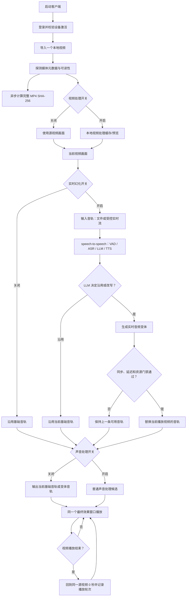
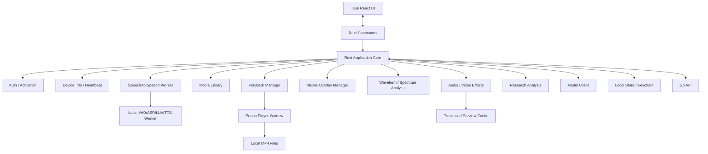
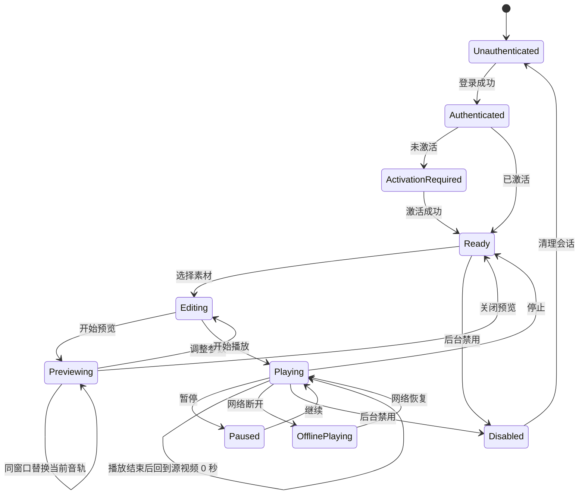
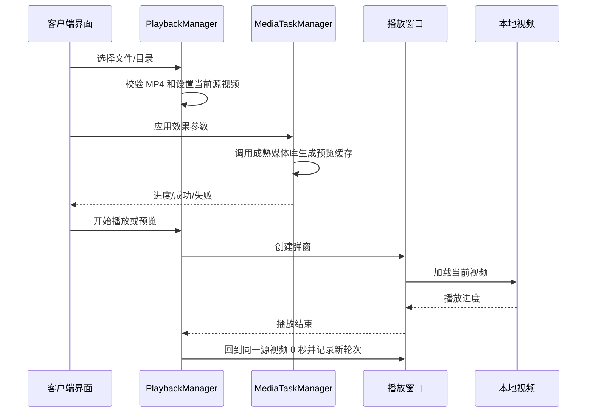

# 桌面客户端架构：Rust + Tauri

## 1. 职责范围

Rust 桌面客户端是系统的执行面，负责：

当前功能链路见 [`桌面端功能流程图.md`](./桌面端功能流程图.md)。

- 使用与后台一致的账号登录
- 输入激活码并绑定设备
- 采集并上报基础设备信息
- 管理本地视频素材和单视频循环播放状态
- 管理单窗口循环播放、播放轮次和 speech-to-speech 音频变体决策
- 调整合规的音频/视频效果并进行非破坏性预览
- 弹出一个持续存在的窗口循环播放同一个源视频；不创建第二个视频窗口
- 展示波形、频谱、响度和基础视频参数
- 添加可见的文字、图片、Logo、贴纸和光效叠加层
- 管理视频处理缓存、实时音频候选、speech-to-speech 状态和本地研究报告
- 提供声音、视频、视觉调制频段、挂件、内容相似度分析、媒体鲁棒性实验、隐形标记研究、随机扰动实验和内容指纹对比
- 提供本地预览场景下的实时话术幻化
- 使用一个持续存在的独立弹窗展示当前源视频和处理效果
- 默认采用单源连续循环：首项原声立即播放，播放结束后同一窗口从 0 秒继续
- 音频输入支持本地文件或受控实时流；实时幻化通过 speech-to-speech 的 VAD/ASR/LLM/TTS 链路按播放轮次和片段生成候选，LLM 决定沿用原文或改写，失败回退原声
- 网络异常时保持本地播放
- 通过 Go 获取当前单账号短期直连租约；只有租约包含供应商委托的短期凭证时，Rust 才直接调用 OpenAI-compatible 大模型，否则保持 Worker 不可用并回退

客户端不负责：

- 用户和激活码管理
- 模型 API Key 管理
- 服务端数据库读写
- 视频云端存储
- 面向平台审核/检测的规避、自动发布和平台接入；研究分析能力仅限本地实验和内容溯源/鲁棒性分析

### 1.1 参考界面功能映射

截图展示的是一个“本地视频素材处理与预览工作台”，不是后台管理页面。桌面端按以下边界吸收功能：

| 截图区域/能力 | 桌面端处理方式 | 优先级 |
| --- | --- | --- |
| 左侧“导入视频”和视频素材库 | 导入文件/目录、展示文件信息、选中/移除素材、维护当前源视频 | P0 |
| 播放、进度、倍速和状态 | 主窗口播放控制，支持单视频循环和播放轮次 | P0 |
| 画中画播放 | 独立预览窗口，可关闭、恢复和调整窗口大小 | P0 |
| 音频转换开关、音频参数重置 | 合规音频效果开关、参数面板和默认值恢复 | P0 |
| 视频转换开关、视频参数重置 | 合规视频效果开关、参数面板和默认值恢复 | P0 |
| 实时幻化开关 | 独立控制 speech-to-speech 话术决策、实时变体和当前播放视频音轨替换；关闭后不启动 Worker | P0 |
| 音频实时变化、响度、波形、频谱 | 采用成熟媒体分析库显示实时或近实时诊断信息 | P1 |
| 亮度、对比度、饱和度、色相、模糊、锐化、裁剪、缩放、旋转、平移 | 使用成熟媒体库滤镜，生成预览缓存，不覆盖原片 | P1 |
| 随机挂件、文字、图标、光效 | 改为用户主动配置的可见叠加层，支持位置、透明度和时间区间 | P1 |
| 音频状态卡片 | 区分可调参数、实时测量值、音色库资源数和“下一次变声”倒计时；倒计时只读且随播放状态暂停/恢复 | P1 |
| 视频频段表 | 展示固定频段列表及每个频段的 `band_weight` 倍数，另行展示目标频率、核心频率和实际生效频率 | P1 |
| 内容相似度分析、媒体鲁棒性实验、隐形标记研究、随机扰动实验、内容指纹对比 | 仅在本地研究分析模式下提供可复现的分析/实验，不连接平台、不自动发布、不用于平台规避 | 研究 |

桌面端主界面建议保持截图的三栏职责：左侧素材库，中间效果和分析面板，右侧画中画预览。UI 控件优先复用 Ant Design；媒体内核和滤镜能力优先采用成熟库，不自行实现工具链。

### 1.2 当前首版功能流程图



当前流程不创建第二个视频窗口、不生成离线版本、不等待其他视频；实时幻化只替换当前播放视频的音轨。

## 2. 技术选型

推荐使用 **Tauri 2 + Rust 核心 + React 界面**：

- Rust：系统能力、文件系统、凭证、安全、播放状态和后台任务
- React：登录、激活、播放控制和设置界面
- Tauri 中的 React 界面同样遵守项目 Ant Design 约束；已有组件优先复用，不覆盖 Ant Design 内部样式
- Tauri：窗口生命周期、Rust/React 通信和安装包
- 媒体能力：使用成熟媒体库/官方 SDK 处理编解码、滤镜、音频分析和播放；不自行实现编解码器、滤镜算法或频谱算法
- HTML5 Video：可作为标准 H.264/AAC MP4 的基础预览方式；复杂效果处理使用经过目标平台验证的媒体引擎

具体媒体库在实施阶段按目标平台、许可证、打包体积和 GPU/CPU 表现验证后确定，当前采用随 Tauri 安装包分发的 FFmpeg/FFprobe 资源；候选可包括 FFmpeg、libmpv、GStreamer 等成熟方案。

FFmpeg 首版打包目标为 `x86_64-apple-darwin`（macOS Intel）、`aarch64-apple-darwin`（macOS M 芯片）和 `x86_64-pc-windows-msvc`（Windows x64）。打包前由 `desktop/工具/准备FFmpeg资源.mjs` 按当前目标选择已下载并记录来源/SHA-256 的二进制，复制到 `src-tauri/binaries/ffmpeg[.exe]` 和 `ffprobe[.exe]`；Tauri 以 `bundle.resources` 将 `binaries/` 放入安装包，Rust 从 `resource_dir()` 定位。开发环境可用 `AUTOLIVE_FFMPEG_PATH`、`AUTOLIVE_FFPROBE_PATH` 覆盖；正式包不依赖系统 PATH。缺少当前目标资源时打包脚本必须失败，许可证和 macOS 签名公证仍需发布前验收。

- AI 生成阶段优先使用成熟本地工具或受控 Worker：Faster-Whisper/FunASR、GPT-SoVITS/CosyVoice/F5-TTS 等；Go 负责 OpenAI-compatible 账号登记、连通性测试、租约和调用记录；LLM 仅在当前直连租约包含供应商委托凭证时由 Rust 调用。
- 本地合成、媒体分析和参数实验优先使用成熟媒体工具；不接入 OBS，也不实现 RTMP 推流。
- 本地视频效果输出必须经过解码、处理和重新编码，不使用视频流 `copy`；FFmpeg 作为随桌面端分发的本地媒体处理工具，不承担 RTMP 推流、断线重连或推流子进程管理。
- 参数范围、单位、默认值和自动读取源素材规则统一见 [`媒体参数范围与默认值.md`](./媒体参数范围与默认值.md)。

## 3. 运行结构



## 4. 客户端目录建议

```text
desktop/
  src-tauri/
    auth/
    activation/
    device/
    local_store/
    playback/
    model_client/
    media_library/
    media_pipeline/
    audio_effects/
    video_effects/
    overlays/
    analysis/
    audio_research/
    video_research/
    watermark_lab/
    script_lab/
    profiles/
    telemetry/
    commands/
    errors/
    main.rs
  ui/
    login/
    activation/
    player/
    final-preview/
    research/
    script-lab/
    settings/
    status/
```

## 5. 客户端状态机



状态规则：

- 未登录不能激活和播放受保护功能。
- 已登录但未激活只能进入激活页面。
- 已激活后可以选择本地视频并播放。
- 选择素材后可以进入 Editing，效果预览进入 Previewing；参数调整必须可见、可关闭和可重置。
- `FinalPreviewController` 只允许一个 `PlayerWindow` 实例；实时话术只更新当前基础音轨，不改变窗口实例。
- 网络断开不影响已打开的本地播放窗口。
- 后台禁用用户或设备后，客户端在下一次鉴权/心跳时进入 Disabled。

## 6. 核心模块

### 6.1 AuthManager

- 登录和退出
- Access Token 刷新
- 受保护请求 `401 → 单飞 Refresh → 原请求只重试一次 → 失败清理会话`
- 处理用户禁用和 Token 失效
- 不在普通配置文件中保存密码

### 6.2 ActivationManager

- 提交激活码
- 绑定当前设备
- 查询激活状态
- 处理过期、已使用和设备数量超限

激活流程：

```text
登录
  ↓
生成/读取本地设备标识
  ↓
提交激活码 + device_id
  ↓
后台校验并绑定
  ↓
保存设备凭证
  ↓
进入 Ready
```

### 6.3 DeviceInfoCollector

采集最小必要信息：

- 设备名称
- 操作系统和版本
- 客户端版本
- CPU 概要
- 内存总量
- 磁盘剩余空间
- 屏幕分辨率
- 当前播放文件和状态

默认不采集 MAC 地址、硬盘序列号、摄像头、麦克风和用户目录文件列表。

### 6.4 HeartbeatService

- 定时上报设备状态
- 网络失败时指数退避
- 恢复后补发最后必要状态
- 不阻塞播放线程
- 重复心跳必须幂等
- 网络超时、连接失败、429 或 5xx 时，只在本地按 `user_id + device_id` 保存一条最新心跳，不积累无限历史
- 下次发送心跳时先使用持久化的 `Idempotency-Key` 补发，再发送当前最新状态；鉴权/参数类错误不进入补发队列
- 本地补发记录只包含设备运行摘要和播放状态，不包含 Access Token、Refresh Token、激活码或模型密钥

### 6.5 PlaybackManager

- 管理当前选中的单个源视频
- 播放源视频
- 播放完成后从同一源视频的 0 秒重新开始
- 记录播放轮次，不生成离线视频版本，不把同一视频伪装成多个媒体项
- 暂停、继续、停止
- 记录当前文件和播放进度

### 6.6 MediaLibrary

- 导入本地视频文件或目录
- 展示文件名、路径摘要、格式、大小、时长、分辨率、帧率、音频采样率和状态
- 管理当前选中的单个源视频，不建立多视频队列
- 对不可读取或格式不兼容的素材给出明确状态
- 不上传原始视频，不把用户路径直接发送到后台

### 6.7 AudioEffectEngine

- 提供音频效果总开关和恢复默认参数
- 普通声音处理开关关闭时，跳过普通音频效果并保留当前基础音轨
- 提供自然真人模式、随机变声周期和“下一次变声周期”预览
- 支持音量/响度、播放速度、音高微移、输入/输出增益、均衡、降噪/环境声、淡入淡出和干湿比
- 研究分析模式支持音色/声纹/响度/频谱联动、MFCC 偏移、SNR 浮动、共振峰、滤波 Q 值、相位扰动、颤音频率/深度、频谱扰动和环境底噪
- 支持音色库、采样率、降维比特率、实时声纹/自然/动态/轻混响等实验参数
- 提供响度稳定、实时波形、频谱和多频段动态联动数据
- 将 `SNR 浮动`、`当前 SNR`、`共振峰偏移`、`当前共振峰`、`可用音色数量`分成不同字段；测量值只读，不能被当作扰动幅度提交
- `下一次变声`由本地播放状态驱动，展示剩余秒数和进度条；暂停、停止、切换媒体时暂停或重置倒计时
- 效果参数由成熟媒体库执行，Rust 负责参数模型、任务编排和错误转换
- 所有实验参数必须带版本、单位、范围、默认来源、随机种子和启用状态；研究模式不连接平台、不自动发布

### 6.8 VideoEffectEngine

- 提供视频效果总开关和恢复默认参数
- 视频处理开关关闭时，不执行视频画面效果，播放器仍使用源视频
- 支持亮度、饱和度、模糊、对比度、色相旋转、锐化、噪点、细节增强、裁剪边缘平滑度、X/Y 像素偏移、帧内微扰、动态裁剪、帧率微扰、色域转换和像素级缩放
- 支持 65Hz～20000Hz 固定频段列表及每个频段独立的 `band_weight` 倍数、波频强度、波频颗粒数、目标频率、核心频率、波频电平和动态均衡阈值；该组参数属于视频模块的纹理/时间调制，不属于音频播放频段
- 支持通道偏移、空间维度、空间 X/Y 偏移和帧扰动概率
- 支持帧率微扰频率（Hz）、帧率微扰幅度（fps）和色域转换强度（%）；不要把“微扰发生频率”和“微扰幅度”合并成一个字段
- 对每个频率同时展示目标值和实际生效值；实际生效值受输出帧率和处理链采样上限约束，超过上限时标记混叠或降级
- 输出到临时预览或导出缓存，不覆盖原始素材
- 显示处理进度、取消、失败和回退原片状态
- 具体滤镜由成熟媒体库执行，不自行编写视频编解码和滤镜算法；只要启用视频效果，输出必须重新编码

### 6.9 OverlayManager

- 添加文字、图片、Logo、贴纸和光效等可见叠加层
- 支持位置、大小、透明度、层级、时间区间和启停
- 支持抽象人脸数量、抽象人脸大小、抽象人脸透明度、随机图形透明度、随机图形大小、画面偏移、切片长度、切片最小长度和切片触发间隔
- 支持预览、清除和恢复默认
- 叠加层配置与素材/效果配置分开保存
- 隐形标记研究由独立 `WatermarkLab` 管理，仅用于本地嵌入、检测、提取和媒体鲁棒性研究

### 6.10 AnalysisPanel

- 展示实时波形、频谱、音量/响度、采样率、声道等音频信息
- 展示视频模块的 65Hz～20000Hz 视觉调制动态联动、目标频率、实际生效频率、核心频率和动态均衡阈值
- 展示分辨率、帧率、时长、编码格式、原始完整 MP4 SHA-256、当前完整 MP4 SHA-256 和阶段哈希等视频信息
- 分析任务异常时显示降级状态，不阻塞播放和主窗口

### 6.11 ProfileManager

- 保存和恢复视频处理开关、声音处理开关、实时幻化开关、音频/视频/叠加层参数
- 配置带版本号和默认值
- 配置失效时回退默认参数并提示用户
- 只保存参数和素材引用，不复制或上传原始视频

### 6.12 ResearchAnalysisController

- 管理声音、视频、视觉调制频段、挂件、内容相似度分析、媒体鲁棒性实验、隐形标记研究、随机扰动实验和内容指纹对比任务
- 管理实验配置、算法版本、参数单位/范围、随机种子、阶段输入/输出哈希和报告导出
- 研究模式默认关闭隐形标记研究和随机扰动实验；启用后必须显式标注实验状态
- 内容相似度分析只输出本地差异报告，不连接平台、不自动发布、不提供平台检测规避策略；当前单视频循环允许重复同一源视频
- 管理实时音频幻化：只有独立开关开启时，才把输入文件/实时流、播放轮次、片段上下文和约束交给 speech-to-speech Worker，由 LLM 决定沿用或改写并生成候选音轨；关闭时不启动 Worker
- 研究任务失败、取消或超时不得影响主窗口、登录、心跳和普通播放

### 6.13 MediaTaskManager

- 管理媒体分析、效果预览、导出和缓存清理任务
- 每个任务有进度、取消、超时、失败和回退状态
- 任务不能阻塞 UI、心跳和播放控制
- 限制并发数和缓存大小，避免长视频耗尽 CPU、GPU 或磁盘

### 6.15 FinalPreviewController

- 接收一个已探测的源 MP4 和可选的视频处理缓存
- 只创建一个 `PlayerWindow`，在窗口生命周期内循环展示当前源视频
- 默认使用源视频原声立即播放；实时幻化替换基础音轨，普通声音处理作用于最终当前音轨，不替换视频文件
- 支持播放、暂停、停止、进度、倍速和循环播放
- 实时音频候选就绪后只替换当前窗口的基础音轨，普通声音处理随后作用于最终当前音轨，保留窗口位置、尺寸和用户控制状态
- 预览失败时显示明确错误，不影响主窗口、登录状态和本地播放/Worker 状态
- 只读取本地生成产物，不上传视频、不连接 RTMP

### 6.16 ContinuousPlaybackCoordinator

- 单源连续循环是默认播放策略，负责同一个源视频的播放轮次和当前音频槽状态
- 源视频通过文件可读性、容器和权限校验后立即使用原声播放；实时检测、变体、视频处理和 SHA-256 任务不能阻塞首帧
- 视频处理开关开启时，视频效果写入临时预览缓存；失败时回退源视频，不改变原文件
- 声音处理开关开启时，对最终当前音轨执行普通音频效果；关闭时不执行普通声音处理
- 实时幻化开关开启时，音频输入经过 speech-to-speech 的 VAD/ASR/LLM/TTS 决策；Rust 仅在当前直连租约包含供应商委托凭证时调用 LLM，改写候选进入播放器候选缓冲区，通过同步门禁后替换当前音轨；底层不锁定 A/B 播放引擎
- 音频候选不是下一视频项，未准备好时继续当前源视频和上一条可用音轨
- 暴露当前源文件、播放轮次、实时幻化状态、LLM 决策、候选状态、回退原因和音频延迟

连续优先模式只针对当前源视频和当前音轨候选；不生成下一项视频，不维护版本预生成队列。实时话术生成无法在当前音频安全余量内完成时，继续播放当前视频和上一条可用音轨，不暂停、不黑屏、不切换空媒体源。

实时音频幻化的连续流程：

```text
导入一个源视频
    ↓
同一个 PlayerWindow 原声循环播放
    ↓（实时幻化开关开启）
输入音轨：文件 / 受控实时流
    ↓
speech-to-speech：VAD / ASR / LLM / TTS
    ↓
LLM 决定沿用原文或生成改写话术
    ↓
沿用：当前基础音轨；改写：生成实时音频变体
    ↓
当前窗口安全边界替换正在播放视频的音轨
```

实时音频幻化的目标是只替换当前源视频正在播放的基础音轨，不重建窗口、不生成新 MP4；speech-to-speech、LLM 或 TTS 超时时保持上一条可用音轨。生成耗时超过当前音频安全余量时，必须继续播放视频和上一条可用音轨，不能用空白或未完成音频强行切换。普通声音处理只作用于最终当前音轨，不参与话术决策。当前已实现候选输入/输出契约、锁定字段与时长校验、候选暂存/提交/丢弃状态机和 `start_at_ms` 安全提交；真实服务和长时间媒体连续性仍需实机验收，未完成时不得把配置或候选状态标记为已换轨。

当前已落地的实时话术纵切片是“上下文调度、候选契约和同步门禁”：Rust 已按播放代际、轮次和片段上下文启动/取消受控 Worker，并校验结构化结果；本地 Hugging Face 适配器已提供可配置入口和音频格式归一化，但真实服务、直连租约凭证和长时间媒体换轨仍需环境验收。Worker 未配置、直连租约失效或模型不可用时，当前视频继续保持当前可用音轨；不暂停视频、不创建第二个窗口，也不宣称已经完成无缝换轨。

播放和效果预览流程：



### 6.17 PlayerWindow

- 应用生命周期内最多创建一个最终效果窗口实例
- 窗口关闭前不因视频切换而销毁或重新创建
- 普通窗口和全屏
- 播放控制
- 当前支持在同一窗口内循环同一媒体源和候选音轨状态切换，不切换多个离线播放项；真实媒体音轨热替换仍需媒体引擎阶段接入
- 通过 Tauri `final-effect` 单实例窗口展示最终效果；窗口已存在时只显示并聚焦，不重复创建
- 当前最小版本由主窗口和最终效果窗口通过 `get_snapshot` 轮询同步播放轮次、音轨状态和播放状态；最终效果窗口不上传视频。后续若改为 Tauri 事件，必须先更新接口契约和长任务计划。
- 错误提示
- 窗口关闭时通知 PlaybackManager
- 播放窗口崩溃时不影响主界面和心跳服务

当前还落地了一条独立的本地固定话术热替换链路，和实时 speech-to-speech、普通声音处理互相独立：Rust 通过 `AUTOLIVE_VOICE_CLONE_WORKER` 指向绝对路径的 `desktop/worker/voice_clone_adapter.py`，探测 `get_voice_clone_worker_capabilities`，并在主窗口调用 `prepare_voice_clone_source`、`start_voice_clone_replacement`、`cancel_voice_clone_operation` 和 `restore_original_audio`。Worker 只在 CPU 上串联 Demucs、faster-whisper 和 XTTS-v2，结果写入应用缓存目录下的 `voice-clone/<source_sha256>/...`；它不生成 MP4，不新建窗口，而是通过同一窗口的独立音频槽替换当前播放轮次的基础音轨。当前话术替换只影响本轮：替换结束后源音频继续播放，下一轮自动恢复原声；如果依赖、模型或 FFmpeg/FFprobe 未就绪，能力保持 unavailable，播放继续原音轨。

### 6.18 ModelClient

- 向 Go 申请当前单账号 `direct_lease`
- 仅在租约包含供应商委托的短期直连凭证时，使用固定 provider/model 直接调用 OpenAI-compatible 供应商
- 只在内存中保存当前租约，不缓存完整号池、长期 API Key 或任意上游地址
- 续租和释放租约；供应商不支持短期/可撤销凭证时返回不可用
- 直连链路完成后，将 request_id、usage、延迟和错误摘要回报 Go；调用摘要必须标记为客户端上报，不伪装成供应商权威账单。当前 Go 接口已提供，但 Rust 自动上报和可信租约注入尚未接通
- 模型失败、租约过期或网络异常时回退当前可用音轨，不阻塞播放

租约操作重试规则：同一次申请、续租或释放操作在网络失败后复用原 `Idempotency-Key`；provider/model/purpose/时长或 lease ID 变化时生成新 key，成功后清理待重试状态。登录、Profile、激活、Heartbeat 和租约操作使用同一操作闸门，互斥执行；已有活动模型租约时禁止切换登录账号，必须先释放租约，避免服务端租约失去本地释放引用；响应提交前校验会话代际，防止旧账号或旧设备响应写入新会话。

当前单视频循环和实时音频幻化不创建媒体任务，不走媒体任务租约绑定流程。Go 提供账号登记/测试、直连租约、Refresh Token 轮换、Logout 和调用摘要记录；Rust 直连调用与调用摘要自动上报仍待供应商凭证委托和可信租约注入完成。

客户端不接触完整供应商 API Key；当前 Go 只返回 `direct_base_url`，未实现凭证委托时客户端不得发起直连，并回退当前可用音轨。

### 6.19 LocalStore

保存：

- 当前用户会话摘要
- 本地设备配置
- 当前源视频与播放轮次
- 视频处理开关、声音处理开关和实时幻化开关
- 最近播放状态
- 音频/视频/叠加层效果配置
- 媒体缓存索引和清理状态
- 当前源视频、播放轮次和最后预览状态
- 研究分析配置、算法版本、随机种子、原始完整 MP4 SHA-256、当前完整 MP4 SHA-256、阶段哈希和研究报告
- 实时音频幻化的开关、当前输入、播放轮次、LLM 决策、音频候选、换轨状态和回退原因
- 未上报事件

设备 Token、Refresh Token 等敏感凭证优先保存到操作系统 Keychain/Credential Manager；LocalStore 只保存非敏感状态和安全存储引用。

## 7. Tauri 通信接口

### 7.1 React 调用 Rust 命令

```text
probe_local_mp4
hash_local_mp4_sha256
get_device_runtime_info
start_playback
pause_playback
resume_playback
stop_playback
complete_playback_loop
commit_media_processing_if_ready
set_processing_switches
set_audio_processing_profile
stage_audio_variant_candidate
commit_audio_variant_candidate
commit_audio_variant_candidate_if_due
discard_audio_variant_candidate
start_speech_to_speech_worker
cancel_speech_to_speech_worker
restore_original_audio
get_snapshot
validate_local_research_params
get_default_local_research_params
get_media_engine_capabilities
start_media_processing
get_research_worker_capabilities
get_research_status
start_research_analysis
cancel_research_analysis
cleanup_local_caches_command
open_final_effect_window
close_final_effect_window
store_refresh_token
load_refresh_token
delete_refresh_token
```

登录、激活、心跳、模型租约和调用摘要通过 Tauri 官方 HTTP 插件访问 Go 控制面，不作为 Rust 本地媒体 IPC。视频媒体 Worker 已完成受控执行最小闭环；完整高级视频滤镜映射、真实 DSP Worker 和 direct lease 凭证仍需后续环境接入，未接入的算法不得由界面伪造为已生效。

### 7.2 Rust 主动发送给 React 的事件

当前最小版本不注册主动事件，React 通过 `get_snapshot` 轮询播放状态、异步哈希和候选槽状态；后续引入事件时必须先更新本节和接口契约，不得恢复旧任务/队列事件。

### 7.3 当前已落地的最小 IPC

当前清理版只开放以下命令，其他命令仍属于后续阶段设计，不应在界面中伪造已实现状态：

- `plugin:dialog|open`：通过 Tauri 官方对话框选择单个 MP4 文件。
- `probe_local_mp4`：仅接受主窗口调用，校验 `.mp4` 扩展名并读取容器元数据；探测成功即可开始首项原声播放，完整 `mp4_sha256` 由独立哈希命令异步计算，任何处理阶段提交前必须完成。
- `probe_local_mp4` 同时返回已校验的本地 `source_path`、音频采样率和声道数；后续 Worker 只能使用该受控源路径或本地候选路径，不从前端自由拼接媒体路径。
- `hash_local_mp4_sha256`：仅接受主窗口调用和 `.mp4` 文件，对整个 MP4 字节流计算 SHA-256。
- `start_playback`、`pause_playback`、`resume_playback`、`stop_playback`、`complete_playback_loop`、`get_snapshot`：驱动单源 `PlaybackCore` 状态机；主窗口和 `final-effect` 窗口共享同一状态，最终效果窗口只加载一个源视频，播放结束后回到该源视频 0 秒并递增播放轮次。视频处理、声音处理和实时幻化不创建第二个视频版本；实时幻化只在音频候选通过门禁后替换当前基础音轨。
- `stage_audio_variant_candidate`：仅接受当前播放代际的音频候选，校验采样率、声道、时长、延迟和完整哈希后进入待切换槽；此时不替换当前播放音轨。
- `commit_audio_variant_candidate`、`commit_audio_variant_candidate_if_due`、`discard_audio_variant_candidate`：分别按显式上下文提交、按播放器当前位置到达 `start_at_ms` 时提交、或丢弃候选；校验失败、候选过期或 Worker 失败时继续上一条可用音轨，不暂停视频、不重建窗口。
- `get_media_engine_capabilities`：主窗口调用，返回安装包内置或开发覆盖的 FFmpeg/FFprobe 版本和可用性；不可用时显示明确原因。
- `start_media_processing`：主窗口启动后台本地媒体处理，结果写入待切换视频槽，不创建 N 个版本、不创建第二个窗口。
- `get_research_worker_capabilities`、`get_research_status`：主窗口读取本地研究 Worker 能力和当前研究报告状态；不可用时显示明确原因。
- `start_research_analysis`、`cancel_research_analysis`：主窗口启动/取消独立研究分析 Worker；研究参数、报告和可选研究 MP4 写入应用缓存，不参与实时播放决策。
- `cleanup_local_caches_command`：主窗口按容量上限清理旧媒体/研究缓存和过期临时文件，保护当前播放、待切换和当前研究任务产物，不触碰源视频。
- `commit_media_processing_if_ready`：播放边界提交已校验媒体缓存；当前视频引用只在循环边界更新。
- `validate_local_research_params`：仅接受主窗口调用，将桌面参数映射为 Rust `LocalResearchParams` 并返回结构化字段错误；只验证单位、范围和字段关系，不执行媒体处理。
- `get_default_local_research_params`：仅接受主窗口调用，返回 Rust 参数模型的默认值；React 只负责编辑和展示，不在前端复制默认范围。
- `set_audio_processing_profile`：仅接受主窗口调用，校验普通声音处理参数版本、单位和范围；普通音频单独处理时由媒体 Worker 执行已映射滤镜；实时幻化同时开启时，最终效果窗口当前只对增益/响度走 `runtime` 运行时路径，MFCC、SNR、共振峰、滤波 Q 值、相位、采样率等未接入运行时 DSP 的参数报告 `unavailable`，保持上一条可用音轨，不伪造已处理音频。
- `start_speech_to_speech_worker`、`cancel_speech_to_speech_worker`、`restore_original_audio`：允许主窗口或最终效果窗口调用，按当前播放代际、循环轮次和片段上下文启动/取消本地受控 Worker，或回退到原始音轨；Worker 结果必须先经过候选音频文件、哈希、时长、采样率、声道、锁定字段和同步门禁校验。
- `get_voice_clone_worker_capabilities`、`prepare_voice_clone_source`、`start_voice_clone_replacement`、`cancel_voice_clone_operation`：允许主窗口调用，按当前源视频完整 SHA-256 和播放代际驱动本地固定话术热替换；`AUTOLIVE_VOICE_CLONE_WORKER` 必须指向绝对路径，Worker 依赖缺失、模型未就绪或能力探测失败时返回 `available=false`，保持当前原音轨，不生成 MP4。
- `stage_audio_variant_candidate`、`commit_audio_variant_candidate`、`commit_audio_variant_candidate_if_due`、`discard_audio_variant_candidate`：属于实时音频幻化阶段的候选槽 IPC；当前已注册 Rust 状态门禁和单窗口音频槽切换，真实 HF 服务、直连凭证和长时间媒体连续性留在实机验收，不恢复旧的单段试听任务。
- `get_snapshot`：返回当前源视频、播放轮次、三个开关、当前基础/最终音轨状态、候选状态和回退原因。
- `direct_model_chat`：仅接受主窗口调用，Rust 使用当前 `direct_lease` 描述中的固定地址和供应商委托短期凭证直接请求 OpenAI-compatible `/chat/completions`，返回模型文本与结构化 usage/延迟摘要；没有委托凭证、租约过期、地址不安全或响应无效时失败并回退。命令不提供独立的 URL 覆盖字段；当前 `direct_base_url` 仍必须由后续可信租约注入流程填充，不能使用完整 API Key。
- `research_params`：Rust 可序列化参数契约，负责音频、视频、视觉频段、挂件和切片参数的默认值、单位与范围校验；当前不执行研究算法，算法由受控外部 Worker 提供，Rust 负责参数快照、原始/阶段输入/阶段输出哈希、报告校验、产物提交和缓存边界。
- 当前播放结束后显式回到同一源视频 0 秒；这不是“静默重复版本”，而是首版定义的单源循环策略。
- `get_device_runtime_info`：仅允许主窗口调用，使用成熟 `sysinfo` 读取当前素材所在磁盘（无法匹配时读取首个可见磁盘）的可用空间，以及总/可用内存、逻辑 CPU 数、系统名、系统版本和内核版本，供 Heartbeat 上报；磁盘读取失败直接返回结构化错误，不使用占位值伪造采集结果；系统字段缺失时保留可选值，不阻断磁盘心跳。
- `get_speech_to_speech_worker_capabilities`：允许主窗口和最终效果窗口调用；从 `AUTOLIVE_SPEECH_TO_SPEECH_WORKER` 读取受控本地可执行文件，并以 `--capabilities-json <capability_output.json>` 参数探测结构化能力。未设置、启动失败、超时、非零退出或能力 JSON 不符合契约时返回 `available=false` 和明确原因；不把 Worker 脚本、Shell 输出或未验证模型标记为可用。
- 真实预览：选择一个文件后调用 `probe_local_mp4`，只有成功项才可播放；由 `convertFileSrc(canonical_path)` 生成 asset URL，最终效果窗口由 `open_final_effect_window` 单实例创建并循环加载当前视频引用。主窗口和最终效果窗口通过 `get_snapshot` 轮询同步播放轮次、当前/待切换视频、音轨状态和处理开关；视频处理只在循环边界切换，不因后台处理或音频候选重新弹窗或创建第二个视频版本。

控制面请求使用 Tauri 官方 HTTP 插件，当前能力文件仅允许 `http://127.0.0.1:8080/**` 和 `http://localhost:8080/**`；部署到正式控制面前必须同步替换为明确的 HTTPS 域名范围，禁止使用任意 URL 通配权限。桌面端 Access Token 只在 React 运行时内存中存在；Refresh Token 使用成熟 `keyring` 库经 Tauri 命令写入系统 Keychain/Credential Manager，登录和轮换后更新，启动时读取并刷新，退出或刷新失效时删除。钥匙串不可用时不阻断本次登录，但明确提示重启后需重新登录。

命令失败统一返回结构化错误；浏览器开发环境没有 Tauri IPC 时，界面直接展示真实错误，不回退为伪造成功结果。

命令返回结构化错误，不让前端解析 Rust 的自由文本日志。

## 8. 与 Go 后端的交互

客户端使用 OpenAPI 生成或约束 API 类型：

```text
POST /api/v1/auth/login
POST /api/v1/auth/refresh
POST /api/v1/auth/logout
POST /api/v1/client/activate
POST /api/v1/client/heartbeat
GET  /api/v1/client/profile
POST /api/v1/client/model-leases
POST /api/v1/client/model-leases/:id/renew
POST /api/v1/client/model-leases/:id/release
POST /api/v1/client/llm/call-records
```

客户端不直接访问 PostgreSQL，不直接读取后台密钥配置，也不把本地视频内容上传到 Go API。客户端先在本地探测源素材并计算完整 SHA-256；当前播放无需创建媒体任务，Go 只承载登录、激活、号池/直连租约、账号测试、调用摘要和状态摘要。实时音频幻化的 speech-to-speech 输入、输出、模型状态和换轨均在桌面端本地或受控 Worker 执行。内容指纹对比只属于研究报告，不参与实时播放决策。

## 9. 离线与恢复

### 网络断开

- 已登录且已激活的客户端继续播放本地视频。
- 心跳和播放事件进入本地待发送队列。
- 模型调用暂停或返回网络错误，不阻塞播放器。
- 已生成的本地预览缓存可以继续使用；新的效果处理任务进入等待状态。

### 网络恢复

- 刷新 Token。
- 上报最新设备状态。
- 按事件 ID 补发未提交事件。
- 清理已确认的本地事件。
- 研究分析任务恢复参数快照、随机种子和哈希上下文；不可恢复时标记为待重跑，不伪造报告。

### 应用重启

- 读取上一次源视频播放状态并重新校验源文件哈希；源文件不存在或哈希已变化时不自动恢复播放。
- 默认恢复到 Ready，不自动播放，除非用户开启自动播放设置。
- 清理过期的临时租约和失效会话。
- 恢复研究分析报告和实时话术幻化状态；实时话术失败时保持当前源视频上一条可用音轨。

## 10. 安全边界

- 密码不落盘。
- Token 不写普通日志。
- 本地文件路径只用于播放器，不拼接系统命令。
- 后台返回的模型结果和错误信息不能包含供应商 API Key。
- 设备禁用后，客户端必须停止受保护的后台能力。
- 客户端直连模型是当前确定方案，但只能使用单账号、短期、限额、可回收租约；禁止下发完整号池、长期 API Key 或任意上游地址。
- 普通播放效果必须用户可见、可关闭、可重置；研究模式的内容相似度分析只用于本地实验，不用于规避平台检测。
- 原始视频只读保留，处理结果使用缓存/导出目录并可清理。
- IPC 命令和本地 Worker 参数必须校验，不能通过路径拼接或 Shell 命令执行处理文件。
- 研究分析模式必须显式显示实验状态、算法版本、随机种子和阶段输入/输出哈希；隐形标记研究结果不得伪装成普通播放效果。
- 研究分析只处理本地或用户授权素材，不连接直播平台，不自动上传或发布，不提供平台审核/检测规避建议。

## 11. 验证策略

### Rust 单元测试

- 登录和激活状态转换
- 激活码失败状态映射
- 单源播放轮次和循环
- 素材库导入、元数据读取和不兼容状态
- 音频/视频参数默认值、切换和重置
- 效果配置版本和失效回退
- 本地媒体 Worker 取消、失败和缓存清理
- 播放窗口关闭处理
- 心跳重试和离线事件队列
- 模型租约过期处理
- 单个最终效果弹窗打开、关闭、单源循环、播放控制和预览失败；实时音轨替换不创建重复窗口
- 音频随机周期、音高/MFCC/SNR/共振峰/滤波 Q 值/相位/频谱参数保存与重置
- 视频多频段、帧率、像素、动态裁剪、空间偏移和挂件参数保存与重置
- 整个 MP4 的原始 SHA-256/当前 SHA-256、阶段哈希、算法版本、随机种子和研究报告一致性
- 隐形标记研究的本地嵌入、检测、提取和媒体鲁棒性分析
- 内容相似度分析、随机扰动实验和内容指纹对比报告
- 实时音频幻化成功、超时、模型失败、换轨门禁失败和回退上一条可用音轨

### 桌面端手工验证

- 标准 MP4 选择和播放
- 循环播放
- 暂停、继续、停止
- 画中画预览
- 音频/视频效果开关、参数修改和一键重置
- 波形、频谱和基础媒体参数展示
- 可见文字、图片、Logo、贴纸和光效叠加
- 处理失败回退原片，原始文件不被覆盖
- 弹窗关闭和重新打开
- 断网继续播放
- 重启后状态恢复
- 实时话术候选超时或门禁失败时保持当前源音轨
- 研究分析模式默认关闭，启用后不连接平台且生成可复现实验报告
- 后台禁用设备后的客户端行为
