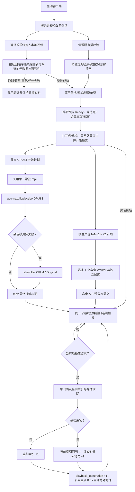
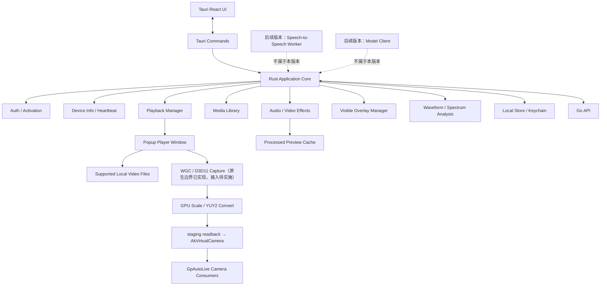
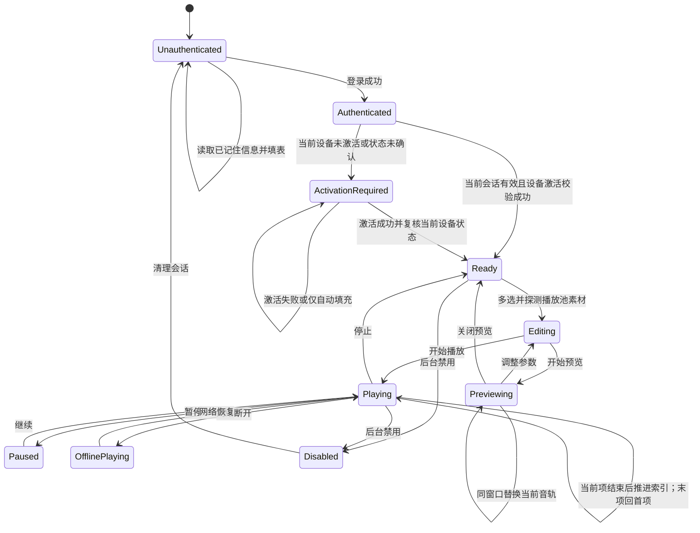

# 桌面客户端架构：Rust + Tauri

> 当前适用范围（2026-09-07）：本文主体保留 Rust/Tauri 历史实现与迁移审计信息；后续桌面产品以 C# Windows 客户端为唯一认证事实源，Rust 客户端进入废弃过渡。认证切换不共享运行中 Session：C# 只在自身设备 ID 缺失时读取固定旧目标 `device-id.autolive.desktop` 并复制合法设备 ID，不读取 Rust 的密码、Refresh Token 或待撤销 Token，也不删除旧凭据。C# 自有 Refresh/待撤销 Token 继续隔离在 `GpAutoLive.CSharp.Windows/` 命名空间；远端退出失败最多保存 8 条并在启动恢复前重试。C# 心跳状态只使用服务端契约的 `idle/playing/paused/error`，普通参数/业务错误不清理 Refresh Token；Access Token 到期前主动 Refresh，首次 `401/UNAUTHENTICATED` 只重试一次。授权到期、设备禁用或撤销均继续 fail-closed。本文后续“敏感凭据只能由 Rust 保存”等旧表述仅代表 Rust 历史实现，不再覆盖 C# 当前产品边界。

> EOF shader 交接与 PortAudio 跨循环时钟（2026-08-31，代码、聚焦测试与单文件真实循环完成）：shader 已完成完整读回但仍处于 `AwaitingPresentation` 时，如果 mpv 已到 EOF，本循环不再等待不存在的下一帧；匹配的 `AdvanceAfterEof` 可越过 actor idle 门禁，并在单源循环或多源换源边界丢弃该未呈现事务，再由新段重新建立周期计划。`AwaitingResponse`、已完成呈现确认和非 EOF 状态仍不得越过。新 loop 的 schedule epoch 是明确重置边界，允许周期 sequence 从 1 重新开始；同一 epoch 内的倒退 sequence 仍按陈旧计划拒绝，避免上一轮较大的 sequence 永久阻断后续 shader 提交。PortAudio 的状态时间轴按绝对呈现锚点与 callback 已消费帧连续计算；同源 PCM 实际越过段尾而显式 N+1 尚未晋级时，输出线程按绝对时间重锚到新的 `loop_index`，恢复源内 PTS 与 `LoopBoundary` 身份。匹配的新段 pending 可复用其 audio epoch，否则分配新 epoch；`AudibleAudioClock` 仍严格拒绝越段观察。该修复不改变声音 DSP 参数、GPU83/CPU4 参数能力、周期范围、单向降级或输出所有权。

> 播放观察超时边界（2026-08-31）：单次 mpv 播放观察 `IpcTimeout` 只表示本轮结果未知，纳入连续三次失败门禁，不得立即停止或重建仍在呈现的 mpv；后续成功观察清零计数。`vo-passes` 等帧预算读取属于辅助遥测，单次超时只失效本轮遥测基线。明确断连、连续观察超时、shader 硬超时、进程退出及确认的 VO/shader 失败仍可进入既有恢复链。mpv 管道后缀是媒体 generation/session 身份，不是 renderer 实例计数，诊断时必须结合 PID 与创建时间判断是否真实重建。

> Active N 参数投影与连续展示（2026-08-31，代码与聚焦测试完成）：`RealtimeVideoRuntime` 内部 `current_schedule` 保存当前已确认 N 的普通视频和高级视觉参数，发布状态前统一通过 `reconcile_active_cycle_snapshot` 投影为与 `N.sequence`、SHA-256 指纹绑定的 `active_cycle_snapshot`。只有 GPU/CPU4、renderer lifecycle `Active`、apply state `Active` 且槽位/调度身份一致时快照存在，其余状态统一为空，从 DTO 边界阻断旧参数宣传。React 在正式配置加载后始终渲染全部视频参数：新 Active N 只读投影到面板；同一 `playback_generation` 的非 Source 确认间隙保留上一轮已确认显示值；新代次尚无已确认值以及 Source、关闭处理或非视频状态使用当前 `mediaEffectParams` 配置值。这个展示缓存不改变 Rust 确认事实、不写回 `mediaEffectParams`，也不触发周期配置。CPU4 的保留/活动快照仍需结合对应 `parameter_support` 展示，只有亮度、对比度、饱和度和色相可标为已执行。

> Rust 视频周期开发端闭环（2026-08-31，30fps MP4 与后台持续推进已通过）：首周期配置现在使用 Rust DTO 的 snake_case 字段，并按物理 GPU/CPU4 模式原子同步逻辑 backend 与参数支持报告；同源、同模式、同 HWND 的中性 mpv 会话原地复用，不再为安装周期控制器停止播放器。`glsl-shader-opts` 读回同时支持 mpv 的有界 JSON 对象和兼容字符串表示，字符串/数字标量规范化后按完整 map、两个 24-bit 计划标记与 SHA-256 本地指纹确认，下一帧 PTS 越界后才晋级。真实 D3D11/D3D11VA 30fps MP4 已确认 N/N+1/N+2 和 10 次变化；主窗口后台期间 mpv PTS 与计划标记持续推进，置前只刷新 Rust 状态。非 30fps TS、跨源往返、故障注入和长稳仍是发布前门禁。

> 中性 Source 会话的 Rust 周期接管（2026-08-31，代码与自动化完成、待真实媒体复验）：逻辑 `Source` 只表示首个效果快照尚未确认，不等于物理视频会话不可用。视频处理已开启且受管 mpv 进程、会话及 GPU/CPU4 启动模式存在时，`RealtimeVideoRuntime` 必须建立 `media_video_cycle` 控制器，将 mpv PTS/FPS 观察送入控制器并生成首个 N/N+1/N+2；只有控制器确实不存在时才允许 Source 轻量 PTS 更新。React 的 Original 自愈不得覆盖这种中性周期会话，Rust actor 对已排队的迟到 ensure 也必须按控制器和物理会话所有权幂等返回。loop、seek、换源和新 generation 会重新进入 `Available / Spawned / source_transitioning` 并清理旧 FPS、计划与事务；真正 Original fallback 或无会话则清除控制器并保持 `Idle`。React 只投影 Rust 状态，并把物理会话存在但周期仍未建立的组合显示为明确错误，不再无限显示“等待接管”。

> Rust 视频周期控制权收口（2026-08-31，代码与非媒体自动化完成，待真实 MP4/TS 验收）：`media_video_cycle` 通过五类事件和四类动作持有配置修订、媒体段身份、mpv 实际 FPS/PTS、确定性 N/N+1/N+2、确认变化次数与应用事务；`RealtimeVideoRuntime` actor 执行 I/O。换源/loop/new generation 先发布 `source_transitioning`，中性化并清除旧队列、FPS、指纹，再以新源观察建立队列。GPU 应用使用 SHA-256 与两个 24-bit shader 标记，依次经过 `Applying → ReadbackConfirmed → PresentedConfirmed → Active`；只有完整 map 回读一致且 mpv PTS 严格越过提交前 PTS才晋级。soft timeout 保持 `result_unknown`，回读不符同指纹最多重发一次，hard timeout 优先同后端重建并只重放最后确认 N。React 只配置、发送明确播放意图并按单调 `status_revision` 投影 last-observed/effective，100ms effect 只保留声音调度；更早的 WebView prepare/commit/sync 和候选 owner 描述仅作历史审计。详细实现见 [`Rust 视频周期唯一所有者实施方案`](./docs/superpowers/plans/2026-08-31-Rust视频周期唯一所有者实施方案.md)。

> 视频帧健康门禁与降级后流水线自愈（2026-08-30，代码、代码总监整改及非媒体门禁完成，待用户真实媒体验收）：mpv `vo-passes.fresh.samples` 是最多 256 帧的滚动窗口，不是每次查询产生的独立窗口。`RealtimeVideoRuntime` 对外仍发布完整滚动 P99 作为诊断，但健康状态机只根据相邻快照新增尾部计算本次 P99；固定长度窗口通过样本重叠识别新帧，PTS 前进且 pass 值恒定时计入该 pass 最新帧，计数器/PTS 回退和任何时间轴、shader、会话转换都会清除旧健康证据。因此单个历史尖峰不会被三次轮询重复计数，真实连续三次超预算或丢帧增长仍进入既有单向降级。React 以播放代次、后端 epoch、PID、逻辑后端和物理 launch mode 组成流水线 owner；同代 owner 变化，或连续两次观察到 N 仍 active、N+1 为空而 N+2 仍 planned 时，作废一次旧候选并唤醒既有单飞调度，不创建第二播放器或新队列。该机制不改变普通声音、PortAudio、GPU `79/83`、CPU4 `4/83`、`5–8s` 周期与 4K 边界；真实多文件长稳仍是发布门禁。

> 视频周期提交与主页 seek 事实源收口（2026-08-31，代码及聚焦测试完成、待用户真实媒体验收）：N+1 到点提交由 `RealtimeVideoRuntime` actor 独占。actor 的首周期 `Available`、GPU `Active` 与 CPU4 `Active` 三条观察分支读取 mpv 真实 `presented_pts_ms` 并进入同一个提交边界，按 `loop_index × source_duration_ms + presented_pts_ms` 形成绝对 PTS；达到计划目标后在同一串行 owner 内应用一条完整 shader/CPU4 快照，物理写入确认后再把 N+1 提升为 N。React 目标定时器和周期确认提交均已删除，主页只展示 Rust N/N+1/N+2 与 PTS。用户拖拽进度条时，主窗口直接以草稿目标、当前 backend epoch 和严格递增 clock epoch 提交 `sync_realtime_video_renderer`；目标限制在 `[0, source_duration_ms)`，只有同身份 mpv 物理 PTS 接近目标才清除草稿。任何 `UserSeek/LoopBoundary` 时间轴边界都会保留已生效 N、清除旧 N+1/N+2，并由新 cursor 重建候选。本批未修改普通声音处理、PortAudio、插话、固定话术或混音语义；GPU 仍为 `79/83`、CPU4 为 `4/83`，4K 延后，真实连续周期、拖拽、多文件和长稳仍待验收。

> 播放前/播放中视频开关与 EOF 所有权收敛（2026-08-30，代码、代码总监整改及聚焦测试完成，待用户真实媒体验收）：用户可在未播放时先开启视频处理再点击播放，也可在 Original 已播放时开启；前者继续等待开关事务提交后再开最终效果窗和启动播放，后者继续复用当前受管 mpv 会话准备首个 GPU/CPU4 候选。受管 mpv 一旦取得当前媒体段所有权，React 在 DTO 短暂缺失、旧循环状态或 EOF 交接期间保持黏性所有权，WebView、`ended/timeupdate` 与隐藏原声音轨不得抢先调用 `complete_playback_item`，画面显示也不得短暂切回兼容 `<video>`；只有当前或相邻上一循环明确发布 stopped/failed/unavailable 或无进程 Source fallback 才释放。Rust 命令层同时把同 generation 的受管 mpv 作为播放完成唯一 owner，并对现场出现的“PlaybackCore 恰好领先一轮、runtime 仍绑定旧 EOF”执行严格单源幂等收敛：只调用既有 `advance_after_eof` 推进 runtime，不再次完成 Core；收敛失败且旧 runtime 仍匹配时记录诊断并停止，跨代次、换源和相隔多轮继续 fail-closed。主页 Presented/Failed 与 100ms 候选显示均要求当前 generation/clock/loop 身份，陈旧状态不再冒充当前周期。Rust 桌面命令 `102/102`、前端聚焦与开关/同步 `117/117`、TypeScript 和 fmt 已通过；未修改普通声音、GPU `79/83`、CPU4 `4/83`、shader、周期范围或 4K，真实单/多文件循环与长稳仍由用户验收。

> 视频降级状态 DTO 闭环（2026-08-30，2026-08-31 补充跨循环重锚约束）：视频后端从活动 GPU/CPU4 会话进入 `Configured/Probing` 降级状态时，必须在清除进程事实的同一 runtime actor 边界重置 AV 同步控制器、音频时钟身份、`av_sync_drift_ms`、`audible_audio_pts_ms` 与 `audio_epoch`。三项对外音频时钟字段必须同时存在，且只允许属于具有真实 `process_id` 的 `Active` 状态；无活动进程的状态不得残留上一后端的音频时钟。PortAudio 跨循环重锚后，AV 控制器首个无漂移判定的观察不得只发布 PTS 与 epoch；进入 `Available/Spawned` 的 source transition 或首周期重建也必须先隐藏三项字段，获得 Active 状态下首个实际 drift 后再成组发布。该约束避免 React 严格 DTO 校验拒绝运行中或降级响应并反复释放、重建视频候选，不改变 PortAudio DSP、声音候选、GPU83/CPU4 参数能力或单向降级顺序。

> EOF 状态发布顺序与候选 owner 自愈（2026-08-30，代码及非媒体门禁完成、待用户真实媒体验收）：受管 mpv 的物理 EOF 由 runtime actor 先写入 actor 私有状态，再发布共享 `MediaVideoBackendRuntimeStatus`，最后非阻塞通知 EOF supervisor；共享快照与事件因此具有同一四维身份，通道 Full 时每个后续 tick 继续重试，`last_notified_eof` 保证成功后只通知一次。supervisor 对共享 `status.eof`、backend/clock/loop、PID 和物理 EOF 的严格校验保持不变。React 在每次准备 N+1 前以 plan/source/generation/source-revision/loop/switch-revision 统一核对 `activeVideoRenderRef`、`pendingMediaApplyRef` 与资源等待回调；不匹配的旧 owner 作废 token 并释放，匹配中的 owner 保持单飞，迟到异步结果重新进入时还要再次核对当前计划。该边界不新增队列或播放器，不修改声音功能、GPU/CPU4 参数、周期与 4K 范围；真实素材和长稳仍待用户验收。

> 视频 N/N+1 状态与 EOF 单一所有者（2026-08-30，代码及非媒体门禁完成、待用户真实媒体验收）：React 以当前已呈现 N 作为周期主状态，N+1 只显示为次级预准备流水线。受管 mpv 活跃以及 Rust 已推进、前端尚在接收新身份的 EOF 过渡窗口内，`ended`、`timeupdate` 和隐藏原声音轨回绕都不得调用 `complete_playback_item`；兼容 WebView 画面仍保留既有幂等推进。Rust EOF 监督只对“同代次、单一视频源、播放中、core 与 runtime 均恰好前进一轮且 runtime 已清除旧 EOF”的迟到事件返回 `already_advanced`，不执行第二次 `complete_item()`；其他不匹配继续拒绝。该边界不改变 GPU83/CPU4 参数、周期调度、声音处理和 4K 范围，真实媒体与长稳仍待用户验收。

> 虚拟摄像头方案（2026-08-30，正式需求·待实施）：唯一后端采用 AkVirtualCamera，首版固定 `GpAutoLive Camera`、Windows 10/11 DirectShow 和 YUY2 `1280×720@30fps`。`autolive-virtual-camera-native` 已实现最终效果 HWND→WGC/D3D11 GPU 捕获、缩放、转换、三槽 staging 以及专用线程容量 1 latest-wins 捕获泵边界，但尚未连接 GPL sidecar 投递与安装门禁；必须显示 `zero_copy=false`。Windows 11 MF、NV12、1080p 和共享纹理零拷贝均未通过门禁，不属于当前能力。

> 麦克风插话范围（2026-08-31，代码已接入·待实机验收）：现有随机文件插话的用户可见入口统一改名为“插话文件”；新增用户显式开启的本地麦克风插话。麦克风链仅允许使用 PortAudio 与 SpeexDSP 完成回声消除、降噪、自动增益、非语义 VAD 和原始输入能量门控，并在说话期间把主媒体及其他话术源的最终数字增益门控到 `0`，不做 ASR、LLM、TTS、speech-to-speech、录音落盘或上传。详细边界、模块和验收以 [`麦克风插话与插话文件入口实施方案`](./docs/superpowers/plans/2026-08-30-麦克风插话与插话文件入口实施方案.md) 为准；真实硬件验证前界面必须显示待验收/不可用状态。

> ZLMediaKit RTMP/RTMPS 直推范围（2026-08-31，初版代码已接入、正式门禁待实施）：用户输入完整发布地址，默认同时输出画面和声音，也可只选其一。桌面端直接读取当前活动源和最终 PCM 总线，通过独立受管 FFmpeg 发布链复用 libplacebo/GPU83 静态快照与硬件 H.264 编码器探测；不捕获桌面、最终效果窗口或 HWND，不经过 Go，也不接入 OBS、平台账号和多平台分发。代码已覆盖 CPU4 回退、确定性错误分类和 PCM 过载重建；详细边界以 [`ZLMediaKit RTMP GPU 直推实施方案`](./docs/superpowers/plans/2026-08-30-ZLMediaKit-RTMP-GPU直推实施方案.md) 为准；真实 ZLMediaKit、GPU/CPU 实机和退出门禁完成前不得标记为可用。

> 视频后端 PID/物理状态原子发布（2026-08-30，代码及非媒体门禁完成、待用户真实媒体验收）：Rust runtime 的可发布状态固定遵守 `process_id.is_some() == physical_paused.is_some()`；有进程时同时具有真实回读的 `physical_eof_reached` 和合法源内 PTS，无进程时四项物理事实及绑定 EOF 全部为空。GPU、CPU4、Original、降级启动、同进程换源和中性旁路均在单一 IPC owner 中确认 `pause/eof-reached` 后调用统一记录边界；stop、demote、probing、failed 调用统一清理边界。React DTO parser 继续 fail-closed，并用双向非法配对、无进程残留 PTS/EOF 和合法 spawned/active 测试锁定跨语言合同。该项不改变周期、shader、参数能力、声音功能和 4K 范围，真实媒体仍待用户复验。

> 视频周期单快照与物理 PTS 看门狗（2026-08-30，代码及非媒体门禁完成、待用户真实媒体验收）：runtime 每约 `40ms` 只观察 mpv 的 EOF、暂停、PTS、VO、丢帧和同步事实，不再随每个 PTS tick 写 `glsl-shader-opts`。GPU 周期在 commit 边界只发送一条完整参数快照；18 项受限调度中的视觉动态语义由生产 shader 使用自动 `PTS`、周期起点、实际 source fps、seed、间隔和幅度推导，帧率调度继续通过唯一受限 speed 合成入口执行。物理呈现看门狗只在受管 GPU/CPU4/Original 进程存活、非暂停、非 EOF 时工作，按源帧率取 `1.5–5s` 阈值；一次同源 seek + 恢复播放后仍不前进才进入既有降级路径，暂停、EOF、seek、循环、换源、新会话和 PTS 恢复均重置。该实现没有启用 libplacebo `dynamic_constants` 的持续性能代价，也不改变 GPU `79/83`、CPU4 `4/83` 和剩余四项 fail-closed 边界；声音链未修改。真实 shader 编译日志、1080p60 周期边界 P99、多厂商 GPU、30 分钟长稳和 4K 均未验收，因此不能宣称绝对无卡顿。

> mpv EOF 后端原子恢复（2026-08-30，代码及非媒体门禁完成、待真实媒体验收）：自然 EOF、单文件循环和多文件顺序推进的连续性所有权收回 Rust runtime/命令；runtime actor 每 `40ms` 有界观察物理 EOF，并经容量 `1` 的非阻塞去重通道直接唤醒 Rust EOF 监督线程。React/WebView 不再为受管 mpv 调用 `complete_playback_item`，不通过 `ended/timeupdate` 抢先推进原生画面，也不在本地修改循环、seek 或暂停态；EOF 待处理期间只冻结视频候选并展示状态。Rust 以完整媒体段与 runtime epoch 身份单飞处理 EOF：先在 clone 上预演下一播放身份，在不持有 `PlaybackCore` 锁时执行源内 seek 或受限 `loadfile replace`、显式恢复暂停态并完成 mpv 物理回读；只有物理恢复成功后才重新锁定最新 core、复核起始身份并恰好提交一次 `complete_item()`。物理失败不推进 generation/loop/index/position；物理已前进但身份过期时只释放仍匹配预演身份的旧 runtime，不能覆盖并发状态或误杀新会话。恢复以 mpv 回读的 `pause=false`、`eof-reached=false`、合法源内 PTS 及连续 PTS 前进确认成功；非 stale 恢复失败记录诊断后无条件释放失效 mpv，stale/superseded 不误杀新会话。跨轮 `presentation_pts_ms` 继续只用于计划/诊断，mpv 只消费 `source_pts_ms`。本整改不改变普通声音 DSP、候选格式、N/N+1、PortAudio、插话、固定话术或混音语义；1080p 单/多文件、声音开关组合和长稳真实门禁通过前不得承诺无卡顿或音画同步已保证。

> 音画统一时间轴与循环边界整改（2026-08-30，代码及聚焦测试完成、待用户真实媒体验收）：Rust 以 `playback_generation + source_path + loop_index + source_duration_ms` 作为不可部分匹配的媒体段身份，并明确区分跨循环 `presentation_pts_ms` 与单文件内 `source_pts_ms`。PortAudio 快照可携带两种位置，mpv `time-pos/seek` 只消费满足 `source_pts_ms < source_duration_ms` 的源内位置；不得把第 N 轮绝对呈现时间送入单个源文件。播放态循环边界执行 `Seek → SetPause(false)`，暂停态执行 `SetPause(true) → Seek`；身份无效、换算失败或目标越过 EOF 时只关闭本轮纠偏并恢复基础速度，不触发 GPU/CPU4 降级。该批未修改普通声音 DSP、声音候选内容、插话、固定话术或混音语义，也未执行 1080p 多文件、1080p60、4K 或长稳门禁，不能据此承诺无卡顿或音画同步指标已通过。

> 视频同步协调与错误边界整改（2026-08-30，代码及聚焦测试完成、待用户真实媒体验收）：React 同时只保留一个 `sync_realtime_video_renderer` IPC 在途和一个 latest-wins pending；`busy` 使用 `100/250/500ms` 有界退避，`result_unknown` 先读 Rust 状态，`stale` 刷新最新 desired/播放快照，旧 revision 响应不得覆盖新请求。Rust 稳定区分 stale、superseded、busy、result_unknown、transport、invalid，并在同 generation 的健康 GPU/CPU4 会话存在时拒绝迟到 Original 覆盖。同步路径的 mpv `IpcTimeout` 仅返回 `result_unknown` 并保留会话，供状态确认或幂等重试；`IpcDisconnected`、断管、进程退出等已确认传输失效仍沿原 actor 单向降级。普通声音候选 `prepare` 移出 Tauri 主线程的调度代码与聚焦检查已完成；只改变准备工作的执行位置和可取消/单飞边界，不改变任何音频 DSP、候选格式、提交或播放语义，真实联合媒体体验仍待用户验收。

> 循环身份与视频候选收口（2026-08-30，代码及非媒体自动化完成、待用户实测）：Rust `PlaybackCore` 是 `playback_generation/source_media_index/loop_index` 的唯一事实源。最终效果窗只从可用原声音轨、受管 mpv PTS 或兼容媒体中读取源内 `position_ms`，绝对位置统一由 `Rust loop_index × duration + position_ms` 计算；原声音轨原生回绕通过既有幂等播放完成 IPC 确认，在途期间停止发布可能倒退的时钟。React 不得提前递增本地 loop，也不得混合媒体 loop 与 Rust loop；候选从目标绝对时间计算所属循环，三方循环一致才进入 prepare/commit。Tauri `sync_realtime_video_renderer` 只接受当前 Rust 循环并从 Rust 播放状态派生 pause；runtime 在 LoopBoundary 清除不匹配的 pending/N+1/N+2，保留活动 N 和同一 mpv 会话。PortAudio 仍只提供可听位置并按 Rust 循环身份隔离，本批未改声音处理功能，也未完成真实媒体、4K 或长稳验收。

> WebView 原声与兼容画面恢复（2026-08-31，代码及非媒体自动化完成、待用户实测）：最终效果窗对带音轨视频维护独立隐藏原声音轨；该元素可用时只作为声音输出和音画同步校正输入，受管视频的位置、周期到期和周期健康始终以同身份 mpv `presented_pts_ms` 为准。原声音轨不可播放、缓冲或被 WebView 节流不得把视频时钟标记为 stalled，也不得冻结 Rust 视频队列。显式用户 seek、真实 loop/ended 仍同步画面和原声；当受管 mpv 进入 `Stopped/Failed`、PID 消失或不再匹配当前身份时，兼容画面按既有边界恢复。PortAudio 活动时 Rust 可听 PTS 继续参与音画闭环校正，但不取代 mpv 作为视频周期物理时钟；普通声音 DSP、候选、插话、固定话术和混音未改变。

> 视频播放池同进程切源（2026-08-30，代码、聚焦测试及用户 TS/MP4 开发端复核完成）：`complete_playback_item` 在视频→视频自然 EOF 时不再先停止 realtime runtime。actor 仅在旧 EOF 身份精确闭合、generation 恰好 +1、宿主 HWND/物理启动模式相同且进程存活时保留 `ManagedMpvProcess`，通过受限 `LoadFileReplace` 结构化命令执行 `loadfile`，并把调用时已经推进的源内位置作为 `start` 文件选项；随后显式恢复 `pause`，等待新路径、`eof=false`、`seeking=false`、`vo-configured=true` 和播放态首帧，再为新 generation 重建 scheduler/status。fallback floor 跨该转换保留；任何取消、超时、进程丢失、解码事实异常或不确定结果都关闭旧进程，由当前物理档位正常重启，不允许继续使用未知媒体身份。用户 TS→MP4 自然轮播中 mpv PID 16712 全程不变且没有空 PID 窗口，GPU N 从 39 连续推进至 52，稳定 GPU pass P99 约 3.30ms，VO/decoder/delayed 均为 0。此证据不覆盖 1080p60、多厂商 GPU、30 分钟长稳或物理设备故障恢复，不能扩张为所有环境绝对无卡顿；声音链没有修改，4K 延后。

> 受管 Original DTO 合同修复（2026-08-30，代码及聚焦测试完成、待真实媒体验收）：逻辑 `Source/Original` 会话继续保留真实 mpv PID、图形 API 和解码器；其 `filter` 必须与物理启动模式一致，GPU 中性旁路为 `Original（中性 shader）`，CPU4 中性旁路为 `Original（CPU4 中性参数）`，真正无 shader 会话为 `Original（无 shader）`。React 信任边界接受这三个明确值，并校验 GPU/CPU4 fallback 与图形解码组合，不接受任意字符串。陈旧候选恢复只能在取得新合法 DTO 后清除旧诊断，解析失败保留结构化错误，禁止把 React 内部空状态二次误报成“响应必须是对象”。该修复不修改声音链、不扩大 GPU `79/83` 或 CPU4 `4/83`，不包含 4K。

> 视频处理开关同会话修复（2026-08-30，代码完成、待用户实测）：当前实现已将逻辑 `Source/Original` 与 mpv 物理启动模式分离。在同一源、同一 playback generation、同一宿主 HWND、进程存活且物理模式仍匹配当前 fallback floor 时，关闭视频处理由 runtime actor 在现有 mpv 上写入 GPU 中性 shader 或 CPU4 四项中性值并清除视频周期计划；再次开启后复用同一 PID 提交后续周期快照，不再仅因开关切换执行 surface suspend、重新 seek 或重建视频表面。首次建立会话、进程不存在/退出/丢失、不满足连续视频 EOF 复用门禁的换源或播放代次变化、宿主 HWND 变化、物理模式与 fallback floor 不匹配，以及导致会话失效的 GPU、设备或 IPC 故障降级、显式停止或关窗，仍允许先回收旧进程再创建或重启；普通周期更新不允许重启。GPU 自动周期当前仍仅准入 `79/83`（61 项 shader + 18 项受限 PTS 调度），剩余 4 项继续 fail-closed，CPU4 仍为 `4/83`。本批未运行真实视频，未实施或验收 4K，也不代表无卡顿、长稳或跨 GPU 验收通过；本修复未修改普通声音 DSP、声音候选、PortAudio、插话、固定话术或混音，最终效果和开关流畅性待用户实测确认。

> mpv 条件属性误降级与 stale 候选整改（2026-08-30，代码完成、待用户实测）：帧预算观察继续强制读取 `vo-passes`、`frame-drop-count` 与 `decoder-frame-drop-count`，但 `mistimed-frame-count`、`vo-delayed-frame-count` 返回强类型 `PropertyUnavailable` 时只保存为 `None`，不能累计失败或推动 `D3D11 零拷贝→D3D11 copy→Vulkan/WinVK copy→GPU+软件解码→CPU4→Original`；其他 IPC/协议错误仍维持连续三次门禁。prepare/commit 返回前后均复核候选 owner、generation、clock epoch 与 loop index；三类 stale 错误释放旧候选、并行刷新播放快照和后端状态后重新调度，晚到结果不能覆盖新身份。未修改普通声音、PortAudio、插话或固定话术，未实施 4K，也未运行真实媒体。

> GPU/CPU4 暂停握手整改（2026-08-30，代码完成、待用户实测）：现场 CPU4 返回 `vo-configured=true` 且 `vo-passes.fresh` 已有 pass 描述，但因进程仍处于启动临时暂停，全部 `count=0/samples=[]`，旧门禁等待 5 秒后误判“首帧尚未呈现”并降级到 Original。现统一为“暂停启动 → IPC 连通 → 先恢复用户权威状态 → 按状态准入”：播放态 GPU/CPU4 等待真实 pass，暂停态验证 VO+PTS+decoder；恢复播放后的 pass、P99 和帧预算仍由 actor 持续观察。错误外层只保留 GPU/CPU4/Original 名称，内层不再重复“mpv 进程…初始化失败”。声音功能、GPU `61/83`、CPU4 四项和 4K 边界均未改变。

> 后端不可用/候选卡住修复（2026-08-30，代码及非媒体验证完成、待用户实测）：Rust 运行时现在只在取得有效 PID 后发布 GPU、CPU4 或受管 Original 的可用/活动状态；完整降级失败发布可序列化的 `Source + Failed + process_id=null`，命令层直接返回该终态，不再误报 `mpv_video_window_not_ready`。状态原因按 256 UTF-16 单位有界、压缩并脱敏；surface suspend 保留会话四维身份、真实降级下限和最多五条历史。React 新增结构化状态解析结果，区分 IPC/DTO 故障，保留最后有效 epoch；prepare/commit 无效响应或终态会释放唯一候选 owner，自动重试仍受 `1/2/4/8/15s` 上限约束。该批未触碰声音功能、未运行真实媒体、未实施 4K；用户实测前不宣称周期变化或无卡顿已经通过。

> 原生表面 Z 序整改（2026-08-29，代码完成、待用户复验）：现场窗口树确认 `WRY_WEBVIEW` 与 `GpAutoLiveNativeVideoHost` 同为 `final-effect` 的直接 child 且覆盖同一客户区，WebView2 排在宿主上方；同时受管 mpv 的 `time-pos`、`vo-configured`、D3D11VA、视频参数和内部截图均正常，因此黑屏定性为宿主 Z 序错误。`NativeVideoHost` 以最小 Win32 `SetWindowPos` 提供 owner-thread 提升能力；Original/GPU 准备只有在当前 mpv PID 的真实视频子窗口检查通过后才提升，失败不遮盖兼容面，resize 也先复核 PID 子窗口再重申。该整改未修改声音链，也尚未通过用户真实媒体复验。

> 当前视频架构（2026-08-29，本文最高优先级）：最终效果窗口接入一个常驻受管 mpv 进程，使用 `gpu-next` 内置 libplacebo 执行 GPU83 自定义 shader 和 GPU 合成；当前最高开发与验收分辨率为 `1920×1080`，4K 延后。Windows 首选 D3D11/D3D11VA，Vulkan/WinVK 为第二路径。周期只通过受限 JSON IPC 原子更新一次完整参数快照，不重编码、不落盘、不切换视频源、不重建播放器。GPU83 失败时按会话单向降级到常驻 mpv 的 libavfilter CPU4，再失败保持 Original。PortAudio 可听 PTS 到 mpv 的非媒体控制接线已完成，`≤80ms` 音画同步和长稳仍是 Phase 5 实机目标。

> 唯一实施入口：[`mpv/libplacebo 实时 GPU 主链实施方案`](./docs/superpowers/plans/2026-08-28-mpv-libplacebo实时GPU主链实施方案.md)。旧视频实现不再保留于当前文档上下文；普通声音候选、PortAudio、插话、固定话术和播放池契约不受影响。

> 当前接线顺序（2026-08-30）：Phase 3A v6 的双后端精确 1080p 门禁已通过，61 项生产 shader 已提升；第二阶段把 18 项已有真实消费链的 PTS 调度参数接入，开发端自动周期现为 `79/83`。两项颜色候选已定义为 libplacebo 感知色域映射，但外部 JSON IPC 无法与 shader 快照证明帧级原子提交，完整开关语义和 HDR/驱动合同也未通过；`slice_min_length_ms` 与画中画时间轴解锁缺少已准入历史纹理，故剩余 4 项继续不可用。GPU 重建/跨 GPU 降级在进程仍暂停时先重放最后活动 shader 快照，再恢复权威播放状态。Phase 4 的 `D3D11 零拷贝→D3D11 copy→Vulkan/WinVK copy→GPU+软件解码→CPU4→Original` 状态机、会话 lease、stop/seek 竞态保护和 CPU4 四字段生产接线已完成非媒体自动化，待一次 1080p 实机退出门禁。Phase 5 控制律为 `20–60ms` 约 `±1%`、`60–80ms` 约 `±2%`；只读 PortAudio 可听 PTS 以 generation/audio epoch/source/loop 隔离并按 25Hz 发布，实际音频播放速率、视频调度基础速度和同步修正经过唯一 `0.25–4.0` 安全值合成后写入 mpv。固定 IPC 同时严格观察 `pause`、`seeking` 和 `paused-for-cache`，这些状态期间只 Hold，不做速度纠偏或恢复硬 seek；Recovery 由视频同步控制器独占创建。普通声音 DSP、N/N+1、插话、固定话术和混音语义未改变；真实联合媒体和长稳未验证。4K 延后。
>
> 测试交付边界（2026-08-30）：可听时钟读取会按不超过 `160ms` 的快照年龄和实际播放速率外推，避免发布节拍本身制造虚假漂移；乱序观测在同步身份切换前被拒绝。`tauri:build:test` 使用独立 debug target、独立产品名/应用标识和 `package-test` 目录，固定连接测试控制面，不执行正式供应晋级或替换正式资源。测试覆盖配置不得重声明主窗口数组，必须继承正式配置的 `decorations=false`，确保主窗口只显示 GpAutoLive 自定义标题栏。当前 NSIS、portable ZIP、portable 与隔离安装启动已通过；媒体功能、1080p60、长稳和多显卡仍由后续实机验收，测试包不能替代正式发布门禁。
>
> 开发端首启修复（2026-08-29，待用户实测）：首次开启视频处理不再由无会话的 surface suspend 推进不可见 backend epoch；已有会话的挂起状态明确为 `Available + Stopped`。处理开关提交原子返回播放快照和权威视频状态，前端在该串行控制边界直接接收状态，不让通用单调接收器丢弃首次尚无 session identity 的事实；永久 prepare 错误按当前播放时钟身份熔断，不再由 100ms 调度持续创建相同失败候选。该批按用户要求未运行自动化或真实媒体测试，不扩大 GPU83、CPU4、同步或无卡顿宣称；声音功能未修改。

> 异步开关调度栅栏（2026-08-29，待用户实测）：Tauri 视频命令异步化后，React 以独立视频开关 revision 区分“用户意图”和“Rust 已提交事实”；周期候选只有在开关队列结束、权威 snapshot 与本地意图一致且 candidate revision/播放代次/源均仍有效时才可进入 prepare。Rust 的 backend epoch 继续是按播放 generation 隔离的严格门禁：同代次旧 epoch 返回 `stale_realtime_video_backend_epoch`，不触碰 mpv、后端 floor 或 runtime 状态；新 generation 先执行既有会话重置，再以 epoch 0 进入新会话。前端对该专属错误只刷新状态并重建候选，不显示 mpv 故障；开关 IPC 失败则回滚到最后权威视频开关值。该路径未改变普通声音、PortAudio、插话和固定话术。

> 专用视频宿主与 IPC 修复（2026-08-29，代码完成、待用户实测）：职责单一的 Windows 本地 crate 封装最小 Win32 unsafe，主 crate 继续 `unsafe_code = "forbid"`。`final-effect` 由 Tauri 主事件线程建立填满客户区的 child HWND；传给 mpv 的 `--wid` 严格为 `uint32_t`。mpv 启动返回前按其 PID 枚举宿主窗口树，验证真实可见、非零尺寸的视频子窗口，不能只凭宿主存在或 `vo-configured` 声称画面就绪。命名管道改为单 worker 独占并串行 `write + flush + read response`；事件可穿插，响应必须匹配当前 `request_id`，超时后会话不可复用。首帧命令共享 `5s` 总预算，只有精确属性暂不可用可轮询。本批不修改声音链、不运行媒体、不实施 4K。

> Phase 3A staging 边界（2026-08-28）：候选 shader 只位于 `desktop/tools/shader-candidates/`，生产只加载随包 `resources/shaders/gpu83.hook`。候选文件不得进入 Tauri bundle；生产提升必须同步更新 shader、Rust capability、固定哈希、精确参数数目、文档和证据，禁止只替换文件或只把映射改成 Available。

> Phase 7 供应状态（2026-08-29）：原锁 `5ee096...` 已完成一次语义准入冷构建，但 Phase 7B 首轮矩阵证明其 FFmpeg 缺少 CPU4 `eq` 和 D3D11VA hwaccel，AMD Vulkan 扩展 surface 查询也返回 `VK_ERROR_UNKNOWN`，因此未替换任何正式资源。整改配方显式启用 GPL/D3D11VA 与常用视频硬解组件，FFmpeg 许可证身份同步为 `GPL-2.0-or-later`，并对该特定 Vulkan 错误增加基础查询回退。锁 `68ff115a...` 的构建因宿主 Docker/WSL 引擎在约 37 分钟时退出而中断；失败容器与卷保留。当前锁 `cff165702cadadb3bcb220c90466e46933a40f47796b4cbd0c08fe4d352a5352` 进一步固定双任务并发和 `4 GiB` 容器内存上限，元数据与 26 项输入字节门禁已通过，使用全新 nocopy 卷的断网冷构建正在执行。旧报告因锁不一致只作历史证据。Phase 7B 后续技术矩阵会强制 GPU/CPU4 实际 OSD 表面精确为 `1920×1080`；技术、法律和 release 门禁全部通过前，开发与发布资源保持不变，音频功能也不受影响。

> Phase 3A 生产门禁（2026-08-29）：61 项产品场景保持同上下文且只改变目标字段，low/active 必须产生可区分响应；frame-inner 使用 `2×2/8×8` 有界稀疏掩码，并有 `1920×1080 → 320×180` area 下采样可测性证明。v6 在 D3D11/Vulkan 的精确 `1920×1080@60fps` 表面验证了同 PID、PTS 连续、零新增丢帧、默认中性和更新期无重复编译，生产已提升为 `61/83`。该证据只覆盖 Phase 3A 同帧能力，不等于剩余 22 项、Phase 4/5/6 或长稳已经通过。

> Phase 3C 准入结论（2026-08-29）：当前随包是外部 `mpv.exe` 运行形态，不含 libmpv DLL、导入库、头文件或 Rust bindings；固定源码引用经官方主源复核的公开 Render API 只有 OpenGL/软件后端，没有本方案要求的 D3D11/Vulkan 公共 Render API，且报告明确这不是本地头文件校验。`audit:mpv-phase3c-admission` 逐项核对生产 shader/AVAILABLE 身份、capability 常量与宏、15 个 HISTORY 字段、`picture_in_picture_timeline_locked` 组合条件以及受控资产/依赖/运行声明。成功结果仍是 `status=not_admitted`、`checkStatus=passed`、`phase3cImplemented=false`；专项测试进入默认静态测试，三轮代码总监复审累计反例 `47/47`，最终 P0/P1/P2 均为 0。同帧 `SAVE/BIND/BUFFER` 不构成历史证据，不得新增第二播放器或用同帧 PIP 冒充独立时间轴。

## mpv 常驻视频会话与独立声音链

当前目标架构只有一条视频入口：

`PlaybackCore → 受管常驻 mpv → gpu-next/libplacebo → 最终效果窗口`

- 旧 MSE、fMP4 period、视频 `.partial/.ready`、逐周期 FFmpeg 视频 Worker、视频分块 IPC 和对应权限/测试已删除；视频生产入口只保留受管 mpv 与 Original。持久 IPC、受控 hook 和精确 83 项映射已落地；Phase 4 生产代码已接通四档跨厂商 GPU 候选后再到 CPU4、Original 的单向会话降级，但最终表面、故障注入、恢复误差和长稳仍未完成实机退出门禁。`vo-passes` 只表示 GPU pass 执行开销，不表示真实帧呈现间隔；运行时另观察 VO/decoder 丢帧、mistimed 和 delayed 计数，真实呈现 P99 仍由 1080p 实机报告证明。4K 延后；许可证材料、跨硬件和真实同步也未完成。当前开发能力为 `79/83`（61 项 shader + 18 项受限 PTS 调度），剩余 4 项继续 fail-closed；不能扩大宣称为完整 GPU83、所有硬件无卡顿或音画同步已经交付。
- final-effect 原生表面的进程所有权已收口到 Rust runtime：当前进程实际绑定的 HWND 是独立事实，不能用最新会话请求覆写后假装旧进程已重绑。GPU、CPU4 和 Original 只有在 HWND 精确相同时才重用；关窗以 suspend 取消在途启动、回收进程并保留可重绑的播放 generation，每个窗口实例最多执行一次清理。2026-08-29 的用户指定 HEVC `720×1280@30fps` 文件已确认单一受管 Original 原生表面连续运动及退出无残留；窗口重建无黑屏、EOF 连续性、GPU83/CPU4 和 1080p60 P99 仍属于后续实机验收，基础播放不替代它们。
- `final-effect` 顶层 HWND 不再直接传给 mpv。`autolive-native-video-host` 负责 Win32 child HWND 的类注册、创建、resize、销毁及 PID 窗口树只读检查；其最小 unsafe 不进入主 crate。对外 `mpv_wid` 是 `u32`，主链拒绝零值或超出 mpv Windows `uint32_t` 合同的句柄。所有 mpv 模式暂停启动；在 VO/首帧事实之外，还必须找到一个由当前 mpv PID 所有、可见、客户区非零且祖先属于专用宿主的真实视频子窗口，才允许 Original/GPU 准备成功。
- 视频处理关闭时，主窗口调用 `ensure_original_video_renderer`，由同一个 Rust runtime actor 以无 shader 的 `MpvLaunchSpec::new` 启动 Original；它复用 D3D11 输出、持久 IPC、Windows Job Object、seek/loop/pause 和停止所有权，不建立第二个播放器，也不消耗 GPU→CPU4 的单向降级状态。mpv 使用 `keep-open=yes` 且禁止无限文件循环，runtime 以严格布尔 `eof-reached` 形成绑定 generation/backend epoch/clock epoch/loop 的事实，新会话、seek 和循环边界清零。EOF 成立后不再读取 PTS/FPS/帧预算并重置连续健康失败，避免自然结束被误判为降级；暂停态不发布或消费 EOF。最终效果窗仅在 PID、active 和身份全部匹配时释放可见 WebView video，未确认或失败时保留兼容画面；单项循环跨轮次等待新 Rust 状态时继续保持原生表面，WebView video 保持透明且不可交互。runtime actor 直接通知 Rust EOF 监督线程，前端不发送原生 EOF 完成触发；只有 Rust 命令/runtime 可以推进 `PlaybackCore` 并验收 mpv 物理恢复。指定 HEVC 文件已通过基础 Original 原生表面复验；本轮 EOF 原子闭环、兼容回退、关窗重开和长稳仍待真实媒体验收。
- Windows 命名管道由一个 worker 独占底层同步句柄；每个命令串行写入、刷新并读取匹配 `request_id` 的响应，不再使用同一同步句柄的克隆读写线程。启动阶段所有查询共享 `5s` 总预算，避免首次 HEVC 解码/VO 建立被固定 `500ms` 单命令预算提前截断；运行态单命令/整 tick 仍为 `250ms/350ms`。启动、健康观察及普通控制中的 `IpcTimeout` 仍会毒化会话，迟到响应不得进入下一请求；但 `sync_realtime_video_renderer` 的确认超时单独返回 `result_unknown` 并保留会话，前端必须先读状态或按同一 desired 幂等重试。`IpcDisconnected`、断管、进程退出和其他已确认传输失效仍进入既有单向降级。1080p60、EOF、关窗重开和无黑屏仍待用户实测。
- 2026-08-29 卡顿与 Original 就绪边界整改：可能等待 runtime actor 的 Tauri 视频命令使用异步响应上下文，不占用窗口同步 IPC 消息泵。视频进程和首帧检查仍由唯一 `realtime-video-runtime` 线程拥有，底层命名管道再由唯一 `mpv-ipc-worker` 独占。首帧循环只重试“未就绪值”和精确 `PropertyUnavailable`；传输超时、断管、乱序、非事件缺少 request ID 或其他协议错误立即结束该次启动并回收 mpv。Original 启动与运行态只要求有效 `time-pos`，GPU83/CPU4 仍读取调度所需事实；启动失败附带脱敏限长 stderr，HWND 失败附带 PID 窗口枚举诊断。该整改不改变任何声音功能，真实视频流畅性仍待用户实测。
- 解码器状态不得由启动参数或 GPU API 推断。GPU83/CPU4 完成 `vo-configured` 和首个 `vo-passes` 后，runtime 通过受限 IPC 读取 `hwdec-current`：`d3d11va`、`d3d11va-copy` 原样记录，mpv 的 `no` 记录为 `software`；属性不可用、未知值和错误响应都让本次 GPU/CPU4 启动失败并进入既有单向降级。无滤镜 Original 在 `vo-configured=true` 后还必须取得有效视频 PTS 与源 FPS 才发布 Active，随后最佳努力读取 `hwdec-current`；读取失败明确记录为“未报告（Original）”，既不误杀已确认时间线的源画面，也不伪造硬解类型。同步控制器同样只读取固定的 `pause`、`seeking`、`paused-for-cache`，且三者都要求成功响应中的显式布尔值。主界面直接投影该事实及 GPU pass P99、VO/decoder 丢帧、mistimed、delayed、连续帧预算异常窗口。视频周期提交漂移不等于 PortAudio 音画同步漂移，GPU pass P99 不等于真实呈现间隔 P99，因此静态状态接线不能替代 1080p60 实机和 Phase 5 同步验收。
- 同一播放代次内，GPU 启动或提交失败只结束当前进程并保留降级状态，不能调用会重建状态机的完整停止；完整停止属于停止播放、关窗、进程退出，以及不满足连续视频 EOF 同进程复用门禁的换代。Original 的 generation/epoch/loop 必须单调，权威 loop 快照未追平时不消耗尝试键；runtime 观察 Source 子进程退出，前端仅对合法 PID 的受管会话读取状态遥测并解析同步结果，GPU/Source 活动态缺少合法 PID 时一律 fail-closed。
- `ManagedMpvProcess` 的有界、源路径脱敏 stderr 尾缓冲同时是渲染故障事实源。启动确认和 actor 运行 tick 都只识别明确的 shader/hook、VO/图形 API 初始化失败及标准设备丢失码；GPU/CPU4 进入既有下一 floor，Original 发布终态失败。音频错误和正常的 error-diffusion 描述不触发视频降级，原因正文限制为 512 字符；该分类不代替真实设备故障注入门禁。
- mpv 负责解封装、硬件/软件解码、视频时钟、帧调度、seek、循环、换源和最终原生视频表面；React 不传输视频字节，也不承担实时同步。
- React 只随真实播放状态传递 generation、clock epoch、loop index、源内位置、源时长和暂停态；换源或用户 seek 才递增 `clock_epoch`，自然循环只把 `loop_index` 恰好递增一轮。播放项完成 IPC 未结算时冻结跨窗 cursor 发布，结算后再发布一次权威成功状态或本地回滚状态，禁止把可能回退的临时 cursor 提前交给单向 Rust runtime。Rust runtime 用 `playback_generation + source_path + loop_index + source_duration_ms` 校验媒体段，跨循环 presentation PTS 只作计划/诊断，向 mpv 发送的永远是小于源时长的 source-local 精确 seek；旧值、clock 回退、跨越多轮和 EOF 位置都拒绝。普通周期和相同 cursor 的位置推进不得 seek；播放态边界固定 `seek → unpause`，暂停态边界固定 `pause → seek`，避免 `keep-open` 遗留暂停或误解除用户暂停。
- 视频候选 prepare 成功只代表 N+1 已可提交，不等于周期已经生效。React 必须在源、计划、播放 generation、backend/clock epoch、loop、处理开关 revision、候选 owner 和后端身份仍一致时，为该 ready candidate 建立唯一的目标 PTS 单次唤醒；不能只修改 ref，也不能依赖下一次 React render、DTO 轮询或媒体事件碰运气。唤醒到期后受限读取同身份 mpv 状态，只有合法 PID、`Available/Active`、`physical_paused=false`、非 EOF 且 source-local `presented_pts_ms` 位于 `[0, sourceDuration)` 时，才能计算 `loop × duration + presented PTS` 并交给原 commit 门禁；该物理位置只服务本次提交，不写回全局媒体时钟，不以墙钟推进媒体。尚未到目标时按真实剩余媒体时间单次重挂；陈旧响应、跨源/跨循环、停止、EOF、关闭处理和组件卸载均清理 owner 与唤醒。
- 主页 seek 在用户松开滑块后保存临时草稿，并立即用草稿中的源内目标位置直接提交 `sync_realtime_video_renderer`；不得先等待最终效果窗的 HTMLMediaElement 回传，也不能以 WebView `currentTime` 或进度条变化宣称成功。每次拖拽使用严格递增 clock epoch，目标夹在 `[0, source_duration_ms)`；旧媒体状态在草稿结算前不能覆盖 desired。同步只有在返回状态精确匹配 generation、backend epoch、clock epoch、loop、暂停态和合法 mpv PID，且物理 `presented_pts_ms` 与目标的差值不超过按源帧率推导并限制在 `350–750ms` 的容差时才结算；结果未知按 latest-wins 协调器有界确认，最终失败先清除草稿，再把界面恢复到最后可信 mpv PTS 或拖动前位置，避免回滚形成新的 seek 循环。
- 上一条中“前端推进后再另发同步”的拆分实现由 2026-08-30 EOF 后端原子恢复决策覆盖。runtime actor 发布精确身份的 EOF 事实并直接通知 Rust EOF 监督线程；React 不再调用原生 EOF 完成命令，只在 EOF 待处理期间冻结视频候选并展示状态。Rust 命令/runtime 以单飞、可取消、有界超时的事务推进 `PlaybackCore`，随后在同一受管 mpv 会话执行单文件 `seek → unpause` 或符合门禁的多文件 `loadfile replace → 恢复权威暂停态`；前端只接收事务完成后的权威快照，不拥有提交或回滚事实源。
- EOF 恢复结果必须同时通过逻辑身份与物理状态验收。除 generation/backend epoch/clock epoch/loop 外，还要回读源路径、`pause`、`eof-reached`、`seeking`、VO 状态和 source-local `time-pos`；播放态必须为 `pause=false && eof=false`，并至少连续两次观察到 PTS 前进。只比较 epoch/loop 的响应不得标记恢复成功。用户主动暂停时相反地保持 `pause=true`，EOF 事务不得解除该意图。
- `presentation_pts_ms` 与 `source_pts_ms` 是两个不可混用的类型边界：前者跨循环单调，仅供计划、诊断和 PortAudio 可听时间；后者限定在当前文件 `[0, source_duration_ms)`，是 mpv seek、恢复位置和物理验收的唯一 PTS。缺时长、溢出、EOF 末端值或身份不完整时 fail-closed，不取模、不夹紧、不猜测。
- 普通声音链不参与 EOF 所有权迁移：声音效果参数、DSP、AAC/M4A 候选、N/N+1、PortAudio 输出、插话、固定话术和混音语义保持不变。音频准备可以在独立阻塞线程运行，但不得长期持有 `playback_transition` 或其他会阻塞 EOF 原子事务的共享锁。
- GPU83 使用会话启动时一次加载的受控完整 shader，并通过一次 `glsl-shader-opts` 更新完整快照；GPU 调度类参数由 mpv 执行。
- GPU83 失败时按会话单向降级到 libavfilter CPU4，再失败保持 Original。CPU4 仅有亮度、对比度、饱和度和色相。
- 普通声音继续使用独立 N/N+1 候选与 PortAudio。Rust 以 PortAudio 实际可听 PTS 为主时钟，对 mpv 已呈现视频 PTS 做有界闭环校正。
- 受管视频的 PortAudio 源重锚只消费同 generation/loop 的 Rust `presented_pts_ms`，不得读取已被 mpv 接管的 WebView `video.currentTime`。同媒体身份的音频时钟短暂缺样不得重建 AV 身份或制造新的 Startup；Recovery/ClockAuthorityChanged 禁止把视频向后硬定位，视频领先时只允许有界降速等待音频追上。
- 帧调度器只接受 source-local PTS；跨循环 absolute PTS 必须按已验证的 loop 起点做检查减法后进入 shader 快照。新 sequence 遇到同段容差内 PTS 回摆时保持现有高水位并继续提交，逻辑调度拒绝不得触发 mpv 降级或重启。同一 generation/clock epoch/loop 的对外 `presented_pts_ms` 单调非递减，只有显式 seek、loop 或换源边界允许回零。
- `SAVE/BIND` 只能证明同一呈现帧中的中间纹理复用，当前生产与候选均未据此宣称跨帧历史。真正依赖过去帧或独立源时间轴的效果继续 `not_admitted`；只有成熟上游接口、可再分发 libmpv 资产、隔离 FFI、安全图形所有者、有界纹理环和 1080p 实机证据全部通过后，才能替换当前外部 mpv GPU 会话，不能在旁边增加第二播放器。
- GPU 运行时故障由唯一 single-flight 转换所有者按当前权威 PTS 重建下一后端并建立新同步 epoch；不预启动第二播放器。正常周期无后端切换，设备丢失恢复允许冻结最后一帧但必须有界。
- 视频参数计划可以保留 N/N+1/N+2 命名，但三者只包含参数快照、目标 PTS、随机种子和提交状态，不创建视频文件、编码进程、MediaSource、SourceBuffer 或视频块 IPC。
- 受管 mpv 会话拥有持久 JSON IPC、唯一 request ID、有界读写队列、命令 deadline、stderr 尾缓冲、Windows Job Object、取消和 Join；Job 创建失败时不启动 mpv，绑定失败时回收刚启动的进程并 fail-closed，强制退出先关闭 `KILL_ON_JOB_CLOSE` Job 再走单进程兜底。纯 Windows 进程树夹具已经证明父进程绑定 Job 后创建的后代会随最后一个 Job 句柄关闭而一起退出；真实 mpv 崩溃和安装包退出仍需实机验收。不得每条命令重开命名管道或无超时阻塞读取。
- 不再保留旧 MSE/period 或视频导入转码的运行时代码作为审计对象；历史只由版本控制保存，不得从历史恢复生产调用。普通声音文件候选继续属于独立声音链。

## 1. 职责范围

Rust 桌面客户端是系统的执行面，负责：

当前功能链路见 [`桌面端功能流程图.md`](./桌面端功能流程图.md)。

- 使用与后台一致的账号登录
- 账号密码登录后，由服务端按账号激活授权自动绑定当前设备；桌面端不接触激活码明文
- 采集并上报基础设备信息
- 管理 `.mp4`、`.mov`、`.mkv`、`.avi`、`.webm`、`.m4v`、`.ts`、`.m2ts`、`.flv`、`.wmv`、`.3gp` 本地视频素材和最多 100 项的有序播放池状态
- 管理单窗口顺序循环、当前索引和播放池循环轮次；本版本不管理 speech-to-speech 音频变体决策
- 调整合规的音频/视频效果并进行非破坏性预览
- 弹出一个持续存在的窗口，按 `A → B → … → A` 顺序播放池中有效视频；任意时刻只有一个活动媒体源，不创建第二个视频窗口
- 展示波形、频谱、响度和基础视频参数
- 添加可见的文字、图片、Logo、贴纸和光效叠加层
- 管理 N/N+1 音视频临时文件、普通声音处理、插话文件、固定话术系统朗读和本地麦克风插话状态；实时音频候选和 speech-to-speech 状态仅作历史兼容审计
- 参考图中的音频、视频、高级视觉、挂件、切片、检测和修复参数全部属于正式产品需求；未映射参数必须显示“正式需求待实现”，语义尚未确认时显示“待确认”。不可见水印和随机扰动只作为普通媒体效果，不输出内容相似度、媒体鲁棒性、内容指纹或平台检测规避结论
- 本版本不提供本地实时话术幻化入口；麦克风插话的本地 VAD 只作数字静音门控，不属于实时话术幻化
- 使用一个持续存在的独立弹窗展示播放池当前项和处理效果
- 默认采用本地有序播放池循环：一次多选按文件对话框返回顺序逐项探测 `1–100` 个条目，只有整批成功才原子替换旧池；取消选择、超过 100 项或任一条目探测失败都保持旧池并显示错误。首项保持 `Ready`，用户点击主页“播放”才打开/聚焦最终效果窗口；当前项结束进入下一项，末项回首项并递增播放池循环轮次，单项池自循环
- 支持以用户所选插话目录为根递归扫描其子目录、随机选择插话文件、主音轨 duck、插话独立音轨选择，以及普通声音处理中的单轨/多轨预设混合；普通声音与插话文件共用同一份 22 套、每套精确 35 字段的预设定义。插话文件以 `audio_selection_mode=fixed|random` 区分固定单轨与所选池随机，默认 `random`。`audio_fixed_preset_id` 可固定选择 `p01–p22`、默认 `p01`；随机模式的 `audio_preset_ids` 可多选或一键全选全部 22 项，以 `audio_mix_enabled + audio_mix_pick_min/audio_mix_pick_max` 表达随机单轨或每次 `1–4` 支路多轨合一。随机文件开始时先抽样一次，长文件按独立预设周期继续切换；`audio_variation_mode` 仅作兼容字段并统一写入 `periodic`。默认随机池为 `p01–p20`，`p21/p22` 只有用户显式选择后参与，其余默认 `false/1/2/periodic`。两条业务链共享预设事实源，但分别保存选择状态和运行快照
- 当前已实现的音频输入以源媒体音轨和插话文件为准；普通声音处理写入 N/N+1 临时媒体文件，插话文件和固定话术走当前本地播放链路。麦克风输入已按专项方案接入本地全双工与 DSP 链，处理顺序为 AEC → 降噪/AGC → SpeexDSP VAD → 原始输入 RMS/SNR 门控；真实硬件/声学门禁完成前仍标记为待验收；实时 speech-to-speech 输入仅作后续版本预留
- 网络异常时保持本地播放
- 通过 Go 管理控制面账号和租约；本版本播放不申请实时话术租约、不调用 OpenAI-compatible 大模型
- 管理抖音直播弹幕随机自动回应 M1：受管 sidecar 完成单账号扫码登录和单直播间 `WebcastChatMessage` 读取；Rust 过滤本账号/重放后从本地回复池随机选句，经用户可配置有界队列串行发送。M1 不调用大模型、不进入 Go，未通过真实门禁前标记“待实施/未接入”

客户端不负责：

- 用户和激活码管理
- 模型 API Key 管理
- 服务端数据库读写
- 视频云端存储
- 面向平台审核/检测、风控、验证码或限频的规避，以及专项方案之外的自动发布、平台接入和独立算法报告任务不属于当前客户端职责

### 1.1 参考界面功能映射

截图展示的是一个“本地视频素材处理与预览工作台”，不是后台管理页面。桌面端吸收其深色、高密度工作台的视觉结构、信息层级和可辨识媒体参数需求；截图中的品牌、硬编码能力数量、平台指标和示例数值不直接继承。实际状态仍以本项目代码与有效契约为准。

| 截图区域/能力 | 桌面端处理方式 | 优先级 |
| --- | --- | --- |
| 左侧“导入视频”和视频素材库 | 从受支持格式白名单选择或系统拖入文件，逐项探测后原子替换或追加到最多 `100` 项的有序播放池；支持单项替换、拖拽/键盘重排、删除和清空 | P0 |
| 播放、进度、音量和状态 | 左栏主窗口播放控制，支持有序播放池循环、当前索引和播放池循环轮次；播放速度由普通声音预设/周期随机化更新并只读展示，不提供随机播放或手动倍速 | P0 |
| 画中画播放 | 左栏提供打开/聚焦独立最终效果窗口的控制；窗口可关闭、恢复和调整大小 | P0 |
| 音频转换开关、音频参数重置 | 合规音频效果开关、参数面板和默认值恢复 | P0 |
| 视频转换开关、视频参数重置 | 合规视频效果开关、参数面板和默认值恢复 | P0 |
| 实时幻化或模型换轨 | 不映射到当前 UI；不显示入口、不启动 speech-to-speech、不生成实时变体、不申请模型租约 | 非当前范围 |
| 音频实时变化、响度、波形、频谱 | 采用成熟媒体分析库显示实时或近实时诊断信息 | P1 |
| 音频/视频/高级正式参数 | 中栏逐字段展示 Rust 正式契约；左栏为普通视频与高级视觉，右栏为普通声音。展示卡与周期状态只读，右侧声音栏的两个具名分组不整体定义为编辑区；上述 9 项只读展示并随预设/周期随机化刷新，算法三态独立展示 | P1 |
| 随机几何、抽象几何脸、同源画中画与局部效果 | 复用打包 FFmpeg 单一滤镜图，支持数量、大小、透明度、时间区间和受控空间变换 | P1 |
| 音频状态卡片 | 区分当前参数、当前 N 文件音轨、候选处理状态、波形/频谱/响度/噪声底/MFCC/SNR/LPC 共振峰只读诊断和普通声音随机周期；倒计时只读且随播放状态暂停/恢复 | P1 |
| 最终效果窗口与实时处理引擎卡片 | 分别映射唯一最终效果窗口和真实的“探测/处理/校验/输出”状态，不展示截图原产品的变声或模型步骤 | P1 |
| 正式媒体参数 | 统一通过 `MediaEffectParams` 展示；每项显式标注“已接入 / 正式需求待实现 / 待确认”，状态不等于编辑权限 | 正式需求，分阶段实现 |
| 独立算法报告、变体 MP4、内容指纹、OBS/平台推流 | 当前版本不提供入口，也不作为桌面端验收或发布能力 | 非当前范围 |
| ZLMediaKit RTMP/RTMPS 直推 | 用户输入完整地址，默认音画双轨且可只选一轨；直接源处理与最终 PCM 分流，不捕获窗口、不经过 Go | 初版代码已接入，正式门禁待实施 |

桌面 UI 不展示独立“运行资源”卡片，不向用户提供运行资源安装、取消、选择目录或清理按钮。正式包优先使用 Tauri bundle 内置的 FFmpeg/FFprobe；内置资源不完整时，Rust 使用已校验的应用数据目录下载/安装路径作为兜底。Windows release 中所有 FFmpeg/FFprobe 子进程必须通过共享后台命令构造器设置 `CREATE_NO_WINDOW`，不得在探测、处理、普通声音或插话链路弹出终端；后台启动不吞掉 spawn、stderr、退出码、超时或取消错误，结构化失败仍沿原调用链返回。资源缺失、探测失败或处理失败通过导入/处理错误反馈。

UI 控件优先复用 Ant Design；媒体内核和滤镜能力优先采用成熟库，不自行实现工具链。

### 1.2 桌面主界面视觉与交互基线

- 主窗口默认以 `1280×800` 客户区启动，最小尺寸保持 `960×680`。主界面采用参考图映射后的深色高密度三栏工作台。顶栏固定为 `36px`；以 `1728×1044` 同视口截图为桌面视觉基准时，主工作区使用 `320px / minmax(0, 1fr) / 272px` 三列、`12px` 外边距和 `12px` 栏间距。`≤1199px` 时外层工作区按素材 → 视频/参数 → 声音/输出重排，保证 `960px` 最小窗口能够进入真实窄屏布局。
- DOM、Tab 和读屏顺序固定为“素材与播放控制 → 视频/参数工作区 → 普通声音/输出状态”。视觉位置不得通过 CSS 排序打乱键盘和辅助技术顺序。
- 主窗口由唯一窗口框架提供 `36px` 自定义顶栏和下方客户区；React 加载、启动错误、登录、会话校验及工作台复用同一顶栏，最终效果原生窗口不套用该框架。三栏各自拥有内部滚动容器，顶栏不随内容滚动；页面根节点不得再出现与栏内滚动竞争的无界纵向滚动。窗口变窄或系统缩放增大时，只允许客户区按上述 DOM 顺序降级并滚动，保持所有关键按钮、状态和错误可访问，不允许仅做横向裁切。
- 左栏是本地有序播放池和播放控制。播放池最多 100 项，按 Rust 当前快照顺序展示；支持通过文件选择或系统文件拖放整批替换/追加、单项替换、拖拽或键盘重排、删除和清空，不提供随机播放。所有编辑入口直接位于主页播放池 Card，不使用播放池管理抽屉。播放会话任意时刻只有一个活动源素材；当前项结束进入下一项，末项回首项，单项池自循环。该本地源文件播放池不是生成版本队列。播放区保留播放、暂停、继续、停止、当前项进度、播放池循环次数、音量和画中画/最终效果窗口入口；不提供独立倍速控制，播放速度只读展示并由普通声音预设/周期随机化更新。`1280px` 宽度下仍保留具名“追加视频”和“清空”入口，播放动作允许按可用宽度自然换行，任何功能不得因窄栏被裁切或移除。
- 播放池标题区常驻“本地有序循环 · 当前数量/100 项”、带文字的“追加视频”和“清空”按钮；未导入时显示“选择 1–100 个视频”，已有播放池时显示整批替换入口和全部单项操作。系统文件拖放与文件选择只调用同一资源准备、FFprobe 探测、原子提交和结构化错误链。新增/替换失败、重复路径或超过 100 项都保持旧池；删除和清空必须确认，拖拽排序必须有键盘上移/下移替代。任何成功编辑都停止当前媒体资源并让新池首项进入 `Ready`，路径和探测元数据不可手工改写。
- 中栏顶部固定展示六张紧凑状态卡，且只展示真实状态：播放、循环、视频处理、普通声音处理、源规格、最终效果窗口。禁止以硬编码或推测值展示“真人率”“风险分”“增强到 2160p”等截图原产品指标。
- 中栏参数主面板填满中栏实际可用宽度，不设置约 `880px`、`860–900px` 或其他固定最大宽度，并以外层双主栏呈现全部正式媒体参数：左栏依次包含普通视频与高级视觉，右栏包含普通声音。参数卡与周期状态保持只读；右侧声音列的“音高、变速与共振峰”“特征、信噪比与空间混合”只作为具名展示/配置分组，不整体定义为编辑区，其中 MFCC 偏移、MFCC 维度、SNR 浮动、频谱盲区、干湿比、环境声混合、高质量音高、播放速度和共振峰偏移只读展示。每个主栏内部的参数卡网格根据该栏实际可用宽度自动决定列数并自然换行，不限制每排卡片数量，也不设置固定列数或卡宽；极窄时外层双主栏按 DOM 顺序降为单列，全程不横向裁剪。普通参数卡固定为统一 `80px` 紧凑高度，只显示参数名、当前值或进度和“已接入 / 正式需求待实现 / 待确认”三态标签；卡片底部不再显示范围、单位、接入情况或待实现原因说明句。固定视觉频段权重使用独立 `196px` 固定高度卡片，跨满所属栏并完整显示三列，不得裁剪。已接入字段仍可进入真实应用，待实现或待确认项仍由三态标签准确表达，三态差异不开放输入。范围、默认值和能力状态事实仍保留在契约、校验与媒体边界。每张参数卡或独立参数模块按《媒体参数范围与默认值》集中定义的参考图五色色板分配自己的颜色，不按大分类固定一种颜色；五色可循环复用，分配顺序尽量避免视觉相邻项同色，并在挂载期内保持逐卡映射稳定。卡片只保留静态强调色、当前值/进度和状态文字，值变化不执行闪烁、光晕、发光阴影或关键帧。颜色不表达算法状态，算法状态继续由三态文字标签表达。
- 主参数区在参数网格之外同时保留“视频周期”和“声音周期”两个只读状态模块，两者都展示各自配置范围、当前真实变化次数，并以各自真实计划的目标时间和周期长度计算进度；旧版仅显示视频周期主状态的布局不得继续作为当前实现。声音状态标签直接读取现有真实 `audio processing status`。两条状态始终按各自计划推进，不存在联动目标。对应处理关闭、播放暂停、周期未启用、尚无真实计划或媒体时钟已停滞时，进度归零或冻结在最后真实位置并保持非活动，次数沿用现有调度器状态；不得通过前端计时器、轮询或渲染次数伪造变化。`playing` 标签还必须受最终窗口最新时钟健康状态约束。
- 右栏依次承载最终效果窗口入口、固定话术、候选文件处理链和本地运行状态。普通声音摘要留在音频 Card，只展示当前 N 音轨、N+1 状态、当前预设和一条混音后波形；采样率、RMS、峰值、噪声底、MFCC、SNR、LPC 共振峰等诊断值不得再次铺在主页波形下方。首轮尚未提交时显示等待态，名称允许自然换行，不得从参数值反推预设身份。插话和固定话术详细配置放入统一抽屉。
- 参考图同时定义视觉结构与正式媒体参数需求。当前已实现 UI 不出现实时话术幻化、speech-to-speech、旧报告/变体 MP4 产物、内容指纹、OBS 或平台推流；ZLMediaKit RTMP/RTMPS 卡片已随专项初版加入，并在真实发布门禁完成前明确显示“正式需求·待实施/未接入”。像素扰动、帧率扰动和 `65Hz–20000Hz` 视觉频段可按能力状态展示，但未映射时不得宣传为已生效，更不得宣传检测规避。
- 深色背景必须从应用启动壳到 React 首次可交互帧保持一致，避免白色启动闪烁。所有颜色、间距、字号、圆角和控件状态通过现有 Design Token、Ant Design 公开 Props 和外层布局实现，不覆盖 `.ant-*` 内部样式。

#### 1.2.1 三个声音抽屉统一规范

- “高级声音”抽屉的桌面目标宽度为 `760px`，“插话文件”“麦克风插话”和“固定话术”抽屉的桌面目标宽度均为 `560px`；四者最终宽度都不得超过 `100vw`，窄窗口下收敛到当前可用视口宽度，不产生抽屉外的横向滚动。麦克风真实硬件门禁完成前必须显示待验收/不可用状态，不得伪造可用。
- 四个抽屉统一使用深色中性主题，不以高饱和色块区分业务。头部采用双行结构：第一行显示明确标题和关闭入口，第二行显示来自当前配置、播放快照或本地能力探测的真实状态摘要；无状态数据时显示可解释的等待、未配置或不可用，不使用占位成功文案。
- 正文按业务职责拆成卡片分区，正文区域独立纵向滚动；标题区和底部操作区保持固定。底部只保留当前流程最重要的主操作，并让取消、关闭或恢复默认等次要操作保持清晰但不抢占主操作层级。
- 所有表单控件必须持续显示可感知标签，不能只用 placeholder、Tooltip 或当前值代替字段名。桌面宽度允许相关字段并排，窄屏时字段统一降为单列，错误说明、单位、范围和不可用原因不能被截断。
- 删除用户预设前必须显示明确确认，说明将删除的预设名称和影响；用户取消后不得改变当前选中预设、参数或播放状态。删除完成后应选择仍存在的有效预设或回退到明确默认值，不得留下失效引用。
- 抽屉优化只调整信息结构和交互密度：高级声音抽屉保留多轨与预设、声音周期、状态和临时文件统计；预设区持续显示已选数量，并提供“选择默认 20 项 / 全选 22 项”快捷操作，底部只保留“重新生成本周期参数”。播放池完整编辑直接位于主页播放池 Card。“音高、变速与共振峰”“特征、信噪比与空间混合”位于主页声音列且不在抽屉重复。插话文件继续保存本地目录、间隔、音量、duck、选择模式和最多四支路设置；麦克风插话本轮只保存输入设备、VAD 灵敏度、AEC/降噪/AGC 开关和启用意图，起声确认、尾音保持与输入增益使用实施方案冻结的有界安全默认值，扩展参数不在本轮入口暴露；固定话术仍只使用 WebView2 本地系统声音。四个抽屉都不得新增实时话术幻化、speech-to-speech 或模型租约。
- 高级声音抽屉不再提供“应用声音参数”或其他手动声音处理入口。参数修改只更新声音 N+2 计划，自动调度器生成 AAC/M4A N+1 并在目标时钟切换。视频处理和重试固定只生成 MP4 视频候选；当前 UI 不调用历史 `audio/both` 媒体处理范围。
- 随机插话保存和高级声音人工应用成功后复用 `<AntApp>` 上下文的 `message` 提示“保存成功”，不新增提示状态、定时器或 CSS；现有失败展示保持不变，高级声音自动周期调用不产生消息。
- 账号/退出、激活有效期和会话提示位于 `36px` 顶栏下方，是工作台页面级 fixed 状态层，层级必须低于 Ant Design Drawer/Modal 等弹层。所有 Drawer 通过公开 `rootStyle` 复用同一顶部安全区，遮罩和面板从顶栏下缘开始：完整覆盖页面背景状态，但不能遮挡或拦截窗口控制按钮。不得用 `.ant-*` 内部选择器或给标题局部抬高层级修补。`Drawer` 继续保持打开后自动聚焦、Esc 关闭与焦点归还，头部/底部固定，正文独立滚动，窄屏字段继续单列。

#### 1.2.2 全量正式参数面板

- 中栏 `MediaParameterPanels` 的参数内容容器使用中栏实际可用宽度，不设置约 `880px`、`860–900px` 或其他 `max-width` 上限；容器必须随中栏一起扩展和收缩，不能因居中上限留下大面积横向空白。容器保持等分伸缩的外层双主栏：左栏按 DOM 顺序放置“普通视频”“高级视觉”，右栏放置“普通声音”；两个主栏内部各自使用基于实际可用宽度自动计算列数的参数卡网格，卡片自然换行且每排数量不设上限。参数区极窄时，外层双主栏按“普通视频 → 高级视觉 → 普通声音”降为单列。这不改变桌面工作区外层素材/参数/输出三栏。字段定义与 Rust 三个正式参数结构逐字段一致；增加或删除 Rust 字段时，契约测试必须要求面板同步修改。
- 全量参数卡、只读诊断和周期状态不接收用户输入；右侧声音参数列可保留“音高、变速与共振峰”“特征、信噪比与空间混合”两个具名分组，但 MFCC 偏移、MFCC 维度、SNR 浮动、频谱盲区、干湿比、环境声混合、高质量音高、播放速度和共振峰偏移必须使用只读展示，不提供 `onChange`、输入手柄或抽屉重复入口。9 项由普通声音预设/周期随机化更新，更新后刷新受控快照展示并继续进入既有校验和运行链路。目标 SNR 为 `null` 时显示“自动”，环境声来源显示“用户素材”“随包内置真实环境声”或混合值为 `0` 时的“未加载”。
- 普通卡片固定为统一 `80px` 紧凑高度；每个主栏内部的卡片网格按实际可用宽度自动决定列数并自然换行，不设置固定列数或固定/目标 `270–290px` 卡宽。窗口缩放时网格持续重排，极窄时才允许外层主栏降为单列；各级布局均不得横向裁剪。普通卡只保留参数名称、当前值或进度和三态标签，禁止渲染底部范围、单位、接入情况或待实现原因说明句。固定视觉频段权重卡使用独立 `196px` 固定高度并跨满所属栏，完整保留三列频段名称与当前权重，并继续使用卡级三态标签，不得裁剪。
- 状态固定为“已接入 / 正式需求待实现 / 待确认”，它只描述算法接入能力，与字段是否可编辑分开；三种状态在主面板均不可修改。视频运行生效以 mpv/libplacebo 已加载完整 shader、快照命令成功、真实帧呈现和输出证据为准，不能由显示值推断。
- 参数显示接收受控不可变快照；目标/核心频率、切片长度/间隔、异步旋转最小/最大等关系由上游调度或引擎在更新快照前维护。错误、加载和空状态使用 Ant Design 公共能力，主面板不维护编辑或禁用模式，也不覆盖 `.ant-*`。
- `audio_stream_params/audio_stream_variants` 仍作为已提交普通声音支路的运行事实源用于状态区；不得通过 `Object.values(...)` 把含枚举/空资源 ID 的合法 DTO 当作非法，也不得从参数值反推预设身份。
- 每次面板挂载时，每张参数卡或独立参数模块分别从《媒体参数范围与默认值》第 3.5 节五色色板分配自己的颜色，不再让普通视频、高级视觉、普通声音各自共用一种分类色。五色允许循环复用，分配顺序应尽量避免视觉相邻项同色；逐卡颜色映射在本次挂载、重新渲染、值更新和排序期间保持稳定。媒体参数卡和插话声音预设参数行只静态更新实际值，保留自己的强调色与状态文字，不维护上一值签名或 A/B 闪烁代次，也不使用动画类、发光伪元素或关键帧。颜色不表达算法状态，状态仍以三态文字为唯一表达。面板、分区、单卡和插话参数行均使用稳定 Props 与组件边界；只有当前卡实际消费的原始值、格式化值、能力状态或颜色变化时才重新渲染，诊断消息、播放时钟及其他无关主页状态不得触发全量参数卡渲染，也不得从 UI 值反推预设或运行态。
- `MediaParameterPanels` 的周期状态层同时消费视频调度快照和声音调度/处理快照，为视频周期、声音周期各保留一个状态模块。每个模块展示对应配置范围、真实已提交或已应用的变化次数，并以各自计划的 `targetAbsolutePositionMs` 与 `periodMediaMs` 计算进度；尚无下一计划时进度必须为 `0`。声音模块的标签必须直接投影现有 `audio processing status`，不能复用视频标签或根据倒计时猜测。两者只消费各自目标，不得创建或显示联动目标。关闭、暂停、未启用或缺少真实计划时，进度保持非活动，次数按现有调度器状态显示。该投影不得新增调度计时器、改变区间采样或影响另一领域候选提交。

### 1.3 当前首版功能流程图



当前流程只在桌面进程内维护有序播放池，不创建第二个视频窗口、不生成永久版本或生成版本队列。任意时刻只有一个 mpv 视频表面和一个主节目声音出口；换源时使用同一受管会话加载新源、递增 `playback_generation`，并从 0ms 建立新同步 epoch。

## 2. 技术选型

推荐使用 **Tauri 2 + Rust 核心 + React 界面**：

- Rust：系统能力、文件系统、凭证、安全、播放状态和后台任务
- React：登录、激活、播放控制和设置界面
- Tauri 中的 React 界面同样遵守项目 Ant Design 约束；已有组件优先复用，不覆盖 Ant Design 内部样式
- Tauri：窗口生命周期、Rust/React 通信和安装包
- 媒体能力：使用成熟媒体库/官方 SDK 处理编解码、滤镜、音频分析和播放；不自行实现编解码器、滤镜算法或频谱算法
- mpv `gpu-next/libplacebo`：当前视频目标主链，负责常驻播放、GPU83、CPU4/Original 降级和最终窗口呈现。
- AkVirtualCamera：只作为 Windows 虚拟摄像头设备和下游兼容层，不把上游 CPU raw/shared-memory 接口描述为 GPU 直送。首版由 WGC/D3D11 在 GPU 上捕获最终效果 HWND并转换为 YUY2，再执行一次有界回读；AkVirtualCamera 使用 direct mode，禁止二次 CPU 缩放/转换。默认 DirectShow；MF 仍为实验门禁。
- `win32job 2.0.3`：仅用于 Windows 受管 mpv 的 Job Object 安全所有权，保持本 crate `unsafe_code = "forbid"`；MIT/Apache-2.0 双许可，不形成第二套播放器或通用进程框架。
- FFprobe：负责媒体导入的有界容器与真实流探测；FFmpeg 只保留普通声音候选、插话等既有职责。二者都不负责视频周期变换，FFmpeg 也不得参与新视频导入转码。

具体媒体库按目标平台、许可证、打包体积和 CPU 表现验证：画面权威主链复用随包 mpv 及其 `gpu-next/libplacebo`；声音继续使用随包 FFmpeg/FFprobe、PortAudio 和 MIT Signalsmith Stretch。不新增 GStreamer、wgpu、自研播放器或第二套 mpv 封装。

FFmpeg 首版打包目标为 `x86_64-apple-darwin`（macOS Intel）、`aarch64-apple-darwin`（macOS M 芯片）和 `x86_64-pc-windows-msvc`（Windows x64）。正式包通过 `bundle.resources` 同时携带运行资源清单和已验证的 `embedded-runtime-resources`；Rust 优先从内置目录定位，内置资源不完整时才切换到应用数据目录的下载/安装布局。开发环境可用环境变量覆盖；正式包不依赖系统 PATH。缺少目标资源时，下载/安装或能力探测必须返回结构化错误，许可证和发布验收仍需单独检查。该资源准备能力不形成桌面端独立运行资源页面或用户操作流程。

Windows release/custom 构建在 `build.rs` 中要求外层 `runtime-resources.json` 保持 schema 1 且运行资源严格等于固定十一项白名单，再对清单和内嵌目录执行双向文件集、大小与 SHA-256 核对；清单与目录即使同时加入自洽的额外文件也会被拒绝。构建边界还会再次解析内部 schema v2 `mpv-runtime-manifest.json`，核对当前构建锁/报告、mpv/libplacebo/FFmpeg 完整源码身份、三项运行二进制、五项法律材料和六项供应证据，只接受 release `approved/true/true`；不再信任旧发布 URL、日期或短提交。Node 准备与发布链还锁定内部清单文件本身的大小和 SHA-256，并拒绝 staging 与目标路径相同或嵌套。因此同时替换内部清单与外层哈希也不能绕过直接 Cargo release 门禁。二进制资源必须标记可执行，`binaries/licenses/` 下的法律材料必须标记为不可执行；缺少固定 mpv 法律材料时正式包必须 fail-closed。Phase 7A 证据现已包含许可证/版权清单和对应源码归档，但整改锁仍需重新完成冷构建、Phase 7B 技术矩阵和法律审核，也未自动替换正式 runtime 资源；因此 release/custom 发布验收继续 fail-closed。

Signalsmith Stretch 通过 Rust 本地依赖在目标平台构建并链接到桌面产物，不作为运行时网络下载资源。Cargo 版本约束和 `Cargo.lock` 是可复现版本事实源；Windows/macOS 目标必须具备兼容 C++ 构建工具链。商业包无需购买 Rubber Band 专有许可，但必须携带 Signalsmith Stretch 与 Signalsmith Linear 的 MIT 版权/许可文本。发布验收同时覆盖静态链接产物、包体变化、连续播放 CPU/内存、算法输入/输出延迟和音质；源码只在本机或 CI 构建，不上传服务器构建。

Windows x64 的 PortAudio 使用动态运行库 `portaudio_x64.dll`。正式安装包和便携包必须同时携带该 DLL；NSIS 安装完成后将其复制到应用 EXE 同目录，卸载前删除该副本，避免 Windows 在进程启动阶段找不到动态库。其他 Windows x64 电脑无需单独安装 PortAudio。Windows 10/11 x64 正式安装包同时采用 Tauri `offlineInstaller` 模式携带 WebView2 安装器，因此不要求目标电脑联网下载 WebView2；便携 ZIP 仍依赖目标系统已有可用 WebView2，只作为内部测试产物。运行时枚举 Host API/输出设备并以系统默认/WASAPI 作为初始配置；右栏可按 Host API 筛选真实设备、选择输出设备并设置缓冲。输出设备选择框每次打开都重新枚举最新设备，界面不保留独立刷新按钮；枚举失败保留旧列表，且不会自动应用草稿、重启活动流或改变实际出口。应用成功后再更新已应用与实际结果。当前随包 DLL 的 ASIO 为关闭状态，UI 不得报告 ASIO 可用。正式对外发布还必须为安装器和主 EXE 完成 Authenticode 签名，签名证书不进入仓库。

Windows NSIS 安装包与 portable/ZIP 测试包必须同时携带固定资源 `ambient/low-level-room-tone.wav` 和 `ambient/LICENSE.txt`。Windows 测试构建开始前只清理受约束的 NSIS bundle 输出目录，不得扩大到 `target/release`；portable 归档阶段必须恰好检测到一个本轮当前 EXE，检测到零个或多个都必须失败，避免旧安装器或旧可执行文件混入。portable 归档生成时缺少任一固定环境声资源也必须失败，不得产出可分发归档；打包只按这两项白名单复制，禁止递归复制 `ambient` 目录中的其他文件。

- AI 生成阶段优先使用成熟本地工具或受控 Worker：Faster-Whisper/FunASR、GPT-SoVITS/CosyVoice/F5-TTS 等；Go 负责 OpenAI-compatible 账号登记、连通性测试、租约和调用记录；LLM 仅在当前直连租约包含供应商委托凭证时由 Rust 调用。
- 本地合成、媒体分析和参数处理优先使用成熟媒体工具；不接入 OBS。ZLMediaKit RTMP/RTMPS 使用成熟 FFmpeg 发布能力，不自研协议栈。
- 本地预览的视频效果由 mpv 解码并通过 `gpu-next/libplacebo` 实时处理与呈现，正常周期和媒体导入都不重新编码、不写视频候选文件；FFprobe 负责导入探测。独立 RTMP 发布链按专项方案由 FFmpeg 直接读取活动源并编码，第一阶段使用启动时静态 GPU83 快照，不捕获或复用 mpv 最终窗口。
- 参数范围、单位、默认值和自动读取源素材规则统一见 [`媒体参数范围与默认值.md`](./媒体参数范围与默认值.md)。

## 3. 运行结构



## 4. 客户端目录建议

```text
desktop/
  src-tauri/
    auth/
    activation/
    device/
    local_store/
    playback/
    model_client/
    media_library/
    media_pipeline/
    audio_effects/
    video_effects/
    overlays/
    analysis/                 # 仅波形、频谱和基础媒体诊断
    profiles/
    telemetry/
    commands/
    errors/
    main.rs
  ui/
    login/
    activation/
    player/
    final-preview/
    settings/
    status/
```

## 5. 客户端状态机



状态规则：

- 未登录不能激活和播放受保护功能。
- 已登录但当前设备尚未获得账号授权或服务端状态尚未确认时保持在登录门禁；客户端自动请求服务端按登录账号分配设备额度，不再等待用户补填激活码。历史缓存、账号偏好和未经当前服务端确认的会话恢复都不能把状态推进到 Ready。
- 只有当前登录会话有效且服务端确认当前 `user_id + device_id` 已激活后，才可以进入 Ready、选择本地视频并播放。深链、后退和直接修改 Hash 路由必须经过同一门禁。
- 新增候选整批探测成功并原子替换、追加或替换单项，或既有条目完成原子重排、删除、清空后可以进入 Editing；取消选择、超限、重复路径、非法稳定身份或任一探测失败都保持原状态并显示明确错误，不提交部分播放池。效果预览进入 Previewing；参数调整必须可见、可关闭和可重置。
- `FinalPreviewController` 只允许一个 `PlayerWindow` 实例；该窗口只渲染当前媒体表面，不渲染 Ant Design Alert、内部错误、诊断或操作提示。播放、音频、候选、通信和窗口尺寸错误只通过跨窗口诊断通道进入主操作窗口；错误发生时保持当前可用媒体/旧轨，实时话术仍不属于本版本。
- 网络断开不影响已打开的本地播放窗口。
- 后台禁用用户或设备后，客户端在下一次鉴权/心跳时进入 Disabled。

## 6. 核心模块

### 6.1 AuthManager

- Rust 是桌面认证秘密和稳定设备标识的唯一所有者：调用桌面专用登录、轮换刷新、启动恢复和退出接口，并负责 Keychain/Credential Manager 读写；同一认证协调器串行上述状态变更，避免并发使用旧 Refresh Token 或旧 Logout 删除新凭据。
- WebView 只获得 `access_token` `expires_at` `audience=desktop` 和用户摘要；不获得 Refresh Token、Keychain 原始返回或服务端完整认证响应。
- 受保护请求 `401 → React 请求层合并同批 Refresh → Rust 串行轮换 → 原请求只重试一次 → 失败清理会话`；Refresh 必须继承 `desktop` audience，不允许前端指定或切换。Logout 开始后登录表单保持 busy，远端尝试和本机清理结束前不得再次登录。
- 处理用户禁用、Token 失效、Refresh Token 重放和 audience 不匹配；重放或 audience 不匹配后不继续自动刷新。
- 登录页只提供“记住账号并保持登录”；账号可作为按控制面环境隔离的普通偏好写入 LocalStore，密码只用于当次登录且不得持久化。
- 登录成功或 Refresh 轮换后，Rust 将新 Refresh Token 写入独立 Keychain 凭据项；Keychain 不可用时不伪造“保持登录”，但允许本次使用短期 Access Token。
- 退出由 Rust 以 Refresh Token 调用幂等 Logout，Access Token 过期不影响撤销。服务端不可达时 WebView 立即退出，Rust 将该 Token 仅作为“待撤销”Keychain 凭据保留并在重连时重试，不得用它恢复会话；界面明确提示“本机已退出，服务端注销未确认”。
- 旧版本的密码和激活码 Keychain 项只允许尽力删除，不读取、不填充表单、不恢复登录。
- 登录门禁页展示产品 Logo 和“登录”标题，沿用桌面顶栏，显示最小化、最大化/还原和关闭窗口按钮，并保留标题栏拖拽；小窗口和系统缩放下表单正文独立滚动，账号、密码和主操作均可到达

### 6.2 ActivationManager

- 账号密码登录后请求服务端自动绑定当前设备
- 服务端从该账号的有效激活授权中分配设备槽位
- 查询当前设备的账号授权状态
- 处理无有效授权、授权过期、设备数量超限、绑定冲突和设备禁用
- 在 Ready 状态显示当前账号授权剩余有效期，并在过期时明确标识
- 门禁不提供激活码输入、记住或清除入口；升级时只对旧版本遗留的激活码 Keychain 项执行尽力删除，不读取或恢复其明文
- 工作台门禁必须在当前会话有效后，使用服务端返回的当前用户/设备状态确认授权；`ACCOUNT_ACTIVATION_REQUIRED`、`ACCOUNT_ACTIVATION_EXPIRED`、`DEVICE_LIMIT_EXCEEDED`、`DEVICE_BINDING_CONFLICT`、`DEVICE_DISABLED` 等结果保持 ActivationRequired，并原样保留稳定 `code` 与面向用户的操作说明

激活流程：

```text
登录
  ↓
由 Rust 从系统凭据库读取或原子创建设备标识；合法旧 WebView 标识只作为首次迁移候选
  ↓
提交当前 device 信息，不提交激活码
  ↓
后台校验并绑定
  ↓
保存设备凭证；尽力删除旧版本遗留的激活码系统凭据
  ↓
重新读取当前用户/设备激活状态
  ↓
会话有效且激活校验成功后进入 Ready
```

### 6.3 DeviceInfoCollector

采集最小必要信息：

- 设备名称
- 操作系统和版本
- 客户端版本
- CPU 概要
- 内存总量
- 磁盘剩余空间
- 屏幕分辨率
- 当前播放文件和状态

默认不采集 MAC 地址、硬盘序列号、摄像头、麦克风和用户目录文件列表。

### 6.4 HeartbeatService

- 定时上报设备状态
- 网络失败时指数退避
- 恢复后补发最后必要状态
- 不阻塞播放线程
- 重复心跳必须幂等
- 网络超时、连接失败、429 或 5xx 时，只在本地按 `user_id + device_id` 保存一条最新心跳，不积累无限历史
- 下次发送心跳时先使用持久化的 `Idempotency-Key` 补发，再发送当前最新状态；鉴权/参数类错误不进入补发队列
- 本地补发记录只包含设备运行摘要和播放状态，不包含 Access Token、Refresh Token、激活码或模型密钥

### 6.5 PlaybackManager

- 管理当前进程内最多 100 项的 `source_media_pool`、`source_media_index`、`playback_pool_cycle` 和 `playback_generation`
- 本批将池项语义从“源视频”扩展为统一媒体项；目标 DTO 使用只读 `source_path`、受校验的 `playback_reference`、`media_kind=video|audio` 和 `compatibility_mode=direct|remuxed|transcoded`。循环、索引、代际、原子 CRUD 与单活动源规则不变
- 文件选择或系统拖放候选逐项独立探测；整批替换、追加或单项替换只有全部新增候选成功才原子提交，任一失败不提交任何新条目
- 通过受校验的 Rust 命令执行单项替换、重排、删除和清空；编辑与播放启动/暂停/继续/停止、媒体 Worker 启动共用播放转换锁，串行停止当前资源、递增播放代际并把非空新池首项置为 `Ready`；提交当前原顺序属于幂等空操作，不停止资源或递增代际
- 播放当前索引对应的唯一活动源视频
- 当前项完成后按 `(source_media_pool 当前条目, source_media_index, playback_generation)` 单飞推进；非末项索引加一，末项回到索引 `0` 并递增 `playback_pool_cycle`，单项池自循环
- 每次换源递增 `playback_generation`，取消并 Join 旧媒体/声音候选，从新条目 0ms 重建绝对媒体时钟；重复 `ended/timeupdate` 不得跳过条目
- 不生成离线视频版本，不把本地源文件播放池伪装成生成版本队列
- 暂停、继续、停止
- 记录当前条目、当前索引、当前项播放进度和播放池循环轮次

### 6.6 MediaLibrary

- 当前实现一次选择 `1–100` 个本地媒体文件，视频扩展名白名单为 `.mp4`、`.mov`、`.mkv`、`.avi`、`.webm`、`.m4v`、`.ts`、`.m2ts`、`.flv`、`.wmv`、`.3gp`，音频扩展名白名单为 `.mp3`、`.wav`、`.m4a`、`.aac`、`.ogg`、`.flac`；本版本不提供播放池目录导入
- 文件选择器和系统拖放已使用统一媒体白名单；视频与纯音频可在同一池混排，目标总量仍为 `1–100`
- 按文件对话框返回顺序展示文件名、路径摘要、格式、大小、时长、分辨率、帧率、音频采样率和状态
- 只有新增候选整批探测成功才原子替换、追加或替换单项；已有条目可拖拽/键盘重排、删除或清空，该源文件播放池与生成版本队列无关
- 扩展名只用于选择过滤；每个候选条目由 FFprobe 独立校验实际容器、视频流、音频流、时长和可读性。非封面视频流分类为 `video`，只有音频或音频加 `attached_pic` 分类为 `audio`，无可用媒体流则拒绝；视频优先由生产 mpv 直接读取只读源路径，纯音频项保持原有声音链。
- 新导入视频不再执行兼容准备：FFprobe 成功后直接固定 `playback_reference=source_path`、`compatibility_mode=direct`，由受管 mpv 在真实播放时确认解码。候选批次任一 FFprobe 失败、取消或被取代都保持旧池；不得创建 `.partial`、兼容 MP4 或调用视频编码器。
- 取消选择、超过 100 项或任一条目探测失败时都不修改旧池，并返回可展示的明确错误；不得提交部分成功结果
- 对损坏文件、扩展名与容器不一致或内部编码不受支持的素材给出明确状态
- 不上传原始视频，不把用户路径直接发送到后台

### 6.7 MediaCandidateEngine（mpv 视频参数计划 + 独立声音候选）

- 视频和普通声音保持独立开关、计划与提交计数，不创建联动周期或合并候选；纯音频项的视频处理状态为 `not_applicable`。
- 视频 N/N+1/N+2 只保存参数快照、目标 PTS、随机种子和提交状态。N+1 通过一条受限 mpv IPC 原子更新，不生成视频文件、视频 Worker、MediaSource、SourceBuffer 或分块缓存；视频处理关闭及失败时保持 Original。
- 视频计划绑定 `source_path + playback_generation + source_revision + sequence`；换源、停止、seek 或 generation 变化使旧计划失效。过期命令不得更新当前参数事实源。
- 除水平/垂直翻转外 `83` 个 UI 参数项必须由 `gpu-next/libplacebo` 和 mpv 帧调度原子参加同一快照；当前未验证项明确拒绝完整准入，不允许回落到旧逐周期 FFmpeg 视频处理。
- 普通声音基础/频域滤镜由 FFmpeg 执行，Signalsmith Stretch 负责高质量音高和共振峰，realFFT/rustdct 与滚动 RMS 负责 MFCC/SNR。环境声按“零值不加载、用户素材优先、随包真实素材兜底”解析。结果写入独立处理音频候选文件，不再封装进视频候选 MP4。
- 视频和声音周期均取用户保存的 `1–60s` 区间并独立随机。视频按 GPU83 → CPU4 → Original 会话级单向降级；声音候选未就绪时继续当前声音 N。只有各自真实呈现/出声确认后才递增该领域变化次数。
- 受管 mpv 和声音 FFmpeg/FFprobe 分别拥有明确所有者、取消、超时、stderr 尾缓冲和 Join。视频正常周期不启动 FFmpeg；声音 Worker 继续保持同领域最多一个。
- 普通声音候选 `prepare` 的参数校验、路径/滤镜准备和候选启动已移出 Tauri 主事件线程，并继续复用既有单飞 Worker、取消、超时和 latest-wins 调度；代码与聚焦检查已完成。它只改变准备工作的调度位置，不改变 DSP 算法、参数值、AAC/M4A 候选格式、N/N+1 提交、PortAudio、插话、固定话术或混音语义；真实联合媒体流畅性仍待用户验收。
- 取消顺序固定为：阻止新提交 → 触发取消 → 终止进程树 → 有界等待退出 → Join 管道线程 → 关闭句柄 → 删除 `.partial`。任何失败都不得遗留子进程、僵尸线程、无界 Channel 或重复重试风暴。
- 普通声音临时文件位于应用数据目录的受管 session 子目录。视频导入和参数周期不产生临时视频文件；停止、换源、播放池编辑、窗口关闭和进程正常退出继续执行各自所有权范围内的清理。
- 状态至少区分 `idle/planning/rendering/validating/ready/switching/playing/cleaning/failed`，并暴露候选 ID、进度、当前阶段、编码器、PID、线程预算、当前/候选/待删文件数和最近错误。只保存参数不得标记为已生效。

### 6.8 MediaFileLeaseManager（声音候选）

- 为声音 current/pending/deleting 文件和一次性视频兼容引用建立显式租约，播放器、验证器和清理器只通过租约访问路径。
- 声音待机槽在 `loadedmetadata/canplay`、目标 seek 和 generation 校验后切换并回报旧文件释放确认；视频参数周期没有文件租约。
- 删除失败按有界次数和退避重试；超过预算时记录结构化错误并交给本次退出或下次启动清理，不能继续生成第四份文件。
- 源文件永不删除，临时文件不能越出应用受管目录；规范化路径、session 所有权和租约代次必须在 Rust 边界校验。
### 6.9 OverlayManager

- 当前已接入随机几何挂件、抽象几何脸和同源画中画；不检测或合成真人
- 支持位置、大小、透明度、时间区间和启停；外部文字/图片/Logo/贴纸素材及层级编辑仍待素材契约
- 支持抽象几何脸数量/大小/透明度、随机图形开关/数量/透明度/大小、画面偏移、切片长度、源片段最小长度和切片触发间隔；源片段最小长度仅约束解锁画中画的延迟可见窗口，不生成离线切片文件
- 支持预览、清除和恢复默认
- 叠加层配置与素材/效果配置分开保存
- 不可见水印是正式普通媒体效果需求，但当前尚未接入；只允许版权/溯源用途，不提供平台检测规避结论

### 6.10 AnalysisPanel

- 展示实时波形、频谱、音量/响度、采样率、声道等音频信息
- 展示分辨率、帧率、时长、编码格式和当前媒体处理状态；哈希只在明确启用的媒体处理链路中展示
- 分析任务异常时显示降级状态，不阻塞播放和主窗口

### 6.11 ProfileManager

- 保存和恢复视频处理开关、声音处理开关、音频/视频/叠加层参数；实时幻化字段如仍存在，只作兼容字段
- 配置带版本号和默认值
- 配置失效时回退默认参数并提示用户
- 只保存参数和素材引用，不复制或上传原始视频

### 6.12 正式参数模型与旧报告边界

- 当前正式参数模块为 `media_effect_params`，公开 `MediaEffectParams`、`AudioEffectParams`、`VideoEffectParams`、`AdvancedEffectParams`、`get_default_media_effect_params` 和 `validate_media_effect_params`。
- 旧 `research_params`、报告 Worker、状态轮询及其 IPC 已移除，禁止重新引入；历史迁移或历史文档不作为当前运行契约。
- 当前产品不创建离线算法报告任务，不生成变体 MP4，也不提供内容相似度、媒体鲁棒性、内容指纹或平台检测规避结论；本地播放池的当前索引、池循环轮次和播放代际只用于当前进程播放状态。正式水印、扰动、频段、挂件和切片参数仍按三态能力逐步接入。
- 实时音频幻化不属于本版本；代码中如仍保留 `SpeechToSpeech` 链路，只用于历史兼容审计，当前不得启动 Worker。

### 6.13 MediaTaskManager

- 管理媒体分析、效果预览、导出和缓存清理任务
- 每个任务有进度、取消、超时、失败和回退状态
- 任务不能阻塞 UI、心跳和播放控制
- 限制并发数和缓存大小，避免长视频耗尽 CPU、GPU 或磁盘

### 6.14 InterludePlayer

- 插话配置进入播放链路前先规范化用户所选目录路径，并将其作为扫描根目录；要求根目录存在、可读，递归遍历根目录及任意层级子目录，且至少发现一个允许格式的普通文件，不要求文件直接位于根目录。目录入池白名单为音频 `.mp3/.wav/.m4a/.aac/.ogg/.flac` 与视频 `.mp4/.mov/.mkv/.avi/.webm/.m4v/.ts/.m2ts/.flv/.wmv/.3gp`。扫描结果只保留规范化后仍位于所选根目录内、可读且扩展名受支持的文件；播放前再由 FFmpeg 校验并解码音轨，目录链接或其他路径解析结果不得越出该根目录。启用但未选择目录、目录不可用/不可读或无可用文件时状态为不可播放，不得伪造等待或播放成功。
- 插话目录按流式递归目录迭代扫描，可播放文件最多 `1000` 个；目录和单文件规范化路径最多 `4096` UTF-8 字节，根目录与全部文件路径累计最多 `512 KiB`。任一上限超出时整体拒绝配置并返回稳定错误码，不保留部分目录结果；递归发现不改变既有格式白名单、安全校验或容量边界。插话文件抽屉从已保存的 `InterludeSnapshot.audio_count` 展示已识别数量与 `1000` 上限；草稿目录尚未提交时继续标明该数量属于已保存配置。
- 插话配置持有一份独立于普通声音配置的选择模式、固定预设、随机预设池和参数快照，保存配置不得修改普通声音的选择状态、当前支路或参数 revision；两者引用同一份 22 套精确 35 字段预设定义。`audio_selection_mode` 只接受 `fixed | random`、默认 `random`；`audio_fixed_preset_id` 只接受 `p01–p22`、默认 `p01`。无论当前模式为何，`audio_preset_ids` 都必须保存并校验为 `1–22` 个互不重复的 `p01–p22` 合法项，以便用户切回 `random`；池可多选或一键全选全部 22 项，默认随机池为 `p01–p20`，`p21/p22` 只有用户显式选择后参与。`fixed` 始终使用固定预设的单一支路，运行时不消费已校验的 `audio_preset_ids`、`audio_mix_enabled/audio_mix_pick_min/audio_mix_pick_max` 和随机周期；`random` 才从所选池抽样。随机模式下 `audio_mix_enabled=false` 时每次从池中选择一项；开启时按 `audio_mix_pick_min/audio_mix_pick_max` 从池中随机选择 `1–4` 项，字段默认 `1/2`，池不足时不得重复扩充超过实际可选项。随机文件开始时必须先抽样一次，因此短文件即使未达到周期也会使用一组预设；长文件使用默认 `8000–15000ms`、允许 `1000–600000ms` 的独立周期，并以当前插话媒体时间为时钟继续抽样。`audio_variation_mode` 保留兼容校验但当前 UI 统一写入 `periodic`，旧 `each_playback` 快照也按上述周期语义执行。同一活动文件只随机一次路径；到达媒体时间边界时保持文件与播放位置，只重新抽样并切换声音预设。暂停和固定话术抢占期间媒体时间不前进，预设边界也不得提前跨越。
- 随机插话触发间隔的展示模型与运行契约分离：React 抽屉只使用一个连续的“插话配置”区块承载全部可编辑控件，内部按启用状态、媒体来源、插话声音周期、独立声音轨和音量与混音顺序使用可见标题分组，不再把输入拆散到多个配置卡。“插话声音周期”分组展示最小周期和最大周期数字输入框，按秒编辑 `0.5–60s`，默认 `8–13s`；提交和快照回显边界换算为 Rust/IPC 的 `interval_min_ms/interval_max_ms`，字段范围仍为 `500–60000ms` 且下限不得大于上限。“插话预设变化周期”在独立声音轨分组内编辑 `1–600s`，不得改写普通声音的 `random_change_period_ms`。主页“插话声音周期”承载插话音量，视觉值、滑块和辅助读值只使用整数 `0%–100%`（`0%=-60dB`、`100%=0dB`）；历史正增益值回显为 `100%`，当前 UI 不生成正增益，IPC 与持久化仍使用 dB。插话音量可在活动期间更新且不受播放控制的媒体音量或媒体静音影响。`ducking_attack_ms` 范围为 `0–1000ms`、默认 `50ms`，`ducking_release_ms` 范围为 `0–3000ms`、默认 `250ms`；攻击为 `0` 时立即把主轨压低到目标增益，释放为 `0` 时立即恢复主轨，不创建负时长或隐式最小时长。
- PortAudio 接管时，固定模式和随机单轨只使用一条滤镜支路；随机多轨合一在同一个 FFmpeg 滤镜图内 `asplit` 为最多 `4` 条支路、分别应用本次完整参数后经 `amix` 合成一条 PCM，随后按当前采样率和声道重采样/适配，由唯一 `audio_cycle_output` 线程混入同一输出流并继续对主轨执行 duck。WebView 是实际声音出口时，Rust 以同一预设快照和同一环境声解析结果为所选插话生成短期处理音频缓存，最终效果窗口播放该缓存并执行 duck；音频文件的处理缓存失败时可明确回退该段原声并保留主音轨。视频容器输入只映射首个有效音频流并忽略视频、字幕和数据流，不进入最终效果窗口的视频源、画中画或视频 Worker。PortAudio 启动前为视频来源生成同参数的短期音频时钟缓存，隐藏 WebView 音频元素只负责结束/暂停时钟且保持静音；实际声音仍由 PortAudio 从原文件音轨输出。视频缓存失败或无可解码音轨时跳过本次，禁止把原视频作为音频元素回退源。周期模式仅为当前段持有一个 current 和最多一个 pending 预设候选，在边界原子接替；准备或切换失败继续 current。无论随机池是否全选 22 项和本次支路数，都只允许一个受管插话任务、一个活动处理图、一个 pending 候选、一个 PortAudio 硬件输出和最多四条实际支路；不得按 22 个预设创建常驻音轨/任务、预生成组合或另建第二硬件流，且必须抑制 WebView 插话副本，避免双播。
- `InterludePlayer` 只负责当前本地插话音轨、固定预设、独立随机预设池和有界周期状态，不启动 speech-to-speech、VAD/ASR/LLM/TTS、实时话术候选或模型租约。固定单轨、所选池随机、周期更新与随机多轨合一属于当前本地普通插话处理，不属于实时话术幻化。React 主页“插话声音预设”卡片在正文参数网格之前使用居中摘要显示当前文件基本名称和运行时实际 `preset_ids` 对应的全部预设名称/编号；未播放时当前文件显示“无”，当前预设和完整参数行继续显示已保存的固定预设或随机池第一项，不能退化为空状态。文件名不得回到卡片标题栏或暴露完整路径。
- 用户暂停时暂停当前插话、文件随机计时和预设媒体时间计划，继续播放后从当前插话位置恢复。配置变化只更新 playback snapshot；新的随机池和预设周期从当前活动文件的下一个媒体时间边界消费，不重启文件、不改变当前位置。活动期间的插话音量立即作用于当前出口；媒体音量和媒体静音只作用于主轨。PortAudio 插话使用有限 EOF 语义：短文件不足启动水位时允许提交已完成解码的非空尾部，PCM 消费完即进入 release 并恢复主轨，不得回到 `0ms` 重复同一文件内容。隐藏 WebView 结束时钟必须实际开始播放：原始音频文件时钟按当前预设播放速度推进，已处理缓存时钟保持缓存原速；不得因 URL 引用提前写入而跳过 `play()`。当前插话自然结束后发布 idle、清空当前文件运行值和插话波纹，预设卡改回已保存配置预览，并释放该段短期缓存、旧配置和旧目录的精确 asset scope。停止播放、切换素材、出口切换或最终效果窗口卸载会使当前 generation 失效，取消计时器、缓存生成、滤镜/文件加载/解码和活动插话，恢复主轨后再有界 Join 任务并删除短期缓存；应用启动时还要清理上次异常退出遗留且已过期的插话缓存。不允许按钮返回后残留插话、缓存、支路任务或 duck。
- 固定话术拥有更高播放优先级。朗读开始前挂起当前插话，再进入固定话术的主轨静音租约；朗读结束、失败或取消后先恢复主轨，再恢复被挂起的插话。固定话术活动期间不得启动新插话。
- 单文件无音轨、加载或解码失败可跳过该次插话并保留主轨；空预设池、随机选择、滤镜图构建、短期缓存生成/校验、出口切换、重采样、混音或输出失败时结束或跳过本次插话、取消对应计时与处理任务、恢复 duck 并保持当前主出口。停止播放、切换素材、出口切换或窗口卸载必须使当前 generation 失效，并在既有超时预算内停止 FFmpeg、删除短期缓存、清空最多四支路的有界 PCM 状态和 Join 受管任务；运行时致命失败也必须清理失败任务，但配置变更不得走该取消路径。状态快照至少区分禁用、目录无效/不可读/无可用文件、预设池无效、等待、暂停、固定话术抢占、WebView 处理缓存播放、WebView 明确原声回退、PortAudio 单轨/多轨混入及随机/滤镜/加载/无音轨/解码/缓存/混音/输出失败，并携带可展示的结构化原因。该播放器不调用实时话术幻化、speech-to-speech 或已删除的旧报告链路。
- 随机插话保存命令校验目录、`audio_selection_mode`、`audio_fixed_preset_id`、`audio_preset_ids`、`audio_mix_enabled`、`audio_mix_pick_min/audio_mix_pick_max`、兼容字段 `audio_variation_mode`、独立的 `1000–600000ms` 预设周期范围、Tauri asset scope 和持久化锁后，把有效配置提交到同一份 playback snapshot；React 统一提交 `periodic`。两种模式都必须保存并校验随机池为 `1–22` 个互不重复的合法项，允许池包含全部 22 项；`fixed` 运行时只是不消费随机池、多轨和变化周期。Tauri 接受后，React 将同一份非敏感请求写入 `autolive.interlude-config.v1`；工作台重新挂载或软件重启时只恢复通过前端类型/范围校验的值，并再次调用 `set_interlude_config` 完成目录、asset scope 与 Rust 契约复验。恢复失败保留表单草稿并显示错误，不把 LocalStore 当作运行事实源。保存路径不得调用 `StopInterlude`、等待旧输出停止或使当前 generation 失效；当前活动插话保持同一文件和位置，新池与新周期从下一个媒体时间边界生效；旧活动段尚无周期计划时从当前媒体位置建立计划。目录/范围/asset scope/锁损坏等真实校验错误直接拒绝保存并保留当前活动插话；Tauri 命令返回结构化 `message`，React 必须展示该 `message`，不得降级为无法定位原因的通用错误。
- 主窗口的两条声音波形互斥消费最终混音诊断：抽屉当前启用开关与已保存配置均为启用，且 `interlude-runtime.status=playing` 时，只有收到时间不早于本段稳定 `started_at_ms` 的新鲜诊断后，上方插话波形才展示最终混音波动，下方普通声音波形固定为中心直线。`sent_at_ms` 继续表示每条运行状态/周期进度消息的发送时间，同一插话内的周期进度刷新不得改写 `started_at_ms` 或持续把诊断判为旧数据；当前开关关闭、已保存配置禁用、等待、结束或失败时，上方插话波形完全不绘制，下方恢复普通声音诊断。不得让上下两条波形同时消费同一份最终混音数据，也不得把插话开始前的普通声音诊断误标为插话波动。
- `interlude-runtime` 以 `file_cycle` 和 `preset_segment` 分别承载当前播放会话已成功开始的插话文件次数与当前文件的 1 基预设段号，并以 `file_progress_percent` 和 `progress_percent` 分别承载下一文件随机触发等待进度与当前文件预设段内进度。主页“插话声音周期”直接显示 `file_cycle`，其进度只按本轮等待起点、已抽样的随机触发点和当前调度时钟计算；触发时为 `100%`，文件自然结束后归零并重新推进。“插话预设变化周期”显示 `max(0, preset_segment - 1)` 并只读取 `progress_percent`。同一文件内切换预设只推进 `preset_segment/progress_percent`，不得修改 `file_cycle/file_progress_percent`；下一文件成功开始时 `file_cycle + 1` 且 `preset_segment=1`，因此下方切换次数归零；自然结束进入等待时保留文件累计次数并把预设段号归零，停止播放时两者归零。
- 最终效果窗口的原始诊断采样和跨窗消息仍可最多 `4Hz`；主波形可在独立诊断显示边界内按该节拍直接绘制，不要求每条样本进入 React 状态树。供连接状态、插话可用性、共振峰只读值和其他主页文字消费的 React 诊断摘要最多每秒提交一次；停止接收后按既有诊断新鲜度边界切换状态。摘要合并定时器、过期定时器和通道订阅在页面隐藏、通道关闭与组件卸载时对称清理。该规则不降低原始采样率，不改变播放时钟、周期调度或上条波形互斥语义。

### 6.14.1 MicrophoneInterlude（代码已接入·待实机验收）

- 复用现有 PortAudio 设备枚举和最终输出流，在用户授权并显式开启后建立全双工输入；不得另起第二套播放器、修改系统主音量或把麦克风写入源媒体文件。
- `MicrophoneCapture` 只负责固定格式帧、设备时间戳和有界环形缓冲；PortAudio 回调中禁止动态分配、文件或网络 I/O、日志、锁等待和 DSP 初始化。队列满时丢弃最旧输入帧并发布有界计数，不阻塞音频线程。
- `MicrophoneSpeechDsp` 在受管工作线程中使用成熟 SpeexDSP，处理顺序固定为 AEC → 降噪 → 自动增益 → VAD，再以原始输入 RMS/SNR 门控过滤 AGC 放大的环境底噪。AEC 参考信号取最终主输出在麦克风叠加前的近端播放参考；输入/输出组合无法通过 PortAudio 全双工格式门禁，或参考环缓连续失效时，本轮会话拒绝/故障并 fail-open 回到 output-only，明确报告 AEC 不可用，不静默伪造成功或切换到第二套 DSP。
- `SpeechGate` 使用 `Idle → MaybeSpeaking → Speaking → Hangover` 状态机消除单帧抖动。起声确认和尾音保持使用用户配置的有界时间，不把 VAD 概率或音频帧高频推入 React；UI 只消费节流后的状态、峰值、设备和错误摘要。
- 进入 `Speaking` 后，由唯一最终混音增益门控把主媒体、普通声音处理、插话文件和固定话术全部置为数字增益 `0`，再在回调末端混入麦克风 PCM，因此最终可听输出只保留麦克风。离开 `Hangover` 后按短释放恢复进入说话前的可听状态；该门控不暂停媒体时钟、不重建 mpv、不改变视频画面。
- 音频优先级固定为 `麦克风插话 > 固定话术 > 插话文件 > 普通声音/原媒体`。麦克风开始说话时取消或静音正在进行的低优先级话术；麦克风结束后不自动续播被截断的插话文件或固定话术，避免重复内容。具体取消语义必须在实现测试中固定。
- 权限拒绝、无输入设备、设备拔出、PortAudio 流失败、DSP 初始化失败、积压超限、暂停、停止、换源和窗口退出都必须进入结构化 `Error/Disabled` 路径，并有取消、超时、Join 和资源释放。麦克风故障默认 fail-open 到原媒体，不能导致视频无声或阻塞播放。
- 麦克风 PCM 只驻留在进程内有界缓冲，不落盘、不上传、不进入日志或遥测；诊断只允许设备标识的脱敏摘要、状态、峰值、延迟、溢出计数和稳定错误码。
- 详细模块拆分、IPC 草案、阶段顺序、自动测试和 Windows 真实硬件验收见 [`麦克风插话与插话文件入口实施方案`](./docs/superpowers/plans/2026-08-30-麦克风插话与插话文件入口实施方案.md)。

### 6.15 FinalPreviewController

- 接收最多 `100` 个已全部探测成功的本地源媒体；视频始终使用只读源，纯音频保持原有声音链。
- 只创建一个 `PlayerWindow` 和一个受管 mpv 视频会话；声音链继续使用独立 A/B/PortAudio。周期只更新参数，不创建 MediaSource/SourceBuffer、不切视频源、不重启 mpv。
- 首项进入 `Ready` 后等待用户点击播放。视频参数提交验证 generation、source revision、sequence 和目标 PTS；声音 A/B 切换继续验证自己的候选身份。迟到事件不得污染新代次。
- 当前画面只来自 mpv GPU83、CPU4 或 Original 三种互斥状态；普通声音只来自当前声音 N 或明确原声回退。不得使用 CSS `filter`/`transform` 伪造视频效果，也不得并行播放源音轨和处理后音轨。
- 支持播放、暂停、停止、进度、音量和有序播放池循环；跨窗口 seek 携带 `playback_generation`，旧代次 seek 直接丢弃。
- 预览失败只在主操作窗口显示明确错误；最终效果窗口保持纯媒体表面。mpv 命令或 GPU 后端失败按会话有界降级并保持 Original，不切空源、不覆盖用户播放意图。
- 只读取用户选择的源媒体、独立兼容引用和应用受管临时文件；该预览模块自身不上传媒体，也不是 RTMP 会话所有者。RTMP 发布只允许由独立 `RtmpOutputManager` 按专项方案启动。

### 6.16 ContinuousPlaybackCoordinator

- 管理播放池索引、循环轮次、`playback_generation`、独立视频参数 N/N+1/N+2 计划、声音 N/N+1/N+2 计划及各自提交状态。
- 视频和声音开关、周期、计划、提交和变化次数全部独立，不提供联动模式。视频计划只生成参数快照，普通声音生成独立音频候选文件。
- GPU83 真实失败时按会话单向降级到 CPU4，再失败保持 Original；降级不属于正常周期操作。声音候选失败或未按时完成时继续当前声音 N。
- 换源、seek、停止、播放池编辑或配置 revision 变化时，使旧候选失效并通知监督器取消、Join 和清理；不得让旧任务抢占新代次。
- 条目自然结束以 `(source, source_media_index, playback_generation)` 幂等单飞推进。多项池换源递增 generation；单项池回到自身递增 pool cycle。
- 本版本不启动 speech-to-speech、VAD/ASR/LLM/TTS，不申请实时话术模型租约，不生成候选话术音轨。
### 6.17 PlayerWindow

- 桌面应用进程使用 Tauri 官方 single-instance 插件，并且该插件必须最先注册；重复启动不创建第二套 `AppState`、窗口或媒体后台任务，只恢复最小化状态、显示并聚焦现有 `main` 主窗口。
- 应用生命周期内最多创建一个最终效果窗口实例
- 窗口关闭前不因视频切换而销毁或重新创建
- 普通窗口和全屏
- 播放控制
- 当前支持在同一窗口内按有序播放池切换本地媒体项；任何时刻只有一个活动媒体源，末项回到首项，单项池回到自身。池内项不是离线生成版本；真实媒体音轨热替换仍需媒体引擎阶段接入
- 纯音频不创建 mpv 视频会话，媒体渲染表面露出纯黑容器，不显示 `attached_pic`、波形、占位图或上一视频残帧。音频切回视频时复用同一窗口并为新 generation 建立 mpv 会话与同步 epoch。
- 通过 Tauri `final-effect` 单实例窗口展示最终效果；窗口已存在时只显示并聚焦，不重复创建
- 主窗口和最终效果窗口通过 `get_snapshot` 同步播放池、索引、循环、generation、mpv 会话/后端/参数快照状态、声音 N/N+1 候选和播放状态。mpv 内部缓冲/降级或声音槽预载/释放执行的暂停不代表用户暂停。
- 错误提示
- 窗口关闭时通知 PlaybackManager
- 播放窗口崩溃时不影响主界面和心跳服务

当前固定话术采用独立的本地系统朗读链路，不依赖本版本未开发的实时 speech-to-speech，也不与普通声音处理共用实现：主窗口通过 `autolive-playback-ui-v1` 的 BroadcastChannel 向同一实例的 `final-effect` 窗口发送版本化 `fixed-speech-command`，最终效果窗口只选择 `SpeechSynthesisVoice.localService === true` 的本地声音，调用 WebView2 的 `speechSynthesis` 朗读 1～500 个 Unicode 字符。朗读期间视频继续播放，但当前源/处理音轨临时静音、插话暂停；`start/end/error/cancel`、切换源视频、停止和窗口卸载都通过操作 ID 幂等清理并恢复用户原来的静音/音量状态。固定话术不识别人声、不分离背景、不生成 WAV/MP4、不调用 Rust 固定话术 IPC、不依赖 Python/Worker/ASR/TTS 模型；没有本地声音或 WebView2 能力时 fail-closed，保持原音轨。正式 EXE 必须通过真实 Windows WebView2 系统朗读烟测后才能发布。

### 6.18 ModelClient（后续版本预留，本版本不调用）

- 后续版本可向 Go 申请当前单账号 `direct_lease`
- 本版本不使用租约调用 OpenAI-compatible 供应商；若后续启用，必须只在租约包含供应商委托的短期直连凭证时调用
- 只在内存中保存当前租约，不缓存完整号池、长期 API Key 或任意上游地址
- 续租和释放租约；供应商不支持短期/可撤销凭证时返回不可用
- 直连链路完成后，将 request_id、usage、延迟和错误摘要回报 Go；调用摘要必须标记为客户端上报，不伪装成供应商权威账单。当前 Go 接口已提供，但 Rust 自动上报和可信租约注入尚未接通
- 后续版本模型失败、租约过期或网络异常时应回退当前可用音轨，不阻塞播放；本版本不发起该调用

租约操作重试规则：同一次申请、续租或释放操作在网络失败后复用原 `Idempotency-Key`；provider/model/purpose/时长或 lease ID 变化时生成新 key，成功后清理待重试状态。登录、Profile、激活、Heartbeat 和租约操作使用同一操作闸门，互斥执行；已有活动模型租约时禁止切换登录账号，必须先释放租约，避免服务端租约失去本地释放引用；响应提交前校验会话代际，防止旧账号或旧设备响应写入新会话。

当前本地有序播放池不创建服务端媒体任务、不上传池内容或路径，也不走实时话术模型租约绑定流程。Go 保留账号登记/测试、直连租约、Refresh Token 轮换、Logout 和调用摘要记录作为控制面能力；本版本桌面播放不发起实时模型调用。

客户端不接触完整供应商 API Key；当前 Go 只返回 `direct_base_url`，未实现凭证委托时客户端不得发起直连，并回退当前可用音轨。

### 6.19 LocalStore

保存：

- 用户显式选择记住的账号名；账号只是按控制面环境隔离的普通界面偏好，不包含密码、激活码或会话有效性结论
- 当前用户会话摘要
- 本地设备配置
- 视频处理开关、声音处理开关；实时幻化字段如仍存在只作兼容保留
- 音频/视频/叠加层效果配置
- 媒体缓存索引和清理状态
- 当前媒体处理配置、已启用链路的哈希状态和清理状态；不保存研究分析报告
- （后续版本）实时音频幻化的开关、当前输入、播放轮次、LLM 决策、音频候选、换轨状态和回退原因
- 未上报事件

登录密码不得持久化；Refresh Token、待撤销 Refresh Token 和设备 Token 等当前敏感凭据只能由 Rust 保存到操作系统 Keychain/Credential Manager，不得返回 WebView。LocalStore 只保存账号等非敏感偏好、非敏感状态和安全存储引用。`source_media_pool`、文件路径、`source_media_index`、`playback_pool_cycle`、`playback_generation` 和播放位置只存在当前进程的 `PlaybackSnapshot`，不得写入 LocalStore 或跨重启恢复。Refresh Token 与待撤销 Token 使用彼此独立、按当前控制面环境和设备区分的凭据项；清除账号偏好不得误删有待撤销责任的 Token。旧版本遗留的密码和激活码 Keychain 项仅允许尽力删除，不再读取、保存或用于授权。LocalStore 中的历史 `activated` 标记、用户名或安全存储引用都不能作为工作台放行依据。

### 6.20 有界内存与统一退出

- 所有进入反序列化或字符串拼接的外部响应先按实际字节计数：FFmpeg/FFprobe 探测 stdout 最多 `512 KiB`，控制面响应最多 `1 MiB`，历史兼容模型响应最多 `2 MiB`，历史 speech-to-speech JSON 最多 `1 MiB`。`Content-Length` 只能用于提前拒绝，缺失或错误时仍以流式读取的实际字节为准；已删除的旧报告 Worker 不再产生响应。
- 模型兼容响应在总响应上限之外继续限制 `model <= 256` 字节、`choices <= 16`、单条 `content <= 512 KiB`、`finish_reason <= 128` 字节；该兼容链路仍不属于当前产品入口。
- 运行资源清单文件最多 `256 KiB`，最多声明 `16` 个文件，单个相对路径最多 `512` 字节，声明总大小最多 `1 GiB`；读取和解析前后均执行边界校验。
- 媒体缓存清理使用流式目录扫描；“最近 N 个”选择只保留至多 N 条候选路径，不把整个缓存目录收集到内存。当前/待切换文件继续受保护，过期 partial 和超额缓存按原规则清理。
- 新导入不再创建一次性视频兼容缓存或兼容准备任务；既有 `media-compatibility` 目录只作为旧版本遗留垃圾由受限缓存清理入口处理，不再成为播放池生命周期的一部分，也不得扩大递归删除目录。
- 声音 N/N+1 临时媒体写入稳定的应用自有 session 目录，并由 Tauri asset protocol 仅授权当前租约文件；插话短期缓存使用独立目录、租约与清理边界。新视频导入不创建缓存文件。
- 最终效果窗口切换源或处理音轨时，`loadedmetadata/error/seeked/playing/timeupdate` 监听器及保险/交叉淡化定时器必须对称释放；清理旧 Effect 不得暂停已经提交给新 Effect 的活动媒体槽。
- 应用退出先关闭新任务门禁，再向媒体、运行资源及历史兼容 speech Worker 发出取消，并按现有协作式停止协议回收当前/候选音频任务；这些受管任务共用 `3s` 退出预算，轮询 `JoinHandle::is_finished` 后于锁外 Join。Worker 超时或锁损坏沿用强制退出策略，不能在退出过程中重新安装后台或音频任务；旧报告 Worker 已删除，不在退出链路中。

### 6.21 RtmpOutputManager（正式需求·待实施）

- Rust 是推流用户意图、session generation、attempt、FFmpeg 子进程、音视频管道、状态、重试和清理的唯一所有者；React 只提交配置和展示脱敏状态，Go 与最终效果窗口都不拥有推流生命周期。
- 请求使用独立 `RtmpOutputConfig`，字段至少包括完整 `target_url`、`video_enabled`、`audio_enabled`、分辨率、帧率、视频码率和音频码率；默认音画都开启且至少一轨开启。配置不接受自由 FFmpeg option。
- `target_url` 只允许 `rtmp://` 或 `rtmps://`，执行前限制总长度、主机、端口和控制字符；通过参数数组传入 FFmpeg，禁止 shell 拼接。第一阶段不持久化完整地址，状态、stderr、错误、崩溃报告和审计必须脱敏。
- 视频不做桌面/窗口捕获，直接读取权威活动源；第一阶段在启动时取得一次已验证的 GPU83 静态快照并构建 libplacebo/FFmpeg 过滤链。编码器按实际可用性 `NVENC → AMF → QSV → Media Foundation → OpenH264` 单向降级，状态公开实际编码器和脱敏原因。
- 声音在最终 PCM 完成主轨增益、普通声音处理、交叉淡化、插话 duck/叠加和限幅后，经有界 `RtmpAudioSink` 分流；FFmpeg 按当前 PortAudio 出口实际采样率接收，再统一重采样为 `48kHz` 双声道 AAC。分流不能阻塞 PortAudio 实时回调，溢出只按明确策略计数和报错。固定话术在 PCM 未迁入 Rust 总线前必须显示“不进入当前推流音轨”。
- 第一阶段换源使用受控停止并重新发布，状态明确展示短暂重连；不得冒充跨条目无断流。后续如有真实需求，再引入常驻发布器和连续单调时间戳，不能预先扩大第一阶段复杂度。
- 生命周期至少覆盖 `Idle / Starting / Publishing / Reconnecting / Stopping / Failed`。确定性配置或能力错误不重试；DNS、连接、TLS、断管和发送超时最多重试 `5` 次，使用 `1/2/4/8/15s` 有界退避。停止、换源、失败和应用退出必须取消等待、关闭管道、Join 线程，并由 Windows Job Object 回收残留 FFmpeg。

### 6.22 VirtualCameraOutputManager（正式需求·待实施）

2026-08-31 已落地第一步：`autolive-virtual-camera-contract` 提供固定规格、GPU 真实性门禁、generation、容量 1 latest-wins、黑帧策略和回读百分位的纯 Rust 契约，并由主程序以受限状态查询/失败闭环入口持有；`autolive-virtual-camera-native` 已提供 Windows Graphics Capture→D3D11 Video Processor→三槽 staging YUY2 的原生捕获边界、专用线程取消/Join、latest-wins 捕获泵，以及固定版本/长度/规格校验的 sidecar framing 和受控会话管道名函数。独立 GPL sidecar 的源码、CMake 注入和离线本机构建脚本已加入对应源码清单，但当前开发机缺少 MSVC/CMake，未生成可运行产物。AkVirtualCamera 上游投递、ACL、签名安装器和真实下游兼容门禁仍未完成，因此当前状态只能显示“未接入”，不得宣称可用。

- 是虚拟摄像头 session 的唯一所有者，独占 generation、WGC frame pool、D3D11 device/context、三槽 staging、容量 1 latest-wins 捕获泵、独立 GPL sidecar、取消、deadline、Job Object 和 Join；`FinalPreviewController` 只提供受管最终效果 HWND 与播放事实，不拥有其生命周期。当前捕获泵已实现，sidecar/Job Object 投递仍待接入。
- 数据链固定为 `mpv/libplacebo 最终效果 HWND → WGC ID3D11Texture2D → D3D11 Video Processor GPU 缩放/BGRA→YUY2 → 一次 staging readback → 容量 1 latest-wins → 受控 Named Pipe framing → AkVirtualCamera direct-mode mmap → DirectShow`。不得启动第二 mpv、二次解码、CPU 重做 GPU83、GDI 截图或逐帧编码；当前 framing 只完成协议边界，实际 Named Pipe/sidecar 仍未接入。
- 首版固定 `GpAutoLive Camera` 和 YUY2 `1280×720@30fps`。Windows 10/11 默认 DirectShow；Windows 11 MF 因上游 experimental、`ActivateObject` 和 NV12 边界风险保持未启用，独立门禁通过后才可条件启用。
- GPU 成功要求非 WARP D3D11、捕获纹理与转换设备 adapter LUID 一致，并公开 adapter、捕获/转换后端、`transport=akvcam_mmap_cpu`、`zero_copy=false`、回读 P50/P99、投递/丢帧和客户端数量。GPU 创建或转换失败时虚拟摄像头 fail-closed/黑帧，不得静默改为 CPU 转换，也不得影响本地播放。
- 暂停、停止、纯音频、锁屏和无有效帧时两帧内黑屏；final-effect HWND 变化递增 generation 并有界重建，旧帧不得进入新会话。捕获回调与 mpv 不受 sidecar 背压，队列满只丢虚拟摄像头旧帧并计数。
- AkVirtualCamera 固定上游提交并作为独立 GPL sidecar/安装组件，不在法务批准前直接链接 Rust 主程序。控制通道必须改为当前用户 ACL 的 Named Pipe 或回环+随机会话认证；共享内存使用显式最小 ACL。NV12 平面边界修复和内存安全测试前禁止生产。
- NSIS 安装/修复/升级/卸载只操作本产品设备、服务、CLSID 和注册项，同时部署签名的 x86/x64 DirectShow 组件；检测下游占用时不修改设备格式。发布必须携带 GPL、修改说明、补丁、完整对应源码/构建脚本、SBOM 和固定哈希。
- 用户在目标应用的摄像头列表选择 `GpAutoLive Camera`；产品不枚举物理摄像头作为输出目标。唯一实施入口为 [`AkVirtualCamera GPU 虚拟摄像头实施方案`](./docs/superpowers/plans/2026-08-30-AkVirtualCamera-GPU虚拟摄像头实施方案.md)。

### 6.23 DouyinLiveManager（M1 正式需求·待实施）

- Rust 是抖音登录、sidecar、session generation、弹幕缓冲、回复池、任务队列、限频、发送结果和退出的唯一所有者；React 只提交非敏感配置并有界轮询状态，Go 和 `final-effect` 不拥有该生命周期。
- M1 顺序固定为“扫码登录 → 连接一个直播间 → 读取 `WebcastChatMessage` → 过滤本账号/重连重放 → 从本地 `1～100` 条回复候选随机选句 → 按 seq 串行发送”。不调用 LLM，不申请模型租约。
- 自动回应队列默认 `500`、用户可在 `10～5000` 内配置；满时丢最旧的 `queued/ready` 任务，发送中任务不取消。任务等待超过 `60s` 标记 `dropped_expired`，终态最多保留 500 条或 10 分钟。
- 回复池和队列容量作为非敏感草稿使用现有 LocalStore 模式保存，恢复后必须经 Rust 权威校验；运行中不可修改。抖音 Cookie/ticket/私钥/证书只存 Rust/sidecar 内存，M1 不提供保持登录。
- Python/Node sidecar 只通过继承匿名管道使用 64 KiB 上限的 NDJSON v1；stdout 只允许协议，stderr 为脱敏有界尾。进程树必须加入 Windows Job Object，并接入 `shutdown_all` 的共享退出预算。
- 风控、验证码、429 或认证失效立即停止发送且不自动恢复；继续读取的任务仍受容量和 60 秒过期约束。用户完成官方验证/重新扫码后手动恢复，旧 generation 任务取消。
- 唯一实施入口为 [`抖音直播弹幕逐条自动回应实施方案`](./docs/superpowers/plans/2026-08-31-抖音直播弹幕逐条自动回应实施方案.md)。

## 7. Tauri 通信接口

虚拟摄像头目标 IPC 为 `get_virtual_camera_status`、`install_or_repair_virtual_camera`、`start_virtual_camera_output`、`stop_virtual_camera_output`。四者只接受 `main` 窗口，安装/修复使用签名固定 helper 与固定 verb，不允许前端传入任意路径、命令、CLSID、设备 ID 或 shell 参数；实现前不注册、不返回伪成功。启动前只从受信任安装包资源根的 `akvirtualcamera/akvirtualcamera-sidecar-x64.exe` 固定路径做 sidecar 前置探测，缺少产物即失败关闭。`final-effect` 只通过内部 Rust 窗口生命周期提供 HWND，不获得安装或控制权限。

### 7.1 React 调用 Rust 命令

```text
probe_local_video
hash_local_artifact_sha256
get_device_runtime_info
start_playback
pause_playback
resume_playback
stop_playback
complete_playback_item
commit_media_processing_if_ready
set_processing_switches
set_audio_processing_profile
stage_audio_variant_candidate
commit_audio_variant_candidate
commit_audio_variant_candidate_if_due
discard_audio_variant_candidate
start_speech_to_speech_worker
cancel_speech_to_speech_worker
restore_original_audio
get_snapshot
get_media_engine_capabilities
start_media_processing
cleanup_local_caches_command
open_final_effect_window
close_final_effect_window
login_control_plane_session
restore_control_plane_session
refresh_control_plane_session
logout_control_plane_session
```

RTMP 专项实施时新增且只允许主窗口调用：`validate_rtmp_output_config`、`start_rtmp_output`、`stop_rtmp_output`、`get_rtmp_output_status`。在命令注册、capability、DTO 校验和真实 ZLMediaKit 测试完成前，这些命令不得作为现有能力声明。

抖音弹幕 M1 实施时新增且只允许主窗口调用：`begin_douyin_qr_login`、`get_douyin_live_status`、`logout_douyin_account`、`start_douyin_live_room`、`poll_douyin_live_comments`、`set_douyin_auto_reply_config`、`start_douyin_auto_reply`、`pause_douyin_auto_reply`、`stop_douyin_live_room`。React 不直接调用 sidecar `chat.send`，发送只能由 Rust 队列调度。

稳定设备标识通过 `get_or_create_control_plane_device_id` 受限命令取得；登录、Refresh、启动恢复和 Logout 通过其余受限 Rust 命令访问 Go 控制面。认证秘密不经 Tauri HTTP 插件返回 WebView，WebView `localStorage` 只提供一次合法旧设备标识迁移候选，不再是设备身份事实源。设备激活、心跳、模型租约和调用摘要仍可由主窗口通过最小 HTTP capability 访问控制面；`final-effect` 窗口不拥有 HTTP 或认证命令权限。视频媒体 Worker 已完成受控执行最小闭环；完整高级视频滤镜映射、真实 DSP Worker 和 direct lease 凭证仍需后续环境接入，未接入的算法不得由界面伪造为已生效。

### 7.2 Rust 主动发送给 React 的事件

当前最小版本不注册主动事件，React 通过 `get_snapshot` 轮询播放状态、按阶段产生的哈希状态和候选槽状态；导入探测默认不触发异步哈希，后续引入事件时必须先更新本节和接口契约，不得恢复旧任务/队列事件。

### 7.3 当前已落地的最小 IPC

本节区分目标契约与当前实现。当前源码已完成播放池多格式探测/编辑命令、FFprobe 探测、兼容播放引用，以及 mpv/libplacebo 持久会话 IPC、受控 shader、正式周期准备入口和 Phase 4 CPU4/Original 生产会话降级代码。启动 lease、stop generation tombstone、seek/loop cursor 取消由同一互斥操作状态原子维护；处理关闭时主动进入 Original 不消耗失败降级 floor，真正失败进入 Original 才成为同代次终点。完整降级历史、CPU4 `83/4/79` 事实状态、确定性错误停止重试以及播放池 EOF/表面仲裁静态闭环已有非媒体自动化；用户指定 HEVC 文件已确认 Original 基础原生表面和退出清理。EOF 时序、关窗重开、Phase 4 真实 1080p 恢复门禁和音画闭环仍待实机实施与验收。不应在界面中伪造已实现状态：

- 受管 mpv 的 `presented_pts_ms` 是 WebView2 无法解封装 TS 等源格式时的视频时钟事实源；只有四维身份精确匹配且进程为 `Available/Active` 时可消费。runtime actor 每次观测到 PTS 前进都要发布状态，并同步会话当前位置；Source 中性旁路、首轮 available、GPU active、CPU4 active 使用同一规则。首轮 N 尚未提交时的 available 进程也可发布同身份 EOF，由 runtime 据此启动后端原子恢复，前端只读展示。Original 与 GPU prepare 均从 Tauri `resource_dir` 解析受控 shader，禁止使用不同资源根造成假缺失。2026-08-30 用户 TS/MP4 开发端复核已覆盖 TS 启动、EOF 推进、MP4 接续、同 PID 短周期参数提交和 shader IPC 回读；该次复核不能替代当前 EOF 原子恢复、多文件无缝切换与长稳门禁。

- `plugin:dialog|open` 与 Tauri 系统文件拖放事件：候选白名单为 `.mp4`、`.mov`、`.mkv`、`.avi`、`.webm`、`.m4v`、`.ts`、`.m2ts`、`.flv`、`.wmv`、`.3gp`；目标池最多 `100` 项，候选顺序以文件选择或拖放返回顺序为准，仍不提供目录导入。拖放监听在组件卸载时必须解除。
- `login_control_plane_session` / `restore_control_plane_session` / `refresh_control_plane_session` / `logout_control_plane_session`：只接受 `main` 窗口调用，命令内再校验窗口 label。Rust 调用桌面专用登录与共享 Refresh/Logout 接口，在返回 WebView 前完成 Refresh Token 的系统凭证库轮换、待撤销管理和字段删除。所有命令只返回短期 Access Token、到期时间、`desktop` audience、普通用户摘要和结构化错误；不返回 Refresh Token 或已保存密码。
- `probe_local_video` / `probe_local_videos`：仅接受主窗口调用，统一媒体扩展名白名单校验后通过 FFprobe 读取实际容器和流元数据；返回规范化源路径、媒体类型、视频/音频流、时长、采样率、声道、`playback_reference=source_path` 和 `compatibility_mode=direct`。`probe_local_videos` 仅在全部候选探测成功后原子替换播放池；取消、超限或任一项失败都保持旧池并显示错误，不保留部分成功项。成功后首项保持 `Ready`，不会转码、自动打开窗口或播放。
- 现有探测/编辑 IPC 已收口为统一媒体语义；视频与纯音频进入同一原子批处理并保持直通。任何单项 FFprobe 失败或取消都不更新 `source_media_pool`；新导入路径不创建 `.partial`、兼容缓存或视频编码子进程。
- `probe_local_video` 返回的 `source_path` 必须经过路径规范化和受控目录校验；后续 Worker 只能使用该受控源路径或本地候选路径，不从前端自由拼接媒体路径。
- `append_local_videos({ paths })`、`replace_playback_pool_item({ source_path, path })`、`reorder_playback_pool_items({ source_paths })`、`remove_playback_pool_item({ source_path })`、`clear_playback_pool()`：仅接受主窗口调用，分别完成追加、单项替换、提交完整稳定路径顺序、删除和清空。目标数量、规范路径、重复路径、稳定 `source_path` 身份和完整 `source_paths` 排列都在 Rust 边界校验。命令串行停止当前 mpv 视频会话和独立声音 Worker 后原子提交快照；失败不修改旧池，非空池首项进入 `Ready`，空池回到无源状态。
- `hash_local_artifact_sha256`（目标；当前为 `hash_local_mp4_sha256`）：接受已探测的受支持源视频，对整个文件字节流计算通用 SHA-256；文件实际为 MP4 时额外填充 MP4 专用哈希字段，非 MP4 不得伪造 MP4 哈希。
- `start_playback`、`pause_playback`、`resume_playback`、`stop_playback`、`complete_playback_item`、`get_snapshot`：驱动有序播放池 `PlaybackCore` 状态机；主窗口和 `final-effect` 窗口共享同一状态。`complete_playback_item` 以 `(source_media_pool 当前条目, source_media_index, playback_generation)` 幂等单飞推进：多项池进入下一项，末项回到首项并递增 `playback_pool_cycle`，每次换源递增 `playback_generation` 并让受管 mpv 在同一窗口加载新源；单项池回到自身并递增池循环轮次。最终效果窗口始终只有一个活动视频会话和一个普通声音出口。
- `stage_audio_variant_candidate`：后续版本/历史兼容 IPC，本版本不接受或提交实时话术音频候选。
- `commit_audio_variant_candidate`、`commit_audio_variant_candidate_if_due`、`discard_audio_variant_candidate`：后续版本/历史兼容 IPC，本版本不执行实时话术候选提交或换轨。
- `get_media_engine_capabilities`：内部媒体流程调用，返回安装包内置或开发覆盖的 FFmpeg/FFprobe 版本和可用性；不可用原因归入导入/处理结构化错误，不驱动独立“运行资源”卡片。
- `start_media_processing`：主窗口提交最新媒体效果配置；视频只更新 N/N+1/N+2 参数计划，声音继续更新 N/N+1/N+2 候选计划。
- `prepare_realtime_video_plan` 已使用有限允许列表启动/复用受管 mpv，并以一条 `set_property glsl-shader-opts` 原子提交已验证参数快照。底层使用一条持久命名管道和单所有者串行 worker；每条命令有唯一 `request_id` 与 deadline，事件可穿插，响应必须匹配。启动/健康观察/普通控制的传输超时仍毒化会话；同步命令确认超时则稳定返回 `result_unknown`、保留会话并要求先查状态或幂等重试，断链仍按既有降级。旧视频分块 IPC 已删除。
- `desktop/tools/verify-mpv-phase1.mjs` 是 Windows 视频技术门禁：只使用随包固定 mpv/FFmpeg/shader，生成 1080p 24/25/30/50/60fps 样本，分别验证 D3D11/Vulkan、每路径 200 次同 PID 参数更新、精确源码缓存契约、`vo-passes` GPU 帧预算、逐帧丢帧时间线和 CPU4 四字段。任一路径、帧预算或证据缺失都返回非零；它不生成或验收 4K，不测 PortAudio，也不替代最终窗口长稳。
- `cleanup_local_caches_command`：清理一次性视频兼容缓存、插话短期缓存、声音候选待删项和启动时发现的过期 session；保护仍被 current/pending 租约引用的文件，不触碰源媒体。
- `prepare_audio_media_candidate` / `commit_audio_media_candidate`：校验完整声音预设、周期结果、环境声来源及参数范围；prepare 只写入 pending 配置和候选文件，exact commit 才原子更新当前声音参数与 audio revision。
- `start_speech_to_speech_worker`、`cancel_speech_to_speech_worker`、`restore_original_audio`：后续版本/历史兼容 IPC；本版本不得从主窗口或最终效果窗口调用，不启动实时话术 Worker。
- 固定话术不注册 Rust IPC；主窗口与 `final-effect` 窗口只通过 BroadcastChannel 交换 `fixed-speech-command` 和 `fixed-speech-status`，文本、操作 ID、状态和错误均在两端校验。该链路不写入 PlaybackSnapshot，不进入音轨候选槽，也不触发内部媒体资源准备。
- 上述候选槽 IPC 和 `direct_model_chat` 均为后续版本/历史兼容面；本版本不得从当前 UI 调用，也不把代码注册视为当前能力已开发。
- `get_snapshot`：返回 `source_media_pool`、`source_media_index`、`playback_pool_cycle`、`playback_generation`、当前项、视频/普通声音处理开关、当前源/处理音轨状态、插话状态和固定话术状态；实时话术字段如仍存在，只作兼容字段。完整本地路径不离开当前进程。
- `get_default_media_effect_params`：返回正式 `MediaEffectParams` 默认值。
- `validate_media_effect_params`：校验正式媒体参数并返回结构化错误；校验成功不等于算法已映射。
- 旧默认值/校验 IPC、报告 Worker 命令和状态轮询已移除，禁止调用或重新注册。
- 当前项结束后显式推进到有序池下一项，末项回到首项；单项池显式回到自身 0 秒。这些项均是用户选择的本地源视频，不是“静默重复版本”或生成版本队列。
- `get_device_runtime_info`：仅允许主窗口调用，使用成熟 `sysinfo` 读取当前素材所在磁盘（无法匹配时读取首个可见磁盘）的可用空间，以及总/可用内存、逻辑 CPU 数、系统名、系统版本和内核版本，供 Heartbeat 上报；磁盘读取失败直接返回结构化错误，不使用占位值伪造采集结果；系统字段缺失时保留可选值，不阻断磁盘心跳。
- `get_speech_to_speech_worker_capabilities`：后续版本/历史兼容 IPC；本版本不从主窗口或最终效果窗口调用，不探测或准备实时话术 Worker。
- 当前播放池实现一次多选 `1～100` 个白名单媒体文件后按返回顺序逐项 FFprobe 探测，全部成功才原子替换旧池。视频由生产 mpv 直接读取 `source_path`，导入不创建兼容引用。新池首项保持 `Ready`，用户点击“播放”才创建/聚焦单实例最终窗口并启动受管 mpv；项结束后复用同一会话按序换源。
- 纯音频使用主音频媒体元素产生进度与结束事件，渲染表面透明并只显示纯黑；不创建 mpv 视频会话。视频/音频混排的推进与幂等门禁继续使用当前条目、索引和 generation，不因媒体类型建立第二套循环逻辑。

桌面开发与发布使用不同的控制面配置边界：在 `desktop/ui` 执行 `pnpm tauri:dev` 时，统一启动脚本默认注入 `VITE_CONTROL_PLANE_ENV=test`、`VITE_CONTROL_PLANE_BASE_URL=http://101.96.208.132:9090`，并加载仅供内部开发/测试使用的 `tauri.test.conf.json`；该公网明文 HTTP origin 只由测试 capability 精确放行，不得描述为生产服务。调用方可以通过同名环境变量覆盖开发默认值，也可以通过 `AUTOLIVE_TAURI_CONFIG` 显式选择 Tauri 配置，但覆盖后的地址仍须同时通过客户端 URL 门禁和所选 capability 的 origin 白名单：开发明文 HTTP 仅允许回环地址或上述固定测试 origin，其他地址必须使用 HTTPS，环境变量不能扩大网络权限。正式 `tauri:build` 不继承开发默认值，必须显式设置 `VITE_CONTROL_PLANE_BASE_URL=https://<实际域名>` 并使用生产 capability；缺少生产地址或使用非 HTTPS 地址时客户端拒绝启动。基础地址填写主机根地址，Rust 桌面登录最终请求 `/api/v1/client/auth/login`。正式发布替换真实域名后从仓库根目录运行 `node tools/check-https-publish.mjs --env-file deploy/.env.example --reverse-proxy deploy/reverse-proxy/nginx.conf --capability desktop/src-tauri/capabilities/default.json --admin-nginx admin-web/nginx.conf` 并重新打包。

生产 Tauri capability 必须拆分为主窗口和 `final-effect` 窗口：主窗口只获得桌面认证命令、必要的控制面 HTTPS origin、文件选择和本地媒体命令；`final-effect` 只获得窗口控制、播放快照和展示所需权限，禁止 HTTP、登录/Refresh/Logout、Keychain、文件选择和无关 IPC。自定义认证命令内部还必须校验 `window.label() == "main"`，不只依赖 capability 或前端隐藏。测试 capability 可额外允许唯一明确测试 HTTP origin，但不进入生产包。正式 CSP 不得包含 `http://localhost:5173` 或 `ws://localhost:5173`；Vite 开发 origin 只进入开发覆盖配置。

桌面 Access Token 只在 React 运行时内存中存在并在 `15 分钟`后失效。Refresh Token 固定 `30 天`，使用成熟 `keyring` 库仅由 Rust 写入系统 Keychain/Credential Manager；登录和轮换后原子更新，启动时由 Rust 读取并刷新，永不返回 WebView。Keychain 不可用时不阻断本次短期会话，但明确提示重启后需重新登录。

“记住账号并保持登录”与密码保存不是同一能力：账号偏好由 LocalStore 读取，密码仅在当次表单提交期间存在并不写入 Keychain。保持登录只表示 Rust 可用 Keychain 中的 Refresh Token 自动恢复会话。升级时客户端对旧版本遗留的密码和激活码 Keychain 项执行一次尽力删除，不读取或恢复到界面。Refresh 恢复可自动建立会话，但工作台路由仍须调用当前设备资料/账号授权校验；未得到当前会话与当前设备的成功响应时保持门禁，不能用账号偏好、历史 profile 或离线缓存降级放行。

命令失败统一返回结构化错误；浏览器开发环境没有 Tauri IPC 时，界面直接展示真实错误，不回退为伪造成功结果。

命令返回结构化错误，不让前端解析 Rust 的自由文本日志。

## 8. 与 Go 后端的交互

客户端使用锁定版本的 `openapi-typescript@7.13.0` 生成 `desktop/ui/src/api/openapi.generated.ts`，并由 `pnpm api:check` 校验；控制面客户端的错误、设备、登录、激活、心跳、资料、租约和调用摘要 DTO 从同一 `components` 派生，禁止再维护第二份字段定义。CI 的 `desktop-contract` 作业同时执行生成检查、类型检查、测试和构建。请求范围如下：

```text
POST /api/v1/client/auth/login
POST /api/v1/auth/refresh
POST /api/v1/auth/logout
POST /api/v1/client/activate
POST /api/v1/client/heartbeat
GET  /api/v1/client/profile
POST /api/v1/client/model-leases
POST /api/v1/client/model-leases/:id/renew
POST /api/v1/client/model-leases/:id/release
POST /api/v1/client/llm/call-records
```

客户端不直接访问 PostgreSQL，不直接读取后台密钥配置，也不把本地视频内容上传到 Go API。客户端先在本地探测源素材；媒体处理仅在明确启用对应链路时计算完整 SHA-256。当前播放无需创建媒体任务，Go 只承载登录、激活、号池/直连租约、账号测试、调用摘要和状态摘要。本版本不执行实时话术输入、输出、模型状态或换轨；正式媒体参数只在本地执行面处理。

## 9. 离线与恢复

### 网络断开

- 已登录且已激活的客户端继续播放本地视频。
- 心跳和播放事件进入本地待发送队列。
- 后续版本模型调用如启用，暂停或网络错误不得阻塞播放器；本版本播放不发起实时模型调用。
- 已生成的本地预览缓存可以继续使用；新的效果处理任务进入等待状态。

### 网络恢复

- 刷新 Token。
- 上报最新设备状态。
- 按事件 ID 补发未提交事件。
- 清理已确认的本地事件。
- 已移除的旧报告任务不纳入当前恢复流程；历史迁移状态只允许按数据审计处理。

### 应用重启

- 不读取或恢复上一次源视频路径、播放位置和播放状态，也不自动打开最终效果窗口。
- 启动后保持未导入状态；用户必须重新通过系统文件选择器一次多选 `1～100` 个受支持格式视频。只有整批实际媒体探测成功才替换为空进程中的播放池并让首项进入 `Ready`，仍须点击“播放”才开始；取消或任一项失败继续保持未导入状态。
- 清理过期的临时租约和失效会话。
- 可按用户显式选择恢复账号偏好；不读取、填充或持久化密码。Rust 可使用 Keychain/Credential Manager 中的 Refresh Token 恢复会话，并在返回 WebView 前完成轮换和原子替换。恢复后仍须在线确认当前设备账号授权状态，必要时自动绑定，失败或无法确认时停留登录门禁。该冷启动门禁不改变已经进入工作台后断网继续既有本地播放的规则。
- 固定话术的进程内状态不跨重启恢复；当前版本不恢复实时话术或研究报告。
- 抖音扫码会话、弹幕、回复任务和发送结果不跨重启恢复；仅恢复经 Rust 再校验的非敏感回复池/队列容量草稿，自动回应保持关闭，用户必须重新扫码和连接。

## 10. 安全边界

- 密码只用于当次登录，不得进入 Keychain、Web Storage、普通磁盘存储、日志、埋点、错误正文或测试快照。账号名可作为普通偏好保存。桌面端不接收激活码；升级清理旧 Keychain 密码/激活码项只能删除，不能恢复到界面。
- Refresh Token 只由 Rust 内存与系统 Keychain/Credential Manager 持有，不得进入 React 状态、Web Storage、日志、错误正文或截图。Access Token 只在主 WebView 运行时内存中存在。
- `desktop` audience 只能访问桌面客户端路由，不得访问 `/api/v1/admin/**`；`admin` audience 不得访问桌面专用 `/api/v1/client/**`。Refresh 不得更改 audience。
- 主窗口与 `final-effect` 必须使用不同 capability；`final-effect` 不得获得 HTTP、Keychain、认证命令或文件选择权限。正式 CSP 不含 Vite 开发 HTTP/WS origin。
- Token 不写普通日志。
- 账号偏好和未经服务端确认的会话恢复不是认证或授权结论；任何工作台路由都必须重新满足有效 `desktop` 会话与当前设备账号授权成功两项条件。门禁失败保留稳定服务端错误码，不使用通用成功缓存或前端布尔值绕过。
- 本地文件路径只用于播放器，不拼接系统命令。
- 后台返回的模型结果和错误信息不能包含供应商 API Key。
- 设备禁用后，客户端必须停止受保护的后台能力。
- 后续版本如启用客户端直连模型，只能使用单账号、短期、限额、可回收租约；本版本不发起实时话术模型调用，禁止下发完整号池、长期 API Key 或任意上游地址。
- 正式媒体效果必须可被发现、可关闭、可重置，并明确显示真实能力状态；独立算法报告任务不属于当前安全边界内的产品能力。
- 完整 RTMP/RTMPS 地址可能包含发布密钥，只允许在主窗口内存和 Rust 推流会话中短期持有；不得进入 LocalStore、Go API、普通日志、错误正文、遥测或截图。第一版不提供“记住地址”；FFmpeg 命令行、stderr 和状态返回均使用脱敏地址。
- 虚拟摄像头只捕获本应用受管最终效果 HWND，不获得桌面、第三方窗口或物理摄像头采集权限。AkVirtualCamera sidecar 控制通道只限本机并带会话认证，共享内存使用当前用户/所需服务/SYSTEM 最小 ACL，关闭不必要句柄继承；客户端完整路径和 PID 不进入普通日志、截图或遥测。
- 抖音 Cookie、ticket、签名、私钥、证书、二维码 Token、原始帧、完整 URL、弹幕和回复正文不得进入 Go、LocalStore、普通日志、错误、截图或崩溃报告。M1 不把完整会话包写入 Windows Credential Manager；sidecar 出站域名固定、TLS 校验开启，不提供代理或风控绕过参数。
- 原始视频只读保留；媒体导入与实时视频效果均不落盘。插话短期音频缓存和用户显式导出使用各自受限目录并可清理；旧 `media-compatibility` 目录仅由受限遗留缓存清理处理。
- IPC 命令和本地 Worker 参数必须校验，不能通过路径拼接或 Shell 命令执行处理文件。
- 不提供内容相似度、媒体鲁棒性、内容指纹、平台评分或检测规避结论；不可见水印和随机扰动作为正式普通媒体效果，只能在真实算法映射后进入运行态。

## 11. 验证策略

### Rust 单元测试

- 登录、账号授权自动设备绑定和 Ready 状态转换
- 登录密码不持久化；账号偏好、Refresh Token、待撤销 Token 分层存储，Keychain 不可用及失败不伪造成功；旧密码/激活码凭据只执行尽力删除
- Refresh Token 不返回 WebView；启动恢复、直接路由和冷启动进入工作台前均执行“`desktop` 会话有效 + 当前设备账号授权成功”双门禁
- 桌面专用登录拒绝管理员账号；账号不存在、密码错误、禁用、无产品成员关系和角色错误均返回相同 `401 UNAUTHENTICATED`
- Access Token 过期后 Logout 仍能通过 Refresh Token 撤销；重复 Logout 幂等，断网退出进入待撤销而不恢复会话
- 服务端同一 Refresh Token 并发轮换只能成功一次；桌面端并发 `401` 合并刷新请求，Rust 串行所有会改变 Keychain 会话凭据的操作，不主动制造旧 Token 重放；轮换后仍为 `desktop` audience
- 重启、升级和清理 WebView 数据后 Rust `device_id` 保持稳定；合法旧 WebView ID 只迁移一次，凭据库失败时停留门禁而不是生成临时设备
- 有效激活授权 `bound_devices < max_devices` 时，新设备完成 `login → profile → activate → profile → Ready`；同设备重登不重复占位，跨账号绑定和禁用设备仍拒绝
- `main` 可调用认证命令，`final-effect` 调用认证、HTTP、Keychain 或文件选择均被拒绝；正式 CSP 不包含开发 origin
- 账号授权失败状态映射：至少覆盖无有效授权、授权过期、设备额度已满、绑定冲突和设备禁用，并保留稳定错误码
- 有序播放池顺序、当前索引、池循环轮次和播放代际：覆盖 `A→B→…→A`、单项自循环、末项回首项、mpv 重复 EOF 事件不跳项、换源复用同一会话、新同步 epoch 从 0ms 建立，以及换源失败时保持真实状态并不跳过播放池条目。
- EOF 后端原子恢复门禁：单文件连续循环至少 `100` 次，多文件按 `A→B→…→A` 连续完成至少 `100` 次自然边界；每个 EOF 身份只推进一次，不重复、不跳项，正常边界不重启 mpv，视频→视频满足同进程门禁时 PID 保持不变。每次边界必须保存事务身份、命令结果和 mpv 回读证据，并在 `1s` 内确认播放态 `pause=false`、`eof-reached=false`、合法 source-local PTS 以及连续两次 PTS 前进；用户暂停边界不得被误恢复。
- 时间轴与联合媒体门禁：分别覆盖无 PortAudio、PortAudio 普通声音开启、声音处理关闭三种组合；验证跨循环 presentation PTS 单调、source PTS 回到当前文件合法范围，音频既有效果参数和混音输出没有语义变化。至少使用一组真实 1080p 单文件和一组真实 1080p 多文件完成周期参数切换、循环边界、显式 seek、暂停/恢复、Original/GPU/CPU4 路径与故障恢复；另行执行 30 分钟长稳并记录 VO/decoder 丢帧、延迟帧、PTS 漂移、mpv PID、进程/句柄和失败原因。未取得这些证据时状态只能是“已实施、待真实媒体验收”，不得宣称无卡顿或音画同步指标通过；4K 不在本轮门禁。
- 播放池文件选择/系统拖放整批替换与追加、单项替换、拖拽/键盘重排、删除和清空；覆盖取消、超限、重复、非法索引或任一探测失败时保留旧池且不提交部分成功项
- 音频/视频参数默认值、切换和重置
- 效果配置版本和失效回退
- 本地媒体 Worker 取消、失败和缓存清理
- RTMP 配置校验、音画轨道组合、地址脱敏、状态机、编码器单向降级、有限缓冲、有界重试、停止/换源/退出无 FFmpeg 与线程残留；并在真实 ZLMediaKit 上分别验证音画双轨、仅画面和仅声音
- 外部响应、Worker JSON、运行资源清单、插话目录和缓存目录的边界值/超限拒绝；退出期间拒绝新任务并在共享预算内取消、Join 全部后台 Worker
- 普通声音周期候选按 prepare 已用时间动态增长 readiness，并保留 `130–750ms` 提交安全尾部；`5130–5750ms` 有界容量不等于固定 readiness，跨 EOF 重启后 PCM 连续，真实 `1500ms` 停产仍触发恢复/回退
- Windows release 的媒体探测、处理、普通声音和插话 FFmpeg/FFprobe 全部使用 `CREATE_NO_WINDOW`，且启动/退出/超时错误仍可观察
- 播放窗口关闭处理
- 心跳重试和离线事件队列
- 模型租约过期处理
- 抖音 NDJSON 包络、未知字段、64 KiB 超限、重复 request id、迟到 generation、坏 protobuf/gzip、ACK、断网重连和 sidecar 退出；stdout 必须始终为合法协议且敏感 canary 不出现在 stdout/stderr
- 抖音回复池 `1/100/0/101` 条、候选字符/字节/控制字符边界、固定 RNG、避免连续重复、自回显过滤、队列容量 `10/500/5000`、满队列丢最旧、60 秒过期、游标越过终态、暂停/清空/缩容/切房竞态和结果未知不重试
- 单个最终效果弹窗打开、关闭、顺序换源、单项自循环、播放控制和预览失败；验证任意时刻只有一个活动媒体源、换源时旧资源有界释放且窗口不重建，本版本不验收实时音轨替换
- 第 6.7 节普通声音处理字段的保存、重置、只读诊断隔离和 `disabled/configured/runtime/unavailable` 状态转换
- Signalsmith Stretch 的音高/共振峰默认旁路、非零处理、有限值/范围拒绝、算法延迟预热、实时循环跨 FFmpeg EOF 保持同一 DSP 实例、取消直接丢弃尾部及失败保持旧轨；flush 仅覆盖有限流/封装测试，多支路必须共享主配置音高/共振峰，普通速度仍由 FFmpeg `atempo` 处理
- 已接入视频效果参数、处理失败回退和原始文件保护
- 最终效果窗口显示边界：视频处理开启时显示受管 mpv 已呈现的真实 `gpu-next/libplacebo` 像素输出，参数快照拒绝或 GPU/CPU4 降级失败时保持上一份已呈现快照或 Original；所有路径都不得叠加 CSS 视频效果。自动变化使用低感知非零区间，并以明显可见手工对照档证明映射真实；PTS 单调并保持连续、无跳帧、黑帧或闪烁
- 明确启用的媒体处理链路的完整文件 SHA-256 与提交一致性
- （后续版本，不纳入当前验收）实时音频幻化成功、超时、模型失败、换轨门禁失败和回退上一条可用音轨

### 桌面端手工验证

- 验证“记住账号并保持登录”只把账号写入普通偏好，密码不进入 Windows Credential Manager/系统 Keychain、Web Storage 或配置；重启时只由 Rust 使用 Refresh Token 恢复
- 验证 Refresh Token 不出现在 React 状态、Web Storage、日志、错误或截图；Keychain 不可用、读写失败和删除失败有真实提示，旧版本遗留密码/激活码凭据被尽力删除且不再显示
- 验证管理员账号在桌面端与其他登录失败使用同一中性提示；桌面 Token 不能访问管理 API，刷新后 audience 不变
- 验证 Access Token 过期、重复退出和断网退出；断网时主界面已退出、待撤销 Token 不能恢复会话，重连后完成撤销
- 验证 `final-effect` 不能调用认证、HTTP、Keychain 或文件选择能力，正式包 CSP 不包含 `localhost:5173` 的 HTTP/WS origin
- 验证有效会话但设备未获得账号授权、账号无有效授权、授权过期、设备额度已满、绑定冲突、设备禁用或授权状态网络不可确认时均停留门禁并展示稳定原因；深链、后退、直接修改 Hash、重启和已记住信息均不能绕过。只有会话与当前设备账号授权都成功才进入工作台
- `.mp4`、`.mov`、`.mkv`、`.avi`、`.webm`、`.m4v`、`.ts`、`.m2ts`、`.flv`、`.wmv`、`.3gp` 逐一选择、探测并验证直放能力或明确错误链路
- 循环播放
- 暂停、继续、停止
- 画中画预览
- 音频/视频效果开关、参数状态更新和一键重置；参数卡保持只读，主页声音列两个具名分组中的上述 9 项也只读展示并随普通声音预设/周期随机化刷新
- 主页右栏普通声音摘要在首轮等待、单轨和多轨场景分别显示明确状态；实际支路数来自播放快照，本周期预设名称在提交成功后更新，多套名称自然换行且不横向裁剪，N+1/N+2 预选不提前改写当前显示
- 波形、频谱和基础媒体参数展示
- 可见文字、图片、Logo、贴纸和光效叠加
- 处理失败回退原片，原始文件不被覆盖
- 验证 GPU83、CPU4 和 Original 三种互斥会话状态；正常周期只发送一次参数快照，不创建文件、不切源、不重启 mpv。检查最终画面没有 CSS 叠加，在正常观看下确认完整 83 项组合低感知，再用明显可见手工对照档逐项确认像素真实变化。依次注入 GPU83 不可用/超时和 CPU4 失败，确认按会话单向降级、候选释放或进入有界重试且继续播放 Original，无黑帧或双声；媒体导入另行验证“只有 FFprobe、没有 FFmpeg 视频编码进程”、取消和旧池保留。
- 弹窗关闭和重新打开
- 断网继续播放
- 重启后不恢复源视频、不自动播放，必须重新选择受支持格式视频；独立保存的参数配置按各自契约恢复
- 旧独立报告入口不存在于当前产品验收范围；正式媒体参数按三态清单逐项验收
- 后台禁用设备后的客户端行为
- 在 `1728×1044` 同视口下与确认后的参考映射稿执行截图对比，核对 `36px` 顶栏、`320px / 1fr / 272px` 三栏、`12px` 边距/栏距、六张真实状态卡及三栏独立滚动
- 验证冷启动到 React 首次可交互帧始终为深色启动壳，无白色闪烁
- 验证 DOM/键盘顺序、可见焦点、系统缩放和窄屏降级；窄屏不得隐藏素材、播放、参数、声音或输出错误的唯一操作入口
- 验证高级声音抽屉桌面宽度为 `760px`、随机插话和固定话术抽屉为 `560px`，三者在窄屏均不超过 `100vw`，且不会引发页面级横向滚动
- 验证三个抽屉的深色中性主题、双行标题、真实状态摘要、卡片分区、正文独立滚动和固定底部主操作；内容滚动时标题与主操作必须保持可见
- 验证所有表单标签持续可见，窄屏字段单列，键盘焦点顺序与视觉顺序一致；删除用户预设必须确认，取消确认不得改变选择或播放状态
- 验证插话文件抽屉的遮罩和面板层级高于账号/退出、激活有效期与会话提示，标题、关闭按钮、正文、底部操作无遮挡且背景不可点击；滚动长正文时头尾固定，窄屏单列不溢出，Tab 不进入背景，Esc 关闭后焦点返回打开抽屉的入口
- 验证全量正式参数主面板逐字段覆盖 Rust 契约，参数内容区填满桌面中栏实际可用宽度，不受约 `880px`、`860–900px` 或其他最大宽度限制，宽中栏两侧没有由参数容器上限造成的大面积空白；外层双主栏为“左：普通视频 + 高级视觉 / 右：普通声音”。每栏内部卡网格根据实际可用宽度自动决定列数并自然换行，不限制每排数量。逐步放大和缩小窗口时验证列数同步增加或减少，极窄时外层双主栏按 DOM 顺序降为单列；全程不使用固定列数或固定/目标 `270–290px` 卡宽且不横向裁剪。参数卡、诊断与周期状态只读，主页声音列的两个具名分组不整体标为编辑区；验证上述 9 项没有滑块、输入框、步进器、`onChange` 或抽屉重复入口，普通声音预设/周期随机化改变其值后刷新展示，并继续经过既有范围/组合校验、N+1 候选准备与提交、失败回退和运行状态更新。能力状态明确为“已接入 / 正式需求待实现 / 待确认”且不决定编辑权限。验证普通参数卡固定为统一 `80px` 高度，只显示参数名、当前值/无手柄紧凑分段进度和三态标签，不渲染底部范围、单位、接入情况或待实现原因说明句；固定视觉频段权重固定为独立 `196px` 高度、跨满所属栏、三列完整且无裁剪。分别在 `1728×1044`、`1280×800`、`1200×760`、`960×680` 和 Windows `125%/150%` 缩放下验证满宽、自动列数、自然换行、外层单列降级、普通卡统一高度、频段卡跨栏、状态标签及每条进度末段不越界、不裁剪、不提前显示满格；验证每张参数卡或独立参数模块从五色色板获得自己的静态强调色，不按大分类固定色，五色允许循环且分配顺序尽量避免视觉相邻项同色，单次挂载期内逐卡映射稳定。媒体参数值和插话预设参数值变化时只立即更新内容，DOM/CSS 不存在 A/B 闪烁类、发光伪元素或关键帧；颜色不表达算法状态。用渲染计数验证只有实际消费值变化的卡片重新渲染，`4Hz` 原始诊断、播放时钟和其他无关主页状态不会带动全量参数卡。验证范围、默认值和能力状态契约仍用于进度、校验与媒体边界，默认值加载、现有调度和媒体引擎状态可继续更新显示，错误/加载/空状态可见、每项只有一个具名进度语义且不覆盖 Ant Design 内部样式；验证 Rust 对未接入非默认值给出具体字段错误，前端不静默归零
- 验证最终效果窗口原始诊断采样和跨窗消息仍可最多 `4Hz`，主波形按该节拍直接绘制并保持插话/普通声音互斥；进入 React 状态树的诊断摘要最多每秒提交一次，诊断停止后按既有新鲜度边界切换连接状态。页面隐藏、通道关闭和组件卸载后没有残留摘要/过期定时器或订阅，且该收敛不改变媒体播放时钟与 N/N+1 调度节拍
- 验证主参数区同时显示视频周期和声音周期两个状态模块；两者分别展示配置范围、真实变化次数，并以各自真实计划的目标时间和周期长度计算进度，声音状态标签与真实 `audio processing status` 一致。确认不存在联动模式、共享目标或区间求交；修改任一领域周期不重建另一领域计划。覆盖视频/声音处理关闭、播放暂停、对应周期未启用和真实计划缺失；无计划时进度为 `0` 且非活动。
- 使用真实视频注入 `currentTime` 停滞：在 `playing` 且排除暂停、seek、切源和加载宽限后，约 `1500ms` 内必须进入“播放时钟停滞/恢复中”，声音与视频周期同时冻结在最后真实位置。确认同一 `playback_generation + source` 最多自动恢复一次，恢复异步结果受源代次保护；恢复成功后时钟继续推进并重新对齐声音，恢复失败则显示明确时钟状态、保持 Rust 用户播放意图并继续本地续播尝试。暂停、seek、metadata 加载、换源和循环边界不得误报或提交后端暂停，任何场景都不得使用墙钟补走进度。
- 在媒体真实播放中分别开启和关闭普通声音处理，确认画面位置持续单调推进；下一份候选必须包含对应处理后或源音轨，切换期间无双声、静音段或重新起播。候选失败保持当前媒体。内部 `pause/load/recovery`、换源和循环事件不得调用后端暂停。
- 在 Windows 10/11 x64 release 覆盖 D3D11、Vulkan、CPU4 和 Original，包含 NVIDIA、AMD、Intel 与无独显电脑；实际运行状态分别记录解码、GPU API、shader 和降级原因。确认运行时只有一个受管 mpv 视频会话，声音候选线程预算继续为 1；声音旧槽按释放确认删除。应用启动和退出清理一次性视频兼容、声音候选与插话缓存。连续 30 分钟观察 CPU、RSS、句柄、子进程、线程和临时文件数量无持续增长。
- 分别以 WebView 和 PortAudio 作为实际出口验证随机插话可听；确认普通声音与随机插话引用同一份 22 套精确 35 字段预设定义，默认随机池为 `p01–p20`，`p21/p22` 只有用户显式勾选或固定选择后参与。固定模式覆盖 `p01–p22` 任一固定单轨；随机模式覆盖多选和一键全选、关闭/开启多轨合一及每次 `1–4` 支路。用短于预设周期的文件验证开始时仍抽样一次且段内不重复切换；使用 30 分钟单文件和固定 10 分钟预设周期，验证路径只随机一次并在媒体位置 `0/10/20` 分钟使用三个预设，暂停与固定话术期间边界冻结；下一候选失败保持 current。PortAudio/FFmpeg 只保留一个活动处理图、一个 pending 候选、一个插话任务和一个硬件输出流；WebView 使用同一完整预设快照和环境声解析结果生成短期处理缓存，生成、校验或播放失败时保持当前可听输出。验证自然结束、停止、切换素材、出口切换、窗口卸载和异常退出遗留缓存清理均不残留处理文件、任务、双播或 duck。
- 验证 `ambient_sound_mix_percent=0` 时不加载第二输入；非零时分别覆盖用户未选择而使用随包内置真实环境声，以及用户选择本地素材后优先覆盖。两种来源都覆盖路径/资源越界、格式不支持、不可读和 FFmpeg 解码失败，失败均保持原声并返回可恢复原因。
- 验证触发间隔在 UI 中只以秒显示和输入，边界 `0.5s/60s`、默认 `8s/13s` 均可无损换算并提交为 `interval_min_ms/interval_max_ms`，Rust 继续拒绝小于 `500ms`、大于 `60000ms` 或下限大于上限的值；验证攻击/释放 `0ms` 分别立即压低/恢复主轨，`1000ms/3000ms` 上界有效，默认仍为 `50ms/250ms`
- 验证所选插话目录中的直接文件和任意层级子目录文件均可递归发现，并覆盖目录缺失、不可读、无可用文件、规范化后越出所选根目录、集合超限、固定预设无效、任一模式下空预设池/重复项/非法项、随机/滤镜失败和单文件加载/解码失败；覆盖暂停/继续、停止、配置变化、切换素材、窗口卸载、出口切换和固定话术抢占。配置变化必须只在下一个插话媒体时间边界消费新预设池或新周期，不取消、换文件、归零或改变当前位置；停止、切换素材和窗口卸载必须取消当前与 pending 任务并有界 Join。确认主轨不被中断、duck 必定恢复、最多四条滤镜支路且只有一个活动图、一个 pending 候选、一个受管插话任务和一个输出，后台任务无残留且状态原因可解释；确认未出现实时话术幻化或按 22 种预设预生成常驻音轨/任务/文件的链路
- 在 Windows release 验证 mpv 直接播放长 GOP H.264、HEVC 和其他白名单素材；覆盖损坏视频、FFprobe 超时、取消与旧池保持，并确认导入期间没有 FFmpeg 视频编码进程或新兼容缓存。逐一验证 `.mp3/.wav/.m4a/.aac/.ogg/.flac` 纯音频直通、带 `attached_pic` 音频和视频 → 音频 → 视频连续两轮混排；纯音频期间普通声音、插话、固定话术及播放控制保持可用。
- 验证保存有效随机插话配置时只更新同一 playback snapshot，不调用 `StopInterlude`；当前插话保持文件和媒体位置，新池及 `1000–600000ms` 预设周期在下一个媒体时间边界生效。两种模式都保存并校验 `audio_preset_ids`，目录、范围、池为空/重复/非法项、asset scope 和锁损坏仍拒绝保存并保留当前插话，React 展示 Tauri 结构化 `message`。同时验证主页仅显示当前文件基本名称，媒体音量/静音与插话音量互不影响。
- 在 Windows release 安装包中把声音和视频周期分别设置为用户输入的短区间，连续跨越不少于 50 个周期；视频侧确认 mpv 同 PID 原子更新参数、真实呈现、无重复 shader 编译、无丢帧增量且不产生周期文件，声音侧继续按既有候选生成、校验、预载、切换和删除闭环验收。分别注入视频 IPC/renderer 失败与声音空音轨、损坏候选、文件占用、进程崩溃和退出超时，确认各领域按自身契约保持上一状态或 Original、回收所属进程线程，并在停止或下次启动清理所属残留
- 在干净的 Windows 10/11 x64 系统使用 NSIS 安装包完成离线安装/卸载，确认 WebView2、FFmpeg/FFprobe、PortAudio 和运行资源无需系统 PATH 或联网补齐；登录、设备激活、导入、播放和最终效果窗口冒烟通过。使用 `Get-AuthenticodeSignature` 或等价系统能力确认安装器和主 EXE 为有效签名；未提供证书的测试包只能记录为未签名，不能通过正式发布门禁
- 分别检查 Windows NSIS 安装包与 portable/ZIP 测试包，确认测试构建开始前只清理受约束的 NSIS bundle 输出目录且不清理 `target/release`，portable 归档阶段恰好检测到一个本轮当前 EXE，零个或多个 EXE 均失败；确认归档内固定包含 `ambient/low-level-room-tone.wav` 和 `ambient/LICENSE.txt`，缺少任一项时构建必须失败，且 `ambient` 目录中的其他文件不得因递归复制进入归档

## 12. 变更记录

- 2026-08-31：新增 `DouyinLiveManager` M1 待实施架构。首个里程碑固定为扫码登录、读取公屏弹幕、本地回复池随机选句和串行发送；队列容量用户可配，满时丢最旧，等待 60 秒过期。M1 不接 LLM、不申请模型租约、不持久化抖音会话，真实链路通过后再规划模型回复。
- 2026-08-30：新增 `VirtualCameraOutputManager` 正式待实施架构，唯一后端采用 AkVirtualCamera。首版为 Windows 10/11 DirectShow、YUY2 `1280×720@30fps`；WGC/D3D11 完成 GPU 捕获/缩放/转换，一次有界回读后交给独立 GPL sidecar，并明确 `zero_copy=false`。MF、NV12、GPL、安全、签名和下游兼容均设为硬门禁。
- 2026-08-30：新增 `RtmpOutputManager` 正式待实施架构和专项方案。用户输入完整 RTMP/RTMPS 地址，默认发布画面与声音并可只选一轨；视频直接读取活动源并使用 FFmpeg/libplacebo/GPU83 静态快照与硬件编码，声音从最终 PCM 分流。该能力不捕获窗口、不经过 Go、不接入 OBS；固定话术 PCM、跨条目无断流和动态 GPU83 快照均明确为第一阶段限制。
- 2026-08-31：`MicrophoneInterlude` 已接入独立 `autolive-speech-dsp`（SpeexDSP 1.2.1）和 PortAudio full-duplex 运行时；麦克风说话期间由唯一最终混音门控把其他声音数字静音到 `0`，并按优先级停止文件插话/固定话术。同时将现有随机文件插话的用户可见名称统一为“插话文件”；真实 Windows 声学门禁、拔插恢复和长稳仍待完成，不扩大到 ASR、LLM、TTS、speech-to-speech、录音或上传。
- 2026-08-28：旧视频 MSE/SourceBuffer、period/分块 IPC、逐周期 FFmpeg 视频 Worker、权限和对应测试已删除；普通声音 A/B/PortAudio 保持不变。
- 2026-08-28：修复多设备登录授权：Rust 串行认证与 Keychain 操作，稳定 `device_id` 由系统凭据库持有并迁移旧 WebView 候选，Logout 完成前禁止重登；账号有效激活授权未满时自动绑定并进入工作台，绑定冲突和限流错误展示可操作说明与请求 ID。

- 2026-08-27：主页参数展示改为静态模式，删除全部媒体参数卡和插话预设参数行的闪烁代次、光晕/发光阴影及关键帧，保留逐卡强调色、当前值和状态文字；原始诊断消息与主波形仍可最多 `4Hz`，React 诊断摘要最多每秒提交一次。参数面板按稳定输入隔离无关主页更新，2026-08-24/26 高亮实现完成事实保留为历史。
- 2026-08-27（历史实现）：视频曾使用 N/N+1/N+2 A/B 文件链并后续迁移到 MSE；两条旧视频路线都已废止。声音 A/B 和受管资源上限继续有效。
- 2026-08-26（最终效果窗口切项位置）：最终效果窗口首次创建并按媒体尺寸校正后保持居中；后续播放池自动切项、处理结果切换或显式尺寸同步只调整窗口尺寸，保留用户当前左上角位置，不再重新居中。
- 2026-08-26（播放时钟部分继续有效；视频渲染部分为 2026-08-25 历史口径，已被 2026-08-26 目标覆盖）：最终效果窗口新增真实媒体位置健康口径，明确 `playing` 不等于时钟推进；合法过渡之外连续约 `1500ms` 无推进即冻结双周期并进入停滞，同源代次最多自动恢复一次，失败显式退出伪播放。原视频 latest-wins、受控边界和整文件单飞只作历史审计。本次不扩展实时话术范围。
- 2026-08-26（最终效果窗冷启动快照恢复）：最终效果窗口只要页面可见就每秒同步一次权威播放快照，不再要求本地快照已先进入 `playing`；每次权威快照仍为 `playing` 而媒体元素处于暂停时，均幂等重试 `video.play()`，不依赖 React 的播放状态值发生变化后才触发一次。因此主页首次播放命令早于新窗口监听器，或首次播放撞上媒体加载竞态时，窗口仍能从后续快照恢复播放。音频诊断与 PortAudio 探测继续只在页面可见且真实播放中运行。
- 2026-08-26（跨窗口周期时钟恢复）：`playback-media-state` 增加最终效果窗口发布会话 ID；主窗口仅在同一会话内使用 source revision、clock epoch 和 sequence 过滤倒序消息。最终效果窗口重开或 Fast Refresh 后，即使新时钟计数从较小值重新开始也会被接收，播放中单独开启声音或视频处理均可继续建立 N+1/N+2 计划并刷新进度。
- 2026-08-25 历史口径，已被 2026-08-26 目标覆盖（视频周期已应用语义）：视频周期到点只覆盖一份 latest-wins 待应用快照，不提前改写主页已应用参数或周期次数；待应用快照仅在受控媒体边界进入真实本地处理链，并在轮询得到对应 `ready` 快照后提升为已应用配置、周期次数加一并清除对应 pending。启动失败或处理状态为 `failed` 时保留旧的已应用值与最新 pending；旧渲染完成也不会误清更新版本的 pending。
- 2026-08-26（声音周期提交竞态修复）：前端候选协调器在 `commit_audio_cycle_candidate` 已发出后等待真实提交结果，不再因越过目标点 `500ms` 宽限期发送取消；只有 Rust 返回提交成功后才更新当前预设、参数和周期次数，失败继续保留旧轨。
- 2026-08-26（设计稿与真实桌面二次对照）：单领域参数容器改为全宽连续网格，修复半栏空白；周期输入、标题副说明、真实授权标识和右栏紧凑状态同步设计稿。空池视频周期显示等待导入，PortAudio 显示等待媒体，关闭声音或清空池会清除当前运行预设身份。参数定义数量与可见行数量保持分离，频段权重展开后高级视觉摘要为 53 行。
- 2026-08-26（TS 视频与纯音频统一播放，代码完成、实机待验收）：统一媒体池、六种纯音频白名单、`attached_pic` 分类、纯音频黑屏及视频处理/PiP 不适用规则已实现；TS/M2TS 已实现源路径与兼容引用分离、快速封装/必要转码、`.partial`、FFprobe 校验、原子提交和无引用缓存清理。Rust/UI 自动化已通过，Windows WebView 与真实媒体样本仍待验收，不标记为已发布。
- 2026-08-25（视频部分为 2026-08-25 历史口径，已被 2026-08-26 目标覆盖）：PortAudio stop/close 失败进入隔离终止态，frame/sample 换算和环缓背压收口；FFmpeg 编码器尝试共享总 deadline 并只对明确初始化失败降级；原视频待应用快照和受控媒体边界渲染只作历史审计；PiP 按需装载/释放，PortAudio/Web Audio 生命周期互斥，重诊断降至有新 PCM 时最多 4Hz，IPC DTO 以 unknown 入站并执行深度/节点/数组/有限数与枚举校验。
- 2026-08-25：收口 Windows 测试包边界：构建前只清理受约束的 NSIS bundle 输出目录，不清理 `target/release`；portable 归档必须恰好检测到一个本轮当前 EXE，零个或多个均失败。NSIS 与 portable/ZIP 都固定携带 `ambient/low-level-room-tone.wav` 和 `ambient/LICENSE.txt`；portable 缺少任一文件即失败，打包禁止递归复制额外 `ambient` 文件。
- 2026-08-25（环境声来源最终澄清）：`ambient_sound_mix_percent = 0` 时不加载第二输入；值大于 `0` 时默认解析随包内置真实环境声，用户本地素材可选且优先覆盖。两种来源均须通过路径、格式、可读性和 FFmpeg 解码验证，失败保持原声并报可恢复错误。
- 2026-08-25（已被“环境声来源最终澄清”覆盖）：上一轮曾要求环境声非零时必须由用户选择本地素材并废止随包来源；该要求已撤回。零值不加载、完整输入验证和失败原声回退要求继续有效。
- 2026-08-25（声音设置保存反馈）：随机插话保存和高级声音人工应用成功后提示“保存成功”，自动周期保持静默；未修改失败流程、IPC 或媒体算法。
- 2026-08-25（最终效果窗口与候选时钟）：最终效果窗口收口为面向客户的纯媒体表面，不再覆盖播放、空源、禁用、音频候选、通信或窗口尺寸提示；结构化诊断通过跨窗口通道保留在主操作窗口。普通声音候选继续严格满足 `current < target <= current + 60000ms`；同代次/同循环的迟到同步时钟重锚到 Rust 最新位置，过期候选按暂态 stale 从最新时钟重建或推进并保持旧轨。
- 2026-08-25（高级声音应用范围）：高级声音抽屉的应用按钮不再因视频处理开启而禁用；React 从当前视频开关派生 `audio/both` 范围，并同步切换文案和 loading，真实忙碌/缺少输入状态继续禁用。视频开启时复用现有完整音视频应用链，不新增 IPC、Worker 或媒体算法。
- 2026-08-25（主页多轨与预设摘要）：主页右栏普通声音处理区增加实际多轨支路与当前周期预设名称的常驻只读展示；支路复用播放快照，名称复用当前周期已提交预设 ID，首轮显示等待态且多套名称自然换行。未新增状态、IPC、处理算法或插话链路。
- 2026-08-25（声音参数只读随机化）：主页声音列不再把“音高、变速与共振峰”“特征、信噪比与空间混合”整体定义为编辑区；MFCC 偏移、MFCC 维度、SNR 浮动、频谱盲区、干湿比、环境声混合、高质量音高、播放速度和共振峰偏移只读展示，不在高级声音抽屉重复输入。9 项继续由普通声音预设和周期随机化更新，更新后刷新受控快照展示，并复用既有校验、候选准备/提交、失败回退和运行状态链路。
- 2026-08-25（双视频与媒体链路修复）：最终效果窗口把 resize 队列和全部媒体事件绑定到 `playback_generation + source`，旧代次完成、metadata、seek/play、timeupdate、ended 和 error 不能提交到新素材；Layout、Content、视觉容器和单个 video 始终填满同一窗口。正式视频链合并空间频段/波形遍历，以随包可用的轻量 `atadenoise=s=5` 承担自动低强度图像修复，显式高强度仍使用 `nlmeans`；随包 FFmpeg 未编译 `hqdn3d`。PIP 时间轴与启用窗相交，PIP/随机图形/抽象脸至少使用 `2/255` 有效 alpha。声音链取消固定 `loudnorm=-16 LUFS`，Signalsmith warmup/flush 空块在 MFCC/SNR 前旁路；没有连续有效 PCM 时保持或恢复 WebView 原声。
- 2026-08-25（历史环境声口径，后续由同日“环境声来源最终澄清”收口）：视频与全声音自动变换落地时允许未选择用户素材时解析随包环境声；最终口径明确为随包内置真实环境声音频，且必须与用户本地素材一样通过完整验证。其余完整视频快照、22×35 预设、PortAudio/WebView 插话与缓存清理事实保持不变，实时话术幻化仍不属于本版本。
- 2026-08-25：桌面端用户可见品牌统一为 `GpAutoLive`，缩写统一为 `GPAL`；内部产品代码、包名、应用标识符、可执行文件名、环境变量和本地存储键保持兼容名称。
- 2026-08-24（正式参数完整接入）：明确 `65–20000Hz` 为视频空间频段并补齐正式视频/高级视觉字段的 FFmpeg 映射；普通声音链新增真实环境声第二输入、干湿支路、自然动态、音色 ID、MFCC/SNR PCM 处理及 MFCC/SNR/LPC 诊断。FFT/DCT 复用 `realfft 3.5.0` 和 `rustdct 0.7.1`，当前正式模型中语义已确认字段不再保留“待实现”状态。
- 2026-08-24（历史逐卡高亮动效完成事实，已由 2026-08-27 主页性能事实覆盖）：参数显示 `value` 变化后曾按该卡自己的颜色执行一次约 `900ms` 高亮，并在 `prefers-reduced-motion: reduce` 下禁用。该实现和自动化验证事实保留；当前已取消参数变化闪烁、光晕、发光阴影和关键帧。
- 2026-08-24（历史双周期状态决策，联动部分已废止）：主参数区同时显示视频周期与声音周期两个状态模块、各自展示真实进度与次数的规则继续有效；当时允许共享联动目标的口径已被 2026-08-27 独立周期决策覆盖。
- 2026-08-24（现行逐卡静态颜色分配；历史动效已由 2026-08-27 主页性能事实覆盖）：每张参数卡或独立参数模块分别从参考图五色色板分配自己的颜色，不再按普通视频、高级视觉、普通声音大分类固定一种颜色；五色可循环复用，分配顺序尽量避免视觉相邻项同色，且单次挂载期内逐卡映射稳定。历史 `290ms/900ms` 高亮事实保留，当前颜色仅作静态强调。算法状态仍由三态文字表达，颜色不表达算法状态；满宽、自动网格、`80px`/`196px` 高度和无底部说明规则不变，也不扩展实时话术幻化。
- 2026-08-24（当前最新满宽决策）：参数内容区填满桌面中栏实际可用宽度，删除约 `880px`、`860–900px` 及其他最大宽度上限；栏内自动网格随窗口增减列数，外层双主栏与极窄单栏降级保持。普通参数卡固定为 `80px` 高，固定视觉频段权重卡固定为 `196px` 高并跨满所属栏；无底部说明、逐卡静态颜色、三态及正式参数事实规则不变。该决策覆盖此前约 `880px` 居中宽度口径，不扩展实时话术幻化。
- 2026-08-24（现行卡片内容决策；高度由上一条明确）：普通参数卡只显示参数名、当前值/进度和三态标签，删除底部范围、单位、接入情况及待实现原因说明句；固定视觉频段权重卡跨满所属栏且三列内容必须完整、不得裁剪。范围、默认值和能力状态事实仍保留在正式契约、校验与媒体边界中。该决策覆盖此前“说明文字至少 `12px` 且显示状态原因”的卡内展示口径，不扩展实时话术幻化。
- 2026-08-24（现行自动网格布局；旧宽度子句已由第一条覆盖）：参数预览使用填满中栏可用宽度的外层双主栏，左栏为普通视频和高级视觉、右栏为普通声音；每个主栏内部卡网格根据实际可用宽度自动决定列数并自然换行，不限制每排数量。极窄时外层双主栏按 DOM 顺序降为单列，全程不设置固定列数或卡宽且不横向裁剪。逐卡静态颜色及三态规则均保持不变；参数变化动效已由 2026-08-27 主页性能事实取消。该布局决策覆盖下一条“每栏两卡、整行最多四卡、先固定降栏内单列”口径，不扩展实时话术幻化。
- 2026-08-24（历史宽度口径，已由同日最新满宽决策覆盖）：参数内容区此前以约 `880px` 为桌面目标宽度，并允许在 `860–900px` 内取整后居中；该最大宽度和由此产生的中栏两侧留白不再属于当前验收。
- 2026-08-24（历史卡内说明口径，已由同日最新卡片内容决策覆盖）：普通卡当时保持紧凑且显示至少 `12px` 的范围、接入情况或待实现原因说明；该说明句与内容自适应高度要求不再作为当前验收，参数范围、默认值和能力状态事实本身仍保留。
- 2026-08-24（历史响应式澄清，已由同日最新自动网格决策覆盖）：参数预览继续使用约 `880px` 居中的外层双主栏，左栏为普通视频和高级视觉、右栏为普通声音；宽窗下每个主栏内部卡网格一排两张，参数区同一横排最多四张。空间不足时先把栏内卡网格降为单列，参数区进一步变窄时再把外层双主栏按 DOM 顺序降为单列，全程伸缩且不横向裁剪。紧凑高度、至少 `12px` 说明、三列频段、分类色与约 `290ms` 反馈、减少动态效果及三态规则均保持不变。该澄清覆盖下一条“每卡占满整栏、每横排左右两张”口径，不扩展实时话术幻化。
- 2026-08-24（历史响应式口径，已由同日最新澄清覆盖）：参数预览内容区继续使用约 `880px` 居中的双主栏，左栏为普通视频和高级视觉、右栏为普通声音；可用宽度足够时两栏等分伸缩、卡片填满所属栏且每横排左右两张，窄窗按 DOM 顺序降为单列，不设置固定卡宽且不横向裁剪。紧凑高度、至少 `12px` 说明、三列频段、分类色与约 `290ms` 反馈、减少动态效果及三态规则均保持不变。该决策覆盖下一条固定/目标 `270–290px` 卡宽口径，不扩展实时话术幻化。
- 2026-08-24（历史布局，已由同日最新响应式澄清覆盖）：参数预览内容区调整为约 `880px` 居中的双主栏，左栏为普通视频和高级视觉、右栏为普通声音；普通卡目标宽度约 `270–290px`、保持紧凑且说明文字至少 `12px`，固定视觉频段权重按三列展示。三个大分类从《媒体参数范围与默认值》的参考图五色色板随机且不重复分配颜色并在挂载期稳定；挂载后显示 `value` 实际变化按所属分类色执行一次约 `290ms` 高亮，初始挂载、相同值、仅重排和普通重渲染不触发，减少动态效果时禁用。状态明确为“已接入 / 正式需求待实现 / 待确认”且不等于编辑权限。该决策覆盖下方同日“三分区同页三栏/删除闪烁”和旧 `720ms` 参数卡反馈口径，不扩展实时话术幻化。
- 2026-08-24：随机插话触发间隔在 React 抽屉中改为秒显示/输入，范围 `0.5–60s`、默认 `8–13s`；Rust/IPC 继续使用 `interval_min_ms/interval_max_ms` 及 `500–60000ms` 校验。duck 攻击/释放范围分别调整为 `0–1000ms`、`0–3000ms`，`0` 表示立即压低/立即恢复，默认值仍为 `50/250ms`。
- 2026-08-24（历史布局，已由同日后续决策覆盖）：收紧全量正式参数卡的宽高与间距：分组内使用约 `148px` 起的自动填充小卡网格，改用最小公开 Design Token 内边距并压缩标题、数值、说明和分段进度间距。窄容器仍自动回落单列，不改参数值、三态、只读语义或响应式顺序。
- 2026-08-25：播放池增加系统文件拖放导入、追加、单项替换、拖拽/键盘重排、删除和清空；文件选择与拖放复用同一 Rust 探测/原子提交链。成功编辑停止当前资源并重置为非空池首项 `Ready` 或空池无源状态，失败不修改旧池；路径和 FFprobe 元数据不可手工编辑。本决策覆盖 2026-08-24“不增加追加、重排或删除”的范围限制，保持最多 100 项、单窗口/单活动源、当前进程内存和非生成队列边界。
- 2026-08-24（历史基线，已由 2026-08-25 播放池 CRUD 范围覆盖）：播放基线从单源循环更新为当前进程内最多 `100` 项的本地有序播放池。一次多选按文件对话框返回顺序整批探测，只有全部成功才原子替换旧池；取消、超限或任一失败均保留旧池，不提交部分结果，也不增加追加、重排或删除。新池首项 `Ready`，点击播放后在单一最终效果窗口以一个活动媒体源执行 `A→B→…→A`，单项池自循环；快照使用 `source_media_pool`、`source_media_index`、`playback_pool_cycle` 和 `playback_generation`，多项池换源时按新媒体代际重建绝对时钟，单项池自循环保持 generation。播放池不跨进程持久化、不上传、不创建服务端媒体任务或生成版本队列。
- 2026-08-24（历史参数卡布局；其主页声音编辑口径已由 2026-08-25 最新只读随机化决策覆盖）：`MediaParameterPanels` 当时完成三类参数卡、无手柄分段进度和三态展示；当时两个具名配置区可编辑的口径不再属于当前验收。
- 2026-08-24：新增桌面全量正式参数面板、`media_audio_effects` 和 `media_video_effects`，把频谱/高频声音扰动、扩展视频参数及一批高级视觉/挂件/同源画中画/局部效果接入同一 FFmpeg 输出链；未定义算法、第二输入、外部模型和 OCR 待核字段继续显示“正式需求待实现/待确认”，Rust 拒绝其非默认提交。
- 2026-08-24（历史声音入口；手动编辑口径已由 2026-08-25 最新只读随机化决策覆盖）：引入 MIT Signalsmith Stretch 作为 FFmpeg `amix` 后的高质量音高/共振峰处理器，普通变速保留 `atempo`；高质量音高、播放速度和共振峰偏移仍在主页声音列展示，但不再提供手动输入，高级声音抽屉只保留 PortAudio、多轨与预设、周期、状态和缓存管理。

- 2026-08-24：参考图参数全部正式化，统一 `MediaEffectParams`/`AudioEffectParams`/`VideoEffectParams`/`AdvancedEffectParams` 和新默认值/校验 IPC；未映射字段按三态标记。旧 `research_*` 类型、报告 Worker 和 IPC 已删除且禁止重新引入；实时话术幻化、OBS/RTMP 和平台检测规避仍不在范围。
- 2026-08-24（历史插话选择模型，处理出口已由 2026-08-25 当前边界覆盖）：插话建立了固定/随机选择、最多四支路、多轨单图和受管任务边界；当前默认随机池、共享预设定义、环境声解析及 WebView 短期处理缓存以 2026-08-25 记录为准。
- 2026-08-24（历史插话选择模型，处理出口已由 2026-08-25 当前边界覆盖）：插话建立固定/随机选择、最多四支路、多轨单图和受管任务边界；当前默认随机池、共享预设定义、环境声解析及 WebView 短期处理缓存以 2026-08-25 记录为准。
- 2026-08-23：完成桌面端内存与资源生命周期审核修复：外部响应/Worker JSON/运行资源清单全部改为有界读取，插话目录和缓存扫描改为有界集合或流式遍历，最终效果窗口补齐监听器与定时器清理，应用退出统一取消并限时等待全部后台 Worker。
- 2026-08-24：桌面门禁改为只输入账号密码；登录后自动按该账号的服务端激活授权绑定当前设备，客户端不再输入、保存或提交激活码，并尽力删除旧版本遗留的激活码 Keychain 项。工作台仍只在当前会话、当前设备和未过期授权全部由服务端确认后放行。
- 2026-08-23：历史版本曾将账号、密码和可选激活码合并到同一门禁表单；该交互已由 2026-08-24 的账号密码登录方案替代。同期增加常驻“导入视频”、空状态“选择视频文件”和已有素材“导入/替换视频”三个共用入口。Windows 10/11 x64 的 NSIS 正式包改为 WebView2 离线安装模式，并明确便携 ZIP 只供内部测试、正式发布需 Authenticode 签名和干净系统冒烟。

- 2026-08-20：按用户提供的参考图确定桌面端深色高密度三栏视觉基线、六张真实状态卡、当前视频参数可见白名单和右栏声音/输出职责；明确视觉复刻不继承参考图的实时话术、研究/检测规避、内容指纹或 OBS/RTMP 能力，并补充同视口截图、深色启动壳、键盘/缩放/窄屏验收。
- 2026-08-20：统一高级声音、随机插话和固定话术三个抽屉的宽度、深色中性主题、双行标题/真实状态摘要、卡片分区、正文滚动和固定底部操作；补充持续可见标签、窄屏单列和删除预设确认要求，保持普通声音、插话和本地系统固定话术的既有功能边界。
- 2026-08-21（历史参数卡反馈口径，已由 2026-08-24 当前后续决策覆盖）：增加真实输出变化反馈规则，参数相同值保持静止、声音预设仅在非零参与当前输出音轨时反馈；补全 `InterludePlayer` 的目录/文件校验、WebView/PortAudio 双出口、同一 PortAudio 输出流混音与 duck、暂停停止清理、固定话术抢占、失败回退和结构化状态原因。本版本边界继续排除实时话术幻化和研究能力。
- 2026-08-21（历史凭据方案，已由 2026-08-26 登录安全实施契约覆盖）：当时允许把密码写入 Keychain 并自动填充；现行方案不再持久化或读取密码，只保留账号普通偏好和 Rust 所有的 Refresh Token，旧密码/激活码凭据只尽力删除。工作台入口仍必须同时通过有效会话与当前设备服务端账号授权校验，既有工作台的离线本地播放不受影响。
- 2026-08-21：收口工作台 fixed 会话状态层与功能抽屉的层级：页面账号/退出、激活有效期和会话提示低于 Ant Design 弹层，抽屉继续通过公开属性保持遮罩、固定头尾、正文滚动、自动聚焦和 Esc 关闭；补充窄屏与焦点归还验收，不改随机插话保存逻辑。
- 2026-08-21：补充随机插话配置校验和结构化错误展示；当前生效语义已由 2026-08-24 收口为“保存只更新 playback snapshot，下一段应用新固定选择或重新抽样，当前活动插话不中断且不调用 `StopInterlude`”。两种模式都保存并校验 `audio_preset_ids`，真实目录/范围/唯一性/asset scope/锁校验失败继续拒绝并保留当前插话。
- 2026-08-21（历史参数卡反馈口径，已由 2026-08-24 当前后续决策覆盖）：细化参数卡/声音预设的真实输出反馈为单次约 `720ms`、继承各 box 自身强调色且不统一绿色，并在减少动态效果偏好下完全禁用；补充凭据成功提示 `4` 秒自动消失、新操作/卸载清理与代际保护，警告和错误继续常驻。
- 2026-08-21（历史参数卡反馈口径，已由 2026-08-24 当前后续决策覆盖）：将普通声音参数状态与声音预设池两个区块容器接入既有真实输出快照反馈：分别比较实际输出参数集合与实际参与预设集合，只在集合变化时执行一次约 `720ms` 的自身强调色反馈；相同集合、轮询、预热、失败不动，减少动态效果时禁用。
- 2026-08-21：统一 Windows release 的 FFmpeg/FFprobe 子进程后台启动契约，全部通过共享命令构造器设置 `CREATE_NO_WINDOW` 且保留错误传播；Scheduled 声音候选保持 `750ms` 提交 readiness，成为 current 后保留有界 `5130ms` PCM 水位覆盖 EOF 重启，`1500ms` 真断粮检测及恢复/回退不变。
- 2026-08-21（历史参数卡反馈口径，已由 2026-08-24 当前后续决策覆盖）：由 Rust `PlaybackSnapshot`/DTO 新增的 `audio_stream_params`、`audio_stream_variants` 统一提供已提交普通声音实际参数；运行态 variants 非空只表示实际混合支路，每字段使用顺序无关的多重集合签名识别真实值或支路增删，并驱动参数卡与区块约 `720ms` 的自身色反馈。等权支路重排、相同快照、预热、失败和 runtime=false 不反馈；本轮 Rust 不提供预设 ID/权重。
> 帧预算遥测资格与失效边界（2026-08-31，代码修复及 30 分钟联合长稳完成）：`RealtimeVideoRuntime` 只在 mpv 已确认非 EOF、非暂停、非 seek、非缓存、周期无待处理 source/loop/seek 边界且 shader 应用状态为 `Active` 时读取 `vo-passes`。`fresh` 为空、pass 缺少 `samples`、样本含 null/负数/非有限值或整窗无可用样本都表示本次性能遥测不可用，不是 IPC、VO 或 shader 物理失败；runtime 丢弃旧 PTS/pass/drop 基线和对外旧指标，下一份稳定有效样本重新建立基线，连续发生也不得推动后端降级。只有 IPC 断连/硬超时、进程/VO/shader 确认失败或真实健康计数连续增长才能进入既有恢复和单向降级链。指定 TS+MP4、普通声音、PortAudio 与插话的 30 分 08 秒后台实测保持 D3D11/gpu-next Active 并完成 7 次播放池循环，未观察到 fallback、IPC 超时或 watchdog；该证据限于当前机器和当前媒体矩阵。
