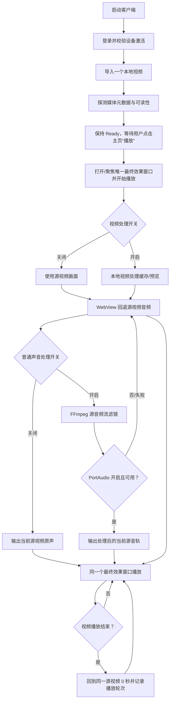
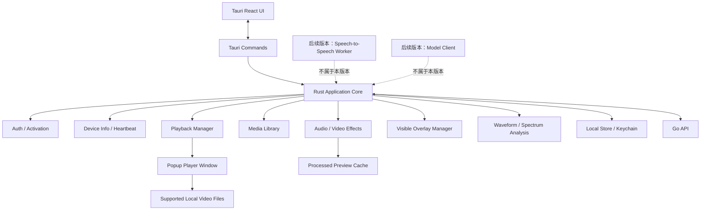
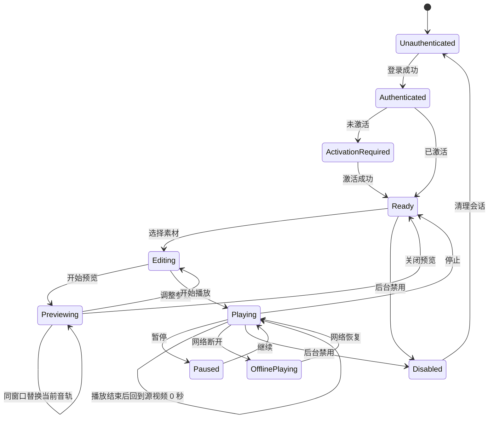
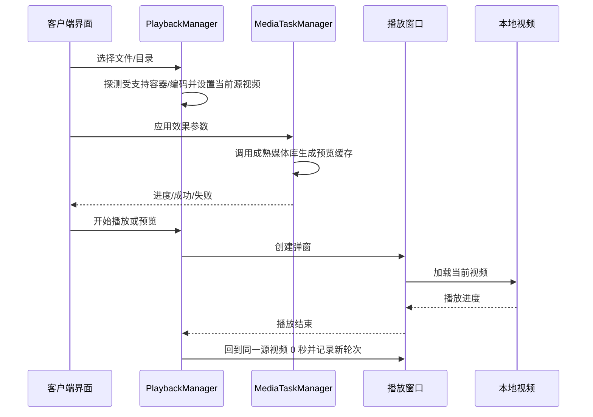

# 桌面客户端架构：Rust + Tauri

> 当前实现事实源：`desktop/src-tauri`、`desktop/ui` 及其自动化测试。本文只描述当前桌面代码已经实现的行为；历史设计不得覆盖本口径。
>
> 当前版本范围声明（2026-08-19）：本版本不开发实时话术幻化。speech-to-speech、VAD/ASR/LLM/TTS、实时话术候选换轨和模型租约直连均不属于当前桌面产品入口、验收或发布范围；文中相关代码/接口仅作历史兼容审计或后续版本预留。当前声音能力以普通声音处理、插话和固定话术系统朗读为准。

## 普通声音周期预热（2026-08-20）

普通声音随机周期采用滚动 current/next：主窗口提交当前周期后立即抽样下一周期，但不修改当前参数事实源；到预计切换前约 4 秒，由拥有真实 `<video>` 时钟的最终效果窗口调用 Rust prepare。Rust 只保留一个当前 FFmpeg 任务和一个候选任务，候选 seek 到目标前 250ms，并以 `-re` 生成固定 750ms PCM 时间窗。到期后最终效果窗口用实时 `video.currentTime + loop_index` 提交；只有提交成功才更新 `PlaybackCore` 配置和 revision。暂停、停止、拖动、换源或配置变化会取消候选并 Join 任务。

当前完成的是预热调度 Phase 1。样本域 30ms 双向交叉淡化和“唯一 `audio_cycle_mixer` 写 PortAudio 环缓”属于后续 Phase 2，未完成前不得把兼容切换路径描述成完整 DAW 或真实双轨 crossfade。

## 1. 职责范围

Rust 桌面客户端是系统的执行面，负责：

当前功能链路见 [`桌面端功能流程图.md`](./桌面端功能流程图.md)。

- 使用与后台一致的账号登录
- 输入激活码并绑定设备
- 采集并上报基础设备信息
- 管理 `.mp4`、`.mov`、`.mkv`、`.avi`、`.webm`、`.m4v`、`.ts`、`.m2ts`、`.flv`、`.wmv`、`.3gp` 本地视频素材和单视频循环播放状态
- 管理单窗口循环播放和播放轮次；本版本不管理 speech-to-speech 音频变体决策
- 调整合规的音频/视频效果并进行非破坏性预览
- 弹出一个持续存在的窗口循环播放同一个源视频；不创建第二个视频窗口
- 展示波形、频谱、响度和基础视频参数
- 添加可见的文字、图片、Logo、贴纸和光效叠加层
- 管理视频处理缓存、普通声音处理、插话和固定话术系统朗读状态；实时音频候选和 speech-to-speech 状态仅作历史兼容审计
- 当前不提供本地声音/视频研究分析、研究报告、内容相似度、媒体鲁棒性、隐形标记、随机扰动或内容指纹能力；仓库中遗留的相关代码只用于迁移审计
- 本版本不提供本地实时话术幻化入口
- 使用一个持续存在的独立弹窗展示当前源视频和处理效果
- 默认采用单源连续循环：导入成功后保持 `Ready`，用户点击主页“播放”才打开/聚焦最终效果窗口并开始播放；播放结束后同一窗口从 0 秒继续
- 支持插话目录扫描、随机插话、主音轨 duck，以及声音处理中的单轨/多轨预设混合；这些能力由当前桌面端 UI 和 Rust IPC 提供
- 音频输入以源视频音频流为准；普通声音处理走 FFmpeg/PortAudio，插话和固定话术走当前本地播放链路。实时 speech-to-speech 输入仅作后续版本预留
- 网络异常时保持本地播放
- 通过 Go 管理控制面账号和租约；本版本播放不申请实时话术租约、不调用 OpenAI-compatible 大模型

客户端不负责：

- 用户和激活码管理
- 模型 API Key 管理
- 服务端数据库读写
- 视频云端存储
- 面向平台审核/检测的规避、自动发布和平台接入；本地声音/视频研究分析也不属于当前客户端职责

### 1.1 参考界面功能映射

截图展示的是一个“本地视频素材处理与预览工作台”，不是后台管理页面。桌面端按以下边界吸收功能：

| 截图区域/能力 | 桌面端处理方式 | 优先级 |
| --- | --- | --- |
| 左侧“导入视频”和视频素材库 | 从受支持格式白名单导入文件/目录，展示文件信息、选中/移除素材、维护当前源视频 | P0 |
| 播放、进度、倍速和状态 | 主窗口播放控制，支持单视频循环和播放轮次 | P0 |
| 画中画播放 | 独立预览窗口，可关闭、恢复和调整窗口大小 | P0 |
| 音频转换开关、音频参数重置 | 合规音频效果开关、参数面板和默认值恢复 | P0 |
| 视频转换开关、视频参数重置 | 合规视频效果开关、参数面板和默认值恢复 | P0 |
| 实时幻化开关 | 本版本不提供；不启动 speech-to-speech、不生成实时变体、不申请模型租约 | 非当前范围 |
| 音频实时变化、响度、波形、频谱 | 采用成熟媒体分析库显示实时或近实时诊断信息 | P1 |
| 亮度、对比度、饱和度、色相、模糊、锐化、裁剪、缩放、旋转、平移 | 使用成熟媒体库滤镜，生成预览缓存，不覆盖原片 | P1 |
| 随机挂件、文字、图标、光效 | 改为用户主动配置的可见叠加层，支持位置、透明度和时间区间 | P1 |
| 音频状态卡片 | 区分当前可调参数、波形/频谱/响度只读诊断和“下一次变声”倒计时；倒计时只读且随播放状态暂停/恢复 | P1 |
| 研究分析、研究报告和实验参数 | 当前版本不提供；历史代码不作为桌面端入口、验收项或发布能力 | 非当前范围 |

桌面 UI 不展示独立“运行资源”卡片，不向用户提供运行资源安装、取消、选择目录或清理按钮。正式包优先使用 Tauri bundle 内置的 FFmpeg/FFprobe；内置资源不完整时，Rust 使用已校验的应用数据目录下载/安装路径作为兜底。资源缺失、探测失败或处理失败通过导入/处理错误反馈。

桌面端主界面建议保持截图的三栏职责：左侧素材库，中间效果和分析面板，右侧画中画预览。UI 控件优先复用 Ant Design；媒体内核和滤镜能力优先采用成熟库，不自行实现工具链。

### 1.2 当前首版功能流程图



当前流程不创建第二个视频窗口、不生成离线版本、不等待其他视频；本版本不执行实时话术候选或换轨，相关代码仅作历史/后续版本兼容。

## 2. 技术选型

推荐使用 **Tauri 2 + Rust 核心 + React 界面**：

- Rust：系统能力、文件系统、凭证、安全、播放状态和后台任务
- React：登录、激活、播放控制和设置界面
- Tauri 中的 React 界面同样遵守项目 Ant Design 约束；已有组件优先复用，不覆盖 Ant Design 内部样式
- Tauri：窗口生命周期、Rust/React 通信和安装包
- 媒体能力：使用成熟媒体库/官方 SDK 处理编解码、滤镜、音频分析和播放；不自行实现编解码器、滤镜算法或频谱算法
- HTML5 Video：用于 WebView 能直接解码的已探测源视频；`.mov`、`.mkv`、`.avi`、`.webm`、`.m4v`、`.ts`、`.m2ts`、`.flv`、`.wmv`、`.3gp` 等容器若不能直接播放，当前返回明确导入/处理错误，不承诺自动兼容转码

具体媒体库在实施阶段按目标平台、许可证、打包体积和 GPU/CPU 表现验证后确定，当前采用随 Tauri 安装包分发的 FFmpeg/FFprobe 资源；候选可包括 FFmpeg、libmpv、GStreamer 等成熟方案。

FFmpeg 首版打包目标为 `x86_64-apple-darwin`（macOS Intel）、`aarch64-apple-darwin`（macOS M 芯片）和 `x86_64-pc-windows-msvc`（Windows x64）。正式包通过 `bundle.resources` 同时携带运行资源清单和已验证的 `embedded-runtime-resources`；Rust 优先从内置目录定位，内置资源不完整时才切换到应用数据目录的下载/安装布局。开发环境可用环境变量覆盖；正式包不依赖系统 PATH。缺少目标资源时，下载/安装或能力探测必须返回结构化错误，许可证和发布验收仍需单独检查。该资源准备能力不形成桌面端独立运行资源页面或用户操作流程。

Windows x64 的 PortAudio 使用动态运行库 `portaudio_x64.dll`。正式安装包和便携包必须同时携带该 DLL；NSIS 安装完成后将其复制到应用 EXE 同目录，卸载前删除该副本，避免 Windows 在进程启动阶段找不到动态库。其他 Windows x64 电脑无需单独安装 PortAudio。

- AI 生成阶段优先使用成熟本地工具或受控 Worker：Faster-Whisper/FunASR、GPT-SoVITS/CosyVoice/F5-TTS 等；Go 负责 OpenAI-compatible 账号登记、连通性测试、租约和调用记录；LLM 仅在当前直连租约包含供应商委托凭证时由 Rust 调用。
- 本地合成、媒体分析和参数实验优先使用成熟媒体工具；不接入 OBS，也不实现 RTMP 推流。
- 本地视频效果输出必须经过解码、处理和重新编码，不使用视频流 `copy`；FFmpeg 作为随桌面端分发的本地媒体处理工具，不承担 RTMP 推流、断线重连或推流子进程管理。
- 参数范围、单位、默认值和自动读取源素材规则统一见 [`媒体参数范围与默认值.md`](./媒体参数范围与默认值.md)。

## 3. 运行结构



## 4. 客户端目录建议

```text
desktop/
  src-tauri/
    auth/
    activation/
    device/
    local_store/
    playback/
    model_client/
    media_library/
    media_pipeline/
    audio_effects/
    video_effects/
    overlays/
    analysis/                 # 仅波形、频谱和基础媒体诊断
    profiles/
    telemetry/
    commands/
    errors/
    main.rs
  ui/
    login/
    activation/
    player/
    final-preview/
    settings/
    status/
```

## 5. 客户端状态机



状态规则：

- 未登录不能激活和播放受保护功能。
- 已登录但未激活只能进入激活页面。
- 已激活后可以选择本地视频并播放。
- 选择素材后可以进入 Editing，效果预览进入 Previewing；参数调整必须可见、可关闭和可重置。
- `FinalPreviewController` 只允许一个 `PlayerWindow` 实例；实时话术只更新当前基础音轨，不改变窗口实例。
- 网络断开不影响已打开的本地播放窗口。
- 后台禁用用户或设备后，客户端在下一次鉴权/心跳时进入 Disabled。

## 6. 核心模块

### 6.1 AuthManager

- 登录和退出
- Access Token 刷新
- 受保护请求 `401 → 单飞 Refresh → 原请求只重试一次 → 失败清理会话`
- 处理用户禁用和 Token 失效
- 不在普通配置文件中保存密码

### 6.2 ActivationManager

- 提交激活码
- 绑定当前设备
- 查询激活状态
- 处理过期、已使用和设备数量超限

激活流程：

```text
登录
  ↓
生成/读取本地设备标识
  ↓
提交激活码 + device_id
  ↓
后台校验并绑定
  ↓
保存设备凭证
  ↓
进入 Ready
```

### 6.3 DeviceInfoCollector

采集最小必要信息：

- 设备名称
- 操作系统和版本
- 客户端版本
- CPU 概要
- 内存总量
- 磁盘剩余空间
- 屏幕分辨率
- 当前播放文件和状态

默认不采集 MAC 地址、硬盘序列号、摄像头、麦克风和用户目录文件列表。

### 6.4 HeartbeatService

- 定时上报设备状态
- 网络失败时指数退避
- 恢复后补发最后必要状态
- 不阻塞播放线程
- 重复心跳必须幂等
- 网络超时、连接失败、429 或 5xx 时，只在本地按 `user_id + device_id` 保存一条最新心跳，不积累无限历史
- 下次发送心跳时先使用持久化的 `Idempotency-Key` 补发，再发送当前最新状态；鉴权/参数类错误不进入补发队列
- 本地补发记录只包含设备运行摘要和播放状态，不包含 Access Token、Refresh Token、激活码或模型密钥

### 6.5 PlaybackManager

- 管理当前选中的单个源视频
- 播放源视频
- 播放完成后从同一源视频的 0 秒重新开始
- 记录播放轮次，不生成离线视频版本，不把同一视频伪装成多个媒体项
- 暂停、继续、停止
- 记录当前文件和播放进度

### 6.6 MediaLibrary

- 导入本地视频文件或目录，扩展名白名单为 `.mp4`、`.mov`、`.mkv`、`.avi`、`.webm`、`.m4v`、`.ts`、`.m2ts`、`.flv`、`.wmv`、`.3gp`
- 展示文件名、路径摘要、格式、大小、时长、分辨率、帧率、音频采样率和状态
- 管理当前选中的单个源视频，不建立多视频队列
- 扩展名只用于选择过滤；导入后必须由 FFprobe 校验实际容器、视频流、音频流、时长和可读性，当前不承诺 WebView 无法直接解码时自动生成兼容本地预览缓存
- 对损坏文件、扩展名与容器不一致或内部编码不受支持的素材给出明确状态
- 不上传原始视频，不把用户路径直接发送到后台

### 6.7 AudioEffectEngine

- 提供音频效果总开关和恢复默认参数
- 普通声音处理开关关闭时，跳过普通音频效果并保留当前基础音轨
- 预热读取速率：当前播放轨使用严格 `-re`；候选轨使用受控 `-readrate max(2, playback_speed + 1) -readrate_initial_burst 0.5`，默认速度下仍为 2 倍读取，显式加速时确保经过 `atempo` 后仍快于画面时钟。多支路滤镜在 5 秒有界预算内追赶，候选仍只允许 50ms 最低可播放余量，提交失败时保持旧轨。
- 普通声音处理配置由播放核心保存并带流版本号；PortAudio 路径由 FFmpeg 直接从源视频音频流生成 f32 PCM，不把处理后音频 MP4 作为播放前置条件。应用侧 SPSC 内存环缓默认 1024 KiB、允许 128～2048 KiB，UI 数值不控制硬件回调帧数。换轨候选以 50ms 为最低可播放余量，并在 5 秒有界预算内继续缓存以追上 FFmpeg 滤镜启动期间推进的画面；提交位置按“UI 观测位置 + 预热耗时 × 当前播放倍速 + 旧环缓待播时长 + PortAudio 实际输出延迟”计算，实际输出延迟取 `PaStreamInfo.outputLatency` 与 callback `outputBufferDacTime-currentTime` 中的较大值。提交只原子预填固定 50ms，剩余连续 PCM 留在候选预缓冲，启用后按正常 50ms 水位依次写入。PortAudio 确认 Active 后才放行候选混音线程，提交成功才销毁旧任务；播放 generation、轮次、媒体引用、声音开关或流版本在预热期间变化时，候选按过期请求丢弃并保留旧轨。SPSC 写入支持跨越环尾，避免连续空闲段暂时不可写时误判消费者无进度。PortAudio 轮询同时读取真实硬件流状态、实际采样率/输出延迟、回调状态位、已消费 PCM frame、回调欠载、生产者丢弃和环缓水位；写入线程只有在 callback 计数和环缓水位连续 500ms 都无变化时才判定消费者无进度，不清空旧环缓。Web Audio 只用于 WebView 回退、音量/静音和只读波形/频谱观测
- 开启或重新配置 PortAudio 时，先启动处于静音暂停态的硬件 callback，用于取得真实输出延迟；视频继续使用 WebView 原声，FFmpeg 候选准备和定位成功后才原子提交、放行 callback 并静音 WebView。设备启动、FFmpeg 预热和源同步在 Tauri blocking worker 上执行，不占用命令异步执行线程；失败时停止候选/硬件流并保持 WebView 播放，避免 1～2 秒预热造成画面停顿或静音。主窗和最终效果窗的完整播放快照统一最多每 1 秒读取一次，PortAudio 状态最多每 2 秒读取一次，且同类请求在途时不得再次入队。
- Web Audio 诊断图按最终效果窗口生命周期只创建一次；React StrictMode/HMR 的短暂重挂载会复用原 AudioContext，延迟清理只在窗口真正卸载后执行，避免同一媒体元素重复绑定 `MediaElementSourceNode`。
- 普通声音处理的用户入口提供 21 项默认随机预设，另有 p22“明显变调与空间（手动）”供显式选择；第 21 项不进入运行池。p22 使用 +2 半音、低频 -6 dB、中频 +5 dB、高频 +6 dB、Q=2.2、相位扰动 8%、颤音 6.8 Hz/2.5%、混响 12%，用于人工听感验收，不进入默认随机池。参数范围覆盖增益/响度、三段 EQ/Q 值、音高、变速、淡入淡出、轻混响、降噪、相位、颤音、环境噪声比例/电平、采样率和码率。环境声素材混合、干湿比、压缩及高级 DSP 保持 `unavailable`
- 播放暂停时先暂停混音线程，再让 PortAudio callback 只填零；停止时同时暂停 callback、清空硬件环缓并停止 FFmpeg/混音任务，避免按钮返回后仍有残余声音。停止后重新播放会按当前播放位置重新预热音轨；每次视频循环边界也触发一次源位置同步，避免连续轮次沿用旧音频时钟造成累计音画偏移。
- PortAudio 的应用侧环缓容量与播放延迟水位分离：容量仍按 128～2048 KiB 配置，默认 1024 KiB；正常播放只维持 50ms 目标水位，不允许 FFmpeg 解码速度把整个环缓填满。候选原子提交同样固定为 50ms，不能把数秒追赶缓存一次写入物理环缓。运行态展示环缓样本数、按实际采样率/声道换算的待播毫秒数和 PortAudio 实际输出延迟，用于定位音画偏移。
- 实时 PortAudio 解码采用 `-re -stream_loop -1` 时禁止使用需要等待 EOF 的 `areverse`；淡出参数在实时路径安全跳过，`areverse → afade → areverse` 仅用于有限输入的离线链路。停止时必须确认 FFmpeg 子进程、stderr、解码线程和混音线程均已退出，不得静默放弃线程句柄；运行态记录当前/候选 FFmpeg PID 和任务数量，最多允许 1 个当前任务加 1 个候选任务。
- 上述 `-re` 约束针对当前播放轨；候选预热按 `max(2, playback_speed + 1)` 计算有界 `-readrate`，配合 `-readrate_initial_burst 0.5` 和 `-stream_loop -1`，同样禁止 `areverse`。
- 提供响度稳定、实时波形和频谱诊断；诊断值只读，不作为处理参数提交
- 将用户配置、只读诊断、资源统计和运行状态分成不同字段；只完成配置保存或校验时不得标记为 `runtime`
- 每个参数返回 `disabled/configured/processing/ready/failed/unavailable` 状态；`configured` 只表示已校验/保存，只有当前 FFmpeg 处理缓存确认执行才可标记 `ready`，未接入 DSP 或分析器时保持 `unavailable`
- `下一次变声`由本地播放状态驱动，展示剩余秒数和进度条；暂停、停止、切换媒体时暂停或重置倒计时
- 效果参数由 FFmpeg 执行，Rust 负责参数模型、任务编排和错误转换；Web Audio 不作为声音效果处理器
- 当前版本不提供研究实验参数、随机种子或研究报告；历史参数不得作为当前运行能力展示
- 本节不扩展实时音频幻化参数；本版本不启动独立 Worker，相关参数和契约只作后续版本/历史审计

### 6.8 VideoEffectEngine

- 提供视频效果总开关和恢复默认参数
- 视频处理开关关闭时，不执行视频画面效果，播放器仍使用源视频
- 支持亮度、饱和度、模糊、对比度、色相旋转、锐化、噪点、细节增强、裁剪边缘平滑度、X/Y 像素偏移、帧内微扰、动态裁剪、帧率微扰、色域转换和像素级缩放
- 当前版本只展示和执行已接入的基础视频效果；视觉频段、实验性微扰和研究挂件不属于当前视频处理入口
- 输出到临时预览或导出缓存，不覆盖原始素材
- 显示处理进度、取消、失败和回退原片状态
- 具体滤镜由成熟媒体库执行，不自行编写视频编解码和滤镜算法；只要启用视频效果，输出必须重新编码

### 6.9 OverlayManager

- 添加文字、图片、Logo、贴纸和光效等可见叠加层
- 支持位置、大小、透明度、层级、时间区间和启停
- 支持抽象人脸数量、抽象人脸大小、抽象人脸透明度、随机图形透明度、随机图形大小、画面偏移、切片长度、切片最小长度和切片触发间隔
- 支持预览、清除和恢复默认
- 叠加层配置与素材/效果配置分开保存
- 隐形标记研究不属于当前产品；历史 `WatermarkLab` 代码如仍存在，只用于迁移审计

### 6.10 AnalysisPanel

- 展示实时波形、频谱、音量/响度、采样率、声道等音频信息
- 展示分辨率、帧率、时长、编码格式和当前媒体处理状态；哈希只在明确启用的媒体处理链路中展示
- 分析任务异常时显示降级状态，不阻塞播放和主窗口

### 6.11 ProfileManager

- 保存和恢复视频处理开关、声音处理开关、音频/视频/叠加层参数；实时幻化字段如仍存在，只作兼容字段
- 配置带版本号和默认值
- 配置失效时回退默认参数并提示用户
- 只保存参数和素材引用，不复制或上传原始视频

### 6.12 历史研究代码（非当前产品）

- 当前桌面端不提供本地声音/视频研究分析、研究报告、隐形标记、内容相似度、媒体鲁棒性、随机扰动或内容指纹入口。
- 代码中如仍保留 `ResearchAnalysisController`、研究 Worker 或历史报告类型，只用于迁移审计；新功能不得依赖或扩展它们，删除另立代码清理任务。
- 实时音频幻化不属于本版本；代码中如仍保留 `SpeechToSpeech` 链路，只用于历史兼容审计，当前不得启动 Worker。

### 6.13 MediaTaskManager

- 管理媒体分析、效果预览、导出和缓存清理任务
- 每个任务有进度、取消、超时、失败和回退状态
- 任务不能阻塞 UI、心跳和播放控制
- 限制并发数和缓存大小，避免长视频耗尽 CPU、GPU 或磁盘

### 6.15 FinalPreviewController

- 接收一个已探测的受支持格式源视频和可选的视频处理缓存；自动兼容预览缓存仍属于后续能力
- 只创建一个 `PlayerWindow`，在窗口生命周期内循环展示当前源视频
- 用户点击“播放”后使用源视频原声开始播放；普通声音处理从源视频音频流经 FFmpeg/PortAudio 输出，不替换视频文件；本版本不执行实时话术换轨
- 支持播放、暂停、停止、进度、倍速和循环播放
- 当前窗口只处理源音轨、普通声音处理、插话和固定话术朗读；`realtime_variant` 候选不属于本版本，保留窗口位置、尺寸和用户控制状态
- 预览失败时显示明确错误，不影响主窗口、登录状态和本地播放/Worker 状态
- 只读取本地生成产物，不上传视频、不连接 RTMP

### 6.16 ContinuousPlaybackCoordinator

- 单源连续循环是默认播放策略，负责同一个源视频的播放轮次和当前音频槽状态
- 源视频通过文件可读性、容器和权限校验后进入 `Ready`，等待用户点击“播放”；实时检测、变体和 SHA-256 任务不能阻塞导入完成
- 视频处理开关开启并应用参数后，视频效果写入临时预览缓存；校验成功后立即切换当前视频引用，失败时回退源视频，不改变原文件
- 声音处理开关开启时，普通声音处理由 FFmpeg 从源视频音频流解码并交给 PortAudio 输出；PortAudio 关闭或失败时 WebView 播放源视频音频。后续版本的 `realtime_variant` 兼容音轨不套用普通声音滤镜；本版本没有该音轨，关闭时不执行普通声音处理
- 本版本不启动实时幻化开关、speech-to-speech、VAD/ASR/LLM/TTS，不申请模型租约，不生成音频候选；只暴露当前源文件、播放轮次、普通声音处理状态、插话状态和固定话术状态

连续优先模式只针对当前源视频和普通声音处理/插话音轨；不生成下一项视频，不维护版本预生成队列。实时话术生成属于后续版本，本版本不启动；当前媒体处理无法及时完成时，继续播放当前视频和当前可用源音轨，不暂停、不黑屏、不切换空媒体源。

实时音频幻化的连续流程（后续版本，当前不开发）：

```text
导入一个源视频
    ↓
同一个 PlayerWindow 原声循环播放
    ↓（实时幻化开关开启）
输入音轨：文件 / 受控实时流
    ↓
speech-to-speech：VAD / ASR / LLM / TTS
    ↓
LLM 决定沿用原文或生成改写话术
    ↓
沿用：当前基础音轨；改写：生成实时音频变体
    ↓
当前窗口安全边界替换正在播放视频的音轨
```

本节只保留后续版本历史方案。本版本不执行 speech-to-speech、LLM、TTS、候选暂存、候选提交或 `start_at_ms` 实时换轨；当前播放直接使用源音频或普通声音处理链。

历史代码可能已经落地实时话术纵切片，但它不代表本版本功能已开发或已验收。当前版本不得启动该 Worker、适配器或模型调用；后续恢复时须重新更新 PRD、接口契约和验收标准。

播放和效果预览流程：



### 6.17 PlayerWindow

- 应用生命周期内最多创建一个最终效果窗口实例
- 窗口关闭前不因视频切换而销毁或重新创建
- 普通窗口和全屏
- 播放控制
- 当前支持在同一窗口内循环同一媒体源和候选音轨状态切换，不切换多个离线播放项；真实媒体音轨热替换仍需媒体引擎阶段接入
- 通过 Tauri `final-effect` 单实例窗口展示最终效果；窗口已存在时只显示并聚焦，不重复创建
- 当前最小版本由主窗口和最终效果窗口通过 `get_snapshot` 轮询同步播放轮次、音轨状态和播放状态；最终效果窗口只使用当前进程内的 `PlaybackSnapshot` 解析视频引用，不从 `localStorage`、上次路径或其他持久化状态恢复源视频。最终效果窗口不上传视频。后续若改为 Tauri 事件，必须先更新接口契约和长任务计划。
- 错误提示
- 窗口关闭时通知 PlaybackManager
- 播放窗口崩溃时不影响主界面和心跳服务

当前固定话术采用独立的本地系统朗读链路，不依赖本版本未开发的实时 speech-to-speech，也不与普通声音处理共用实现：主窗口通过 `autolive-playback-ui-v1` 的 BroadcastChannel 向同一实例的 `final-effect` 窗口发送版本化 `fixed-speech-command`，最终效果窗口只选择 `SpeechSynthesisVoice.localService === true` 的本地声音，调用 WebView2 的 `speechSynthesis` 朗读 1～500 个 Unicode 字符。朗读期间视频继续播放，但当前源/处理音轨临时静音、插话暂停；`start/end/error/cancel`、切换源视频、停止和窗口卸载都通过操作 ID 幂等清理并恢复用户原来的静音/音量状态。固定话术不识别人声、不分离背景、不生成 WAV/MP4、不调用 Rust 固定话术 IPC、不依赖 Python/Worker/ASR/TTS 模型；没有本地声音或 WebView2 能力时 fail-closed，保持原音轨。正式 EXE 必须通过真实 Windows WebView2 系统朗读烟测后才能发布。

### 6.18 ModelClient（后续版本预留，本版本不调用）

- 后续版本可向 Go 申请当前单账号 `direct_lease`
- 本版本不使用租约调用 OpenAI-compatible 供应商；若后续启用，必须只在租约包含供应商委托的短期直连凭证时调用
- 只在内存中保存当前租约，不缓存完整号池、长期 API Key 或任意上游地址
- 续租和释放租约；供应商不支持短期/可撤销凭证时返回不可用
- 直连链路完成后，将 request_id、usage、延迟和错误摘要回报 Go；调用摘要必须标记为客户端上报，不伪装成供应商权威账单。当前 Go 接口已提供，但 Rust 自动上报和可信租约注入尚未接通
- 后续版本模型失败、租约过期或网络异常时应回退当前可用音轨，不阻塞播放；本版本不发起该调用

租约操作重试规则：同一次申请、续租或释放操作在网络失败后复用原 `Idempotency-Key`；provider/model/purpose/时长或 lease ID 变化时生成新 key，成功后清理待重试状态。登录、Profile、激活、Heartbeat 和租约操作使用同一操作闸门，互斥执行；已有活动模型租约时禁止切换登录账号，必须先释放租约，避免服务端租约失去本地释放引用；响应提交前校验会话代际，防止旧账号或旧设备响应写入新会话。

当前单视频循环不创建媒体任务，不走实时话术模型租约绑定流程。Go 保留账号登记/测试、直连租约、Refresh Token 轮换、Logout 和调用摘要记录作为控制面能力；本版本桌面播放不发起实时模型调用。

客户端不接触完整供应商 API Key；当前 Go 只返回 `direct_base_url`，未实现凭证委托时客户端不得发起直连，并回退当前可用音轨。

### 6.19 LocalStore

保存：

- 当前用户会话摘要
- 本地设备配置
- 当前源视频与播放轮次
- 视频处理开关、声音处理开关；实时幻化字段如仍存在只作兼容保留
- 最近播放状态
- 音频/视频/叠加层效果配置
- 媒体缓存索引和清理状态
- 当前源视频、播放轮次和最后预览状态
- 当前媒体处理配置、已启用链路的哈希状态和清理状态；不保存研究分析报告
- （后续版本）实时音频幻化的开关、当前输入、播放轮次、LLM 决策、音频候选、换轨状态和回退原因
- 未上报事件

设备 Token、Refresh Token 等敏感凭证优先保存到操作系统 Keychain/Credential Manager；LocalStore 只保存非敏感状态和安全存储引用。

## 7. Tauri 通信接口

### 7.1 React 调用 Rust 命令

```text
probe_local_video
hash_local_artifact_sha256
get_device_runtime_info
start_playback
pause_playback
resume_playback
stop_playback
complete_playback_loop
commit_media_processing_if_ready
set_processing_switches
set_audio_processing_profile
stage_audio_variant_candidate
commit_audio_variant_candidate
commit_audio_variant_candidate_if_due
discard_audio_variant_candidate
start_speech_to_speech_worker
cancel_speech_to_speech_worker
restore_original_audio
get_snapshot
get_media_engine_capabilities
start_media_processing
cleanup_local_caches_command
open_final_effect_window
close_final_effect_window
store_refresh_token
load_refresh_token
delete_refresh_token
```

登录、激活、心跳、模型租约和调用摘要通过 Tauri 官方 HTTP 插件访问 Go 控制面，不作为 Rust 本地媒体 IPC。视频媒体 Worker 已完成受控执行最小闭环；完整高级视频滤镜映射、真实 DSP Worker 和 direct lease 凭证仍需后续环境接入，未接入的算法不得由界面伪造为已生效。

### 7.2 Rust 主动发送给 React 的事件

当前最小版本不注册主动事件，React 通过 `get_snapshot` 轮询播放状态、按阶段产生的哈希状态和候选槽状态；导入探测默认不触发异步哈希，后续引入事件时必须先更新本节和接口契约，不得恢复旧任务/队列事件。

### 7.3 当前已落地的最小 IPC

本节区分目标契约与当前实现。多格式目标命令为 `probe_local_video` 和 `hash_local_artifact_sha256`；当前源码已完成 `probe_local_video`、11 种扩展名文件选择白名单和 FFprobe 实际探测，通用异步哈希 IPC 与自动兼容预览仍属于后续阶段。其他命令仍属于后续阶段设计时，也不应在界面中伪造已实现状态：

- `plugin:dialog|open`：目标文件选择白名单为 `.mp4`、`.mov`、`.mkv`、`.avi`、`.webm`、`.m4v`、`.ts`、`.m2ts`、`.flv`、`.wmv`、`.3gp`，单次播放仍只选择一个源视频；目录导入只收集白名单内文件。
- `probe_local_video`：仅接受主窗口调用，扩展名白名单校验后通过 FFprobe 读取实际容器和流元数据；返回规范化源路径、视频/音频流、时长、采样率和声道。探测成功后只更新源素材并保持 `Ready`，不会自动打开窗口或播放；当前不生成自动兼容预览缓存。
- `probe_local_video` 返回的 `source_path` 必须经过路径规范化和受控目录校验；后续 Worker 只能使用该受控源路径或本地候选路径，不从前端自由拼接媒体路径。
- `hash_local_artifact_sha256`（目标；当前为 `hash_local_mp4_sha256`）：接受已探测的受支持源视频，对整个文件字节流计算通用 SHA-256；文件实际为 MP4 时额外填充 MP4 专用哈希字段，非 MP4 不得伪造 MP4 哈希。
- `start_playback`、`pause_playback`、`resume_playback`、`stop_playback`、`complete_playback_loop`、`get_snapshot`：驱动单源 `PlaybackCore` 状态机；主窗口和 `final-effect` 窗口共享同一状态，最终效果窗口只加载一个源视频，播放结束后回到该源视频 0 秒并递增播放轮次。视频处理和普通声音处理不创建第二个视频版本。
- `stage_audio_variant_candidate`：后续版本/历史兼容 IPC，本版本不接受或提交实时话术音频候选。
- `commit_audio_variant_candidate`、`commit_audio_variant_candidate_if_due`、`discard_audio_variant_candidate`：后续版本/历史兼容 IPC，本版本不执行实时话术候选提交或换轨。
- `get_media_engine_capabilities`：内部媒体流程调用，返回安装包内置或开发覆盖的 FFmpeg/FFprobe 版本和可用性；不可用原因归入导入/处理结构化错误，不驱动独立“运行资源”卡片。
- `start_media_processing`：主窗口启动后台本地媒体处理，结果写入待切换视频槽，不创建 N 个版本、不创建第二个窗口。
- `cleanup_local_caches_command`：主窗口按容量上限清理旧媒体缓存和过期临时文件，保护当前播放和待切换产物，不触碰源视频。
- `commit_media_processing_if_ready`：兼容保留的已校验视频缓存提交命令；当前 Worker 完成校验后会立即提交当前视频引用，不把循环边界作为视频处理结果的必要前置条件。
- `set_audio_processing_profile`：仅接受主窗口调用，校验当前普通声音处理参数的版本、角色、单位和范围；普通声音参数由 `start_media_processing` 保存到播放核心，PortAudio 直接交给 FFmpeg 音频流处理并返回 `runtime`，不等待音频 MP4 缓存。WebView 回退播放源视频音频。播放速度不参与周期调度；未接入的环境声素材混合、干湿比和压缩字段保持 `unavailable`，只读诊断不得作为处理参数提交。
- `start_speech_to_speech_worker`、`cancel_speech_to_speech_worker`、`restore_original_audio`：后续版本/历史兼容 IPC；本版本不得从主窗口或最终效果窗口调用，不启动实时话术 Worker。
- 固定话术不注册 Rust IPC；主窗口与 `final-effect` 窗口只通过 BroadcastChannel 交换 `fixed-speech-command` 和 `fixed-speech-status`，文本、操作 ID、状态和错误均在两端校验。该链路不写入 PlaybackSnapshot，不进入音轨候选槽，也不触发内部媒体资源准备。
- 上述候选槽 IPC 和 `direct_model_chat` 均为后续版本/历史兼容面；本版本不得从当前 UI 调用，也不把代码注册视为当前能力已开发。
- `get_snapshot`：返回当前源视频、播放轮次、视频/普通声音处理开关、当前源/处理音轨状态、插话状态和固定话术状态；实时话术字段如仍存在，只作兼容字段。
- `research_params`、`validate_local_research_params`、`get_default_local_research_params` 以及 `start_research_analysis` 等研究命令：代码中如仍保留，仅作为历史兼容面，不属于当前 UI、当前播放状态或当前验收；不得在新代码中调用或扩展。
- 当前播放结束后显式回到同一源视频 0 秒；这不是“静默重复版本”，而是首版定义的单源循环策略。
- `get_device_runtime_info`：仅允许主窗口调用，使用成熟 `sysinfo` 读取当前素材所在磁盘（无法匹配时读取首个可见磁盘）的可用空间，以及总/可用内存、逻辑 CPU 数、系统名、系统版本和内核版本，供 Heartbeat 上报；磁盘读取失败直接返回结构化错误，不使用占位值伪造采集结果；系统字段缺失时保留可选值，不阻断磁盘心跳。
- `get_speech_to_speech_worker_capabilities`：后续版本/历史兼容 IPC；本版本不从主窗口或最终效果窗口调用，不探测或准备实时话术 Worker。
- 目标真实预览：选择一个白名单文件后调用 `probe_local_video`，只有实际探测成功项才可播放；由 `convertFileSrc(canonical_path)` 生成 asset URL，能否直放由目标 WebView/编码器决定，失败进入导入/播放错误链路。探测成功后保持 `Ready`，用户点击“播放”才由 `open_final_effect_window` 单实例创建/聚焦并循环加载当前视频引用。主窗口和最终效果窗口通过 `get_snapshot` 轮询同步播放轮次、当前/待切换视频、音轨状态和处理开关；视频处理校验成功后立即切换当前视频引用，不因后台处理或音频候选重新弹窗或创建第二个视频版本。

控制面请求使用 Tauri 官方 HTTP 插件，当前默认基地址为 `http://192.168.100.213:18090`，构建环境可用 `VITE_CONTROL_PLANE_BASE_URL` 覆盖；Tauri capability 只允许该明确远程地址，禁止本地旧地址和任意 URL 通配权限。正式部署仍应切换到明确的 HTTPS 域名范围。桌面端 Access Token 只在 React 运行时内存中存在；Refresh Token 使用成熟 `keyring` 库经 Tauri 命令写入系统 Keychain/Credential Manager，登录和轮换后更新，启动时读取并刷新，退出或刷新失效时删除。钥匙串不可用时不阻断本次登录，但明确提示重启后需重新登录。

命令失败统一返回结构化错误；浏览器开发环境没有 Tauri IPC 时，界面直接展示真实错误，不回退为伪造成功结果。

命令返回结构化错误，不让前端解析 Rust 的自由文本日志。

## 8. 与 Go 后端的交互

客户端使用 OpenAPI 生成或约束 API 类型：

```text
POST /api/v1/auth/login
POST /api/v1/auth/refresh
POST /api/v1/auth/logout
POST /api/v1/client/activate
POST /api/v1/client/heartbeat
GET  /api/v1/client/profile
POST /api/v1/client/model-leases
POST /api/v1/client/model-leases/:id/renew
POST /api/v1/client/model-leases/:id/release
POST /api/v1/client/llm/call-records
```

客户端不直接访问 PostgreSQL，不直接读取后台密钥配置，也不把本地视频内容上传到 Go API。客户端先在本地探测源素材；媒体处理仅在明确启用对应链路时计算完整 SHA-256。当前播放无需创建媒体任务，Go 只承载登录、激活、号池/直连租约、账号测试、调用摘要和状态摘要。本版本不执行实时话术输入、输出、模型状态或换轨；研究分析不参与当前控制面或播放面。

## 9. 离线与恢复

### 网络断开

- 已登录且已激活的客户端继续播放本地视频。
- 心跳和播放事件进入本地待发送队列。
- 后续版本模型调用如启用，暂停或网络错误不得阻塞播放器；本版本播放不发起实时模型调用。
- 已生成的本地预览缓存可以继续使用；新的效果处理任务进入等待状态。

### 网络恢复

- 刷新 Token。
- 上报最新设备状态。
- 按事件 ID 补发未提交事件。
- 清理已确认的本地事件。
- 历史研究分析任务不纳入当前恢复流程；遗留状态只允许按迁移审计处理。

### 应用重启

- 不读取或恢复上一次源视频路径、播放位置和播放状态，也不自动打开最终效果窗口。
- 启动后保持未导入状态；用户必须重新点击“导入视频并播放”，通过系统文件选择器选择受支持格式视频，实际媒体探测成功后才开始播放。
- 清理过期的临时租约和失效会话。
- 固定话术的进程内状态不跨重启恢复；当前版本不恢复实时话术或研究报告。

## 10. 安全边界

- 密码不落盘。
- Token 不写普通日志。
- 本地文件路径只用于播放器，不拼接系统命令。
- 后台返回的模型结果和错误信息不能包含供应商 API Key。
- 设备禁用后，客户端必须停止受保护的后台能力。
- 后续版本如启用客户端直连模型，只能使用单账号、短期、限额、可回收租约；本版本不发起实时话术模型调用，禁止下发完整号池、长期 API Key 或任意上游地址。
- 普通播放效果必须用户可见、可关闭、可重置；本地声音/视频研究分析不属于当前安全边界内的产品能力。
- 原始视频只读保留，处理结果使用缓存/导出目录并可清理。
- IPC 命令和本地 Worker 参数必须校验，不能通过路径拼接或 Shell 命令执行处理文件。
- 研究分析、隐形标记、内容相似度、媒体鲁棒性、随机扰动和内容指纹不属于当前产品入口；遗留代码不得被新功能调用。

## 11. 验证策略

### Rust 单元测试

- 登录和激活状态转换
- 激活码失败状态映射
- 单源播放轮次和循环
- 素材库导入、元数据读取和不兼容状态
- 音频/视频参数默认值、切换和重置
- 效果配置版本和失效回退
- 本地媒体 Worker 取消、失败和缓存清理
- 播放窗口关闭处理
- 心跳重试和离线事件队列
- 模型租约过期处理
- 单个最终效果弹窗打开、关闭、单源循环、播放控制和预览失败；本版本不验收实时音轨替换
- 第 6.7 节普通声音处理字段的保存、重置、只读诊断隔离和 `disabled/configured/runtime/unavailable` 状态转换
- 已接入视频效果参数、处理失败回退和原始文件保护
- 明确启用的媒体处理链路的完整文件 SHA-256 与提交一致性
- （后续版本，不纳入当前验收）实时音频幻化成功、超时、模型失败、换轨门禁失败和回退上一条可用音轨

### 桌面端手工验证

- `.mp4`、`.mov`、`.mkv`、`.avi`、`.webm`、`.m4v`、`.ts`、`.m2ts`、`.flv`、`.wmv`、`.3gp` 逐一选择、探测并验证直放能力或明确错误链路
- 循环播放
- 暂停、继续、停止
- 画中画预览
- 音频/视频效果开关、参数修改和一键重置
- 波形、频谱和基础媒体参数展示
- 可见文字、图片、Logo、贴纸和光效叠加
- 处理失败回退原片，原始文件不被覆盖
- 弹窗关闭和重新打开
- 断网继续播放
- 重启后不恢复源视频、不自动播放，必须重新选择受支持格式视频；独立保存的参数配置按各自契约恢复
- 实时话术候选超时或门禁失败时保持当前源音轨
- 研究分析入口不存在于当前产品验收范围；遗留研究代码不作为手工验收项
- 后台禁用设备后的客户端行为
