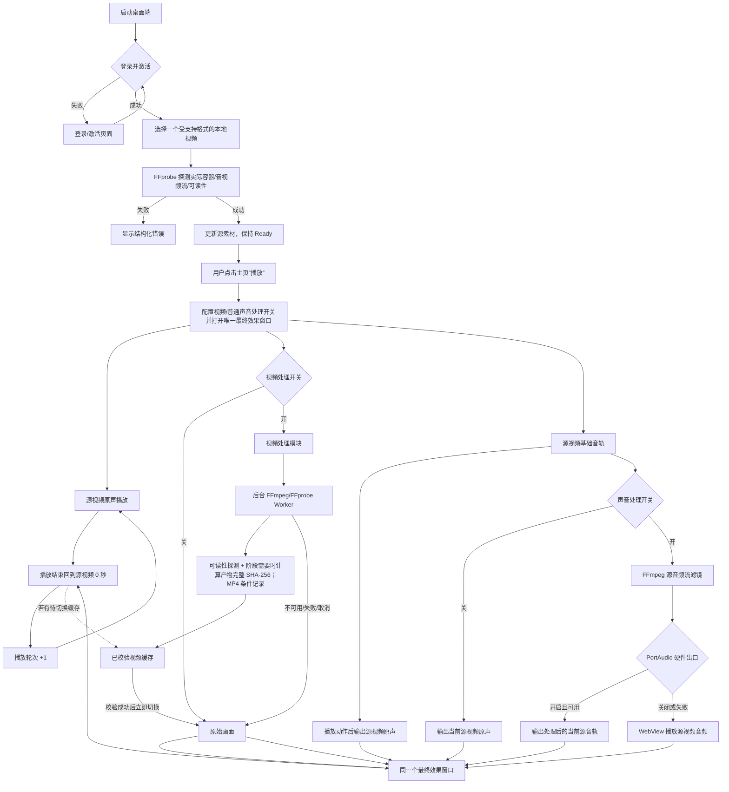
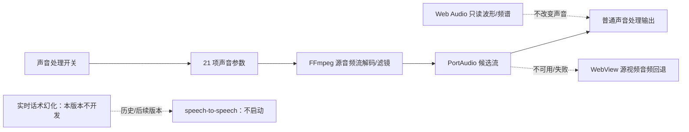
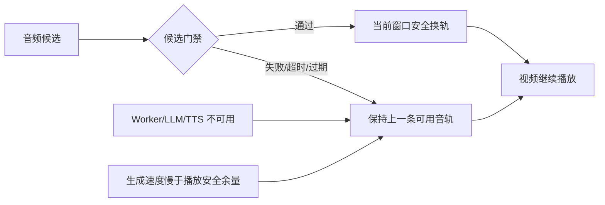

# 桌面端当前功能流程图

> 当前版本范围声明（2026-08-19）：本版本不开发实时话术幻化。speech-to-speech、VAD/ASR/LLM/TTS 和实时候选音轨换轨不进入当前流程、UI、验收或发布；相关节点仅可作为历史/后续版本参考。当前流程以普通声音处理、插话和固定话术系统朗读为准。

## 1. 产品边界

桌面端只处理一个本地源视频、一个持续存在的播放窗口和当前播放音轨。不存在 N 版本离线生成、版本队列、多视频顺序播放或批量 MP4 合成。

## 2. 当前主链路

## 3. 当前开关的职责

| 开关 | 控制范围 | 关闭时行为 |
|---|---|---|
| 视频处理 | 已接入的画面效果和后台处理缓存；经过 FFprobe 和必要校验后立即切换当前视频引用 | 使用当前可用画面 |
| 声音处理 | 普通源音轨由 FFmpeg 流式滤镜处理并优先送 PortAudio；PortAudio 关闭或失败时 WebView 回退源音频 | 不执行普通声音处理 |
| 实时话术幻化 | 本版本不开发；不提供入口、不启动 speech-to-speech Worker、不申请模型租约 | 后续版本/历史方案 |

视频处理和普通声音处理两个当前开关互不隐式联动。导入成功后不自动播放，用户点击“播放”才打开窗口并开始源音轨播放；普通声音处理只处理普通源音轨，插话作为叠加层执行，固定话术使用本地系统朗读。本版本不生成或切换实时话术候选，不启动 speech-to-speech，不申请模型租约。

本地导入白名单为 `.mp4`、`.mov`、`.mkv`、`.avi`、`.webm`、`.m4v`、`.ts`、`.m2ts`、`.flv`、`.wmv`、`.3gp`。声音面板将用户配置、只读诊断和 `disabled/configured/processing/ready/runtime/unavailable/failed` 状态分开；声音参数应用后保存流式配置并由 FFmpeg/PortAudio 预热候选，不生成处理音频 MP4；播放速度不加入周期调度。实时音频幻化参数本次不扩展。

FFmpeg/FFprobe 优先从内置 `embedded-runtime-resources` 使用，资源不完整时才走已校验的应用数据目录下载/安装；桌面 UI 不显示独立“运行资源”卡片，也不提供安装、取消、选择目录或清理资源按钮。依赖失败进入导入/处理错误链路。当前不承诺自动兼容预览转码。

### 3.1 普通声音处理的 FFmpeg 预览

该预览展示当前已映射参数、流式处理状态、PortAudio/ WebView 实际出口和 `configured/processing/runtime/failed` 状态。参数修改后由 FFmpeg 预热新的源音频流候选；不生成处理音频 MP4。播放速度按用户配置处理，但不参加周期随机变化。Web Audio 仅提供只读诊断和回退播放。

播放状态进入 `paused` 或 `stopped` 时，PortAudio 和 FFmpeg 音频混音任务按取消策略释放；当前可用视频处理缓存可以保留。实时话术幻化不属于本版本生命周期。

## 4. 实时幻化失败链路（后续版本，当前不开发）

本节仅保留历史/后续版本参考。本版本不启动实时话术 Worker，不生成候选，不执行 VAD、ASR、LLM、TTS 或实时换轨；当前失败链路以普通声音处理回退 WebView 源音频为准。

## 5. 管理系统与桌面端边界

后台不接收视频文件，不创建媒体任务，不展示版本数量或版本进度；Go 负责 OpenAI-compatible 模型账号登记、连通性测试、租约和调用摘要，桌面端通过单账号直连租约直接调用模型，视频和音频内容保留在本地。

## 6. 非当前范围：本地声音/视频研究分析

本地声音/视频研究分析、研究报告、内容相似度、媒体鲁棒性、隐形标记、随机扰动和内容指纹支线已从当前产品移除。仓库中仍可能存在历史 Worker、参数和 IPC，它们不参与当前播放决策，也不属于当前 UI、验收或发布能力；删除代码需要单独的清理任务。
