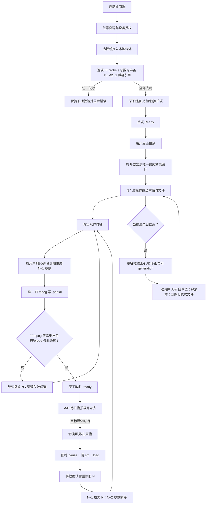
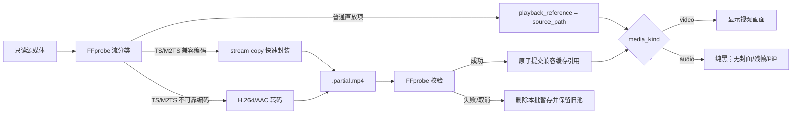
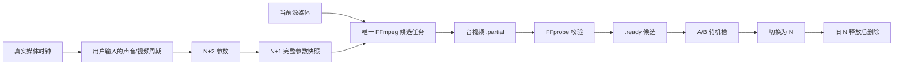
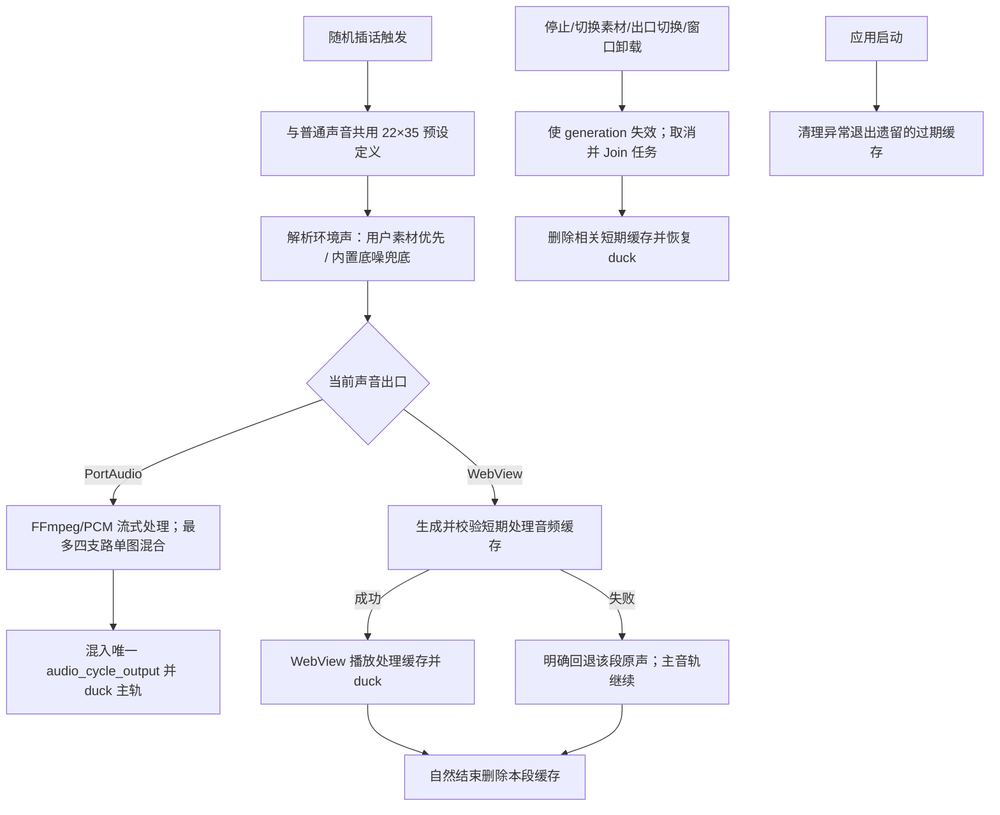
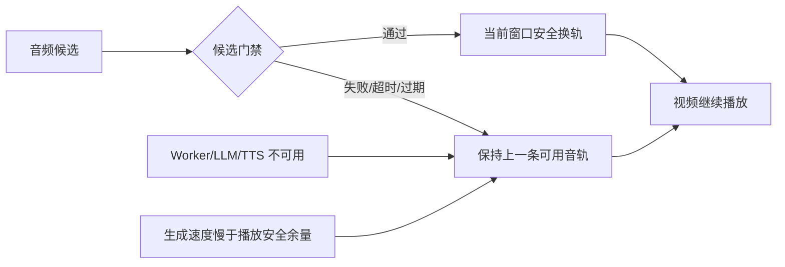
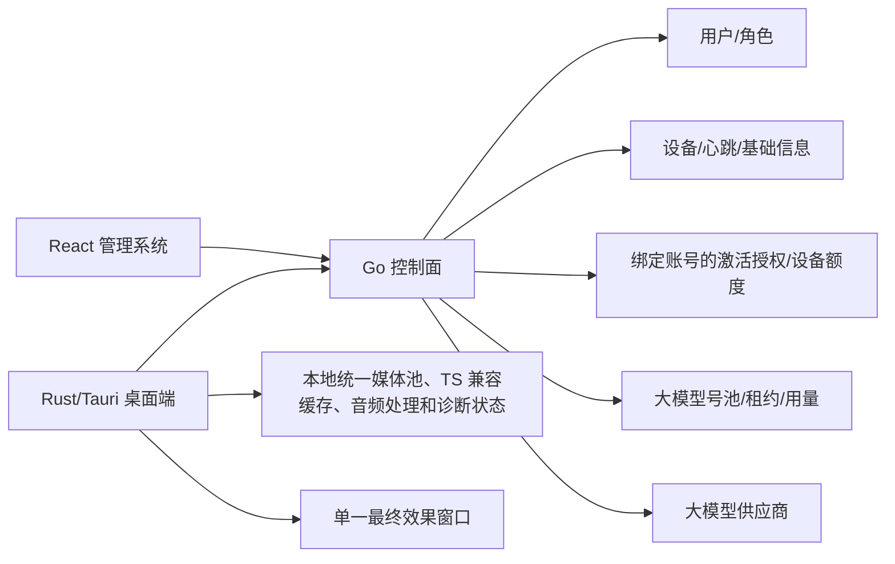

# 桌面端当前与本批目标功能流程图

> 当前版本范围声明（2026-08-27）：本版本不开发实时话术幻化。当前媒体处理采用 N/N+1/N+2 临时文件滚动方案；视频候选包含处理画面与普通声音音轨，纯音频候选生成临时音频。旧文件在释放后删除，软件关闭和下次启动均执行清理。

## 1. 产品边界

桌面端在当前进程内维护最多 `100` 项的本地有序播放池、一个持续存在的播放窗口和一个活动媒体槽。播放池不是生成版本队列；但运行期间允许 N、N+1 和最多一份待删项的受管临时文件。所有临时文件只服务当前播放会话，不上传、不持久保存，源文件保持只读。

## 2. 本批目标主链路（已规划、待实施）

### 2.1 播放池与候选状态约束

| 状态 | 语义 |
|---|---|
| `source_media_pool` | 最多 `100` 项视频/音频混排；新增候选全部探测成功后才原子提交 |
| `playback_reference` | 受校验的源或 TS/M2TS 兼容引用，不能由前端自由拼接 |
| `playback_generation` | 换源时递增；旧代际事件、候选和文件租约不得影响新代际 |
| N | 当前可见、出声并提供真实媒体时钟的源媒体或临时文件 |
| N+1 | 至多一个 `.partial` 或 `.ready` 候选；视频候选同时包含处理画面和普通声音音轨 |
| N+2 | 仅保存参数、随机种子和目标媒体时间；不创建文件、进程或线程 |
| deleting | Windows 文件占用时最多一份待删文件；有界退避，存在时不得生成第四份文件 |
| FFmpeg | 全局最多一个候选进程；取消必须终止进程树并 Join stdout/stderr 线程 |

播放池和候选状态只存在当前桌面进程。任何成功编辑都停止当前资源、取消并回收候选、清理旧 session，非空池首项进入 `Ready`。正常关闭同步清理当前会话，异常退出残留由下次启动清理。
## 3. 当前开关的职责

| 开关 | 控制范围 | 关闭时行为 |
|---|---|---|
| 视频处理 | 视频项把 `VideoEffectParams + AdvancedEffectParams` 写入统一 N+1 候选；纯音频项为 `not_applicable` | 候选沿用源画面；音频项继续纯黑 |
| 声音处理 | 普通源音轨经 FFmpeg/Signalsmith/PCM 处理后写入统一 N+1 候选音轨 | 候选复制或编码源音轨，不执行普通声音效果 |
| 实时话术幻化 | 本版本不开发；不提供入口、不启动 speech-to-speech Worker、不申请模型租约 | 后续版本/历史方案 |

视频处理和普通声音处理两个当前开关互不隐式联动。播放池成功导入或编辑后不自动播放，非空池首项保持 `Ready`；用户点击“播放”才打开/聚焦窗口并开始当前项源音轨播放。纯音频项不改变用户保存的视频开关值，只把本项视频处理与 PiP 判定为不适用；切回视频项后继续按保存值执行。普通声音处理只处理当前项源音轨，换源时按新的 `playback_generation` 有界释放并重建；插话作为叠加层执行，固定话术使用本地系统朗读。本版本不生成或切换实时话术候选，不启动 speech-to-speech，不申请模型租约。

本地视频导入白名单为 `.mp4`、`.mov`、`.mkv`、`.avi`、`.webm`、`.m4v`、`.ts`、`.m2ts`、`.flv`、`.wmv`、`.3gp`，本批纯音频白名单增加 `.mp3`、`.wav`、`.m4a`、`.aac`、`.ogg`、`.flac`。目标池限制为 `0～100` 项，新增候选按文件选择或系统拖放返回顺序探测；取消、超限、重复路径、任一项探测或兼容准备失败都保留旧池并显示错误，不做部分成功。声音面板将用户配置、只读诊断和 `disabled/configured/processing/ready/runtime/unavailable/failed` 状态分开；参数卡、诊断和周期状态只读，主页声音列的两个具名参数区可编辑。普通声音与随机插话共用 22 套精确 35 字段预设，`p01–p20` 为默认低感知池，`p21/p22` 仅显式参与；播放速度参加预设变换，`random_change_period_ms` 是预设外的全局调度结果。目标 SNR 的 `null` 显示“自动”。实时音频幻化参数本次不扩展。

FFmpeg/FFprobe 优先从内置 `embedded-runtime-resources` 使用，资源不完整时才走已校验的应用数据目录下载/安装；桌面 UI 不显示独立“运行资源”卡片，也不提供安装、取消、选择目录或清理资源按钮。依赖失败进入导入/处理错误链路。当前代码已为 TS/M2TS 建立受控兼容缓存，源文件保持只读，兼容 H.264/AAC 等组合优先快速封装，目标 WebView 不可靠的组合才转为 H.264/AAC。输出先写 `.partial.mp4`，经 FFprobe 校验后原子提交；失败、取消、清空、退出和无引用缓存按受限目录规则回收。

### 3.0 TS/M2TS 兼容缓存与纯音频显示

兼容缓存只解决 WebView 播放入口，不属于视频效果产物；普通声音处理始终从 `source_path` 解码，避免重复编码影响音频处理事实源。纯音频继续复用主媒体元素的时间和结束事件，因此与视频共享暂停、继续、停止、音量、静音、顺序循环、插话和固定话术规则。

### 3.1 普通声音与画面的统一候选文件

普通声音和视频开关独立控制参数，输出统一落入同一候选文件。参数修改只更新最新 N+1 计划；候选实际切换前不改变当前运行值。播放速度属于声音预设字段并同步候选的音视频时间轴。暂停或停止会冻结调度；停止、换源和关闭会取消 FFmpeg、等待线程退出并清理临时文件。
### 3.2 随机插话双出口与缓存生命周期

普通声音和随机插话共享预设定义、参数完整性规则和环境声解析入口，但分别持有选择状态与运行快照。当前插话使用启动时快照播放到自然结束；周期到期或配置变化只影响下一段，不中途换组。短期缓存不跨业务代际复用，不作为用户媒体资产或永久缓存。

## 4. 实时幻化失败链路（后续版本，当前不开发）

本节仅保留历史/后续版本参考。本版本不启动实时话术 Worker，不生成候选，不执行 VAD、ASR、LLM、TTS 或实时换轨；当前失败链路以普通声音处理回退 WebView 源音频为准。

## 5. 管理系统与桌面端边界

后台不接收视频文件、播放池内容或本地路径，不创建媒体任务，不展示版本数量或版本进度；Go 负责 OpenAI-compatible 模型账号登记、连通性测试、租约和调用摘要，但本版本桌面播放不申请实时话术租约、不调用模型。播放池、视频和音频内容全部保留在当前本地进程。

## 6. 正式媒体参数与非目标边界

参考图中的声音、视频、视觉频段、不可见水印、随机扰动、挂件和切片参数全部属于正式 `MediaEffectParams` 需求；当前播放状态必须区分“已实现并生效”“已有模型待接入”“正式需求但缺失”。旧独立报告 Worker、状态轮询和 IPC 已删除，禁止重新引入。当前仍不提供内容相似度、媒体鲁棒性、内容指纹、平台评分或检测规避结论。

## 7. 变更记录

- 2026-08-27：当前媒体链统一为 N/N+1/N+2 临时文件滚动处理；视频候选包含处理后画面与普通声音音轨，纯音频候选生成临时音频。A/B 槽预载切换，旧文件释放后删除；运行时最多一个候选 FFmpeg，停止、换源、关闭和下次启动均执行有界清理。
- 2026-08-26（TS 视频与纯音频统一播放，代码完成、实机待验收）：主链路已扩展为视频/纯音频混排统一媒体池；增加六种音频格式、`attached_pic` 忽略、纯音频纯黑及视频处理/PiP 不适用规则。TS/M2TS 兼容缓存按快速封装/必要转码、`.partial`、FFprobe 校验和原子提交执行，失败或取消保持旧池且不修改源文件；Rust/UI 自动化已通过，Windows WebView 与真实媒体样本仍待验收。
- 2026-08-25：播放池增加系统文件拖放、追加、单项替换、拖拽/键盘重排、删除和清空；新增候选整批探测并原子提交，失败保持旧池。成功编辑停止当前资源并把非空池首项重置为 `Ready`；路径和探测元数据只读。本决策覆盖 2026-08-24“不提供追加、重排或删除”的旧范围，不改变最多 100 项、单窗口/单活动源、当前进程内存和非生成队列边界。
- 2026-08-25：视频收口为一种自动低感知模式，除翻转外生成完整视频/高级快照，PIP 新增透明度并与挂件、随机图形一起进入真实 FFmpeg 输出。声音收口为 22×35 共享预设，`p01–p20` 默认低感知、`p21/p22` 显式可听，全局周期在预设外，目标 SNR 自动；环境声采用用户素材优先、内置底噪兜底。随机插话补充 PortAudio 流式处理、WebView 短期处理缓存、明确原声回退及缓存生命周期流程；实时话术幻化仍不属于当前版本。
- 2026-08-24：当前主链路由单源循环更新为当前进程内最多 `100` 项的本地有序播放池；一次多选整批探测成功后按文件对话框返回顺序原子替换，取消、超限或任一失败保留旧池，不提交部分结果。首项 `Ready` 后由用户点击播放，在单一最终效果窗口执行 `A→B→…→A`，单项池自循环；换源递增播放代际并按新媒体重建绝对时钟。播放池不上传、不持久化，不创建服务端媒体任务或生成版本队列。
