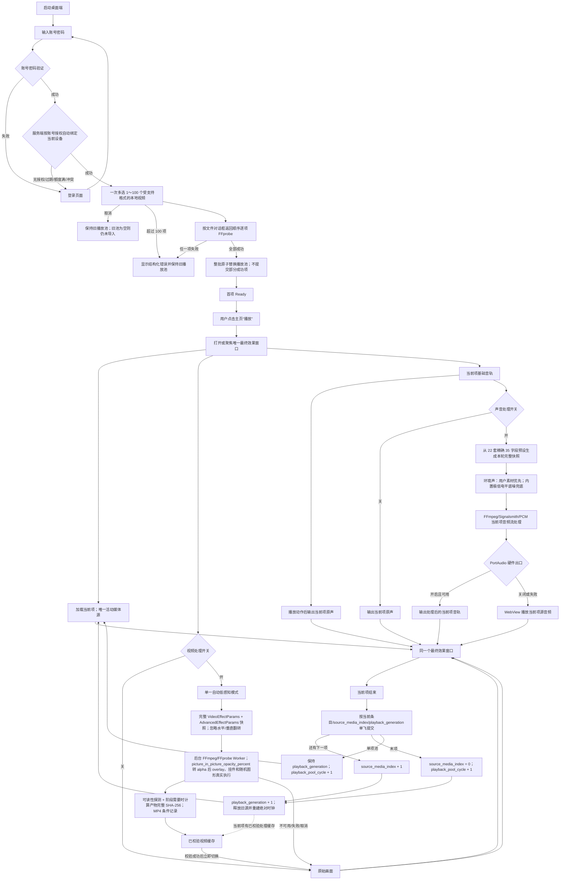
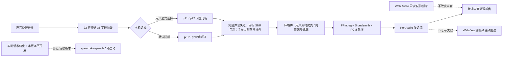
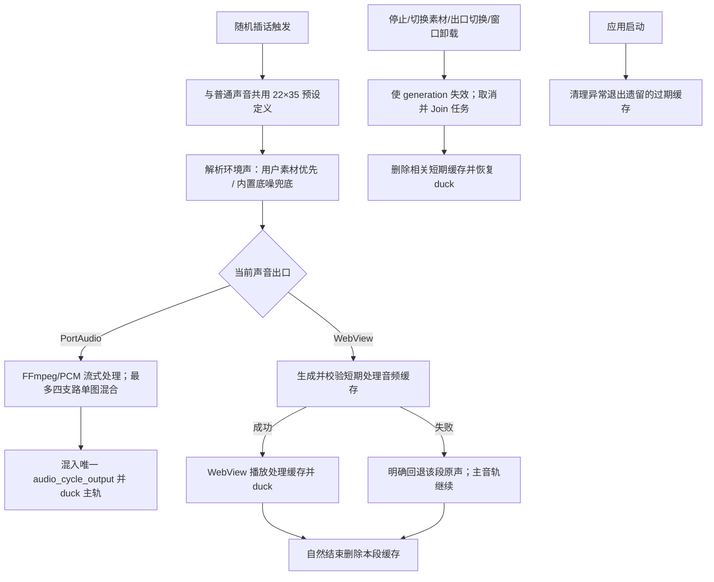
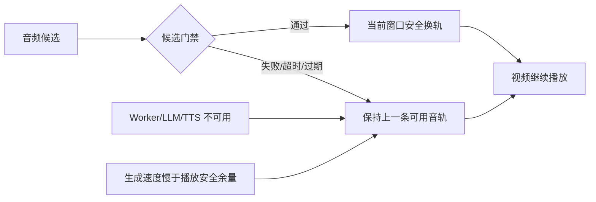
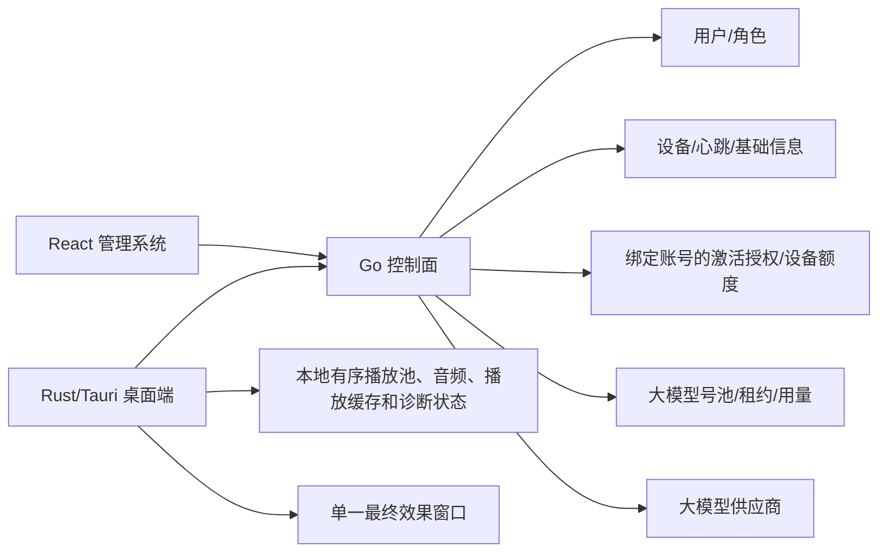

# 桌面端当前功能流程图

> 当前版本范围声明（2026-08-25）：本版本不开发实时话术幻化。speech-to-speech、VAD/ASR/LLM/TTS 和实时候选音轨换轨不进入当前流程、UI、验收或发布；相关节点仅可作为历史/后续版本参考。当前流程以视频单一自动低感知处理、普通声音处理、随机插话和固定话术系统朗读为准。

## 1. 产品边界

桌面端在当前进程内维护最多 `100` 项的本地有序播放池、一个持续存在的播放窗口和一个活动媒体源。播放池项来自用户一次多选的本地文件，不是 N 版本离线生成结果；不存在服务端媒体任务、生成版本队列或批量 MP4 合成。

## 2. 当前主链路

### 2.1 播放池状态约束

| 状态 | 语义 |
|---|---|
| `source_media_pool` | 最多 `100` 项，顺序等于文件对话框返回顺序；一次多选只有整批探测成功才原子替换 |
| `source_media_index` | 当前活动媒体源索引；项结束单飞推进，末项回 `0` |
| `playback_pool_cycle` | 从末项回到首项时递增；单项池每次回到自身时也递增 |
| `playback_generation` | 多项池切换到另一个活动媒体源时递增；旧代际事件、候选和计时不得影响新代际。单项池自循环保持该值 |
| 当前媒体绝对时钟 | 仅对当前 `playback_generation` 有效，换源后从新媒体 `0ms` 重建 |

播放池、路径、索引、池循环轮次和播放代际只存在当前桌面进程，不写入 LocalStore，也不在应用重启后恢复。当前不提供追加、重排或删除操作。

## 3. 当前开关的职责

| 开关 | 控制范围 | 关闭时行为 |
|---|---|---|
| 视频处理 | 一种自动低感知模式；除水平/垂直翻转外生成完整 `VideoEffectParams + AdvancedEffectParams` 快照，PIP/挂件/随机图形保持启用并以非零低值进入真实 FFmpeg 输出 | 使用当前可用画面 |
| 声音处理 | 普通源音轨由 FFmpeg 流式滤镜处理并优先送 PortAudio；PortAudio 关闭或失败时 WebView 回退源音频 | 不执行普通声音处理 |
| 实时话术幻化 | 本版本不开发；不提供入口、不启动 speech-to-speech Worker、不申请模型租约 | 后续版本/历史方案 |

视频处理和普通声音处理两个当前开关互不隐式联动。新播放池整批探测成功后不自动播放，首项保持 `Ready`；用户点击“播放”才打开/聚焦窗口并开始当前项源音轨播放。普通声音处理只处理当前项源音轨，换源时按新的 `playback_generation` 有界释放并重建；插话作为叠加层执行，固定话术使用本地系统朗读。本版本不生成或切换实时话术候选，不启动 speech-to-speech，不申请模型租约。

本地导入白名单为 `.mp4`、`.mov`、`.mkv`、`.avi`、`.webm`、`.m4v`、`.ts`、`.m2ts`、`.flv`、`.wmv`、`.3gp`。一次多选按对话框返回顺序限制为 `1～100` 项，取消、超限或任一项探测失败都保留旧池并显示错误，不做部分成功。声音面板将用户配置、只读诊断和 `disabled/configured/processing/ready/runtime/unavailable/failed` 状态分开；参数卡、诊断和周期状态只读，主页声音列的两个具名参数区可编辑。普通声音与随机插话共用 22 套精确 35 字段预设，`p01–p20` 为默认低感知池，`p21/p22` 仅显式参与；播放速度参加预设变换，`random_change_period_ms` 是预设外的全局调度结果。目标 SNR 的 `null` 显示“自动”。实时音频幻化参数本次不扩展。

FFmpeg/FFprobe 优先从内置 `embedded-runtime-resources` 使用，资源不完整时才走已校验的应用数据目录下载/安装；桌面 UI 不显示独立“运行资源”卡片，也不提供安装、取消、选择目录或清理资源按钮。依赖失败进入导入/处理错误链路。当前不承诺自动兼容预览转码。

### 3.1 普通声音处理的 FFmpeg 预览

该预览展示当前已映射参数、流式处理状态、PortAudio/WebView 实际出口和 `configured/processing/runtime/failed` 状态。参数修改后由 FFmpeg 预热新的源音频流候选；不生成处理音频 MP4。播放速度是 35 个预设字段之一并参加本轮变换；周期值独立于单套预设。Web Audio 仅提供只读诊断和普通源音频回退播放。

播放状态进入 `paused` 或 `stopped` 时，PortAudio 和 FFmpeg 音频混音任务按取消策略释放；当前可用视频处理缓存可以保留。实时话术幻化不属于本版本生命周期。

### 3.2 随机插话双出口与缓存生命周期

普通声音和随机插话共享预设定义、参数完整性规则和环境声解析入口，但分别持有选择状态与运行快照。当前插话使用启动时快照播放到自然结束；周期到期或配置变化只影响下一段，不中途换组。短期缓存不跨业务代际复用，不作为用户媒体资产或永久缓存。

## 4. 实时幻化失败链路（后续版本，当前不开发）

本节仅保留历史/后续版本参考。本版本不启动实时话术 Worker，不生成候选，不执行 VAD、ASR、LLM、TTS 或实时换轨；当前失败链路以普通声音处理回退 WebView 源音频为准。

## 5. 管理系统与桌面端边界

后台不接收视频文件、播放池内容或本地路径，不创建媒体任务，不展示版本数量或版本进度；Go 负责 OpenAI-compatible 模型账号登记、连通性测试、租约和调用摘要，但本版本桌面播放不申请实时话术租约、不调用模型。播放池、视频和音频内容全部保留在当前本地进程。

## 6. 正式媒体参数与非目标边界

参考图中的声音、视频、视觉频段、不可见水印、随机扰动、挂件和切片参数全部属于正式 `MediaEffectParams` 需求；当前播放状态必须区分“已实现并生效”“已有模型待接入”“正式需求但缺失”。旧独立报告 Worker、状态轮询和 IPC 已删除，禁止重新引入。当前仍不提供内容相似度、媒体鲁棒性、内容指纹、平台评分或检测规避结论。

## 7. 变更记录

- 2026-08-25：视频收口为一种自动低感知模式，除翻转外生成完整视频/高级快照，PIP 新增透明度并与挂件、随机图形一起进入真实 FFmpeg 输出。声音收口为 22×35 共享预设，`p01–p20` 默认低感知、`p21/p22` 显式可听，全局周期在预设外，目标 SNR 自动；环境声采用用户素材优先、内置底噪兜底。随机插话补充 PortAudio 流式处理、WebView 短期处理缓存、明确原声回退及缓存生命周期流程；实时话术幻化仍不属于当前版本。
- 2026-08-24：当前主链路由单源循环更新为当前进程内最多 `100` 项的本地有序播放池；一次多选整批探测成功后按文件对话框返回顺序原子替换，取消、超限或任一失败保留旧池，不提交部分结果。首项 `Ready` 后由用户点击播放，在单一最终效果窗口执行 `A→B→…→A`，单项池自循环；换源递增播放代际并按新媒体重建绝对时钟。播放池不上传、不持久化，不创建服务端媒体任务或生成版本队列。
