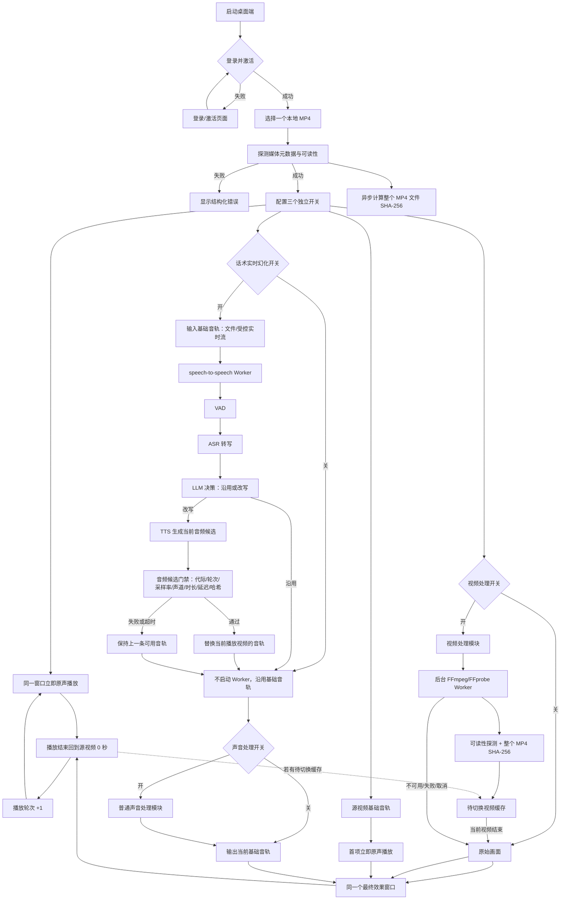
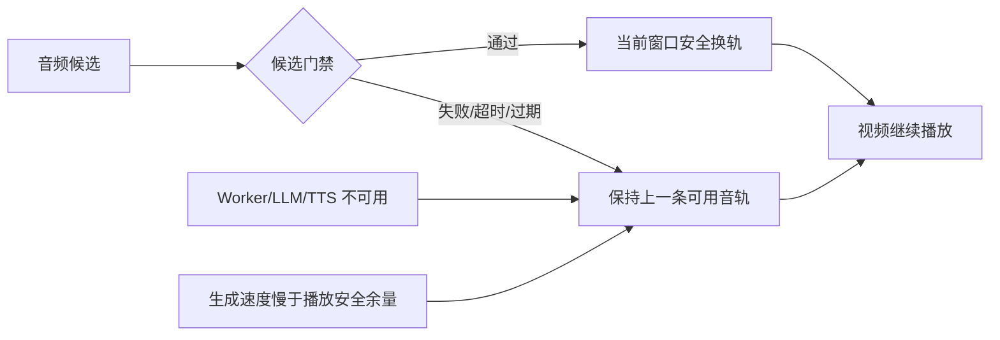
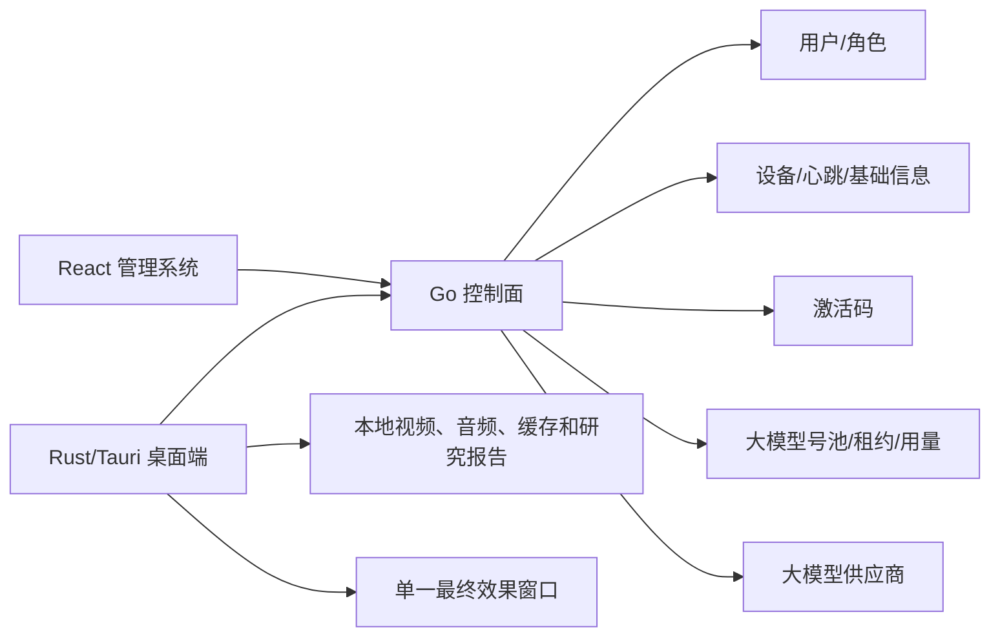

# 桌面端当前功能流程图

## 1. 产品边界

桌面端只处理一个本地源视频、一个持续存在的播放窗口和当前播放音轨。不存在 N 版本离线生成、版本队列、多视频顺序播放或批量 MP4 合成。

## 2. 当前主链路



## 3. 三个开关的职责

| 开关 | 控制范围 | 关闭时行为 |
|---|---|---|
| 视频处理 | 画面效果、视觉调制频段、视频挂件、后台处理缓存；经过 FFprobe 和整文件 SHA-256 后在循环边界切换 | 使用当前可用画面 |
| 声音处理 | 作用于最终当前音轨的音量、音高、均衡、混响、底噪、音频分析等普通音频能力 | 不执行普通声音处理 |
| 话术实时幻化 | VAD、ASR、LLM 沿用/改写、TTS 和当前音轨替换 | 不启动 speech-to-speech Worker |

三个开关互不隐式联动。首项源音轨立即播放；实时话术幻化只替换当前基础音轨，普通声音处理作用于最终当前音轨；候选失败、过期或来不及时保持上一条可用音轨，不生成新的 MP4，不暂停视频，不重新弹出窗口。

## 4. 实时幻化失败链路



## 5. 管理系统与桌面端边界



后台不接收视频文件，不创建媒体任务，不展示版本数量或版本进度；Go 负责 OpenAI-compatible 模型账号登记、连通性测试、租约和调用摘要，桌面端通过单账号直连租约直接调用模型，视频和音频内容保留在本地。

## 6. 研究分析支线

研究分析是独立的本地支线，不参与实时播放决策：

```text
当前源视频/当前处理缓存/当前音频候选
    ↓
完整文件 SHA-256（每个阶段之前计算）
    ↓
内容相似度分析
媒体鲁棒性实验
隐形标记研究
随机扰动实验
内容指纹对比
    ↓
本地研究报告
```

研究支线不连接直播平台，不提供平台审核或检测规避策略。
