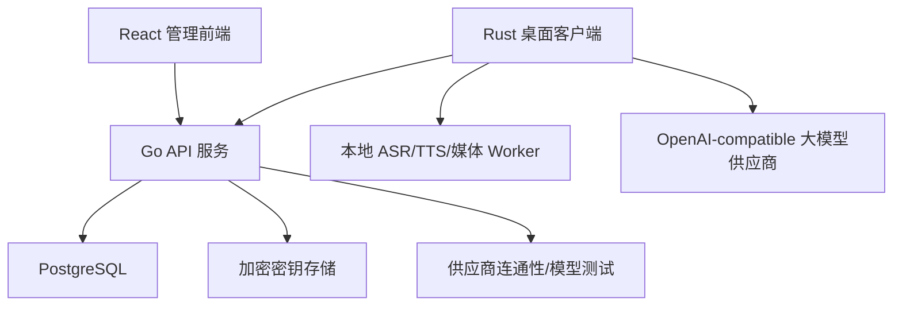
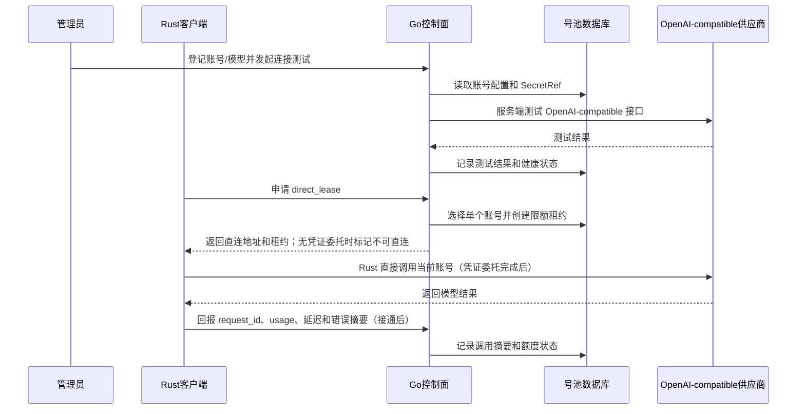

# 管理系统架构：Go 后端 + React 前端

## 1. 职责范围

管理系统是整个产品的控制面，首版只管理以下内容：

- 用户和角色
- 桌面设备
- 客户端激活码
- 大模型供应商和账号池
- 模型额度、租约和使用记录
- 审计日志

管理系统不负责本地视频处理、生成和展示；桌面端本地执行视频/声音处理、实时音频幻化和单窗口循环，Go 服务负责鉴权、设备、激活码、OpenAI-compatible 模型账号登记与测试、号池租约、额度、调用记录和审计。模型请求由 Rust 使用短期直连租约直接发送给供应商，Go 不转发话术内容。

## 2. 运行架构



首版采用模块化单体 Go 服务，不拆微服务。React 构建为静态资源，由反向代理或 Go 服务提供。

## 3. Go 后端架构

### 3.1 分层

```text
HTTP Handler
    ↓
Application Service
    ↓
Domain / Policy
    ↓
Repository
    ↓
PostgreSQL / Secret Store
```

数据库迁移和密钥字段边界见 [`数据库迁移与密钥存储约束.md`](./数据库迁移与密钥存储约束.md)。版本化迁移由独立 `backend/cmd/migrate` 命令执行；当前已接入 PostgreSQL `auth_sessions`、JSONB 快照 repository、模型账号/租约/usage/请求预占和 AES-256-GCM Secret Store。模型读源默认是快照，受控 PostgreSQL 环境可用 `APP_MODEL_READ_SOURCE=normalized` 验证模型账号/租约/usage/请求预占从规范化表恢复；上述规范化表当前仍处于迁移期双写，不等于完整生产模式，后续仍需领域写入 repository、并发和跨进程验收。

- Handler：路由、鉴权、参数校验、响应和错误码转换
- Application Service：编排登录、激活、设备、号池租约、OpenAI-compatible 账号测试、直连调用摘要和审计摘要用例
- Domain/Policy：权限、激活码、额度、并发、租约和模型调用状态规则
- Repository：数据库读写和事务边界；当前服务层通过 `store.Repository` 注入，开发期使用 `MemoryStore`，PostgreSQL 使用 `control_plane_state` 单行 JSONB 快照和行锁，作为后续领域 repository 的过渡层
- Secret Store：模型密钥的加密保存和读取；PostgreSQL 模式使用 `store.SecretStore` 的 AES-256-GCM SQL 实现，API 启动要求主密钥、数据库连通和迁移版本均通过校验；快照失败时对新 SecretRef 执行补偿删除
- 生产化限制：认证会话已使用 PostgreSQL `auth_sessions`；默认业务快照仍是读写事实源，模型域可受控切换到规范化读源并在加载时 fail-closed 校验。`users`、`devices`、幂等记录、激活码和审计日志仍未完成独立规范化 repository，真实 PostgreSQL 额度并发/故障集成测试和完整跨进程一致性仍未完成

### 3.2 目录边界

```text
backend/
  cmd/server/
  internal/
    auth/
    users/
    devices/
    activation_codes/
    model_pool/
    audit_logs/
    httpapi/
    storage/
    config/
```

各模块通过应用服务或明确的接口交互，不在 Handler 中直接访问其他模块的数据库表。

### 3.3 业务模块

#### Auth

- 用户名/密码登录
- 管理员和普通用户角色
- Access Token 和 Refresh Token
- 密码哈希存储
- 会话失效和退出登录

#### Users

- 创建、编辑、禁用用户
- 重置密码
- 查询用户设备
- 设置用户可用模型或额度

#### Devices

- 设备注册
- 设备绑定和解绑
- 设备心跳
- 设备基础信息
- 设备禁用和强制失效

#### Activation Codes

- 生成激活码
- 设置有效期和可绑定设备数
- 核销激活码
- 手动作废
- 查询核销记录

#### Model Pool

- 供应商管理
- 模型账号管理
- API Key 加密保存
- 账号状态：`active`、`cooldown`、`exhausted`、`disabled`
- 优先级、每日额度和并发限制
- 租约申请、续租、释放和超时回收
- 调用用量和失败记录

#### Audit Logs

- 管理员登录
- 用户变更
- 激活码生成、作废和核销
- 设备绑定、解绑和禁用
- 模型账号和租约变更

## 4. API 设计

### 4.1 管理端接口

```text
POST   /api/v1/auth/login
POST   /api/v1/auth/refresh
POST   /api/v1/auth/logout

GET    /api/v1/admin/users
POST   /api/v1/admin/users
POST   /api/v1/admin/users/{user_id}/disable

GET    /api/v1/admin/devices
POST   /api/v1/admin/devices/{device_id}/disable
POST   /api/v1/admin/devices/{device_id}/unbind

GET    /api/v1/admin/activation-codes
POST   /api/v1/admin/activation-codes
POST   /api/v1/admin/activation-codes/{code_id}/revoke

GET    /api/v1/admin/model-pool
POST   /api/v1/admin/model-pool
PATCH  /api/v1/admin/model-pool/{account_id}
POST   /api/v1/admin/model-pool/{account_id}/disable
POST   /api/v1/admin/model-pool/{account_id}/test
GET    /api/v1/admin/model-usage

GET    /api/v1/admin/audit-logs
GET    /api/v1/health
```

说明：当前默认内存模式已实现用户/设备/激活码、模型号池和租约最小开发闭环；OpenAI-compatible 账号连通性测试、Rust 直连调用摘要、健康/并发/额度派生状态已接入当前契约。PostgreSQL 模式已接入持久化 `auth_sessions`、JSONB 控制面快照、模型账号/租约/用量/请求预占影子写入和 AES-256-GCM Secret Store。禁用号池账号前若仍有活动租约，服务端返回冲突并要求先释放租约。当前 `direct_lease` 只返回 `direct_base_url`，未实现供应商凭证委托时 Rust 不得直连；自动健康探测/冷却、规范化模型读源唯一写入事实源和完整生产无状态仍按后续阶段补齐。

### 4.2 客户端接口

```text
POST /api/v1/client/activate
POST /api/v1/client/heartbeat
GET  /api/v1/client/profile

POST /api/v1/client/model-leases
POST /api/v1/client/model-leases/:id/renew
POST /api/v1/client/model-leases/:id/release
POST /api/v1/client/llm/call-records
```

统一错误格式：

```json
{
  "code": "DEVICE_DISABLED",
  "message": "设备已被管理员禁用",
  "request_id": "req_xxx"
}
```

## 5. React 前端架构

### 5.1 页面

```text
/login
/dashboard
/users
/devices
/activation-codes
/model-pool
/audit-logs
```

首版管理页面以用户、设备、激活码和号池为主。不在后台直接处理大视频、不实现媒体编辑器，也不通过 Go API 转发视频内容。

### 5.2 目录建议

```text
admin-web/
  src/
    app/
      router.tsx
      providers.tsx
    api/
      client.ts
      auth.ts
      users.ts
      devices.ts
      activationCodes.ts
      modelPool.ts
    features/
      auth/
      users/
      devices/
      activation-codes/
      model-pool/
    components/
    hooks/
    types/
    utils/
```

### 5.3 状态管理

- React Query：服务端数据、缓存、刷新、loading 和错误状态
- Context：当前登录用户和权限
- 页面本地 state：表单、弹窗、筛选条件
- 不提前引入复杂全局状态库

### 5.4 组件库约束

- React 管理端统一使用 Ant Design。
- 能使用 Ant Design 组件完成的功能，直接使用组件库，不重复实现同类组件。
- 不修改 Ant Design 组件内部样式，不覆盖 `.ant-*` 选择器。
- 页面级布局使用官方 Props、公开配置和外层容器完成；确实无法满足时先记录限制并确认。

### 5.5 页面状态要求

每个列表页需要覆盖：

- loading
- empty
- error
- permission denied
- retry
- disable/revoke confirmation
- operation success feedback

## 6. 数据模型

```text
users
  id, username, password_hash, role, status, created_at

devices
  id, user_id, name, platform, app_version, status,
  last_seen_at, disk_free_bytes, memory_total_bytes,
  memory_available_bytes, cpu_logical_cores, runtime_os_name,
  runtime_os_version, kernel_version, current_media, playback_state,
  created_at

activation_codes
  id, code_hash, status, expires_at, max_devices,
  used_by_user_id, used_by_device_id, used_at

model_providers
  id, name, base_url, status

model_accounts
  id, provider_id, model_name, encrypted_secret,
  priority, daily_limit, concurrency_limit, status,
  cooldown_until

model_leases
  id, account_id, user_id, device_id, status,
  expires_at, request_count, created_at

model_usage
  id, lease_id, request_id, input_tokens, output_tokens,
  latency_ms, status, error_code, created_at

audit_logs
  id, actor_user_id, device_id, action, target_type,
  target_id, detail_json, created_at
```

关键约束：

- 激活码只保存哈希，数据库不保存明文激活码
- 一个激活码只能完成一次有效核销
- 被禁用用户或设备不能申请模型租约
- 心跳和用量上报必须幂等
- 同一次用户操作的重试必须复用原 `Idempotency-Key`；请求语义或资源标识变化必须生成新 key，成功或用户取消后清理本地待重试状态
- 本地媒体源、处理缓存和研究产物在每个阶段前后记录完整文件 SHA-256；MP4 使用整个文件字节流计算，不上传原视频
- 账号达到额度或并发上限后不可继续分配

当前实现说明：号池账号支持 OpenAI-compatible `base_url`。Go 负责账号连通性测试、租约签发、调用摘要记录和额度状态；当前 `direct_lease` 仅返回允许访问的 `direct_base_url`，尚无供应商凭证委托时 Rust 不发起直连。测试和调用摘要均不记录 API Key、完整模型响应或音视频正文。当前源码仍保留早期服务端代理/请求预占兼容结构，属于待迁移历史实现，不得作为当前业务入口。

客户端重试说明：管理端新增号池账号、桌面端租约申请/续租/释放和直连调用摘要上报均在一次用户操作生命周期内复用幂等键。桌面端登录、Profile、激活、Heartbeat、租约操作互斥；已有活动模型租约时禁止切换登录账号，避免服务端租约失去本地释放引用；并通过会话代际丢弃过期响应。实时话术幻化使用当前会话申请的直连租约，调用摘要必须关联服务端返回的 `request_id` 和 `lease_id`，不能只凭客户端自报成功。当前摘要上报接口已存在，但 Rust 自动上报和可信租约注入尚未接通。

## 7. 大模型号池与直连调用

Go 负责登记和管理 OpenAI-compatible 模型账号，管理员可以在后台发起连通性测试。测试由 Go 服务端使用 Secret Store 中的密钥直接访问供应商，记录 `success/failed`、HTTP 状态、延迟、模型响应摘要和错误码；测试请求不得进入桌面端，也不得把 API Key 写入响应或日志。

Rust 运行时不经过 Go 模型转发层，而是先申请一个短期、单账号、限额、可回收的 `direct_lease`。当前租约只返回 `direct_base_url`，没有供应商凭证委托时 Rust 不发起模型直连；租约过期、撤销、账号被禁用或缺少可用凭证时，停止新的模型请求并回退当前可用音轨。



这样完整 API Key 和完整号池不会进入客户端。直连租约必须绑定用户、设备、provider、model、用途和过期时间；Rust 不得自定义上游地址、切换账号或绕过租约。客户端回报的 usage 默认标记为 `client_reported`，不能在没有供应商权威回执时宣称为最终计费结果。

## 8. 安全与审计

- 服务端接口使用 HTTPS。
- 密码使用强哈希算法保存。
- 激活码只保存哈希值，展示明文只发生在生成后的单次响应。
- 模型 API Key 加密存储，并限制到模型池服务读取。
- Token、API Key、激活码和个人信息不写入普通日志。
- 用户、设备、激活码、模型账号的变更写入审计日志。
- 设备信息遵循最小采集原则，不默认采集 MAC、硬盘序列号、摄像头、麦克风或用户目录。

## 9. 部署与验证

```text
开发机/CI
  ├── 构建 Go 二进制
  └── 构建 React 静态资源

服务器
  ├── Go 二进制
  ├── React 静态资源
  ├── PostgreSQL
  └── 加密配置/密钥服务
```

服务器不拉取源码、不安装依赖、不执行构建，只部署发布产物。

验证重点：

- Go：登录、权限、激活码状态、设备禁用、心跳、模型租约和额度集成测试
- React：类型检查、构建、主要页面冒烟以及 loading/empty/error/无权限状态
- 联调：创建用户 → 客户端登录 → 激活设备 → 后台查看设备 → 请求模型租约
