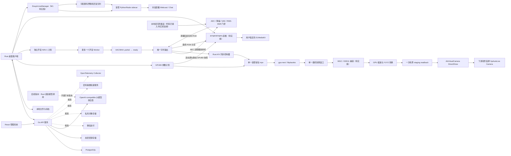

# 系统技术架构总览

> Rust 视频周期唯一所有者（2026-08-31，代码与非媒体自动化完成，待真实媒体验收）：React 只通过 `configure_realtime_video_cycle` 提交参数基线和周期范围，并通过明确的 Rust 播放意图执行播放、暂停与 seek；Rust runtime actor 独占确定性 N/N+1/N+2 队列，以 mpv `presented_pts_ms` 和实际 FPS 判断到期。换源、loop 和新 generation 先发布 `source_transitioning`，原子中性化并清除旧队列、旧 FPS、旧指纹，观察到新源物理事实后再建队列。GPU 提交采用 `Applying → ReadbackConfirmed → PresentedConfirmed → Active`，SHA-256 指纹、两个 24-bit shader 标记、完整选项读回和下一呈现帧必须全部确认；软超时为 `result_unknown`，硬超时先重建同后端且只重放最后确认 N。Rust 发布严格递增 `status_revision`，React 维护 last-observed/effective 双状态并 fail-closed。WebView 的 100ms 调度、`document.visibilityState`、`sourceAudio.currentTime`、视频 `prepare/commit/sync` 均不再拥有推进权；更早的 WebView 视频调度描述仅作历史审计。声音周期仍独立，真实 MP4/TS 后台、故障注入与长稳仍待验收。详细边界见 [`Rust 视频周期唯一所有者实施方案`](./docs/superpowers/plans/2026-08-31-Rust视频周期唯一所有者实施方案.md)。

> 音画稳定性契约收口（2026-08-30，代码及聚焦测试完成、待用户真实媒体验收）：桌面执行面以 `playback_generation + source_path + loop_index + source_duration_ms` 作为统一媒体段身份，跨循环 `presentation_pts_ms` 与单文件 `source_pts_ms` 分开建模；PortAudio 可听时钟可携带二者，但 mpv 只接收合法 source-local PTS。播放态循环边界为 `Seek → SetPause(false)`，暂停态为 `SetPause(true) → Seek`；无效身份、换算失败或越界 PTS 只停用同步纠偏并恢复基础速度，不触发视频后端降级。React 视频同步采用单 IPC 在途与 latest-wins pending，`busy` 按 `100/250/500ms` 有界退避，`result_unknown` 先查 Rust 状态，`stale` 刷新最新 desired；Rust 提供稳定错误分类及健康 GPU/CPU4 的 Original 防覆盖门禁。同步路径的 mpv `IpcTimeout` 返回 `result_unknown` 并保留会话供状态确认/幂等重试，`IpcDisconnected`、断管和进程退出仍按既有单向降级。普通声音候选 `prepare` 移出 Tauri 主线程的调度代码与聚焦检查已完成，只调整调度位置，不改变声音 DSP、候选格式、PortAudio、插话、固定话术或混音语义。本轮只覆盖 1080p 目标，未执行真实媒体、多文件、1080p60、4K 或长稳门禁，不能写为无卡顿或音画同步已保证。

> 视频处理开关同会话修复（2026-08-30，代码完成、待用户实测）：当前实现已将逻辑 `Source/Original` 与 mpv 物理启动模式分离。在同一源、同一 playback generation、同一宿主 HWND、进程存活且物理模式仍匹配当前 fallback floor 时，关闭视频处理由 runtime actor 在现有 mpv 上写入 GPU 中性 shader 或 CPU4 四项中性值并清除视频周期计划；再次开启后复用同一 PID 提交后续周期快照，不再仅因开关切换执行 surface suspend、重新 seek 或重建视频表面。首次建立会话、进程不存在/退出/丢失、换源或播放代次变化、宿主 HWND 变化、物理模式与 fallback floor 不匹配，以及导致会话失效的 GPU、设备或 IPC 故障降级、显式停止或关窗，仍允许先回收旧进程再创建或重启；普通周期更新不允许重启。GPU 自动周期当前仍仅准入 `79/83`（61 项 shader + 18 项受限 PTS 调度），剩余 4 项继续 fail-closed，CPU4 仍为 `4/83`。本批未运行真实视频，未实施或验收 4K，也不代表无卡顿、长稳或跨 GPU 验收通过；本修复未修改普通声音 DSP、声音候选、PortAudio、插话、固定话术或混音，最终效果和开关流畅性待用户实测确认。

> 条件帧指标与候选身份恢复（2026-08-30，代码完成、待用户实测）：runtime 将 mpv `mistimed-frame-count`、`vo-delayed-frame-count` 建模为可选时序计数；`PropertyUnavailable` 只产生 `None`，不进入帧预算观察失败 streak，重新可用后只比较连续有效样本。VO/pass/drop 等核心事实与真实 IPC 故障仍按三个连续窗口单向降级。React 对三类 stale 视频错误先隔离旧 owner 和迟到响应，再并行刷新权威播放快照与后端状态，成功后清空旧计划并重新唤醒调度，刷新失败继续使用既有有界退避。本项不改变声音域、参数能力、4K 范围或实机验收结论。

> 首帧准入时序（2026-08-30，代码完成、待用户实测）：受管 mpv 进程固定暂停启动以避免 IPC 建立前失控播放；命名管道连通后先恢复权威播放/暂停状态。播放态 GPU/CPU4 以 VO、视频时间线、解码器和至少一个真实 `vo-passes` 样本准入；暂停态不要求 pass 样本，只验证 VO、PTS 与解码器，恢复播放后继续由既有运行健康观察器验证 pass 与帧预算。Original 仍不以 shader/pass 声称效果生效。该边界消除“暂停启动却等待渲染计数”的 CPU4/GPU 假降级，不改变声音域、参数能力或 4K 范围。

> 视频后端失败闭环（2026-08-30，代码及非媒体验证完成、待用户实测）：runtime 的状态合同明确区分 `Stopped/Available`、GPU/CPU4/Original 活动会话和 `Source/Failed` 全失败终态；可用或活动后端必须具有真实 mpv PID，全失败终态不得再进入 HWND 验证。错误摘要统一有界脱敏，suspend 保留播放身份、真实 fallback floor 和最多五条降级历史。GPU 候选按能力而非厂商固定为 `D3D11 零拷贝 → D3D11 copy → Vulkan/WinVK copy → GPU+软件解码`，再进入 CPU4 和 Original。React 保留最后有效状态，分别投影 IPC 与 DTO 故障，并在 prepare/commit 的非法响应或终态上对称释放候选，消除永久“候选处理中”。本项不改变声音域、不扩大 `61/83` 与 CPU4 四项，也未执行真实视频或 4K 验收。

> 原生表面 Z 序边界（2026-08-29，代码完成、待用户复验）：现场黑屏的直接原因不是 mpv 解码或 IPC 失败，而是 WebView2 child HWND 在同一父窗口内覆盖了专用视频宿主。宿主只在当前受管 mpv PID 已创建可见、非零视频子窗口后由 Tauri 主线程提升到父窗口子 Z 序顶部；启动失败不提升，窗口 resize 时重新验证 PID 子窗口后再重申 Z 序。提升失败按视频表面未就绪处理并回收会话。该事实不能替代 1080p60、EOF、重开或长稳门禁。

> 当前视频目标架构（2026-08-28，最高优先级）：视频由常驻 mpv 播放器和其 `gpu-next/libplacebo` 渲染器连续处理与呈现；Windows 首选 D3D11/D3D11VA，Vulkan/WinVK 为第二 GPU 路径。周期只原子更新 GPU83 参数快照，不再生成视频 period、重编码文件或 MSE 分块。GPU83 失败后按会话单向降级到 libavfilter CPU4，再失败保持 Original；CPU4 只执行亮度、对比度、饱和度和色相。详细边界以 [`mpv/libplacebo 实时 GPU 主链实施方案`](./docs/superpowers/plans/2026-08-28-mpv-libplacebo实时GPU主链实施方案.md) 为准。

> 删除声明：旧视频 MSE、SourceBuffer、period、分块 IPC 和逐周期视频 Worker 已从生产代码移除；普通声音 N/N+1、PortAudio、插话和固定话术继续有效。
>
> 实施状态（更新至 2026-08-31）：受管 mpv 持久 IPC、受控 libplacebo hook、GPU83 精确映射和 WebView 配置→Rust actor 独占推进的正式周期入口已落地；旧视频 MSE/period/逐周期 FFmpeg 生产代码与权限已删除。Phase 3A v6 的 D3D11/Vulkan 精确 1080p 门禁已通过 61 项 shader，第二阶段接入 18 项受限 PTS 调度，开发自动周期能力为 `79/83`。两项颜色候选已定义但因外部 JSON IPC 跨属性更新无法证明帧级原子、完整开关语义和 HDR/驱动合同未通过而继续 `Unavailable`；两项跨帧历史也继续不可用。GPU 重建会在暂停态重放最后活动 shader 快照后再恢复播放。Phase 4/6 已完成降级、EOF、表面仲裁、周期控制权后移和 shader 读回确认代码接线，但仍待 1080p 综合实机门禁，不表示无卡顿。Phase 5 已接入带完整身份的 PortAudio 可听 PTS、25Hz 发布和 mpv 闭环控制，并把实际音频播放速率纳入唯一视频速度；普通声音处理、候选、插话、固定话术和混音语义未改变。真实联合媒体和长稳仍未完成，4K 不在范围。
> 测试可用性状态（2026-08-30）：可听 PTS 在视频读取侧按快照年龄和实际播放速率外推，乱序样本不会提前切换同步身份。测试包使用独立 debug target、应用标识和输出目录，NSIS、portable 与隔离安装启动通过并固定连接测试控制面；它复用当前开发资源，不改变正式供应资产或正式发布 fail-closed 状态。
>
> 故障状态补充（2026-08-29）：受管 mpv 的有界、脱敏 stderr 已进入唯一 runtime actor；明确的 shader/hook、VO/图形 API 初始化失败和设备丢失码会在启动或运行阶段形成真实降级原因，音频错误及正常渲染描述不会触发视频降级。非媒体状态矩阵已覆盖七类故障/竞态，但真实硬件故障恢复、黑屏和 P99 仍待 1080p 实机门禁。
>
> 开发端首启修复（2026-08-29，待用户实测）：无既有视频会话时的 surface suspend 不再推进调用方不可见的 backend epoch；已有会话挂起发布 `Available + Stopped` 和完整身份。处理开关原子返回播放快照与权威视频状态，同一播放时钟身份的永久 prepare 失败会熔断 100ms 候选重建，瞬时状态读取失败保留最后有效 epoch。该批按用户要求未运行测试，未修改声音功能，不构成 1080p60、同步或无卡顿验收。
>
> mpv IPC 与原生宿主边界（2026-08-29 基线，2026-08-30 同步超时语义补充）：Tauri/WebView2 顶层窗口只作为专用 Win32 child 视频宿主的父窗口，mpv `--wid` 使用严格 `uint32_t` 合同。mpv 启动后按 PID 枚举宿主窗口树，只有找到可见、非零客户区且祖先属于专用宿主的视频子窗口才允许命令返回成功。Windows 命名管道由单一 worker 独占并串行完成写、刷新和响应读取；事件可穿插，响应必须匹配当前 `request_id`。启动、健康观察和普通控制超时仍毒化并回收会话；仅同步命令确认超时返回 `result_unknown` 并保留会话，等待状态确认或幂等重试。`IpcDisconnected` 等已确认断链仍按原降级，只有精确的属性暂不可用响应允许常规重试。首帧查询共享 `5s` 总预算，运行态继续使用短预算。该项不触碰声音功能、不包含真实媒体或 4K 验收。
>
> 音轨时间窗门禁（2026-08-27）：FFprobe 导入结果携带相对容器时间轴的 `[audio_start_ms, audio_end_ms)`。声音计划器和 Rust 命令在创建 Worker 前共同判断候选窗口；完全落在容器无声头尾的候选静默跳过，部分相交继续处理。多项池不得把当前源无声尾部绕回本源，单项池才允许按源时长周期判断。该门禁只避免无意义补零产物，不改变 `volumedetect` 对真实静音内容的校验。

> 当前版本范围声明（2026-08-31）：本版本不开发实时话术幻化。麦克风插话已完成本地 PortAudio full-duplex、锁定 SpeexDSP AEC/NS/AGC/VAD、末端门控和 Tauri/UI 接线，真实 Windows 声学门禁仍待完成；ZLMediaKit RTMP/RTMPS GPU 直推和 AkVirtualCamera GPU 辅助虚拟摄像头输出仍属待实施正式需求。RTMP 不捕获窗口；虚拟摄像头是独立本地链，只捕获本应用最终效果 HWND，由 WGC/D3D11 在 GPU 上处理后一次有界回读到 AkVirtualCamera CPU raw 边界，明确不是零拷贝。三项能力均不经过 Go，未完成各自真实门禁前不得声称已生效。

本项目拆成两个独立架构域：

- [管理系统架构](./管理系统架构.md)：Go 后端 + React 管理前端
- [桌面客户端架构](./桌面客户端架构.md)：Rust + Tauri 桌面端
- [桌面端功能流程图](./桌面端功能流程图.md)：历史流程图，仍含已废止的视频 FFmpeg N/N+1 描述；在单独同步前不得作为当前 mpv 或虚拟摄像头架构依据
- [媒体参数范围与默认值](./媒体参数范围与默认值.md)：跨桌面端 UI、Rust 和本地媒体 Worker 的参数契约
- [参考图参数对比与正式化清单](./参考图参数对比与正式化清单.md)：参考图 1–5 的参数识别、当前实现分级和依赖建议
- [媒体参数与本地阶段能力契约](./docs/superpowers/specs/2026-08-12-媒体参数与本地阶段能力契约.md)：历史参数/阶段方案快照，不作为当前类型或 IPC 契约
- [实时音频幻化与循环播放方案](./实时音频幻化与循环播放方案.md)：历史/后续版本方案；本版本不开发实时话术幻化
- [麦克风插话与插话文件入口实施方案](./docs/superpowers/plans/2026-08-30-麦克风插话与插话文件入口实施方案.md)：当前麦克风插话、PortAudio 全双工、SpeexDSP AEC/VAD、数字静音、资源生命周期和实机门禁的唯一实施入口；代码已接入，实机门禁待完成
- [ZLMediaKit RTMP GPU 直推实施方案](./docs/superpowers/plans/2026-08-30-ZLMediaKit-RTMP-GPU直推实施方案.md)：用户输入完整 RTMP/RTMPS 地址、音画轨道选择、直接源处理、GPU 编码降级、最终 PCM 分流、会话生命周期和真实 ZLMediaKit 门禁的唯一实施入口；初版代码已接入，真实门禁待完成
- [AkVirtualCamera GPU 虚拟摄像头实施方案](./docs/superpowers/plans/2026-08-30-AkVirtualCamera-GPU虚拟摄像头实施方案.md)：WGC/D3D11 GPU 捕获和转换、AkVirtualCamera CPU 边界交付、DirectShow 兼容、GPL/安全/签名和下游矩阵的唯一实施入口；尚未实施
- [服务端商业化与生产就绪扩展 PRD](./tasks/prd-server-commercial-production-readiness.md)：Phase 2 RBAC 与 React 权限壳已交付；订阅/订单/支付、可信制品、公共配置 Schema 和生产运维仍为后续专项
- [douyin-desktop 接入 autoLive 多产品控制面 PRD](./tasks/prd-douyin-desktop-control-plane-integration.md)：Phase 1 产品硬隔离与管理范围基线已实现；Profile 新鲜度、模型认证、固定 OpenAPI 制品与跨仓库 E2E 仍未实施
- [服务端与桌面端登录安全加固实施计划](./docs/superpowers/plans/2026-08-26-服务端与桌面端登录安全加固实施计划.md)：2026-08-26 已完成主体实现、本地自动化和 Docker PostgreSQL 16 真库验证；Windows Credential Manager、正式 HTTPS/DNS/TLS、多主机与 Race 验收待补
- [mpv/libplacebo 实时 GPU 主链实施方案](./docs/superpowers/plans/2026-08-28-mpv-libplacebo实时GPU主链实施方案.md)：当前视频播放、GPU83、CPU4、Original、PortAudio 同步和旧链迁移的唯一实施入口

## 总体边界

### 管理系统负责

- 用户、角色和登录
- 桌面设备、激活码和设备状态
- 大模型供应商、账号池、额度和租约
- 审计、错误码和运营数据
- 通过受 ACL 保护的 `/metrics` 提供低基数 HTTP 与 PostgreSQL 连接池运营指标；不把该端点作为公网业务入口
- 对外提供版本化 API

### 桌面客户端负责

- 用户登录和设备激活
- 本地设备信息采集
- 心跳和运行状态上报
- 本地有序播放池、单窗口播放和顺序循环；文件选择或系统文件拖放按返回顺序导入。新增候选全部探测成功后才原子替换、追加或替换单项；既有条目支持重排、删除和清空。不生成永久版本，视频周期也不生成临时媒体文件。
- 独立视频处理开关：承载正式 `VideoEffectParams` 和 `AdvancedEffectParams`；除水平/垂直翻转外的 83 项以单一快照进入 mpv `gpu-next/libplacebo`。真实帧调度类参数由 mpv 执行，不用 shader 时间变量伪造。
- 独立声音处理开关：承载正式 `AudioEffectParams`，包括自然动态、本地音色 ID、随机周期、音高、增益/响度、速度、均衡、降噪/环境声、真实环境声第二输入、干湿比、淡入淡出、混响、底噪、采样率、码率、MFCC、SNR、共振峰、频谱/相位/高频扰动等；基础/频域效果由 FFmpeg 执行，音高/共振峰偏移由 Signalsmith Stretch 执行，MFCC/SNR 由 realFFT/rustdct 与滚动 RMS PCM 处理器执行，波形/频谱/响度/噪声底/MFCC/SNR/LPC F1/F2/F3 属于最终混音只读诊断
- 环境声第二输入采用双来源门禁：`ambient_sound_mix_percent = 0` 时不加载第二输入；值大于 `0` 时默认解析随包内置真实环境声，用户本地素材可选且优先覆盖。用户素材和随包素材都必须通过授权路径/受控资源路径、格式白名单、可读性和 FFmpeg 实际解码验证；失败保持原声并返回可恢复错误
- 插话文件和固定话术系统朗读：在当前播放窗口内按各自规则叠加或朗读
- 麦克风插话（代码已接入·待实机验收）：用户显式开始监听后，本地 PortAudio 全双工采集经 SpeexDSP AEC、降噪、AGC、说话活动门控和原始输入 RMS/SNR 门控；说话期间主媒体数字静音，只保留清理后的麦克风声音。音频不录制、不上传、不调用模型，详细边界以专项实施方案为准
- ZLMediaKit RTMP/RTMPS 直推（正式需求·待实现/未接入）：用户输入完整发布地址，默认同时发布画面和声音，也可仅选其一；视频直接读取当前活动源并在独立 FFmpeg 发布链复用 libplacebo/GPU83 静态快照与硬件 H.264 编码器探测，声音从最终 PCM 总线分流为 AAC。不得捕获桌面、最终效果窗口或 HWND，Go 不进入媒体路径
- AkVirtualCamera 虚拟摄像头（正式需求·待实现/未接入）：只捕获唯一最终效果 HWND，WGC/D3D11 负责非 WARP GPU 捕获、缩放和 YUY2 `1280×720@30fps` 转换；一次 staging readback 后由独立 GPL sidecar 交给 AkVirtualCamera DirectShow。它不写物理摄像头、不进入 Go，也不创建第二 mpv 或第二解码链
- 抖音直播弹幕随机自动回应（正式需求·待实现/未接入）：M1 只允许单账号、单房间扫码登录，读取 `WebcastChatMessage`，过滤本账号回显和重连重放，从本地 `1～100` 条回复池随机选句，经用户可配置的 `10～5000` 有界队列和单发送 Worker 串行发送。队列满时丢最旧未发送任务，等待超过 `60s` 丢弃；抖音凭据只存本进程内存，重启重新扫码。链路使用受管 sidecar 和匿名管道，不进入 Go、数据库或模型号池
- 单一持久弹窗预览和最终效果展示；视频事实源是受管 mpv 实际会话状态与已呈现帧，普通声音事实源仍是当前 N 音频。最终窗口禁止 CSS Filter/Transform 视频叠加。
- 正式媒体参数统一收敛到 `MediaEffectParams`，使用 `get_default_media_effect_params` 和 `validate_media_effect_params` 读取默认值与校验；旧报告 Worker/IPC 已移除，不得重新引入
- 不提供独立算法报告、内容相似度、媒体鲁棒性、内容指纹或平台检测规避结论；不可见水印和随机扰动仅作为普通媒体效果需求管理
- 离线播放和本地状态保存
- 通过 Go 管理控制面账号、租约和审计；本版本桌面播放不因实时话术幻化调用 OpenAI-compatible 大模型

## 跨系统约定

- API 前缀统一为 `/api/v1`。
- OpenAPI 是 Go、React、Rust 之间的接口契约来源。
- 后台和桌面端复用同一身份事实源，但必须签发不同 audience 的会话：管理端为 `admin`，桌面端为 `desktop`。会话 audience 是服务端授权边界，不由前端角色显示替代。
- 激活码由后台生成，创建时绑定一个产品内账号、有效期和 `1～100` 台设备额度；逐设备绑定事实由独立绑定表保存。同一设备重复登录不重复占额，管理员解绑释放额度，禁用设备保留额度。
- 桌面端只提供账号密码登录，不显示、保存或提交激活码。账号名可以在用户显式选择后作为普通本地偏好保存；登录密码不得持久化。Refresh Token 由 Rust 通过系统 Keychain/Credential Manager 独占保存、读取、轮换、恢复和删除，不返回 WebView。任何自动恢复都不构成设备授权证明。
- 工作台入口的唯一放行条件是当前登录会话有效且 Go 服务确认当前设备对应的 `user_id + device_id` 已获得未过期账号授权。Refresh 恢复、历史 profile、本地 `activated` 缓存或已记住凭据均不能单独放行；`ACCOUNT_ACTIVATION_REQUIRED`、`ACCOUNT_ACTIVATION_EXPIRED`、`DEVICE_LIMIT_EXCEEDED`、`DEVICE_BINDING_CONFLICT`、`DEVICE_DISABLED` 或状态无法确认时，桌面端停留登录门禁并保留稳定错误码。已经进入工作台后的网络中断仍按既有离线播放规则处理。
- Go 服务不代理本地视频内容。
- ZLMediaKit 由用户自行部署和管理；桌面端只向用户输入的完整 RTMP/RTMPS 地址直接发布。目标地址不进入 Go API、数据库、审计正文或普通日志，错误和状态必须脱敏；开始、停止、失败、换源和退出由 Rust 单一会话所有者有界回收。
- 模型 API Key 只保存在 Go 的 Secret Store；桌面端不获取完整号池。当前 `direct_lease` 只返回账号允许的 `direct_base_url`，没有供应商委托凭证时客户端不可直连并回退。
- 视频播放断网可继续；登录、账号授权设备绑定、租约申请/续租需要网络；后续版本如启用模型直连，失败也不得阻塞本地播放器。
- 本地播放状态在内存中维护有序播放池、当前索引、播放池循环轮次和当前媒体代际；任意时刻只有一个活动媒体源，原视频不被无提示覆盖。播放池只存在于当前桌面进程，不上传 Go 控制面，也不跨应用重启恢复。
- 当前目标主流程是 `选择或拖入媒体 → 全量探测并原子更新播放池 → 用户点击播放 → 启动或复用受管 mpv 会话 → 加载源 → 周期原子更新 GPU83 参数 → 顺序换源并循环`。纯音频项不创建 mpv 视频会话。
- 视频域只有已呈现快照 N、已验证待目标 PTS 提交的 N+1，以及只保存参数/目标时间/随机种子的 N+2；三者都不创建视频文件或编码进程。声音域继续使用独立 N/N+1 候选。
- mpv 视频输出始终无声，PortAudio 或兼容 dry audio 出口负责唯一可听主轨；Rust 同步控制器以可听 PTS 与 mpv 已呈现 PTS 做闭环校正。
- 音画闭环只接受同一 `playback_generation + source_path + loop_index + source_duration_ms` 的观测。跨循环 presentation PTS 用于状态和计划，单文件 source-local PTS 用于 mpv；播放态/暂停态边界分别使用 `Seek → SetPause(false)` 与 `SetPause(true) → Seek`，无效或越界音频时钟不得推动视频降级。
- React→Rust 视频同步是单在途、latest-wins 协议；busy 只做有界退避，结果未知先查状态，stale 先刷新最新 desired。同步确认超时保留会话，明确断链才进入原有 GPU→CPU4→Original 单向降级。
- 候选先写入 `.partial`，FFmpeg 正常退出后使用 FFprobe 校验时长、可解码流、时间戳和必要音轨，再原子改名为 `.ready`。未通过校验的文件不得进入播放器。
- 普通声音 `.partial` 已通过 FFprobe 后，只有 `volumedetect` 暂缺有效 `max_volume` 才在同一声音 Worker 内对同一产物自动重试内容探测 `2` 次（总尝试最多 `3` 次），共享原 deadline/取消令牌且不重复编码。stderr 保留末尾摘要；静音、取消、超时、参数错误、FFmpeg 非零退出及其他不可读错误不重试。恢复保留当前声音 N，不改变视频 N/N+1/N+2 的 sequence、队列、进度或 Worker；耗尽后报告声音候选失败并清理暂存。
- Worker 内同一暂存产物的内容探测重试与声音候选恢复相互独立：声音候选最终失败后不重复使用已清理产物，而是在保持当前 N 的前提下按 `1/2/4/8/15s` 最多五次自动重建新候选，第六次连续失败才等待人工重试。视频周期不再存在前端 apply 调度；Rust actor 在唯一 IPC owner 内按 mpv PTS 排空到期计划，并在写响应与 shader 精确读回确认后才晋级 N。
- 最终效果窗口只持有一个 mpv 视频表面；周期边界不切源、不重建视频表面。声音 A/B/PortAudio 保持独立。
- 临时文件按 session/generation/candidate 建立租约。停止、换源、关闭、崩溃后的下次启动均清理；正常运行上限为 N 与 N+1 两份，文件占用导致删除延迟时最多保留一份待删项并重试，禁止无界增长。
- 视频由一个 Rust 会话所有者监督常驻 mpv，声音由独立监督器管理 FFmpeg/FFprobe 候选。两者都必须纳入 Windows Job Object，持有取消令牌、退出超时、有限 stderr 尾缓冲和可等待的 JoinHandle；mpv 另外必须使用持久有界 JSON IPC。
- CPU/线程预算由 `available_parallelism` 和运行探针决定：预留至少一个逻辑核，软件编码线程上限为 `min(8, max(1, logical_cores - 1))`；候选构建单飞，解码/滤镜/编码不再各自无界扩线程。编码器按 NVENC → AMF → QSV → Media Foundation → 软件编码实际启动探测并缓存本机可用结果，兼容 Intel 和无独显电脑。
- 最终效果窗口只负责声音/WebView 兼容时钟观察和状态展示；视频周期健康与推进由 Rust runtime 直接观察同身份 mpv `presented_pts_ms`。排除暂停、seek、切源和加载宽限后，mpv PTS 停滞由 Rust 看门狗处理；WebView 音频缓冲或不可播放只能冻结声音候选/同步校正，不能冻结视频 N/N+1/N+2。两域均不得使用墙钟伪造媒体位置。
- 播放控制命令与媒体引擎事件分层：主页显式“播放/暂停/继续/停止”是 Rust 播放状态的唯一用户意图入口；mpv 内部缓冲、降级和声音槽 pause/load 不能反向提交用户暂停。
- 条目结束边界由 mpv 严格布尔 EOF 事实单飞提交；该事实绑定 generation/backend epoch/clock epoch/loop，暂停态不发布或消费。后端按 `(source_media_pool 当前条目, source_media_index, playback_generation)` 幂等确认下一项。换源递增 generation、建立新同步 epoch，并清理旧声音候选；单项池保持 generation 并递增池循环轮次，等待新轮次状态期间保持原生表面。
- 仓库中可能存在早期媒体任务、版本计划和阶段 Worker 的历史实现；它们不属于当前架构入口，新功能不得依赖或扩展，代码删除需另行执行迁移清理。
- 本版本不连接 speech-to-speech、ASR/LLM/TTS，不申请实时话术模型租约，不生成候选话术音轨，也不执行 `realtime_variant` 换轨；唯一 VAD 例外是麦克风插话的本地有人声/无人声门控，禁止扩展为内容识别、转写、话术改写或变声。普通声音处理统一写入 N/N+1 临时媒体文件的音轨；高质量音高、播放速度、共振峰偏移、MFCC 偏移、MFCC 维度、SNR 浮动、频谱盲区、干湿比和环境声混合参加普通声音周期随机化，桌面 UI 只展示当前值。
- 媒体处理仅在明确启用对应哈希链路时对源文件或产物计算完整字节流 SHA-256；旧阶段报告不属于当前播放契约，正式参数调度所需随机种子仅作为内部可复现信息。
- 本地预览的视频效果仍由 mpv 解码、`gpu-next/libplacebo` 实时渲染和呈现，周期边界不编码。独立 RTMP/RTMPS 发布按专项方案由 FFmpeg 直接读取活动源并编码，不复用或捕获预览窗口；FFmpeg/FFprobe 的其他既有职责不变，仍不接入 OBS。
- 虚拟摄像头与 RTMP 使用不同输入边界：虚拟摄像头只允许 WGC 捕获本应用最终效果 HWND；暂停、停止、纯音频、锁屏或无有效帧时两帧内输出黑帧。AkVirtualCamera 上游不是 GPU 零拷贝接口，运行状态必须公开 `zero_copy=false`、GPU adapter、回读和丢帧事实。
- FFmpeg/FFprobe 优先从 Tauri bundle 的 `embedded-runtime-resources` 读取，内置资源不完整时才使用已校验的应用数据目录下载/安装布局；桌面 UI 不展示独立“运行资源”卡片，也不提供安装、取消、选择目录或清理资源按钮。依赖缺失或执行失败通过导入/处理错误提示返回。
- Windows 10/11 x64 的正式跨机交付边界是 NSIS 安装包：除 FFmpeg/FFprobe、PortAudio 和资源清单外，安装包还携带 WebView2 离线安装器，避免把目标电脑联网或预装 WebView2 作为运行前提。便携 ZIP 只用于内部测试；正式对外发布还必须完成 Authenticode 签名与干净系统冒烟。
- AkVirtualCamera 发布资源还必须包括固定提交、独立 GPL sidecar、x86/x64 DirectShow 组件、补丁、完整对应源码/构建脚本、SBOM 和签名；控制 IPC 仅限本机且有认证，共享内存使用最小 ACL。Windows 11 MF 仍为实验组件，未通过独立门禁不得启用。
- 具体参数的范围、单位和默认值以 [`媒体参数范围与默认值.md`](./媒体参数范围与默认值.md) 为准。
- 模型凭证、设备凭证、用户密码、Refresh Token 和激活码按安全凭证处理，不能写入普通日志或明文配置提交；桌面端不得持久化用户密码或把 Refresh Token 暴露给 WebView，也不再接收激活码明文。
- 写操作的幂等键按“单次用户操作”复用；客户端参数、租约 ID 或资源变化时必须换 key。登录、激活、Heartbeat、租约、直连调用记录和账号测试仍按会话代际保护。本地有序播放池不创建服务端媒体任务或生成版本队列；本版本不因实时话术幻化占用模型租约。模型密钥仍只由 Go 管理，本地播放不上传音视频或播放池路径。
- Go、React、Rust 均在本地开发机或 CI 构建，服务器只部署构建产物。

## 登录安全架构（2026-08-26，已实现主体）

本阶段不开发注册；普通用户继续由管理员创建。管理端/桌面端登录入口、会话 audience、Refresh family、Argon2id、持久化限流、Rust 凭证托管和窗口 capability 已落地；本地 Docker PostgreSQL 16 已验证迁移、normalized 读源、双 Repository 限流竞争与认证 HTTP 链路，Windows Credential Manager 异常路径、正式 HTTPS/DNS/TLS、多主机和 Race 仍需发布环境证据。

- 管理端登录只签发 `admin` audience；桌面专用登录只签发 `desktop` audience，并拒绝管理员账号。`/api/v1/admin/**` 只接受 `admin`，`/api/v1/client/**` 只接受 `desktop`；Refresh 继承原 user、product、device 与 audience，客户端不能换绑。
- Access Token 有效期为 15 分钟；Refresh Token 使用 30 天绝对有效期，不因轮换延长。每个登录建立一个 token family 和 generation；每次 Refresh 在短事务内锁定并消费上一代、创建下一代。已轮换 Token 被再次使用时撤销整个 family，记录不含 Token 的安全审计。
- Logout 以 Refresh Token 哈希定位并幂等撤销当前会话，不要求 Access Token 仍有效，也不泄露 Token 是否存在。桌面端服务端注销失败时仍清除本机状态，并明确标记远端注销未确认。
- 用户不存在、密码错误、用户禁用、无产品权限和桌面尝试管理员账号统一返回 `401 UNAUTHENTICATED` 与中性提示；不存在用户执行预生成 dummy hash 校验，减少响应工作量差异。登录限流使用账号和来源 IP 的带领域前缀 HMAC 摘要并由 PostgreSQL 跨实例持久化，但策略分层：账号从第 5 次失败起退避，来源地址从第 50 次失败起承担聚合滥用退避；进程内再以单账号 burst 20/每 2 秒恢复 1 个和来源地址 burst 60/每秒恢复 1 个限制短突发，避免同一 NAT 下不同账号共享低阈值。HMAC 密钥由专用 Secret 注入；仅当直接来源属于 `APP_TRUSTED_PROXY_CIDRS` 时解析转发地址。
- 新建、管理员重置和管理员自身换密使用 `golang.org/x/crypto/argon2` 的 Argon2id，并以 PHC 格式保存参数、盐和摘要；既有 bcrypt 仅兼容读取，成功登录后渐进升级。新密码为 15～128 个 Unicode 字符，不自动 trim、截断或强制字符组合；登录仍兼容已有较短 bcrypt 凭证。
- Rust 是桌面认证秘密和稳定设备标识的唯一所有者：通过同一认证协调器串行登录、Refresh、启动恢复、轮换、Logout 和 Keychain 更新；WebView 只得到短期 Access Token、过期时间、用户摘要和结构化错误。合法旧 WebView `device_id` 只作为首次迁移候选，稳定存储失败时不生成临时身份继续注册；Logout 完成前 UI 禁止重新登录。升级时尽力删除旧登录密码与激活码凭据。
- Tauri capability 按窗口拆分：`main` 可调用必要认证与控制面能力，`final-effect` 只保留窗口和媒体展示所需能力，不得访问控制面 HTTP、Keychain、认证命令或无关文件入口；认证命令同时校验调用窗口标签。
- 生产 CSP 不保留 `localhost:5173` 与 `ws://localhost:5173`，开发 origin 只进入开发覆盖配置。正式 capability 的控制面域名由发布配置生成并校验，不长期保留示例域名。
- 控制面传输默认要求 HTTPS；开发/测试明文 HTTP 只允许 `localhost`、`127.0.0.1` 或 `::1` 回环地址，远程测试地址不得承载密码或 Access Token 明文。

本次非目标：用户注册、邀请注册、MFA/WebAuthn、邮箱或短信找回密码、设备硬件指纹、设备密钥对与挑战签名。

## 多产品控制面 P0（Phase 1 基线已实现，RBAC 共享交付已接入）

autoLive 已以迁移 0023 和 Go Phase 1 基线开始承载 `autolive` 与 `douyin_desktop`：全局 `users` 复用身份，`user_products` 管理产品准入，客户端会话绑定单一 product；设备、激活码、租约、用量、审计和管理分页查询已传播或校验 product。普通管理员的列表查询只能看到会话所属产品，内建本地管理员保留兼容的跨产品列表范围，筛选参数只能收窄结果。商业化 Phase 2 已补齐固定权限目录、产品角色绑定、即时服务端鉴权和 React 权限壳；迁移 0023 仍保留旧全局设备唯一键，终态复合约束及 Profile/离线授权等后续能力待后续阶段。兼容窗口内，登录请求缺失 product 时默认进入 `autolive`，显式产品仍必须是有效值；`snapshot` 读源中的历史设备记录缺失 product 时也只按旧契约解释为 `autolive`，并仅用于 Profile、Heartbeat 及其设备审计。已认证为 `autolive` 的历史客户端心跳若省略 product，同样使用会话中的 `autolive`；`douyin_desktop` 心跳缺失 product、显式其他产品、无效产品和非设备审计目标继续严格拒绝。

Profile 仍计划由服务端返回时间、状态、6 小时建议复核、24 小时签名离线硬截止和权益 revision。douyin-desktop 首版本地 BYOK；供应商不能提供可撤销、受限、绑定租约的短期凭证时，不开放托管直连。OpenAPI 不可变三件套和跨仓库 E2E 仍未建立；真实 PostgreSQL 回放需要独立环境证据。详细设计与四阶段计划见 [`tasks/prd-douyin-desktop-control-plane-integration.md`](./tasks/prd-douyin-desktop-control-plane-integration.md)。

## 服务端商业化与生产就绪扩展（Phase 2 已交付，其余规划中）

该专项实施范围包含 Go 服务端、PostgreSQL/Secret Store、服务端 Worker、供应商适配器、服务端 CI/运维链路和 React 管理页；Rust/Tauri 客户端业务改动不在范围内。专项保持现有模块化单体，不拆微服务，也不引入外部消息队列；跨事务投递与后台作业优先使用 PostgreSQL Outbox/Job Worker。详细需求、阶段和验收以 [`tasks/prd-server-commercial-production-readiness.md`](./tasks/prd-server-commercial-production-readiness.md) 及其阶段文件为准。

- 管理查询：新增订阅、订单、套餐版本的管理列表/详情，并扩展设备白名单筛选、排序、分页和真实数据量索引验证。
- 管理授权（Phase 2 已交付）：服务端维护固定权限目录，自定义角色只能组合已登记权限；管理员可持有多角色且权限取并集，不支持用户级 allow/deny 覆盖。每个受保护 API 按当前权限点鉴权，内建 `super_admin`、本地管理员和最后超管保护防止提权与锁死。
- React 管理面（Phase 2 已交付）：通过 `/api/v1/admin/me` 获取角色/权限，统一过滤导航、守卫路由、控制操作并展示 403；前端隐藏只是体验层，服务端仍是授权唯一权威。其余角色、套餐、订单、订阅、支付、重置投递、激活码安全、制品、公共配置和运维页仍按后续阶段补齐。
- 商业核心：套餐版本发布后不可变，订单保存人民币分金额与权益快照，微信支付 Native 回调先验签/解密、再幂等履约，并通过主动查单恢复未知结果。
- 密码重置：只保存一次性 Token 哈希，通过 Outbox/Worker 投递中性通知，不发送明文密码，成功后撤销会话。
- 激活码：`activation_codes` 保持哈希事实源并记录创建时绑定的账号；`activation_device_bindings` 保存当前逐设备额度事实，账号密码登录后由受保护设备绑定接口自动分配。后续新生成激活码的可恢复明文进入独立 `activation_code_secrets` 加密表，重新查看需要管理员密码二次验证、限流和脱敏审计；容量在线调整和设备切换仍属于后续专项。
- 可信制品：仅发布软件制品、桌面运行资源和容器元数据，不上传用户本地媒体；私有对象存储提供短时下载，CI 生成签名、SBOM 与 Provenance，服务端验证身份、摘要与文件哈希并向消费端提供验证元数据；客户端验签另立任务。
- 公共配置：每个 namespace 绑定不可变 JSON Schema Draft 2020-12 版本，禁止任意远程 `$ref`，保留敏感字段扫描、dry-run、revision/ETag 和复杂度上限。
- 产品商业与席位：套餐版本、订单、支付、订阅和设备席位全部绑定 product；有效订阅开放该产品全部功能，套餐只区分价格、周期和席位，激活码不替代商业权益。
- 客户端报告：经用户同意、客户端/服务端双重脱敏、有界采样/限流/保留删除的错误摘要，以及不含附件/外部工单/通知的最小反馈状态流。
- 生产运维：扩展数据保留与归档，执行加密备份和隔离恢复演练；保留 Prometheus 指标并新增 OpenTelemetry Trace/OTLP；发布门禁验证 signer、issuer、repository、workflow、ref 和 digest。
- 发布边界：Go、React、Rust 仍只在本地开发机或 CI 构建，服务器仅接收已验证的发布产物。

除上述已交付的 Phase 2 RBAC/OpenAPI/迁移/管理端实现外，其余节点和接口均为后续规划；服务器仍只接收本地或 CI 构建的发布产物，真实 PostgreSQL 与浏览器手工验收按阶段记录执行状态。

## 当前不包含

- 口型同步、实时视频边播边合成
- 除专项方案限定的抖音公屏读取与随机回复外的弹幕/直播间互动、滤镜美颜和多平台一键分发
- 面向平台审核/检测、风控、验证码或限频的规避；除 ZLMediaKit 直推和抖音弹幕专项外的自动发布与平台接入
- 在本仓库部署、托管或管理视频流媒体服务器；ZLMediaKit 由用户另行提供
- 微服务、消息队列和 Kubernetes
- 用户注册、邀请注册、MFA/WebAuthn、邮箱/短信找回密码和设备密钥对
- 写入或采集物理摄像头、捕获桌面/第三方窗口、虚拟麦克风、虚拟摄像头 4K/60fps/多实例和端到端 GPU 零拷贝承诺

## 变更记录

- 2026-08-31：新增抖音直播弹幕随机自动回应 M1 架构。首个里程碑固定为扫码登录 → 读取唯一弹幕 → 本地回复池随机选句 → 有界队列 → 单发送 Worker；不接 LLM、不申请模型租约、不经过 Go，满队列丢最旧且任务等待超过 60 秒丢弃。正式实现和真实兼容门禁完成前保持“待实施/未接入”。
- 2026-08-30：虚拟摄像头统一选择 AkVirtualCamera。新增最终效果 HWND → WGC/D3D11 GPU 捕获/转换 → 一次有界回读 → AkVirtualCamera DirectShow → 下游摄像头应用的本地链，并冻结 GPL-3.0、安全、x86/x64、签名和 MF 实验门禁；当前未实施。
- 2026-08-31：接入 ZLMediaKit RTMP/RTMPS 初版代码、Tauri 命令权限、最终 PCM 分流和主窗口卡片；GPU83→CPU4、确定性错误分类、PCM 过载重建和有界重试代码已接入。本机临时 Windows ZLMediaKit 已完成三轨道、AMD GPU83、断开/恢复和 30 分钟长稳联调；目标显卡矩阵、远端鉴权/网络和跨环境 Windows 退出门禁仍待完成。不捕获窗口、不经过 Go、不接入 OBS、平台账号或多平台分发。
- 2026-08-30：新增麦克风插话正式需求和唯一实施方案入口；允许本地 AEC、降噪和只判断有人声/无人声的 VAD 控制主媒体数字静音，同时继续禁止 speech-to-speech、ASR/LLM/TTS、实时变声、话术改写、模型调用、录音和上传。后续已完成代码接入，但真实 Windows 声学门禁仍未完成，不能标记为已生效。
- 2026-08-28：登录限流改为账号低阈值退避与来源地址高阈值聚合保护，消除同一 NAT 下普通失败的连带封禁；桌面认证与 Keychain 操作由 Rust 串行协调，稳定 `device_id` 迁移到 Rust 凭据库，Logout 完成前禁止重登。账号存在任一 `bound_devices < max_devices` 的有效激活授权时，新设备必须自动绑定；跨账号已绑定设备仍需管理员解绑。
- 2026-08-27（历史方案，已由 2026-08-28 mpv/libplacebo 主链替代）：当时取消 WebView2 CSS 视频叠加并把完整参数统一进入 FFmpeg GPU/CPU 文件链；该视频文件链现已删除，不再是当前实现或验收依据。声音链保持独立。
- 2026-08-26：完成服务端与桌面端登录安全主体实现：管理员创建用户保持不变；管理端/桌面端以 `admin/desktop` audience 硬隔离，Access 15 分钟、Refresh 30 天绝对期限并启用 family 重放检测，Logout 按 Refresh 幂等撤销；登录防枚举并增加 PostgreSQL 账号/IP 摘要限流；新密码切换 Argon2id、旧 bcrypt 渐进升级；桌面不保存密码，Refresh 由 Rust 独占且不进入 WebView；主窗口与最终效果窗口 capability 拆分。本地自动化与 Docker PostgreSQL 16 真库验收已通过；Windows Credential Manager、正式 HTTPS/DNS/TLS、多主机和 Race 仍待环境验收。
- 2026-08-25：桌面播放池增加系统文件拖放、追加、单项替换、拖拽/键盘重排、删除和清空。新增候选整批探测后原子提交，任何失败保持旧池；成功编辑停止当前资源并把非空池首项置为 `Ready`。路径与 FFprobe 元数据只读；最多 100 项、单窗口/单活动源、当前进程内存和非生成队列边界保持不变。
- 2026-08-25：环境声来源最终澄清为“零值不加载、非零默认随包真实环境声、用户本地素材可选且优先”；两种非零来源都执行路径、格式、可读性和 FFmpeg 解码验证，失败保持原声并报可恢复错误。
- 2026-08-25（已被环境声来源最终澄清覆盖）：上一轮曾要求环境声非零时必须由用户选择本地素材；该要求已撤回。零值不加载、输入验证和失败原声回退要求继续有效。
- 2026-08-25：九项普通声音参数（高质量音高、播放速度、共振峰偏移、MFCC 偏移、MFCC 维度、SNR 浮动、频谱盲区、干湿比、环境声混合）改为只读展示并继续参加周期随机化；移除主页独立倍速控制，播放速度由同一随机化参数链路同步视频与声音。
- 2026-08-24：桌面本地播放从单源自循环扩展为最多 100 项的有序播放池；一次多选按文件对话框返回顺序逐项探测，只有整批成功才原子替换旧池，取消、超限或任一条目失败都保持旧池并显示错误。当前项结束进入下一项，末项回首项，单项自循环；仍只使用一个最终效果窗口、一个活动媒体源和本地进程状态，不创建服务端媒体任务或生成版本队列。每次换源递增 `playback_generation` 并重建绝对媒体时钟。
- 2026-08-24：参考图媒体参数全部正式化，统一当前类型/IPC 命名和三态能力口径；旧报告 Worker/IPC 已删除且禁止重新引入。实时话术幻化、OBS/RTMP 和平台检测规避范围不变。
