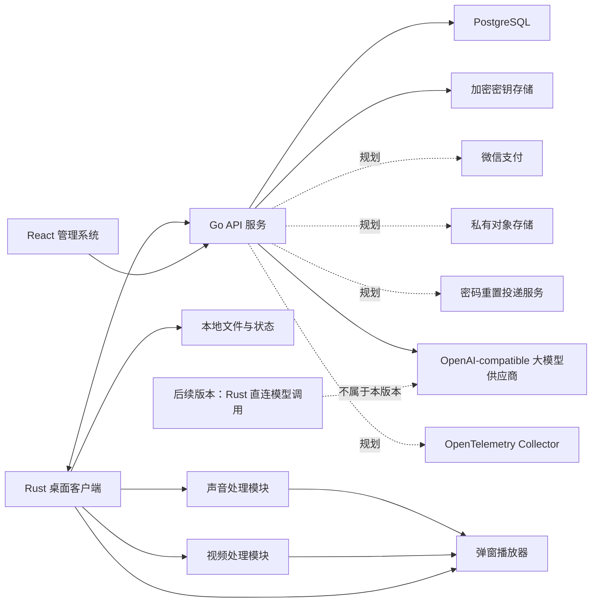

# 系统技术架构总览

> 当前版本范围声明（2026-08-24）：本版本不开发实时话术幻化。实时话术的 speech-to-speech、VAD/ASR/LLM/TTS、候选音轨换轨和模型直连只作为历史/后续版本参考，不属于当前架构入口、验收或发布范围。参考图中的媒体效果参数全部是正式产品需求；未映射字段必须显示“待实现/未接入”，不得声称已生效。

本项目拆成两个独立架构域：

- [管理系统架构](./管理系统架构.md)：Go 后端 + React 管理前端
- [桌面客户端架构](./桌面客户端架构.md)：Rust + Tauri 桌面端
- [桌面端功能流程图](./桌面端功能流程图.md)：当前本地播放池、单窗口和视频/普通声音处理开关的功能链路
- [媒体参数范围与默认值](./媒体参数范围与默认值.md)：跨桌面端 UI、Rust 和本地媒体 Worker 的参数契约
- [参考图参数对比与正式化清单](./参考图参数对比与正式化清单.md)：参考图 1–5 的参数识别、当前实现分级和依赖建议
- [媒体参数与本地阶段能力契约](./docs/superpowers/specs/2026-08-12-媒体参数与本地阶段能力契约.md)：历史参数/阶段方案快照，不作为当前类型或 IPC 契约
- [实时音频幻化与循环播放方案](./实时音频幻化与循环播放方案.md)：历史/后续版本方案；本版本不开发实时话术幻化
- [服务端商业化与生产就绪扩展 PRD](./tasks/prd-server-commercial-production-readiness.md)：Phase 2 RBAC 与 React 权限壳已交付；订阅/订单/支付、可信制品、公共配置 Schema 和生产运维仍为后续专项
- [douyin-desktop 接入 autoLive 多产品控制面 PRD](./tasks/prd-douyin-desktop-control-plane-integration.md)：Phase 1 产品硬隔离与管理范围基线已实现；Profile 新鲜度、模型认证、固定 OpenAPI 制品与跨仓库 E2E 仍未实施

## 总体边界

### 管理系统负责

- 用户、角色和登录
- 桌面设备、激活码和设备状态
- 大模型供应商、账号池、额度和租约
- 审计、错误码和运营数据
- 通过受 ACL 保护的 `/metrics` 提供低基数 HTTP 与 PostgreSQL 连接池运营指标；不把该端点作为公网业务入口
- 对外提供版本化 API

### 桌面客户端负责

- 用户登录和设备激活
- 本地设备信息采集
- 心跳和运行状态上报
- 本地有序播放池、单窗口播放和顺序循环；一次文件选择可按文件对话框返回顺序导入 `1–100` 个 `.mp4`、`.mov`、`.mkv`、`.avi`、`.webm`、`.m4v`、`.ts`、`.m2ts`、`.flv`、`.wmv`、`.3gp` 源视频。整批条目全部探测成功后才原子替换当前播放池；当前项播放结束后进入下一项，末项结束后回到首项，单项池退化为同一源视频自循环，不生成离线视频版本
- 独立视频处理开关：承载正式 `VideoEffectParams` 和 `AdvancedEffectParams`；基础/扩展视频、边缘柔化、源帧率锁定、波频/通道/空间调制、`65–20000Hz` 视频空间频段、随机几何/抽象几何脸、同源画中画锁定/解锁时间轴、切片、边缘羽化、变换平滑和局部效果按真实 FFmpeg 输出进入运行态；`65–20000Hz` 按对数映射到每幅画面 `1–32` 个空间周期，不进入音频频谱
- 独立声音处理开关：承载正式 `AudioEffectParams`，包括自然动态、本地音色 ID、随机周期、音高、增益/响度、速度、均衡、降噪/环境声、真实环境声第二输入、干湿比、淡入淡出、混响、底噪、采样率、码率、MFCC、SNR、共振峰、频谱/相位/高频扰动等；基础/频域效果由 FFmpeg 执行，音高/共振峰偏移由 Signalsmith Stretch 执行，MFCC/SNR 由 realFFT/rustdct 与滚动 RMS PCM 处理器执行，波形/频谱/响度/噪声底/MFCC/SNR/LPC F1/F2/F3 属于最终混音只读诊断
- 环境声第二输入采用双来源门禁：`ambient_sound_mix_percent = 0` 时不加载第二输入；值大于 `0` 时默认解析随包内置真实环境声，用户本地素材可选且优先覆盖。用户素材和随包素材都必须通过授权路径/受控资源路径、格式白名单、可读性和 FFmpeg 实际解码验证；失败保持原声并返回可恢复错误
- 插话和固定话术系统朗读：在当前播放窗口内按各自规则叠加或朗读
- 单一持久弹窗预览和最终效果展示；视频像素事实源只允许当前项经校验的 FFmpeg 处理缓存，或处理关闭/失败时明确回退的源视频。最终窗口的 CSS 只负责布局和媒体表面填充，不在视频元素上二次叠加色彩、模糊、位移或缩放伪效果；本版本不执行实时话术换轨
- 正式媒体参数统一收敛到 `MediaEffectParams`，使用 `get_default_media_effect_params` 和 `validate_media_effect_params` 读取默认值与校验；旧报告 Worker/IPC 已移除，不得重新引入
- 不提供独立算法报告、内容相似度、媒体鲁棒性、内容指纹或平台检测规避结论；不可见水印和随机扰动仅作为普通媒体效果需求管理
- 离线播放和本地状态保存
- 通过 Go 管理控制面账号、租约和审计；本版本桌面播放不因实时话术幻化调用 OpenAI-compatible 大模型

## 跨系统约定

- API 前缀统一为 `/api/v1`。
- OpenAPI 是 Go、React、Rust 之间的接口契约来源。
- 后台和桌面端使用同一套用户账号体系。
- 激活码由后台生成，创建时绑定一个产品内账号、有效期和 `1～100` 台设备额度；逐设备绑定事实由独立绑定表保存。同一设备重复登录不重复占额，管理员解绑释放额度，禁用设备保留额度。
- 桌面端只提供账号密码登录，不显示、保存或提交激活码。账号名可以在用户显式勾选后作为普通本地偏好保存；密码只能通过受限 Tauri 边界进入操作系统 Keychain/Credential Manager。两者都必须可清除，自动填充只恢复表单值，不自动提交登录，也不构成会话或设备授权证明。
- 工作台入口的唯一放行条件是当前登录会话有效且 Go 服务确认当前设备对应的 `user_id + device_id` 已获得未过期账号授权。Refresh 恢复、历史 profile、本地 `activated` 缓存或已记住凭据均不能单独放行；`ACCOUNT_ACTIVATION_REQUIRED`、`ACCOUNT_ACTIVATION_EXPIRED`、`DEVICE_LIMIT_EXCEEDED`、`DEVICE_BINDING_CONFLICT`、`DEVICE_DISABLED` 或状态无法确认时，桌面端停留登录门禁并保留稳定错误码。已经进入工作台后的网络中断仍按既有离线播放规则处理。
- Go 服务不代理本地视频内容。
- 模型 API Key 只保存在 Go 的 Secret Store；桌面端不获取完整号池。当前 `direct_lease` 只返回账号允许的 `direct_base_url`，没有供应商委托凭证时客户端不可直连并回退。
- 视频播放断网可继续；登录、账号授权设备绑定、租约申请/续租需要网络；后续版本如启用模型直连，失败也不得阻塞本地播放器。
- 本地播放状态在内存中维护有序播放池、当前索引、播放池循环轮次和当前媒体代际；任意时刻只有一个活动媒体源，原视频不被无提示覆盖。播放池只存在于当前桌面进程，不上传 Go 控制面，也不跨应用重启恢复。
- 当前主流程是 `一次多选 1–100 个受支持格式视频 → 按文件对话框返回顺序逐项探测实际容器/音视频流/可读性 → 整批成功后原子替换本地播放池 → 首项保持 Ready → 用户点击播放打开唯一窗口 → 配置视频/普通声音处理开关 → 按池顺序播放当前项、插话或固定话术系统朗读 → 末项回首项`。取消选择、超过 100 项或任一条目探测失败都保持旧池并显示明确错误；不提交部分播放池。不生成离线版本或生成版本队列。本版本不启动实时话术幻化。首次播放允许在最终效果窗口尚未建立真实时钟时先由 WebView 播放原声；PortAudio 输出任务未创建属于延后接管状态，不得使 `start_playback` 失败。
- 每个播放池条目先由 FFprobe 独立探测；当前不承诺 WebView 不支持时自动转码，直放失败进入明确错误链路。视频效果开启并应用后由受控 FFmpeg/FFprobe Worker 把基础串行滤镜、`media_video_effects` 高级滤镜和需要分支的单一 complex graph 合并为一次本地处理，输出经可读性探测、整文件 SHA-256 和原子提交后只切换当前条目的视频引用。普通声音处理不生成音频 MP4：FFmpeg 从当前条目的源视频解码并执行基础滤镜/多支路混音和 `media_audio_effects` 频谱/高频扰动，Signalsmith Stretch 在混音后统一执行音高与共振峰偏移，随后交给 PortAudio；播放速度仍由 FFmpeg `atempo` 执行。PortAudio 或首轨 DSP 失败时 WebView 播放当前条目的源视频音频，运行中候选失败保持旧轨。实时话术候选不属于当前播放链路。
- 视频自动低感知快照进入 FFmpeg 映射后，整数精度字段必须保持跨周期稳定或旁路，其他微量参数不得因固定最小滤镜强度、非零硬下限或错误的帧概率采样而被放大。实现无法忠实表达某个微量值时必须保持中性/旁路或按明确精度规则处理，并由契约测试覆盖；发布仍同时要求原片/处理结果客观帧差和正常观看主观低感知手工门禁。
- 普通声音随机周期使用“一个当前任务 + 一个下一周期候选”的滚动预热，不常驻创建 20 多个 FFmpeg 进程。N+1 预选完成后立即启动 Scheduled FFmpeg，seek 到目标前 250ms，并以 `-readrate max(3, playback_speed + 1) -readrate_initial_burst 1.0` 有界追赶；从 prepare 起的动态就绪水位为“已用准备时间 + max(130ms, 当前动态播放水位)”，提交安全尾部最高 750ms，候选容量为 `5000ms + 提交安全尾部`（5130–5750ms），而不是取得固定 750ms PCM 就提前切轨；N+2 始终只保存参数。prepare 先校验 generation/revision 再替换 pending，旧 revision 失败后读取最新快照并用新 candidate ID 重建，禁止重试旧候选。同步和提交携带 `source_media_pool` 当前条目、`source_media_index`、`playback_pool_cycle`、当前条目时长/位置、`playback_generation` 与该媒体代际内的绝对媒体时间。每次切换到另一个源条目都递增 `playback_generation`，取消旧候选并从新条目 0ms 重建绝对时钟；不同条目之间不得延续上一条目的绝对时间或 PCM。单项池回到自身时保持 `playback_generation`，递增 `playback_pool_cycle` 并按同一媒体代际的循环时间轴继续。commit 从目标时间扣除环缓实际待播时长和硬件输出延迟，尚未到点或动态覆盖不足时保留已预热候选及 current。声音处理播放时自动尝试 PortAudio，WebView 在候选覆盖当前绝对画面时间和动态安全水位前继续出声，满足后自动接管；UI 不提供手动硬件出口开关。CatchUp 使用同一单调时钟动态检查覆盖，短缺时每 10ms 继续预热，总预算 5 秒，临时不足不关闭 PortAudio。即时插话仍使用固定窗口 RealTime 预热，不与周期候选共用动态增长水位。两个 FFmpeg 任务只生产各自的有界 PCM；单一 `audio_cycle_output` 线程按值持有 PortAudio，是 SPSC 环缓唯一写入者，采用至少 200ms/8 个 callback、最高 500ms 的动态播放水位，并在提交时执行 30ms 双向线性交叉淡化。运行状态同时要求硬件 callback、当前 PCM 生产任务、音频时间轴和实际 PCM frame 有效，不能把 callback 补零伪装成运行；PCM 停产时先启用 WebView 回退，保留旧 current/环缓并预热 pending，成功后才替换旧生产者，真正失败后关闭 PortAudio 偏好。输出 callback frame 与硬件延迟共同形成可听音频时钟，连续 A/V 偏差超限才触发重对齐。HTML 视频自然结束产生的内部 `pause` 只触发一次有序播放池推进，不调用后端暂停；换源代际会取消旧音频候选。此处候选属于普通声音 DSP 周期，不是 speech-to-speech 话术候选。
- 普通源同步和 PCM 恢复共用独立于 pending 槽的原子占位，覆盖“候选已取出、正在追赶/提交”的整个窗口。占位存在时，N+1 prepare 和无匹配旧候选 cancel 只能得到可重试状态，不得推进全局 token；停止和暂停仍可取消全部音频操作。源或声音 revision 变化返回 `audio_mixer_candidate_superseded`，保留当前轨和硬件流，由 UI 基于最新绝对媒体时钟串行重建一次。追赶或启动期间被更新控制请求抢占产生的 stale 状态也按暂态处理，不关闭 PortAudio；最新同步恢复后 UI 只清除旧的 PortAudio 回退提示。用户主动暂停或停止造成的旧同步取消不显示为音频源故障。音频出口状态通过 `reason_code/retryable` 区分暂态与真正 FFmpeg/硬件故障。
- 活动 PortAudio 的源同步采用单一所有者：最终效果窗口持有当前媒体代际的真实视频绝对媒体时钟并负责普通同步、PCM 恢复和 A/V 重对齐，主窗口只在硬件未激活时创建或重启出口。普通声音处理的输入身份取当前播放池条目的源素材音轨，不随该条目的视频处理缓存变化；切换到下一条目时必须递增 `playback_generation`、停止旧源生产者并按新源重新建立音频输入和时钟。活动硬件出现 `running=false` 时先恢复 WebView，再由最终效果窗口串行重试一次，避免双窗口抢占候选导致整轮静音。
- PortAudio Host API 选择器始终展示 `ASIO`，但可用性必须来自运行时设备枚举；只有返回 `host_api=asio` 的真实输出设备时才允许选择。当前随包 `portaudio_x64.dll` 未启用 ASIO，因此入口显示禁用态；默认仍使用系统默认/WASAPI，ASIO 不可用或启动失败继续回退 WebView。
- 条目结束边界由最终效果窗口单飞提交：`timeupdate` 与 `ended` 不得同时推进本地索引；后端按 `(source_media_pool 当前条目, source_media_index, playback_generation)` 幂等确认下一项，末项才把 `source_media_index` 回到 `0` 并递增 `playback_pool_cycle`。主页发往最终效果窗口的 seek 控制同样携带 `playback_generation`，最终窗口只执行与当前快照代次相同的 seek，换源后迟到的旧控制直接丢弃。多项池换源以新 `playback_generation` 从新条目 0ms 重建 PortAudio 绝对媒体时钟，不能继续沿用上一条目的时间轴；单项池保持 generation 并递增池循环轮次。PCM 解码进程只处理当前条目的有限输入，结束后停止并 Join 旧进程，再按推进结果创建新生产者。PCM 恢复时若旧轨和物理环缓已经为空，已预热候选可从静音淡入接管，避免 callback 持续补零而恢复任务永久等待旧轨样本。
- 仓库中可能存在早期媒体任务、版本计划和阶段 Worker 的历史实现；它们不属于当前架构入口，新功能不得依赖或扩展，代码删除需另行执行迁移清理。
- 本版本不连接 speech-to-speech、VAD/ASR/LLM/TTS，不申请实时话术模型租约，不生成候选话术音轨，也不执行 `realtime_variant` 换轨；相关代码、字段和接口只作历史兼容审计或后续版本预留。普通声音处理统一使用 FFmpeg 处理已映射参数并通过 PortAudio 输出，WebView 只保留源视频声音回退和波形/频谱诊断。高质量音高、播放速度、共振峰偏移、MFCC 偏移、MFCC 维度、SNR 浮动、频谱盲区、干湿比和环境声混合参加普通声音周期随机化；桌面 UI 只展示当前值，不提供逐项手动修改入口。
- 媒体处理仅在明确启用对应哈希链路时对源文件或产物计算完整字节流 SHA-256；旧阶段报告不属于当前播放契约，正式参数调度所需随机种子仅作为内部可复现信息。
- 视频效果输出必须解码、处理并重新编码，不使用视频流 `copy`；FFmpeg/FFprobe 随桌面端安装包按 macOS Intel、macOS M 和 Windows x64 分发，Rust 从 Tauri `resource_dir()` 定位，开发环境可用环境变量覆盖；它们不用于 RTMP/OBS 推流。
- FFmpeg/FFprobe 优先从 Tauri bundle 的 `embedded-runtime-resources` 读取，内置资源不完整时才使用已校验的应用数据目录下载/安装布局；桌面 UI 不展示独立“运行资源”卡片，也不提供安装、取消、选择目录或清理资源按钮。依赖缺失或执行失败通过导入/处理错误提示返回。
- Windows 10/11 x64 的正式跨机交付边界是 NSIS 安装包：除 FFmpeg/FFprobe、PortAudio 和资源清单外，安装包还携带 WebView2 离线安装器，避免把目标电脑联网或预装 WebView2 作为运行前提。便携 ZIP 只用于内部测试；正式对外发布还必须完成 Authenticode 签名与干净系统冒烟。
- 具体参数的范围、单位和默认值以 [`媒体参数范围与默认值.md`](./媒体参数范围与默认值.md) 为准。
- 模型凭证、设备凭证、用户密码和激活码按安全凭证处理，不能写入普通日志或明文配置提交；桌面端只允许在用户显式选择时把密码保存到系统凭据库，不再接收激活码明文。
- 写操作的幂等键按“单次用户操作”复用；客户端参数、租约 ID 或资源变化时必须换 key。登录、激活、Heartbeat、租约、直连调用记录和账号测试仍按会话代际保护。本地有序播放池不创建服务端媒体任务或生成版本队列；本版本不因实时话术幻化占用模型租约。模型密钥仍只由 Go 管理，本地播放不上传音视频或播放池路径。
- Go、React、Rust 均在本地开发机或 CI 构建，服务器只部署构建产物。

## 多产品控制面 P0（Phase 1 基线已实现，RBAC 共享交付已接入）

autoLive 已以迁移 0023 和 Go Phase 1 基线开始承载 `autolive` 与 `douyin_desktop`：全局 `users` 复用身份，`user_products` 管理产品准入，客户端会话绑定单一 product；设备、激活码、租约、用量、审计和管理分页查询已传播或校验 product。普通管理员的列表查询只能看到会话所属产品，内建本地管理员保留兼容的跨产品列表范围，筛选参数只能收窄结果。商业化 Phase 2 已补齐固定权限目录、产品角色绑定、即时服务端鉴权和 React 权限壳；迁移 0023 仍保留旧全局设备唯一键，终态复合约束及 Profile/离线授权等后续能力待后续阶段。兼容窗口内，登录请求缺失 product 时默认进入 `autolive`，显式产品仍必须是有效值；`snapshot` 读源中的历史设备记录缺失 product 时也只按旧契约解释为 `autolive`，并仅用于 Profile、Heartbeat 及其设备审计。已认证为 `autolive` 的历史客户端心跳若省略 product，同样使用会话中的 `autolive`；`douyin_desktop` 心跳缺失 product、显式其他产品、无效产品和非设备审计目标继续严格拒绝。

Profile 仍计划由服务端返回时间、状态、6 小时建议复核、24 小时签名离线硬截止和权益 revision。douyin-desktop 首版本地 BYOK；供应商不能提供可撤销、受限、绑定租约的短期凭证时，不开放托管直连。OpenAPI 不可变三件套和跨仓库 E2E 仍未建立；真实 PostgreSQL 回放需要独立环境证据。详细设计与四阶段计划见 [`tasks/prd-douyin-desktop-control-plane-integration.md`](./tasks/prd-douyin-desktop-control-plane-integration.md)。

## 服务端商业化与生产就绪扩展（Phase 2 已交付，其余规划中）

该专项实施范围包含 Go 服务端、PostgreSQL/Secret Store、服务端 Worker、供应商适配器、服务端 CI/运维链路和 React 管理页；Rust/Tauri 客户端业务改动不在范围内。专项保持现有模块化单体，不拆微服务，也不引入外部消息队列；跨事务投递与后台作业优先使用 PostgreSQL Outbox/Job Worker。详细需求、阶段和验收以 [`tasks/prd-server-commercial-production-readiness.md`](./tasks/prd-server-commercial-production-readiness.md) 及其阶段文件为准。

- 管理查询：新增订阅、订单、套餐版本的管理列表/详情，并扩展设备白名单筛选、排序、分页和真实数据量索引验证。
- 管理授权（Phase 2 已交付）：服务端维护固定权限目录，自定义角色只能组合已登记权限；管理员可持有多角色且权限取并集，不支持用户级 allow/deny 覆盖。每个受保护 API 按当前权限点鉴权，内建 `super_admin`、本地管理员和最后超管保护防止提权与锁死。
- React 管理面（Phase 2 已交付）：通过 `/api/v1/admin/me` 获取角色/权限，统一过滤导航、守卫路由、控制操作并展示 403；前端隐藏只是体验层，服务端仍是授权唯一权威。其余角色、套餐、订单、订阅、支付、重置投递、激活码安全、制品、公共配置和运维页仍按后续阶段补齐。
- 商业核心：套餐版本发布后不可变，订单保存人民币分金额与权益快照，微信支付 Native 回调先验签/解密、再幂等履约，并通过主动查单恢复未知结果。
- 密码重置：只保存一次性 Token 哈希，通过 Outbox/Worker 投递中性通知，不发送明文密码，成功后撤销会话。
- 激活码：`activation_codes` 保持哈希事实源并记录创建时绑定的账号；`activation_device_bindings` 保存当前逐设备额度事实，账号密码登录后由受保护设备绑定接口自动分配。后续新生成激活码的可恢复明文进入独立 `activation_code_secrets` 加密表，重新查看需要管理员密码二次验证、限流和脱敏审计；容量在线调整和设备切换仍属于后续专项。
- 可信制品：仅发布软件制品、桌面运行资源和容器元数据，不上传用户本地媒体；私有对象存储提供短时下载，CI 生成签名、SBOM 与 Provenance，服务端验证身份、摘要与文件哈希并向消费端提供验证元数据；客户端验签另立任务。
- 公共配置：每个 namespace 绑定不可变 JSON Schema Draft 2020-12 版本，禁止任意远程 `$ref`，保留敏感字段扫描、dry-run、revision/ETag 和复杂度上限。
- 产品商业与席位：套餐版本、订单、支付、订阅和设备席位全部绑定 product；有效订阅开放该产品全部功能，套餐只区分价格、周期和席位，激活码不替代商业权益。
- 客户端报告：经用户同意、客户端/服务端双重脱敏、有界采样/限流/保留删除的错误摘要，以及不含附件/外部工单/通知的最小反馈状态流。
- 生产运维：扩展数据保留与归档，执行加密备份和隔离恢复演练；保留 Prometheus 指标并新增 OpenTelemetry Trace/OTLP；发布门禁验证 signer、issuer、repository、workflow、ref 和 digest。
- 发布边界：Go、React、Rust 仍只在本地开发机或 CI 构建，服务器仅接收已验证的发布产物。

除上述已交付的 Phase 2 RBAC/OpenAPI/迁移/管理端实现外，其余节点和接口均为后续规划；服务器仍只接收本地或 CI 构建的发布产物，真实 PostgreSQL 与浏览器手工验收按阶段记录执行状态。

## 当前不包含

- 口型同步、实时视频边播边合成
- 弹幕互动、滤镜美颜和多平台一键分发
- 面向平台审核/检测的规避、自动发布和平台接入
- 视频流媒体服务器
- 微服务、消息队列和 Kubernetes

## 变更记录

- 2026-08-25：环境声来源最终澄清为“零值不加载、非零默认随包真实环境声、用户本地素材可选且优先”；两种非零来源都执行路径、格式、可读性和 FFmpeg 解码验证，失败保持原声并报可恢复错误。
- 2026-08-25（已被环境声来源最终澄清覆盖）：上一轮曾要求环境声非零时必须由用户选择本地素材；该要求已撤回。零值不加载、输入验证和失败原声回退要求继续有效。
- 2026-08-25：明确最终效果窗口只显示 FFmpeg 真实输出或源视频回退，禁止在视频元素上二次叠加 CSS 色彩/模糊/几何伪效果；整数像素位移保持稳定方向，其他微量参数不得被最小强度或错误概率采样放大，主观低感知与客观帧差继续作为联合发布门禁。
- 2026-08-25：九项普通声音参数（高质量音高、播放速度、共振峰偏移、MFCC 偏移、MFCC 维度、SNR 浮动、频谱盲区、干湿比、环境声混合）改为只读展示并继续参加周期随机化；移除主页独立倍速控制，播放速度由同一随机化参数链路同步视频与声音。
- 2026-08-25：首播在 PortAudio 尚未创建时保持 WebView 原声并延后自动接管；跨窗口 seek 按 `playback_generation` 隔离，换源后不执行旧代次控制；续播点按已加载的 `playback_generation` 隔离，旧媒体元素迟到的时间事件不能污染新条目。普通声音候选 stale/superseded 保持暂态恢复语义且不进入全局错误。右侧普通声音面板改为内容自然高度，声音功能入口由右列滚动保证可达。
- 2026-08-24：桌面本地播放从单源自循环扩展为最多 100 项的有序播放池；一次多选按文件对话框返回顺序逐项探测，只有整批成功才原子替换旧池，取消、超限或任一条目失败都保持旧池并显示错误。当前项结束进入下一项，末项回首项，单项自循环；仍只使用一个最终效果窗口、一个活动媒体源和本地进程状态，不创建服务端媒体任务或生成版本队列。每次换源递增 `playback_generation` 并重建绝对媒体时钟。
- 2026-08-24：参考图媒体参数全部正式化，统一当前类型/IPC 命名和三态能力口径；旧报告 Worker/IPC 已删除且禁止重新引入。实时话术幻化、OBS/RTMP 和平台检测规避范围不变。
