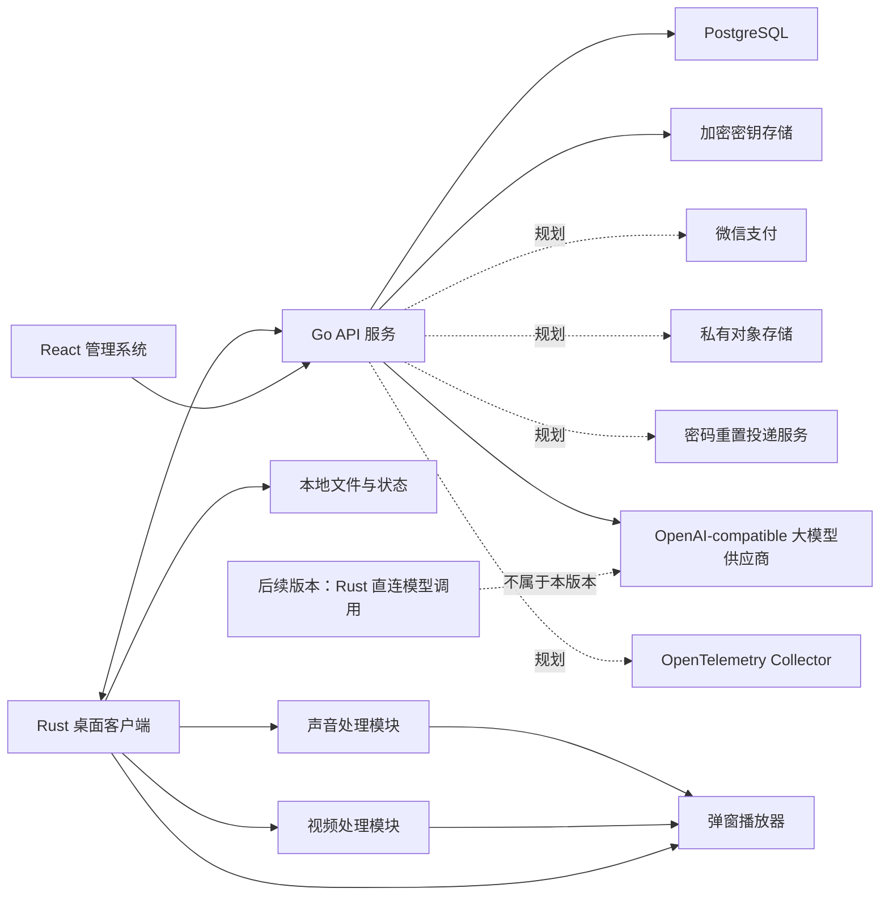

# 系统技术架构总览

> 当前版本范围声明（2026-08-19）：本版本不开发实时话术幻化。实时话术的 speech-to-speech、VAD/ASR/LLM/TTS、候选音轨换轨和模型直连只作为历史/后续版本参考，不属于当前架构入口、验收或发布范围。

本项目拆成两个独立架构域：

- [管理系统架构](./管理系统架构.md)：Go 后端 + React 管理前端
- [桌面客户端架构](./桌面客户端架构.md)：Rust + Tauri 桌面端
- [桌面端功能流程图](./桌面端功能流程图.md)：当前单视频、单窗口和视频/普通声音处理开关的功能链路
- [媒体参数范围与默认值](./媒体参数范围与默认值.md)：跨桌面端 UI、Rust 和本地媒体 Worker 的参数契约
- [媒体参数与本地阶段能力契约](./docs/superpowers/specs/2026-08-12-媒体参数与本地阶段能力契约.md)：参数校验、阶段顺序和本地依赖能力状态
- [实时音频幻化与循环播放方案](./实时音频幻化与循环播放方案.md)：历史/后续版本方案；本版本不开发实时话术幻化
- [服务端商业化与生产就绪扩展 PRD](./tasks/prd-server-commercial-production-readiness.md)：订阅/订单/支付、可信制品、公共配置 Schema 和生产运维的后续专项；当前未实施

## 总体边界

### 管理系统负责

- 用户、角色和登录
- 桌面设备、激活码和设备状态
- 大模型供应商、账号池、额度和租约
- 审计、错误码和运营数据
- 通过受 ACL 保护的 `/metrics` 提供低基数 HTTP 与 PostgreSQL 连接池运营指标；不把该端点作为公网业务入口
- 对外提供版本化 API

### 桌面客户端负责

- 用户登录和设备激活
- 本地设备信息采集
- 心跳和运行状态上报
- 本地单视频选择、单窗口播放和循环播放；源视频导入支持 `.mp4`、`.mov`、`.mkv`、`.avi`、`.webm`、`.m4v`、`.ts`、`.m2ts`、`.flv`、`.wmv`、`.3gp`，视频结束后回到同一源视频的 0 秒，不生成离线视频版本
- 独立视频处理开关：控制已接入的视频画面效果；研究视觉频段、实验挂件和视频研究分析不属于当前入口
- 独立声音处理开关：控制已接入的普通音频配置和效果，包括自然真人模式、随机周期、音高、增益/响度、速度、均衡、降噪/环境声、淡入淡出、混响、底噪、采样率和码率；波形、频谱和响度属于只读诊断，声音研究参数不属于当前入口
- 插话和固定话术系统朗读：在当前播放窗口内按各自规则叠加或朗读
- 单一持久弹窗预览和最终效果展示；本版本不执行实时话术换轨
- 研究分析、实验报告、内容相似度、媒体鲁棒性、隐形标记、随机扰动和内容指纹能力不属于当前产品；仓库遗留模块只用于迁移审计
- 离线播放和本地状态保存
- 通过 Go 管理控制面账号、租约和审计；本版本桌面播放不因实时话术幻化调用 OpenAI-compatible 大模型

## 跨系统约定

- API 前缀统一为 `/api/v1`。
- OpenAPI 是 Go、React、Rust 之间的接口契约来源。
- 后台和桌面端使用同一套用户账号体系。
- 激活码由后台生成，一次性绑定用户和设备。
- Go 服务不代理本地视频内容。
- 模型 API Key 只保存在 Go 的 Secret Store；桌面端不获取完整号池。当前 `direct_lease` 只返回账号允许的 `direct_base_url`，没有供应商委托凭证时客户端不可直连并回退。
- 视频播放断网可继续；登录、激活、租约申请/续租需要网络；后续版本如启用模型直连，失败也不得阻塞本地播放器。
- 本地播放只保留当前源视频所需的状态；原视频不被无提示覆盖。
- 当前主流程是 `导入单个受支持格式视频 → 探测实际容器/音视频流/可读性 → 保持 Ready → 用户点击播放打开唯一窗口 → 配置视频/普通声音处理开关 → 播放源视频、插话或固定话术系统朗读`；不生成离线版本、不追加视频队列。本版本不启动实时话术幻化。
- 源视频先由 FFprobe 探测；当前不承诺 WebView 不支持时自动转码，直放失败进入明确错误链路。视频效果开启并应用后由受控 FFmpeg/FFprobe Worker 生成本地处理缓存，输出经可读性探测、整文件 SHA-256 和原子提交后立即切换当前视频引用。普通声音处理不生成音频 MP4，而是由 FFmpeg 从源视频音频流处理后交给 PortAudio；PortAudio 关闭或失败时 WebView 播放源视频音频。实时话术候选不属于当前播放链路。
- 普通声音随机周期使用“一个当前任务 + 一个下一周期候选”的滚动预热，不常驻创建 20 多个 FFmpeg 进程。N+1 预选完成后立即启动 Scheduled FFmpeg，seek 到目标前 250ms，按 `-readrate playback_speed × 1.1` 保留 10% PCM 生产余量并生成固定 750ms PCM，填满后由有界队列反压；N+2 始终只保存参数。prepare 先校验 generation/revision 再替换 pending，旧 revision 失败后读取最新快照并用新 candidate ID 重建，禁止重试旧候选。同步和提交携带循环代次、视频时长、单轮位置与未回绕绝对媒体时间；FFmpeg 只在 seek 时折回单轮位置。commit 从目标时间扣除环缓实际待播时长和硬件输出延迟，尚未到点时保留已预热候选。声音处理播放时自动尝试 PortAudio，WebView 在候选覆盖当前绝对画面时间和动态安全水位前继续出声，满足后自动接管；UI 不提供手动硬件出口开关。CatchUp 使用同一单调时钟动态检查覆盖，短缺时每 10ms 继续预热，总预算 5 秒，临时不足不关闭 PortAudio。两个 FFmpeg 任务只生产各自的有界 PCM；单一 `audio_cycle_output` 线程按值持有 PortAudio，是 SPSC 环缓唯一写入者，采用至少 200ms/8 个 callback、最高 500ms 的动态播放水位，并在提交时执行 30ms 双向线性交叉淡化。运行状态同时要求硬件 callback、当前 PCM 生产任务、音频时间轴和实际 PCM frame 有效，不能把 callback 补零伪装成运行；PCM 停产时先启用 WebView 回退，保留旧 current/环缓并预热 pending，成功后才替换旧生产者，真正失败后关闭 PortAudio 偏好。输出 callback frame 与硬件延迟共同形成可听音频时钟，连续 A/V 偏差超限才触发重对齐。HTML 视频自然结束产生的内部 `pause` 只推进循环，不调用后端暂停或取消音频候选。此处候选属于普通声音 DSP 周期，不是 speech-to-speech 话术候选。
- 普通源同步和 PCM 恢复共用独立于 pending 槽的原子占位，覆盖“候选已取出、正在追赶/提交”的整个窗口。占位存在时，N+1 prepare 和无匹配旧候选 cancel 只能得到可重试状态，不得推进全局 token；停止和暂停仍可取消全部音频操作。源或声音 revision 变化返回 `audio_mixer_candidate_superseded`，保留当前轨和硬件流，由 UI 基于最新绝对媒体时钟串行重建一次。追赶或启动期间被更新控制请求抢占产生的 stale 状态也按暂态处理，不关闭 PortAudio；最新同步恢复后 UI 只清除旧的 PortAudio 回退提示。用户主动暂停或停止造成的旧同步取消不显示为音频源故障。音频出口状态通过 `reason_code/retryable` 区分暂态与真正 FFmpeg/硬件故障。
- 活动 PortAudio 的源同步采用单一所有者：最终效果窗口持有真实视频绝对媒体时钟并负责普通同步、PCM 恢复和 A/V 重对齐，主窗口只在硬件未激活时创建或重启出口。普通声音处理的输入身份取源素材音轨，不随视频处理缓存或循环编号变化；活动硬件出现 `running=false` 时先恢复 WebView，再由最终效果窗口串行重试一次，避免双窗口抢占候选导致整轮静音。
- PortAudio Host API 选择器始终展示 `ASIO`，但可用性必须来自运行时设备枚举；只有返回 `host_api=asio` 的真实输出设备时才允许选择。当前随包 `portaudio_x64.dll` 未启用 ASIO，因此入口显示禁用态；默认仍使用系统默认/WASAPI，ASIO 不可用或启动失败继续回退 WebView。
- 循环边界由最终效果窗口单飞提交：`timeupdate` 与 `ended` 不得同时推进本地循环序号；后端确认新循环后必须按新循环绝对媒体时间重锚 PortAudio，不能继续沿用上一轮时间轴。PCM 解码进程按有限输入逐轮顺序重启，避免长驻无限循环进程在源文件边界停止产出。PCM 恢复时若旧轨和物理环缓已经为空，已预热候选可从静音淡入接管，避免 callback 持续补零而恢复任务永久等待旧轨样本。
- 仓库中可能存在早期媒体任务、版本计划和阶段 Worker 的历史实现；它们不属于当前架构入口，新功能不得依赖或扩展，代码删除需另行执行迁移清理。
- 本版本不连接 speech-to-speech、VAD/ASR/LLM/TTS，不申请实时话术模型租约，不生成候选话术音轨，也不执行 `realtime_variant` 换轨；相关代码、字段和接口只作历史兼容审计或后续版本预留。普通声音处理统一使用 FFmpeg 处理已映射参数并通过 PortAudio 输出，WebView 只保留源视频声音回退和波形/频谱诊断。播放速度按配置生效但不参加周期随机变化。
- 媒体处理仅在明确启用对应哈希链路时对源文件或产物计算完整字节流 SHA-256；研究阶段哈希、随机种子和研究报告不属于当前播放契约。
- 视频效果输出必须解码、处理并重新编码，不使用视频流 `copy`；FFmpeg/FFprobe 随桌面端安装包按 macOS Intel、macOS M 和 Windows x64 分发，Rust 从 Tauri `resource_dir()` 定位，开发环境可用环境变量覆盖；它们不用于 RTMP/OBS 推流。
- FFmpeg/FFprobe 优先从 Tauri bundle 的 `embedded-runtime-resources` 读取，内置资源不完整时才使用已校验的应用数据目录下载/安装布局；桌面 UI 不展示独立“运行资源”卡片，也不提供安装、取消、选择目录或清理资源按钮。依赖缺失或执行失败通过导入/处理错误提示返回。
- 具体参数的范围、单位和默认值以 [`媒体参数范围与默认值.md`](./媒体参数范围与默认值.md) 为准。
- 模型凭证和设备凭证按安全凭证处理，不能写入普通日志或明文配置提交。
- 写操作的幂等键按“单次用户操作”复用；客户端参数、租约 ID 或资源变化时必须换 key。登录、激活、Heartbeat、租约、直连调用记录和账号测试仍按会话代际保护。当前单视频循环不创建媒体任务；本版本不因实时话术幻化占用模型租约。模型密钥仍只由 Go 管理，本地播放不上传音视频。
- Go、React、Rust 均在本地开发机或 CI 构建，服务器只部署构建产物。

## 服务端商业化与生产就绪扩展（规划、未实施）

该专项实施范围包含 Go 服务端、PostgreSQL/Secret Store、服务端 Worker、供应商适配器、服务端 CI/运维链路和 React 管理页；Rust/Tauri 客户端业务改动不在范围内。专项保持现有模块化单体，不拆微服务，也不引入外部消息队列；跨事务投递与后台作业优先使用 PostgreSQL Outbox/Job Worker。详细需求、阶段和验收以 [`tasks/prd-server-commercial-production-readiness.md`](./tasks/prd-server-commercial-production-readiness.md) 及其阶段文件为准。

- 管理查询：新增订阅、订单、套餐版本的管理列表/详情，并扩展设备白名单筛选、排序、分页和真实数据量索引验证。
- 管理授权：服务端维护固定权限目录，自定义角色只能组合已登记权限；管理员可持有多角色且权限取并集，不支持用户级 allow/deny 覆盖。每个受保护 API 按当前权限点鉴权，内建 `super_admin`、本地管理员和最后超管保护防止提权与锁死。
- React 管理面：通过当前管理员契约获取角色/权限，统一过滤导航、守卫路由、控制操作并展示 403；前端隐藏只是体验层，服务端仍是授权唯一权威。角色、套餐、订单、订阅、支付、重置投递、激活码安全、制品、公共配置和运维页均使用 OpenAPI 生成契约与 Ant Design。
- 商业核心：套餐版本发布后不可变，订单保存人民币分金额与权益快照，微信支付 Native 回调先验签/解密、再幂等履约，并通过主动查单恢复未知结果。
- 密码重置：只保存一次性 Token 哈希，通过 Outbox/Worker 投递中性通知，不发送明文密码，成功后撤销会话。
- 激活码：`activation_codes` 保持哈希事实源；新生成激活码的可恢复明文进入独立 `activation_code_secrets` 加密表，重新查看需要管理员密码二次验证、限流和脱敏审计。绑定详情进入独立槽位表，支持容量调整和设备切换。
- 可信制品：仅发布软件制品、桌面运行资源和容器元数据，不上传用户本地媒体；私有对象存储提供短时下载，CI 生成签名、SBOM 与 Provenance，服务端验证身份、摘要与文件哈希并向消费端提供验证元数据；客户端验签另立任务。
- 公共配置：每个 namespace 绑定不可变 JSON Schema Draft 2020-12 版本，禁止任意远程 `$ref`，保留敏感字段扫描、dry-run、revision/ETag 和复杂度上限。
- 生产运维：扩展数据保留与归档，执行加密备份和隔离恢复演练；保留 Prometheus 指标并新增 OpenTelemetry Trace/OTLP；发布门禁验证 signer、issuer、repository、workflow、ref 和 digest。
- 发布边界：Go、React、Rust 仍只在本地开发机或 CI 构建，服务器仅接收已验证的发布产物。

以上节点和接口均为后续规划；当前 OpenAPI、数据库迁移、运行时和服务器部署不因本节而改变。

## 当前不包含

- 口型同步、实时视频边播边合成
- 弹幕互动、滤镜美颜和多平台一键分发
- 面向平台审核/检测的规避、自动发布和平台接入
- 视频流媒体服务器
- 微服务、消息队列和 Kubernetes
